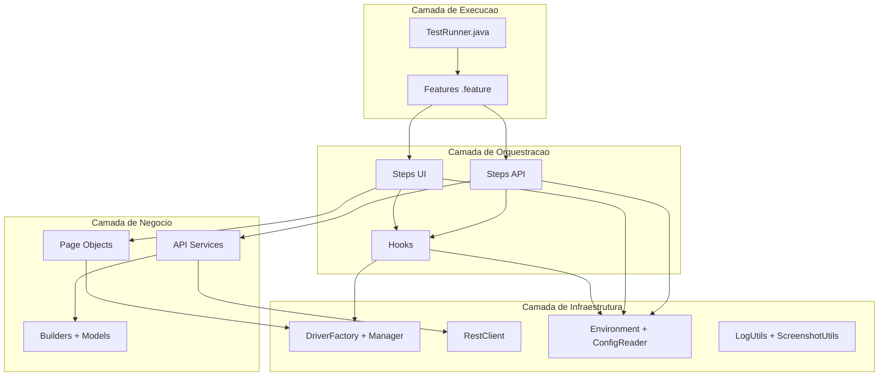
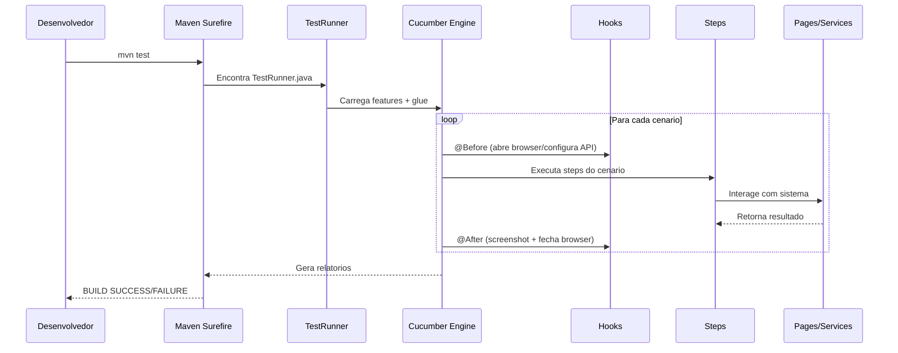
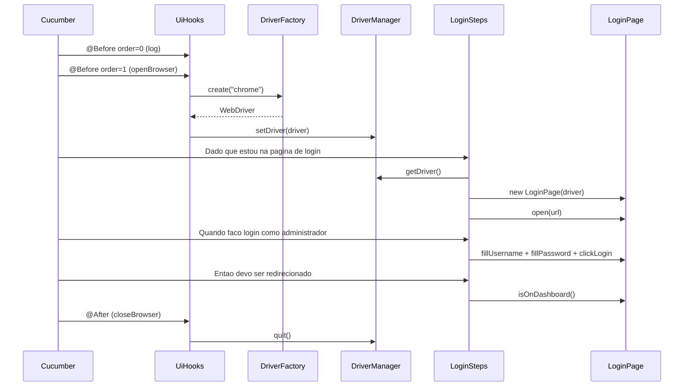
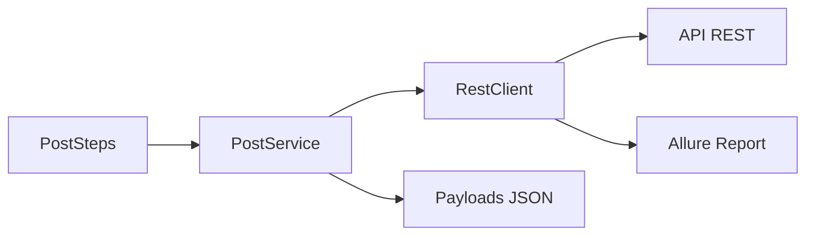
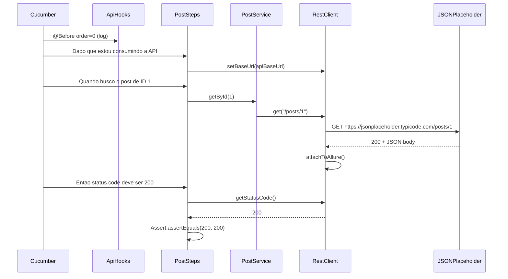
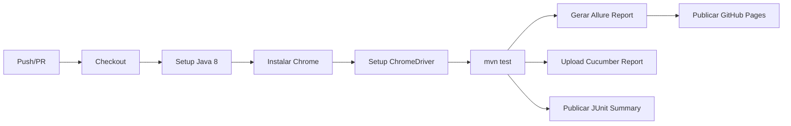
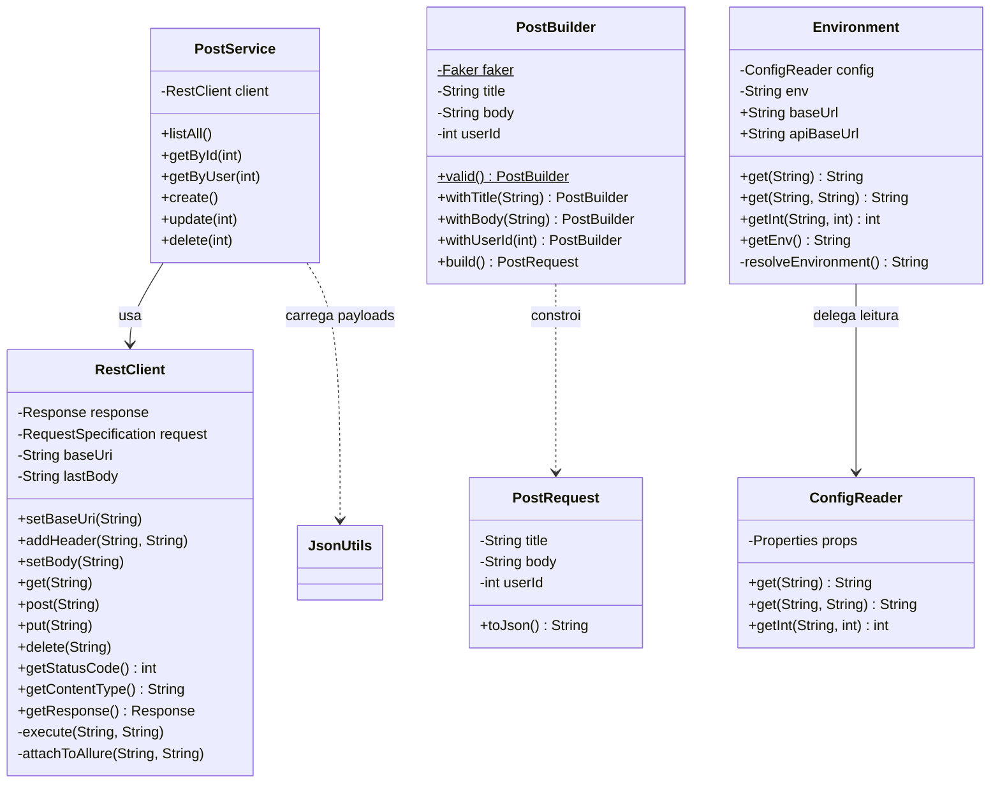
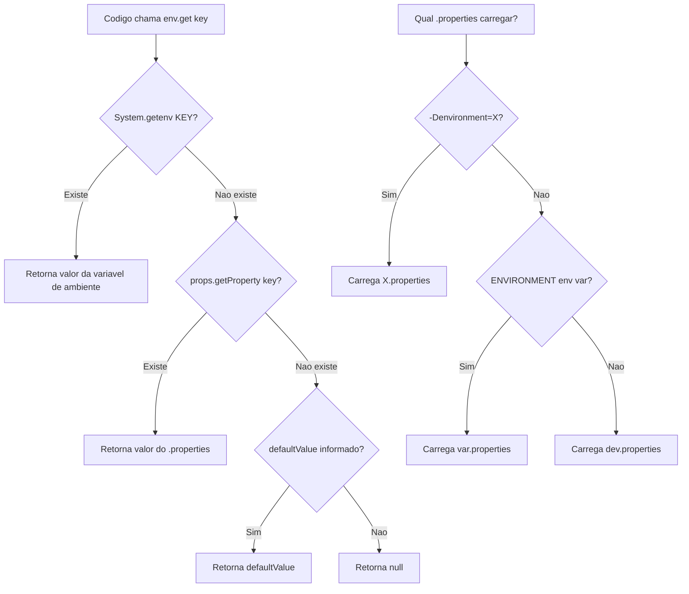

# Framework Profissional de Automacao de Testes

> Este material acompanha o projeto disponivel para download. Abra no VS Code e siga os modulos na ordem.

---

## Sumario

- [Como Baixar e Executar](#como-baixar-e-executar)
- [Modulo 1 — Arquitetura do Framework](#modulo-1--arquitetura-do-framework)
- [Modulo 2 — Automacao UI](#modulo-2--automacao-ui)
- [Modulo 3 — Automacao API](#modulo-3--automacao-api)
- [Modulo 4 — Infraestrutura do Framework](#modulo-4--infraestrutura-do-framework)
- [Modulo 5 — Conceitos Avancados](#modulo-5--conceitos-avancados)

---

## Como Baixar e Executar

### Pre-requisitos

| Ferramenta | Versao | Download |
|---|---|---|
| JDK | 8 (obrigatorio) | adoptium.net |
| Maven | 3.8+ | maven.apache.org |
| Google Chrome | Ultima estavel | google.com/chrome |
| ChromeDriver | Compativel com Chrome | chromedriver.chromium.org |
| VS Code | Ultima versao | code.visualstudio.com |

### Download do ZIP e Abertura no VS Code

1. Baixe o arquivo ZIP do projeto
2. Extraia em uma pasta de sua preferencia
3. Abra o VS Code → File → Open Folder → selecione a pasta extraida
4. Abra o terminal integrado: `Ctrl + `` `

### POR QUE o botao "Run" no TestRunner.java NAO funciona no VS Code

O VS Code **nao e uma IDE Java nativa**. Quando voce abre o projeto, o Java Language Server precisa indexar todas as dependencias — isso pode levar varios minutos e falhar silenciosamente, especialmente com Java 8 e proxies corporativos.

Problemas comuns ao usar o botao "Run":
- O Language Server nao reconhece as classes do Cucumber
- Imports ficam em vermelho mesmo com o projeto compilando
- O runner executa sem encontrar os steps (0 cenarios)

**A forma CONFIAVEL de executar e SEMPRE pelo terminal integrado** (`Ctrl + `` `):

```bash
mvn test
```

> Nunca confie no botao "Run" do VS Code para projetos Cucumber com Java 8. Use sempre `mvn test`.

### Primeiro Comando

```bash
# Executa todos os testes (UI + API)
mvn test

# Apenas testes de API (rapido, sem navegador)
mvn test -Dcucumber.filter.tags="@api"

# Apenas testes de UI
mvn test -Dcucumber.filter.tags="@ui"

# Apenas smoke tests
mvn test -Dcucumber.filter.tags="@smoke"
```

### Como Ver Resultados

| Relatorio | Comando | Local |
|---|---|---|
| Allure (interativo) | `mvn allure:serve` | Abre no navegador |
| Cucumber HTML | Abrir arquivo | `target/cucumber-reports/cucumber.html` |
| Log de execucao | Abrir arquivo | `target/test-execution.log` |
| JUnit XML | CI/CD | `target/cucumber-reports/cucumber.xml` |

---

## Modulo 1 — Arquitetura do Framework

### Visao Geral da Arquitetura

Este framework segue uma arquitetura em camadas onde cada camada tem uma responsabilidade unica. A separacao permite que voce adicione novos testes sem modificar a infraestrutura e vice-versa.

### Diagrama de Arquitetura



### Estrutura de Pastas

```
selenium-cucumber-project/
├── pom.xml
├── .github/workflows/testes.yml
└── src/test/
    ├── java/
    │   ├── api/
    │   │   ├── builders/        → PostBuilder.java
    │   │   ├── clients/         → RestClient.java
    │   │   ├── models/          → PostRequest.java
    │   │   └── services/        → PostService.java
    │   ├── config/
    │   │   ├── ConfigReader.java
    │   │   └── Environment.java
    │   ├── drivers/
    │   │   ├── DriverFactory.java
    │   │   └── DriverManager.java
    │   ├── exceptions/
    │   │   └── FrameworkException.java
    │   ├── hooks/
    │   │   ├── ApiHooks.java
    │   │   └── UiHooks.java
    │   ├── pages/
    │   │   ├── base/            → BasePage.java
    │   │   └── login/           → LoginPage.java
    │   ├── runners/
    │   │   └── TestRunner.java
    │   ├── steps/
    │   │   ├── api/             → PostSteps.java
    │   │   └── ui/              → LoginSteps.java
    │   └── utils/
    │       ├── JsonUtils.java
    │       ├── LogUtils.java
    │       └── ScreenshotUtils.java
    └── resources/
        ├── environments/
        │   ├── dev.properties
        │   └── hml.properties
        ├── features/
        │   ├── api/             → posts.feature
        │   └── ui/              → login.feature
        ├── payloads/posts/
        │   ├── create-post.json
        │   └── update-post.json
        ├── schemas/
        │   └── post-schema.json
        └── logback.xml
```

### Responsabilidade de Cada Camada

| Camada | Responsabilidade | Arquivos |
|---|---|---|
| Execucao | Ponto de entrada, define quais features rodar e gera relatorios | TestRunner.java, arquivos .feature |
| Orquestracao | Traduz Gherkin em codigo, gerencia ciclo de vida | Steps, Hooks |
| Negocio | Logica de interacao com sistema (UI) ou API | Pages, Services, Builders |
| Infraestrutura | Recursos compartilhados: driver, HTTP, config, log | Drivers, RestClient, Config, Utils |

### Fluxo de Execucao



### Decisoes Tecnologicas

| Tecnologia | Versao | Justificativa |
|---|---|---|
| Java | 8 | Maximo de compatibilidade corporativa, suportado ate 2030 |
| Selenium | 3.141.59 | Ultima versao compativel com Java 8 |
| Cucumber | 7.18.0 | Suporte Java 8+, steps em portugues |
| REST Assured | 4.5.1 | Ultima versao com Java 8, API fluente |
| JUnit 4 | 4.13.2 | Integracao nativa com Cucumber-JUnit |
| Allure | 2.24.0 | Relatorio visual profissional com evidencias |
| PicoContainer | 7.18.0 | Injecao de dependencia automatica por cenario |
| Logback | 1.2.12 | Logging corporativo (console + arquivo) |
| JavaFaker | 1.0.2 | Dados de teste dinamicos em pt-BR |
| Maven Surefire | 3.2.5 | Execucao confiavel de testes no terminal |

> A escolha de Java 8 garante que o framework funcione em qualquer maquina corporativa sem atualizacao de JDK.

***Resultado: voce entende a arquitetura completa antes de escrever uma unica linha de codigo.***

---

## Modulo 2 — Automacao UI

### DriverFactory

A DriverFactory cria instancias do WebDriver com configuracoes diferentes para ambiente local (visual) e CI (headless). Ela detecta automaticamente se esta rodando em CI pela variavel de ambiente.

```java
package drivers;

import org.openqa.selenium.WebDriver;
import org.openqa.selenium.chrome.ChromeDriver;
import org.openqa.selenium.chrome.ChromeOptions;
import utils.LogUtils;

/**
 * Cria instancias de WebDriver.
 */
public class DriverFactory {

    private static final boolean IN_CI =
            System.getenv("CI") != null || System.getenv("JENKINS_URL") != null;

    public WebDriver create(String browser) {
        LogUtils.info("Criando driver: " + browser + (IN_CI ? " [headless]" : " [visual]"));
        switch (browser.toLowerCase()) {
            case "chrome": return createChrome();
            default: throw new IllegalArgumentException("Browser nao suportado: " + browser);
        }
    }

    private WebDriver createChrome() {
        if (!IN_CI) {
            String path = System.getenv("CHROME_DRIVER_PATH") != null
                    ? System.getenv("CHROME_DRIVER_PATH")
                    : "C:\\chromedriver\\chromedriver-win64\\chromedriver.exe";
            System.setProperty("webdriver.chrome.driver", path);
        }

        ChromeOptions options = new ChromeOptions();
        if (IN_CI) {
            options.addArguments("--headless=new", "--no-sandbox",
                    "--disable-dev-shm-usage", "--window-size=1920,1080");
        } else {
            options.addArguments("--start-maximized");
        }
        options.addArguments("--disable-notifications", "--remote-allow-origins=*");
        return new ChromeDriver(options);
    }
}
```

> Configure a variavel de ambiente `CHROME_DRIVER_PATH` para apontar ao seu chromedriver local.

### DriverManager

O DriverManager usa `ThreadLocal` para armazenar o WebDriver de cada thread. Isso garante seguranca em execucao paralela — cada cenario tem sua propria instancia isolada.

```java
package drivers;

import org.openqa.selenium.WebDriver;

/**
 * Gerencia o WebDriver via ThreadLocal (seguro para paralelo).
 */
public class DriverManager {

    private static final ThreadLocal<WebDriver> driver = new ThreadLocal<>();

    private DriverManager() {}

    public static WebDriver getDriver() {
        return driver.get();
    }

    public static void setDriver(WebDriver webDriver) {
        driver.set(webDriver);
    }

    public static void quit() {
        WebDriver d = driver.get();
        if (d != null) {
            d.quit();
            driver.remove();
        }
    }
}
```

> `ThreadLocal` impede que cenarios paralelos compartilhem o mesmo navegador — cada thread tem o seu.

### BasePage

A BasePage e uma classe abstrata que fornece metodos utilitarios para todos os Page Objects. Usar heranca aqui evita duplicacao de codigo — todo page herda `type`, `click`, `getText` e `navigate`.

```java
package pages.base;

import config.Environment;
import org.openqa.selenium.By;
import org.openqa.selenium.TimeoutException;
import org.openqa.selenium.WebDriver;
import org.openqa.selenium.WebElement;
import org.openqa.selenium.support.ui.ExpectedConditions;
import org.openqa.selenium.support.ui.WebDriverWait;
import utils.LogUtils;

/**
 * Classe base para todos os Page Objects.
 */
public abstract class BasePage {

    protected final WebDriver driver;
    protected final WebDriverWait wait;

    protected BasePage(WebDriver driver) {
        this.driver = driver;
        int timeout = new Environment().getInt("timeout.explicit", 10);
        this.wait = new WebDriverWait(driver, timeout);
    }

    protected void navigate(String url) {
        LogUtils.info("Navegando: " + url);
        driver.get(url);
    }

    protected void type(By locator, String text) {
        WebElement element = wait.until(ExpectedConditions.visibilityOfElementLocated(locator));
        element.clear();
        element.sendKeys(text);
    }

    protected void click(By locator) {
        wait.until(ExpectedConditions.elementToBeClickable(locator)).click();
    }

    protected String getText(By locator) {
        return wait.until(ExpectedConditions.visibilityOfElementLocated(locator)).getText();
    }

    protected boolean urlContains(String fragment) {
        try {
            return wait.until(ExpectedConditions.urlContains(fragment));
        } catch (TimeoutException e) {
            LogUtils.warn("Timeout aguardando URL conter: " + fragment);
            return false;
        }
    }
}
```

> A classe e `abstract` para impedir instanciacao direta — voce deve sempre criar um Page concreto como LoginPage.

### LoginPage

O LoginPage encapsula todos os elementos e acoes da tela de login. Nenhum locator fica exposto fora da classe.

```java
package pages.login;

import org.openqa.selenium.By;
import org.openqa.selenium.WebDriver;
import pages.base.BasePage;

/**
 * Page Object da pagina de Login.
 */
public class LoginPage extends BasePage {

    private final By usernameField = By.name("username");
    private final By passwordField = By.name("password");
    private final By loginButton   = By.cssSelector("button[type='submit']");
    private final By errorMessage  = By.cssSelector(".oxd-alert-content-text");

    public LoginPage(WebDriver driver) {
        super(driver);
    }

    public void open(String url) {
        navigate(url);
    }

    public void fillUsername(String username) {
        type(usernameField, username);
    }

    public void fillPassword(String password) {
        type(passwordField, password);
    }

    public void clickLogin() {
        click(loginButton);
    }

    public String getErrorMessage() {
        return getText(errorMessage);
    }

    public boolean isOnDashboard() {
        return urlContains("/dashboard");
    }
}
```

> Cada Page Object expoe metodos de negocio (fillUsername, clickLogin) e nunca expoe locators diretamente.

### Page Object Pattern

O padrao Page Object separa a logica de interacao com a UI (locators, cliques, digitacao) da logica de teste (asserts, validacoes). Cada pagina do sistema vira uma classe Java com metodos que representam acoes do usuario. Se um elemento muda no HTML, voce altera apenas o Page — os testes continuam iguais.

### Feature em Portugues — login.feature

```gherkin
# language: pt
@ui
Funcionalidade: Login no sistema
  Como um usuário registrado
  Quero fazer login na aplicação
  Para acessar as funcionalidades do sistema

  Contexto:
    Dado que estou na página de login

  @smoke
  Cenário: Login com credenciais válidas
    Quando faço login como administrador
    Então devo ser redirecionado para a página inicial

  Cenário: Login com senha incorreta
    Quando faço login com usuário "admin" e senha incorreta
    Então devo ver a mensagem de erro "Invalid credentials"

  Esquema do Cenário: Login com credenciais inválidas
    Quando faço login com usuário "<usuario>" e senha "<senha>"
    Então devo ver a mensagem de erro "<mensagem>"

    Exemplos:
      | usuario       | senha      | mensagem            |
      | usuarioErrado | admin123   | Invalid credentials |
      | wronguser     | wrongpass  | Invalid credentials |
```

> Use `# language: pt` no topo de cada feature para habilitar steps em portugues (Dado, Quando, Entao).

### LoginSteps

Os Steps traduzem o Gherkin em codigo Java. O `Environment` e injetado automaticamente pelo PicoContainer — voce nao precisa criar manualmente.

```java
package steps.ui;

import config.Environment;
import drivers.DriverManager;
import io.cucumber.java.pt.Dado;
import io.cucumber.java.pt.Então;
import io.cucumber.java.pt.Quando;
import org.junit.Assert;
import pages.login.LoginPage;

/**
 * Steps de Login (UI).
 * Environment injetado via PicoContainer.
 */
public class LoginSteps {

    private final Environment env;
    private LoginPage loginPage;

    public LoginSteps(Environment env) {
        this.env = env;
    }

    @Dado("que estou na página de login")
    public void openLogin() {
        loginPage = new LoginPage(DriverManager.getDriver());
        loginPage.open(env.baseUrl);
    }

    @Quando("faço login como administrador")
    public void loginAsAdmin() {
        loginPage.fillUsername(env.get("usuario.admin"));
        loginPage.fillPassword(env.get("senha.admin"));
        loginPage.clickLogin();
    }

    @Quando("faço login com usuário {string} e senha {string}")
    public void loginWith(String user, String pass) {
        loginPage.fillUsername(user);
        loginPage.fillPassword(pass);
        loginPage.clickLogin();
    }

    @Quando("faço login com usuário {string} e senha incorreta")
    public void loginWithWrongPassword(String user) {
        loginPage.fillUsername(user);
        loginPage.fillPassword(env.get("senha.invalida"));
        loginPage.clickLogin();
    }

    @Então("devo ser redirecionado para a página inicial")
    public void shouldBeOnDashboard() {
        Assert.assertTrue("Nao redirecionou para o dashboard", loginPage.isOnDashboard());
    }

    @Então("devo ver a mensagem de erro {string}")
    public void shouldSeeError(String expected) {
        Assert.assertEquals("Mensagem incorreta", expected, loginPage.getErrorMessage());
    }
}
```

> O PicoContainer cria uma nova instancia de `Environment` para cada cenario — isso garante isolamento total entre testes.

### UiHooks — Ciclo de Vida

Os Hooks sao metodos que executam antes (@Before) e depois (@After) de cada cenario. No contexto UI, eles abrem o navegador antes e capturam screenshot + fecham o navegador depois.

```java
package hooks;

import config.Environment;
import drivers.DriverFactory;
import drivers.DriverManager;
import io.cucumber.java.After;
import io.cucumber.java.Before;
import io.cucumber.java.Scenario;
import org.openqa.selenium.WebDriver;
import utils.LogUtils;
import utils.ScreenshotUtils;

import java.util.concurrent.TimeUnit;

/**
 * Hooks para cenarios @ui.
 */
public class UiHooks {

    private final Environment env;

    public UiHooks() {
        this.env = new Environment();
    }

    @Before(value = "@ui", order = 0)
    public void logScenario(Scenario scenario) {
        LogUtils.info("=== [UI] " + scenario.getName() + " ===");
    }

    @Before(value = "@ui", order = 1)
    public void openBrowser() {
        if (DriverManager.getDriver() == null) {
            String browser = env.get("browser", "chrome");
            int implicitWait = env.getInt("timeout.implicit", 10);
            int pageLoad = env.getInt("timeout.pageLoad", 30);

            DriverFactory factory = new DriverFactory();
            WebDriver driver = factory.create(browser);
            driver.manage().timeouts().implicitlyWait(implicitWait, TimeUnit.SECONDS);
            driver.manage().timeouts().pageLoadTimeout(pageLoad, TimeUnit.SECONDS);
            DriverManager.setDriver(driver);
        }
    }

    @After(value = "@ui")
    public void closeBrowser(Scenario scenario) {
        WebDriver driver = DriverManager.getDriver();
        if (driver == null) return;

        String mode = env.get("screenshot.mode", "failure_only");
        boolean shouldCapture = "always".equals(mode) || scenario.isFailed();

        if (shouldCapture) {
            byte[] screenshot = ScreenshotUtils.capture(driver);
            if (screenshot.length > 0) {
                String status = scenario.isFailed() ? "FALHA" : "SUCESSO";
                scenario.attach(screenshot, "image/png", status + " - " + scenario.getName());
                LogUtils.info("Screenshot [" + status + "]");
            }
        }

        DriverManager.quit();
        LogUtils.info("=== Navegador encerrado ===");
    }
}
```

> O parametro `order` nos @Before define a sequencia — order 0 executa primeiro (log), order 1 depois (browser).

### Diagrama: Ciclo de Vida de um Cenario UI



***Resultado: voce tem o primeiro fluxo UI completo funcionando — do navegador ao assert.***

---

## Modulo 3 — Automacao API

### RestClient

O RestClient e o cliente HTTP central do framework. Ele encapsula o REST Assured e anexa automaticamente request/response ao relatorio Allure — sem que os steps precisem se preocupar com evidencias.

```java
package api.clients;

import io.qameta.allure.Allure;
import io.restassured.http.ContentType;
import io.restassured.response.Response;
import io.restassured.specification.RequestSpecification;
import utils.LogUtils;

import static io.restassured.RestAssured.given;

/**
 * Cliente HTTP corporativo.
 * Instancia por cenario (thread-safe via PicoContainer).
 * Anexa request/response ao Allure automaticamente.
 */
public class RestClient {

    private Response response;
    private RequestSpecification request;
    private String baseUri;
    private String lastBody;

    public RestClient() {}

    public void setBaseUri(String baseUri) {
        this.baseUri = baseUri;
        this.request = given()
                .baseUri(baseUri)
                .contentType(ContentType.JSON)
                .accept(ContentType.JSON);
    }

    public void addHeader(String key, String value) {
        request = request.header(key, value);
    }

    public void setBody(String body) {
        this.lastBody = body;
        request = request.body(body);
    }

    public void get(String endpoint) { execute("GET", endpoint); }
    public void post(String endpoint) { execute("POST", endpoint); }
    public void put(String endpoint) { execute("PUT", endpoint); }
    public void delete(String endpoint) { execute("DELETE", endpoint); }

    public int getStatusCode() { return response.getStatusCode(); }
    public String getContentType() { return response.getContentType(); }
    public Response getResponse() { return response; }
    public String getResponseBody() { return response.getBody().asString(); }

    private void execute(String method, String endpoint) {
        LogUtils.info(method + " " + baseUri + endpoint);
        switch (method) {
            case "GET": response = request.when().get(endpoint).then().extract().response(); break;
            case "POST": response = request.when().post(endpoint).then().extract().response(); break;
            case "PUT": response = request.when().put(endpoint).then().extract().response(); break;
            case "DELETE": response = request.when().delete(endpoint).then().extract().response(); break;
        }
        attachToAllure(method, endpoint);
    }

    private void attachToAllure(String method, String endpoint) {
        try {
            String req = method + " " + baseUri + endpoint;
            if (lastBody != null) req += "\n\nBody:\n" + lastBody;
            Allure.addAttachment("Request", "text/plain", req);
            Allure.addAttachment("Response [" + response.getStatusCode() + "]",
                    "application/json", response.getBody().asPrettyString());
        } catch (Exception e) {
            LogUtils.debug("Allure attach falhou: " + e.getMessage());
        }
    }
}
```

> O metodo `attachToAllure` salva request e response como evidencia — no relatorio voce ve exatamente o que foi enviado e recebido.

### Padrao Client-Service

O padrao Client-Service separa o "como fazer HTTP" (RestClient) do "o que fazer com a API" (Services). O Client cuida de headers, body, metodos HTTP e evidencias. O Service conhece os endpoints e a logica de negocio.



Essa separacao permite reutilizar o mesmo RestClient para qualquer API (posts, users, comments) e manter os Services focados na logica de cada recurso.

### PostService

O PostService encapsula as operacoes do recurso `/posts`. Ele carrega payloads de arquivos JSON e delega a execucao HTTP ao RestClient.

```java
package api.services;

import api.clients.RestClient;
import utils.JsonUtils;

/**
 * Service para o recurso /posts.
 * Encapsula logica de negocio das chamadas API.
 */
public class PostService {

    private final RestClient client;

    public PostService(RestClient client) {
        this.client = client;
    }

    public void listAll() {
        client.get("/posts");
    }

    public void getById(int id) {
        client.get("/posts/" + id);
    }

    public void getByUser(int userId) {
        client.get("/posts?userId=" + userId);
    }

    public void create() {
        String body = JsonUtils.load("payloads/posts/create-post.json");
        client.setBody(body);
        client.post("/posts");
    }

    public void update(int id) {
        String body = JsonUtils.load("payloads/posts/update-post.json")
                .replace("\"id\":1", "\"id\":" + id);
        client.setBody(body);
        client.put("/posts/" + id);
    }

    public void delete(int id) {
        client.delete("/posts/" + id);
    }
}
```

> Para adicionar um novo recurso (ex: /users), basta criar um UserService seguindo o mesmo padrao.

### PostBuilder + Faker

O PostBuilder usa o padrao Builder para gerar dados de teste dinamicos via JavaFaker. Util para cenarios que precisam de dados aleatorios em portugues.

```java
package api.builders;

import api.models.PostRequest;
import com.github.javafaker.Faker;

import java.util.Locale;

/**
 * Builder para dados de Post.
 * Gera dados dinamicos via Faker ou permite customizacao.
 */
public class PostBuilder {

    private static final Faker faker = new Faker(new Locale("pt-BR"));

    private String title;
    private String body;
    private int userId;

    private PostBuilder() {
        this.title = faker.lorem().sentence(5);
        this.body = faker.lorem().paragraph(2);
        this.userId = 1;
    }

    public static PostBuilder valid() {
        return new PostBuilder();
    }

    public PostBuilder withTitle(String title) {
        this.title = title;
        return this;
    }

    public PostBuilder withBody(String body) {
        this.body = body;
        return this;
    }

    public PostBuilder withUserId(int userId) {
        this.userId = userId;
        return this;
    }

    public PostRequest build() {
        return new PostRequest(title, body, userId);
    }
}
```

> Use `PostBuilder.valid().withTitle("Meu Titulo").build()` para dados customizados ou `PostBuilder.valid().build()` para dados aleatorios.

### Templates de Payload

Os payloads ficam em arquivos JSON separados — isso facilita a manutencao e permite que analistas de teste editem sem mexer no codigo Java.

**create-post.json:**

```json
{
  "title": "Post de Teste Automatizado",
  "body": "Conteudo via REST Assured",
  "userId": 1
}
```

**update-post.json:**

```json
{
  "id": 1,
  "title": "Titulo Atualizado",
  "body": "Corpo atualizado",
  "userId": 1
}
```

> Payloads em arquivo JSON permitem versionamento independente e revisao por analistas sem conhecimento de Java.

### TestData vs Payload

| Aspecto | TestData (Builder + Faker) | Payload (arquivo JSON) |
|---|---|---|
| Quando usar | Dados dinamicos por execucao | Dados fixos para validacao exata |
| Exemplo | Titulo aleatorio em cada run | "Post de Teste Automatizado" |
| Manutencao | Codigo Java | Arquivo JSON no classpath |
| Vantagem | Nao repete dados entre runs | Previsivel — ideal para asserts exatos |
| Desvantagem | Assert precisa ser generico | Dados repetitivos em execucoes |

### JSON Schema Validation

A validacao de contrato (schema) garante que a estrutura da resposta da API nao mudou. O schema define campos obrigatorios, tipos e restricoes.

**post-schema.json:**

```json
{
  "type": "object",
  "required": ["userId", "id", "title", "body"],
  "properties": {
    "userId": { "type": "integer", "minimum": 1 },
    "id": { "type": "integer", "minimum": 1 },
    "title": { "type": "string", "minLength": 1 },
    "body": { "type": "string", "minLength": 1 }
  },
  "additionalProperties": true
}
```

No step, a validacao e feita assim:

```java
@E("a resposta deve estar de acordo com o schema {string}")
public void validateSchema(String schemaFile) {
    restClient.getResponse().then().assertThat()
            .body(io.restassured.module.jsv.JsonSchemaValidator
                    .matchesJsonSchemaInClasspath("schemas/" + schemaFile));
}
```

> Validacao de schema detecta mudancas na API (campo removido, tipo alterado) automaticamente, sem precisar de assert manual.

### Feature em Portugues — posts.feature

```gherkin
# language: pt
@api
Funcionalidade: API de Posts
  Como consumidor da API REST
  Quero validar os endpoints de posts
  Para garantir que a API responde corretamente

  Contexto:
    Dado que estou consumindo a API de posts

  @smoke
  Cenário: Listar todos os posts
    Quando busco todos os posts
    Então o status code da resposta deve ser 200
    E o Content-Type da resposta deve conter "application/json"
    E a resposta deve conter 100 posts

  @smoke
  Cenário: Buscar um post por ID
    Quando busco o post de ID 1
    Então o status code da resposta deve ser 200
    E o campo "userId" deve ter valor inteiro 1
    E o campo "id" deve ter valor inteiro 1
    E o campo "title" não deve estar vazio
    E o campo "body" não deve estar vazio

  Cenário: Buscar posts de um usuário específico
    Quando busco os posts do usuário 1
    Então o status code da resposta deve ser 200
    E todos os posts devem ter "userId" igual a 1

  Cenário: Criar um novo post
    Dado que tenho os dados de um novo post
    Quando envio o novo post
    Então o status code da resposta deve ser 201
    E o campo "title" deve ter valor de texto "Post de Teste Automatizado"
    E o campo "userId" deve ter valor inteiro 1
    E o campo "id" não deve estar vazio

  Cenário: Atualizar um post existente
    Dado que tenho os dados de atualização do post 1
    Quando atualizo o post 1
    Então o status code da resposta deve ser 200
    E o campo "title" deve ter valor de texto "Titulo Atualizado"

  Cenário: Deletar um post
    Quando deleto o post 1
    Então o status code da resposta deve ser 200

  Cenário: Buscar post inexistente retorna 404
    Quando busco o post de ID 9999
    Então o status code da resposta deve ser 404

  @smoke
  Cenário: Validar contrato (schema) do post
    Quando busco o post de ID 1
    Então o status code da resposta deve ser 200
    E a resposta deve estar de acordo com o schema "post-schema.json"
```

> O `Contexto` executa antes de cada cenario — perfeito para setup comum como configurar a base URL.

### PostSteps

Os PostSteps traduzem a feature de API em chamadas ao PostService. Note como as dependencias (Environment, RestClient, PostService) sao injetadas via construtor pelo PicoContainer.

```java
package steps.api;

import api.clients.RestClient;
import api.services.PostService;
import config.Environment;
import io.cucumber.java.pt.Dado;
import io.cucumber.java.pt.E;
import io.cucumber.java.pt.Então;
import io.cucumber.java.pt.Quando;
import org.junit.Assert;

import java.util.List;

/**
 * Steps de API Posts.
 * Todas as dependencias injetadas via PicoContainer.
 */
public class PostSteps {

    private final Environment env;
    private final RestClient restClient;
    private final PostService postService;

    public PostSteps(Environment env, RestClient restClient, PostService postService) {
        this.env = env;
        this.restClient = restClient;
        this.postService = postService;
    }

    @Dado("que estou consumindo a API de posts")
    public void setupApi() {
        restClient.setBaseUri(env.apiBaseUrl);
    }

    @Dado("que tenho os dados de um novo post")
    public void prepareNewPost() {
        postService.create();
    }

    @Dado("que tenho os dados de atualização do post {int}")
    public void prepareUpdate(int id) {
        postService.update(id);
    }

    @Quando("busco todos os posts")
    public void getAll() {
        postService.listAll();
    }

    @Quando("busco o post de ID {int}")
    public void getById(int id) {
        postService.getById(id);
    }

    @Quando("busco os posts do usuário {int}")
    public void getByUser(int userId) {
        postService.getByUser(userId);
    }

    @Quando("envio o novo post")
    public void submitPost() {
        // POST executado no @Dado via postService.create()
    }

    @Quando("atualizo o post {int}")
    public void updatePost(int id) {
        // PUT executado no @Dado via postService.update()
    }

    @Quando("deleto o post {int}")
    public void deletePost(int id) {
        postService.delete(id);
    }

    @Então("o status code da resposta deve ser {int}")
    public void validateStatus(int expected) {
        Assert.assertEquals("Status incorreto", expected, restClient.getStatusCode());
    }

    @E("o Content-Type da resposta deve conter {string}")
    public void validateContentType(String expected) {
        Assert.assertTrue("Content-Type incorreto", restClient.getContentType().contains(expected));
    }

    @E("a resposta deve conter {int} posts")
    public void validateCount(int expected) {
        Assert.assertEquals("Quantidade incorreta", expected,
                restClient.getResponse().jsonPath().getList("$").size());
    }

    @E("o campo {string} deve ter valor inteiro {int}")
    public void validateIntField(String field, int expected) {
        Assert.assertEquals("Campo '" + field + "' incorreto", expected,
                restClient.getResponse().jsonPath().getInt(field));
    }

    @E("o campo {string} deve ter valor de texto {string}")
    public void validateTextField(String field, String expected) {
        Assert.assertEquals("Campo '" + field + "' incorreto", expected,
                restClient.getResponse().jsonPath().getString(field));
    }

    @E("o campo {string} não deve estar vazio")
    public void validateNotEmpty(String field) {
        Object value = restClient.getResponse().jsonPath().get(field);
        Assert.assertNotNull("Campo nulo", value);
        Assert.assertNotEquals("Campo vazio", "", value.toString().trim());
    }

    @E("todos os posts devem ter {string} igual a {int}")
    public void validateAllFields(String field, int expected) {
        List<Integer> values = restClient.getResponse().jsonPath().getList(field, Integer.class);
        Assert.assertFalse("Lista vazia", values.isEmpty());
        for (int i = 0; i < values.size(); i++) {
            Assert.assertEquals("Post[" + i + "] incorreto", expected, (int) values.get(i));
        }
    }

    @E("a resposta deve estar de acordo com o schema {string}")
    public void validateSchema(String schemaFile) {
        restClient.getResponse().then().assertThat()
                .body(io.restassured.module.jsv.JsonSchemaValidator
                        .matchesJsonSchemaInClasspath("schemas/" + schemaFile));
    }
}
```

> O PicoContainer detecta que PostService precisa de RestClient e cria ambos automaticamente — zero configuracao manual.

### Diagrama: Ciclo de Vida de um Cenario API



***Resultado: voce tem o primeiro fluxo API completo funcionando — do request ao schema validation.***

---

## Modulo 4 — Infraestrutura do Framework

### Environment + ConfigReader

O `Environment` resolve qual arquivo de configuracao carregar com base na hierarquia: System Property > Variavel de Ambiente > Padrao (dev). O `ConfigReader` le o arquivo .properties e ainda verifica variaveis de ambiente como override.

**Environment.java:**

```java
package config;

/**
 * Gerencia configuracoes de ambiente.
 * Carrega o .properties correto com base em -Denvironment=dev|hml|prod
 *
 * Hierarquia:
 *   1. System Property (-Denvironment=hml)
 *   2. Variavel de ambiente (ENVIRONMENT=hml)
 *   3. Padrao: dev
 */
public class Environment {

    private final ConfigReader config;
    private final String env;

    public String baseUrl;
    public String apiBaseUrl;

    public Environment() {
        this.env = resolveEnvironment();
        this.config = new ConfigReader("environments/" + env + ".properties");
        this.baseUrl = config.get("base.url");
        this.apiBaseUrl = config.get("api.base.url");
    }

    public String get(String key) {
        return config.get(key);
    }

    public String get(String key, String defaultValue) {
        return config.get(key, defaultValue);
    }

    public int getInt(String key, int defaultValue) {
        return config.getInt(key, defaultValue);
    }

    public String getEnv() {
        return env;
    }

    private String resolveEnvironment() {
        if (System.getProperty("environment") != null) {
            return System.getProperty("environment");
        }
        if (System.getenv("ENVIRONMENT") != null) {
            return System.getenv("ENVIRONMENT");
        }
        return "dev";
    }
}
```

**ConfigReader.java:**

```java
package config;

import exceptions.FrameworkException;

import java.io.IOException;
import java.io.InputStream;
import java.util.Properties;

/**
 * Le arquivos .properties do classpath.
 */
public class ConfigReader {

    private final Properties props = new Properties();

    public ConfigReader(String fileName) {
        try (InputStream input = getClass().getClassLoader().getResourceAsStream(fileName)) {
            if (input == null) {
                throw new FrameworkException("Arquivo nao encontrado no classpath: " + fileName);
            }
            props.load(input);
        } catch (IOException e) {
            throw new FrameworkException("Erro ao carregar " + fileName, e);
        }
    }

    public String get(String key) {
        String envValue = System.getenv(key.replace(".", "_").toUpperCase());
        if (envValue != null) return envValue;
        return props.getProperty(key);
    }

    public String get(String key, String defaultValue) {
        String value = get(key);
        return value != null ? value : defaultValue;
    }

    public int getInt(String key, int defaultValue) {
        String value = get(key);
        return value != null ? Integer.parseInt(value) : defaultValue;
    }
}
```

> O ConfigReader converte `base.url` para `BASE_URL` ao buscar variaveis de ambiente — util para CI/CD com GitHub Secrets.

### Configuracao por Ambiente

Cada ambiente tem seu proprio arquivo `.properties` com URLs, timeouts e credenciais especificas.

**dev.properties** (desenvolvimento local):

```properties
# Ambiente: DEV
base.url=https://opensource-demo.orangehrmlive.com/web/index.php/auth/login
api.base.url=https://jsonplaceholder.typicode.com

browser=chrome
timeout.implicit=10
timeout.pageLoad=30
timeout.explicit=10
screenshot.mode=failure_only

usuario.admin=admin
senha.admin=admin123
senha.invalida=senhaErrada
```

**hml.properties** (homologacao):

```properties
# Ambiente: HML (Homologacao)
base.url=https://opensource-demo.orangehrmlive.com/web/index.php/auth/login
api.base.url=https://jsonplaceholder.typicode.com

browser=chrome
timeout.implicit=15
timeout.pageLoad=45
timeout.explicit=15
screenshot.mode=always

usuario.admin=admin
senha.admin=admin123
senha.invalida=senhaErrada
```

| Propriedade | DEV | HML | Razao |
|---|---|---|---|
| timeout.implicit | 10s | 15s | HML e mais lento |
| timeout.pageLoad | 30s | 45s | HML com mais latencia |
| screenshot.mode | failure_only | always | HML precisa evidencia completa |

Para trocar de ambiente:

```bash
# Via linha de comando
mvn test -Denvironment=hml

# Via variavel de ambiente
set ENVIRONMENT=hml
mvn test
```

> Em producao, use um Secrets Manager (Vault, AWS Secrets) em vez de credenciais no .properties.

### Logging: LogUtils + logback.xml

O LogUtils fornece uma interface simples de logging que grava simultaneamente no console e em arquivo.

**LogUtils.java:**

```java
package utils;

import org.slf4j.Logger;
import org.slf4j.LoggerFactory;

/**
 * Logging corporativo via SLF4J + Logback.
 */
public class LogUtils {

    private static final Logger log = LoggerFactory.getLogger("automation");

    private LogUtils() {}

    public static void info(String msg) { log.info(msg); }
    public static void warn(String msg) { log.warn(msg); }
    public static void error(String msg) { log.error(msg); }
    public static void error(String msg, Throwable t) { log.error(msg, t); }
    public static void debug(String msg) { log.debug(msg); }
}
```

**logback.xml:**

```xml
<?xml version="1.0" encoding="UTF-8"?>
<configuration>
    <appender name="CONSOLE" class="ch.qos.logback.core.ConsoleAppender">
        <encoder>
            <pattern>%d{HH:mm:ss} %-5level - %msg%n</pattern>
        </encoder>
    </appender>

    <appender name="FILE" class="ch.qos.logback.core.FileAppender">
        <file>target/test-execution.log</file>
        <encoder>
            <pattern>%d{yyyy-MM-dd HH:mm:ss} [%thread] %-5level %logger{36} - %msg%n</pattern>
        </encoder>
    </appender>

    <logger name="automation" level="INFO"/>

    <root level="WARN">
        <appender-ref ref="CONSOLE"/>
        <appender-ref ref="FILE"/>
    </root>
</configuration>
```

| Appender | Destino | Formato | Quando usar |
|---|---|---|---|
| CONSOLE | Terminal | `HH:mm:ss LEVEL - msg` | Acompanhar execucao ao vivo |
| FILE | `target/test-execution.log` | Completo com thread | Analise pos-execucao e debug |

> O logger "automation" esta em INFO, mas o root esta em WARN — isso filtra logs verbosos de bibliotecas externas.

### FrameworkException

Excecao customizada para erros de infraestrutura. Usar uma excecao propria facilita identificar se o problema e do framework ou do teste.

```java
package exceptions;

/**
 * Excecao customizada do framework.
 * Usada para erros de infraestrutura (config nao encontrado, template ausente, etc).
 */
public class FrameworkException extends RuntimeException {

    public FrameworkException(String message) {
        super(message);
    }

    public FrameworkException(String message, Throwable cause) {
        super(message, cause);
    }
}
```

| Quando usar FrameworkException | Quando usar Assert |
|---|---|
| Arquivo de config nao encontrado | Validacao de negocio falhou |
| Payload JSON ausente | Status code inesperado |
| Driver nao criado | Campo da resposta incorreto |
| Template nao carregou | Elemento nao encontrado na tela |

> FrameworkException e RuntimeException — nao precisa de try/catch nos steps, o cenario simplesmente falha com mensagem clara.

### Screenshots Configuraveis

O modo de screenshot e controlado pela propriedade `screenshot.mode` no arquivo de ambiente.

```java
// Trecho do UiHooks.java - @After
String mode = env.get("screenshot.mode", "failure_only");
boolean shouldCapture = "always".equals(mode) || scenario.isFailed();

if (shouldCapture) {
    byte[] screenshot = ScreenshotUtils.capture(driver);
    if (screenshot.length > 0) {
        String status = scenario.isFailed() ? "FALHA" : "SUCESSO";
        scenario.attach(screenshot, "image/png", status + " - " + scenario.getName());
    }
}
```

**ScreenshotUtils.java:**

```java
package utils;

import org.openqa.selenium.OutputType;
import org.openqa.selenium.TakesScreenshot;
import org.openqa.selenium.WebDriver;

/**
 * Captura de screenshots.
 */
public class ScreenshotUtils {

    private ScreenshotUtils() {}

    public static byte[] capture(WebDriver driver) {
        if (driver instanceof TakesScreenshot) {
            return ((TakesScreenshot) driver).getScreenshotAs(OutputType.BYTES);
        }
        return new byte[0];
    }
}
```

| Modo | Comportamento | Quando usar |
|---|---|---|
| `failure_only` | Captura apenas em falha | DEV (economiza tempo) |
| `always` | Captura em todo cenario | HML (evidencia completa para auditoria) |

> Em HML use `always` para ter evidencia de todos os cenarios — exigencia comum em auditorias.

### Allure Report

O Allure gera relatorios visuais interativos com graficos, timeline e evidencias anexadas (screenshots, request/response).

```bash
# Executar testes e gerar dados
mvn test

# Abrir relatorio no navegador
mvn allure:serve
```

O que aparece no Allure:
- Timeline de execucao (qual cenario demorou mais)
- Graficos de passa/falha por feature
- Screenshots anexadas em cada cenario UI
- Request/Response de cada chamada API
- Historico de execucoes (quando integrado com CI)

> O Allure precisa dos dados em `target/allure-results` — se a pasta estiver vazia, rode `mvn test` primeiro.

### Estrategia de Tags

Tags controlam quais cenarios executar sem alterar codigo.

| Tag | Significado | Quando usar |
|---|---|---|
| `@ui` | Cenario de interface (abre navegador) | Testes que interagem com tela |
| `@api` | Cenario de API (sem navegador) | Testes de endpoint REST |
| `@smoke` | Cenario critico (deve passar sempre) | Pipeline de deploy, validacao rapida |

Combinacoes uteis:

```bash
# Apenas smoke de API (mais rapido possivel)
mvn test -Dcucumber.filter.tags="@api and @smoke"

# Tudo exceto UI (quando nao tem ChromeDriver)
mvn test -Dcucumber.filter.tags="not @ui"

# Apenas um cenario especifico
mvn test -Dcucumber.filter.tags="@smoke" -Dcucumber.filter.tags="@api"
```

> Adicione tags nos cenarios, nunca nos steps — tags sao metadados de execucao, nao de implementacao.

### GitHub Actions Workflow

O pipeline CI/CD executa automaticamente em cada push/PR e publica relatorios.

```yaml
name: Automacao de Testes - Selenium + REST Assured

on:
  push:
    branches: [ main, develop ]
  pull_request:
    branches: [ main ]
  workflow_dispatch:

permissions:
  contents: write
  pages: write

jobs:
  testes:
    name: Executar Testes (UI + API)
    runs-on: ubuntu-latest

    steps:
      - name: Checkout do repositorio
        uses: actions/checkout@v4

      - name: Configurar Java 8
        uses: actions/setup-java@v4
        with:
          java-version: '8'
          distribution: 'temurin'
          cache: maven

      - name: Instalar Google Chrome
        uses: browser-actions/setup-chrome@v1
        with:
          chrome-version: stable

      - name: Configurar ChromeDriver
        run: |
          CHROME_VERSION=$(google-chrome --version | grep -oP '\d+\.\d+\.\d+')
          echo "Chrome version: $CHROME_VERSION"
          DRIVER_URL="https://storage.googleapis.com/chrome-for-testing-public/${CHROME_VERSION}.0/linux64/chromedriver-linux64.zip"
          wget -q "$DRIVER_URL" -O /tmp/chromedriver.zip || true
          if [ -f /tmp/chromedriver.zip ]; then
            unzip -o /tmp/chromedriver.zip -d /tmp/
            sudo mv /tmp/chromedriver-linux64/chromedriver /usr/local/bin/
            sudo chmod +x /usr/local/bin/chromedriver
          fi
          chromedriver --version

      - name: Executar testes Maven
        run: mvn test --no-transfer-progress
        env:
          CI: true

      - name: Gerar relatorio Allure
        uses: simple-elf/allure-report-action@master
        if: always()
        with:
          allure_results: target/allure-results
          allure_history: allure-history

      - name: Publicar Allure Report no GitHub Pages
        uses: peaceiris/actions-gh-pages@v4
        if: always()
        with:
          github_token: ${{ secrets.GITHUB_TOKEN }}
          publish_branch: gh-pages
          publish_dir: allure-history

      - name: Publicar relatorio Cucumber
        uses: actions/upload-artifact@v4
        if: always()
        with:
          name: cucumber-report-${{ github.run_number }}
          path: target/cucumber-reports/
          retention-days: 30

      - name: Publicar resultado JUnit
        uses: mikepenz/action-junit-report@v4
        if: always()
        with:
          report_paths: target/cucumber-reports/cucumber.xml
          detailed_summary: true
          include_passed: true
```

### Pipeline — Diagrama Visual



### CI/CD — O Que Cada Step Faz

| Step | Funcao | Detalhe |
|---|---|---|
| Checkout | Clona o repositorio | Padrao para qualquer pipeline |
| Setup Java 8 | Instala JDK Temurin | Cache Maven incluso |
| Instalar Chrome | Instala Chrome estavel | Necessario para testes @ui |
| ChromeDriver | Baixa driver compativel | Versao automatica baseada no Chrome |
| mvn test | Executa todos os testes | CI=true ativa headless |
| Allure Report | Gera HTML interativo | Historico de execucoes |
| GitHub Pages | Publica relatorio | Acesso via URL do repo |
| Cucumber Report | Salva artefato | Download por 30 dias |
| JUnit Report | Exibe no PR | Resumo direto no GitHub |

> A variavel `CI=true` faz a DriverFactory usar modo headless automaticamente — nao precisa configurar nada extra.

### Checklist: Como Adicionar Novo Teste UI

1. Crie o Page Object em `pages/novomodulo/NovaPage.java` (extends BasePage)
2. Defina os locators como campos `private final By`
3. Crie metodos publicos para cada acao do usuario
4. Crie a feature em `resources/features/ui/nova.feature` com tag `@ui`
5. Crie os steps em `steps/ui/NovaSteps.java`
6. Injete `Environment` via construtor nos steps
7. Use `DriverManager.getDriver()` para obter o driver
8. Execute: `mvn test -Dcucumber.filter.tags="@ui"`
9. Verifique o relatorio: `mvn allure:serve`

### Checklist: Como Adicionar Novo Teste API

1. Crie o payload em `resources/payloads/nomorecurso/create.json`
2. Crie o Service em `api/services/NovoService.java` (recebe RestClient)
3. Implemente metodos para cada operacao (get, create, update, delete)
4. Crie a feature em `resources/features/api/novo.feature` com tag `@api`
5. Crie os steps em `steps/api/NovoSteps.java`
6. Injete `Environment`, `RestClient` e o Service via construtor
7. No step de setup, chame `restClient.setBaseUri(env.apiBaseUrl)`
8. Crie o schema em `resources/schemas/novo-schema.json` (opcional)
9. Execute: `mvn test -Dcucumber.filter.tags="@api"`
10. Verifique o relatorio: `mvn allure:serve`

### Troubleshooting — Erros Mais Comuns

| Erro | Causa | Solucao |
|---|---|---|
| `SessionNotCreatedException: ChromeDriver version` | ChromeDriver incompativel com Chrome | Baixe a versao correta em chromedriver.chromium.org |
| `FrameworkException: Arquivo nao encontrado` | Propriedades ou payload ausente | Verifique se o arquivo existe em `src/test/resources` |
| `java.net.SSLHandshakeException` | Proxy/antivirus interceptando SSL | Configure o trustStore no pom.xml ou desative verificacao SSL do proxy |
| `0 Scenarios, 0 Steps` | Glue path incorreto ou feature sem tag | Verifique `glue = {"steps", "hooks"}` no TestRunner e tags na feature |
| `NullPointerException no DriverManager` | Hook @ui nao executou (tag faltando) | Confirme que a feature tem `@ui` na linha acima da Funcionalidade |

> Se o erro persiste, consulte `target/test-execution.log` para o stacktrace completo.

***Resultado: o framework esta pronto para uso pela equipe — configuravel, rastreavel e com pipeline CI/CD.***

---

## Modulo 5 — Conceitos Avancados

### Diagrama de Classes



### Ciclo de Vida Completo da Execucao

```mermaid
graph TD
    A[mvn test] --> B[Maven Surefire Plugin]
    B --> C[Encontra TestRunner.java]
    C --> D[Cucumber Engine]
    D --> E[Carrega Features .feature]
    E --> F[Resolve Glue: steps + hooks]
    F --> G{Tag do Cenario?}
    G -->|@ui| H[UiHooks @Before]
    G -->|@api| I[ApiHooks @Before]
    H --> J[Abre Browser]
    J --> K[Executa Steps UI]
    I --> L[Executa Steps API]
    K --> M[UiHooks @After]
    L --> N[Proximo cenario]
    M --> O[Screenshot + Fecha browser]
    O --> N
    N --> P{Mais cenarios?}
    P -->|Sim| G
    P -->|Nao| Q[Gera Relatorios]
    Q --> R[Allure JSON]
    Q --> S[Cucumber HTML]
    Q --> T[JUnit XML]
    R --> U[mvn allure:serve]
```

### Fluxo Completo: Resolucao de Configuracao



### Boas Praticas Consolidadas

| # | Pratica | Justificativa |
|---|---|---|
| 1 | Um Page Object por pagina/componente | Mantem alteracoes isoladas |
| 2 | Locators privados, metodos publicos | Encapsulamento — steps nao conhecem HTML |
| 3 | Steps nao contem logica de negocio | Steps sao tradutores Gherkin → codigo |
| 4 | Payloads em arquivos JSON | Editaveis sem recompilar |
| 5 | Configuracao externalizada (.properties) | Troca de ambiente sem alterar codigo |
| 6 | Variaveis de ambiente como override | CI/CD usa Secrets sem arquivo local |
| 7 | Screenshot condicional por ambiente | DEV rapido, HML com evidencia |
| 8 | Tags para filtrar execucao | Pipeline executa so o necessario |
| 9 | Builder Pattern para dados dinamicos | Cada execucao usa dados unicos |
| 10 | Schema validation para contrato | Detecta breaking changes na API |
| 11 | ThreadLocal para WebDriver | Seguranca em execucao paralela |
| 12 | Log em arquivo + console | Debug pos-execucao sem perder info |
| 13 | PicoContainer para DI | Zero configuracao, escopo por cenario |
| 14 | Hooks com order | Controle fino da sequencia de setup |
| 15 | FrameworkException para infra | Separa erro de infra de erro de teste |

### Como Evoluir a Arquitetura

- **Adicionar Firefox**: Criar metodo `createFirefox()` na DriverFactory com GeckoDriver
- **Execucao paralela**: Configurar `maven-surefire-plugin` com `<parallel>methods</parallel>` e `<threadCount>4</threadCount>`
- **Autenticacao com token**: Adicionar metodo `setAuthToken(String)` no RestClient que chama `addHeader("Authorization", "Bearer " + token)`
- **Multiplas APIs**: Criar novos Services (UserService, CommentService) que reutilizam o mesmo RestClient
- **Dados de massa por ambiente**: Criar pasta `testdata/dev/`, `testdata/hml/` com CSVs por cenario
- **Retry em falhas transientes**: Usar plugin `cucumber-jvm-parallel-plugin` ou `@Retry` annotation customizada
- **Report customizado**: Adicionar categorias no Allure (categories.json) para classificar falhas

### FAQ

| Pergunta | Resposta |
|---|---|
| Posso usar Java 11+? | Sim, mas precisara atualizar Selenium para 4.x e REST Assured para 5.x. O framework foi projetado para Java 8 por compatibilidade corporativa. |
| Os testes UI funcionam sem internet? | Nao. A aplicacao de teste (OrangeHRM) esta hospedada na nuvem. Para testes offline, substitua pela URL de um servidor local. |
| Como rodo apenas um cenario? | Adicione uma tag unica (ex: `@wip`) ao cenario e execute: `mvn test -Dcucumber.filter.tags="@wip"` |
| O Allure mostra relatorio vazio? | Execute `mvn test` primeiro para gerar dados em `target/allure-results`. Depois rode `mvn allure:serve`. |
| Como adiciono headers de autenticacao? | Use `restClient.addHeader("Authorization", "Bearer SEU_TOKEN")` no step de setup antes das chamadas HTTP. |

### Glossario

| Termo | Definicao |
|---|---|
| Page Object | Classe que encapsula elementos e acoes de uma pagina web |
| Step Definition | Metodo Java que implementa um passo do Gherkin |
| Hook | Metodo que executa antes/depois de cenarios (setup/teardown) |
| Glue | Pacotes Java onde o Cucumber busca Steps e Hooks |
| Feature | Arquivo .feature com cenarios escritos em Gherkin |
| Tag | Metadado (@ui, @api) que filtra execucao de cenarios |
| Runner | Classe que configura e dispara a execucao do Cucumber |
| ThreadLocal | Mecanismo Java que isola dados por thread |
| PicoContainer | Framework de injecao de dependencia leve |
| Builder Pattern | Padrao que constroi objetos complexos passo a passo |
| Schema Validation | Verificacao de que a resposta JSON segue um contrato esperado |
| Headless | Modo de execucao do browser sem interface grafica |
| Allure | Framework de relatorios visuais para testes automatizados |
| REST Assured | Biblioteca Java para testes de API REST |
| Surefire | Plugin Maven que executa testes unitarios/integracao |

### Comandos Rapidos

**Execucao:**

| Comando | Funcao |
|---|---|
| `mvn test` | Executa todos os testes |
| `mvn test -Dcucumber.filter.tags="@api"` | Apenas testes API |
| `mvn test -Dcucumber.filter.tags="@ui"` | Apenas testes UI |
| `mvn test -Dcucumber.filter.tags="@smoke"` | Apenas smoke tests |
| `mvn test -Dcucumber.filter.tags="@api and @smoke"` | Smoke de API |
| `mvn test -Dcucumber.filter.tags="not @ui"` | Tudo exceto UI |
| `mvn test -Denvironment=hml` | Executa em ambiente HML |

**Relatorios:**

| Comando | Funcao |
|---|---|
| `mvn allure:serve` | Abre Allure no navegador |
| Abrir `target/cucumber-reports/cucumber.html` | Relatorio Cucumber |
| Abrir `target/test-execution.log` | Log completo |

**Utilitarios Maven:**

| Comando | Funcao |
|---|---|
| `mvn clean` | Limpa target/ (relatorios antigos) |
| `mvn compile` | Compila sem executar testes |
| `mvn dependency:tree` | Mostra arvore de dependencias |
| `mvn dependency:resolve` | Baixa dependencias faltantes |
| `mvn -version` | Verifica versao do Maven instalada |

**Variaveis de Ambiente:**

| Variavel | Funcao | Exemplo |
|---|---|---|
| `ENVIRONMENT` | Define ambiente | `set ENVIRONMENT=hml` |
| `CI` | Ativa modo headless | Automatico no GitHub Actions |
| `CHROME_DRIVER_PATH` | Caminho do ChromeDriver | `C:\chromedriver\chromedriver.exe` |
| `BASE_URL` | Override da URL base | Sobrescreve `base.url` do .properties |
| `API_BASE_URL` | Override da URL da API | Sobrescreve `api.base.url` do .properties |

***Resultado: voce domina o framework em nivel senior — arquitetura, evolucao e operacao do dia a dia.***
