# Framework de Automacao de Testes — Selenium + REST Assured + Cucumber

> Projeto didatico para automacao Web e API com arquitetura profissional.

---

## Como Preparar o Ambiente e Executar os Testes

### Pre-requisitos

| Ferramenta | Versao | Verificar instalacao |
|---|---|---|
| JDK | 8 (obrigatorio) | `java -version` |
| Apache Maven | 3.8+ | `mvn -version` |
| Google Chrome | Ultima estavel | `chrome --version` |
| ChromeDriver | Mesma major do Chrome | `chromedriver --version` |
| VS Code | Qualquer versao recente | — |

> **ChromeDriver**: baixe em https://googlechromelabs.github.io/chrome-for-testing/ e coloque em `C:\chromedriver\chromedriver-win64\chromedriver.exe` (ou configure a variavel `CHROME_DRIVER_PATH`).

### Baixar e extrair o projeto

1. Faca o download do ZIP no material do curso
2. Extraia em um diretorio sem espacos no caminho (ex: `C:\Projetos\selenium-cucumber-project`)
3. Abra o VS Code: **File > Open Folder** e selecione a pasta extraida

### Por que o botao "Run" no TestRunner.java NAO funciona no VS Code

O VS Code **nao e uma IDE Java nativa** como IntelliJ ou Eclipse. Ele depende da extensao **Java Language Server** para compilar e executar codigo Java.

Problemas comuns:

| Problema | Causa |
|---|---|
| Botao "Run" nao aparece | O Language Server ainda esta indexando (pode levar minutos) |
| Erro de classpath | O Language Server nao detectou o `pom.xml` corretamente |
| Timeout silencioso | Java 8 + proxy corporativo bloqueia download de dependencias |
| Testes nao encontrados | A extensao nao reconhece o runner do Cucumber |

**A forma CONFIAVEL de executar os testes e SEMPRE via terminal:**

```bash
mvn test
```

Isso garante que o Maven resolve dependencias, compila e executa usando o Surefire Plugin — independente do estado do Language Server.

### Abrir o terminal integrado e executar

1. No VS Code: pressione `` Ctrl+` `` (crase) para abrir o terminal integrado
2. Verifique que esta na raiz do projeto (onde esta o `pom.xml`)
3. Execute:

```bash
# Executar todos os testes
mvn test

# Executar apenas testes de API
mvn test -Dcucumber.filter.tags="@api"

# Executar apenas testes de UI
mvn test -Dcucumber.filter.tags="@ui"

# Executar testes smoke
mvn test -Dcucumber.filter.tags="@smoke"
```

### Como visualizar os resultados

| Relatorio | Comando | Localizacao |
|---|---|---|
| Cucumber HTML | Gerado automaticamente | `target/cucumber-reports/cucumber.html` |
| Allure | `mvn allure:serve` | Abre no navegador |
| Log de execucao | — | `target/test-execution.log` |

> **Dica**: Na primeira execucao, o Maven baixa todas as dependencias. Isso pode levar alguns minutos dependendo da conexao.

---

## Modulo 1 — Fundamentos e Arquitetura

### Diagrama de Arquitetura

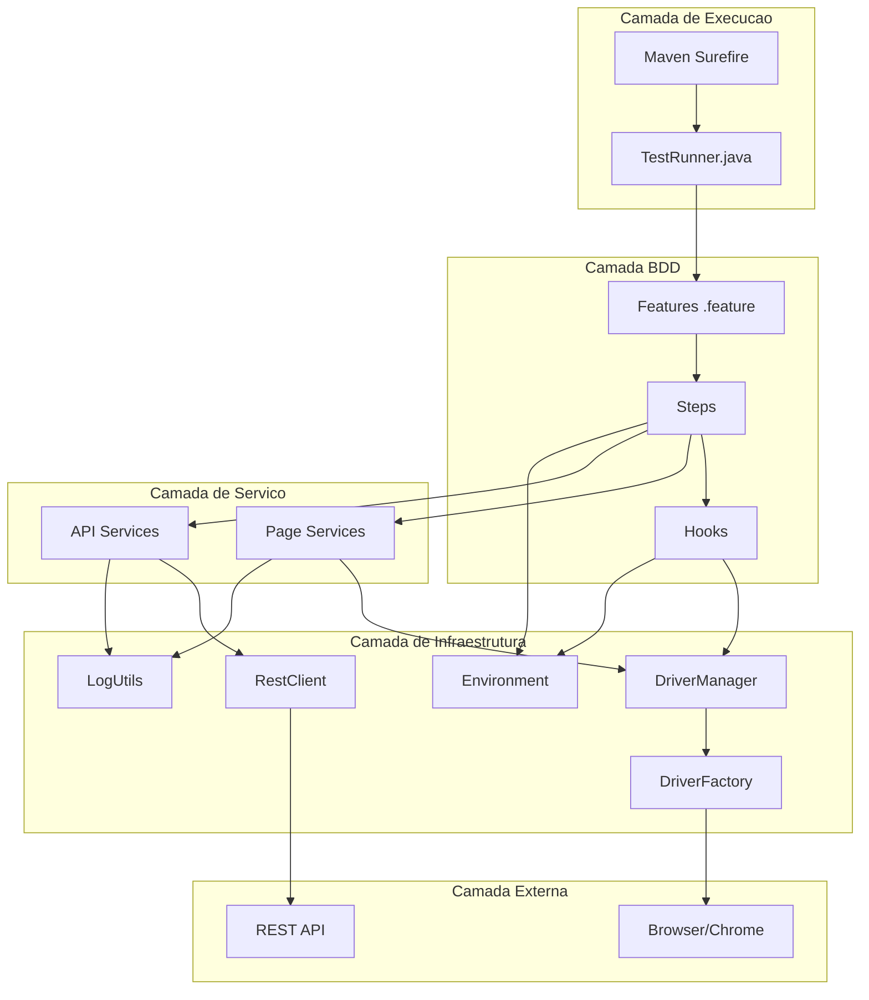

### Responsabilidades por Camada

| Camada | Responsabilidade | Classes |
|---|---|---|
| Execucao | Dispara testes via Maven/JUnit | `TestRunner`, Surefire Plugin |
| BDD | Define cenarios em linguagem natural | `.feature`, Steps, Hooks |
| Servico | Logica de interacao (UI e API) | Pages, Services |
| Infraestrutura | Recursos compartilhados | DriverManager, RestClient, Environment |
| Externa | Sistemas sob teste | Browser, APIs REST |

### Decisoes Tecnologicas

| Tecnologia | Versao | Motivo |
|---|---|---|
| Java | 8 | Compatibilidade maxima com ambientes corporativos |
| Selenium | 3.141.59 | Ultima versao estavel para Java 8 |
| REST Assured | 4.5.1 | Ultima versao com suporte Java 8 |
| Cucumber | 7.18.0 | BDD com suporte a portugues nativo |
| JUnit 4 | 4.13.2 | Integracao direta com Cucumber Runner |
| PicoContainer | 7.18.0 | DI leve sem configuracao XML |
| Allure | 2.24.0 | Relatorios visuais com evidencias |
| JavaFaker | 1.0.2 | Dados dinamicos para testes |
| Logback | 1.2.12 | Logging estruturado (SLF4J) |

### Estrutura de Diretorios

```
src/test/
├── java/
│   ├── api/
│   │   ├── builders/      # Builders com Faker
│   │   ├── clients/       # RestClient (HTTP)
│   │   ├── models/        # POJOs de request/response
│   │   └── services/      # Logica de negocio API
│   ├── config/            # Environment, ConfigReader
│   ├── drivers/           # DriverFactory, DriverManager
│   ├── exceptions/        # FrameworkException
│   ├── hooks/             # UiHooks (Before/After)
│   ├── pages/
│   │   ├── base/          # BasePage (metodos compartilhados)
│   │   └── login/         # LoginPage
│   ├── runners/           # TestRunner.java
│   ├── steps/
│   │   ├── api/           # PostSteps
│   │   └── ui/            # LoginSteps
│   └── utils/             # LogUtils, JsonUtils, ScreenshotUtils
└── resources/
    ├── environments/      # dev.properties, hml.properties
    ├── features/
    │   ├── api/           # posts.feature
    │   └── ui/            # login.feature
    ├── payloads/          # JSONs de request
    ├── schemas/           # JSON Schemas para validacao
    └── logback.xml
```

---

## Modulo 2 — Framework Web (Selenium + Cucumber)

### Fluxo de Execucao UI

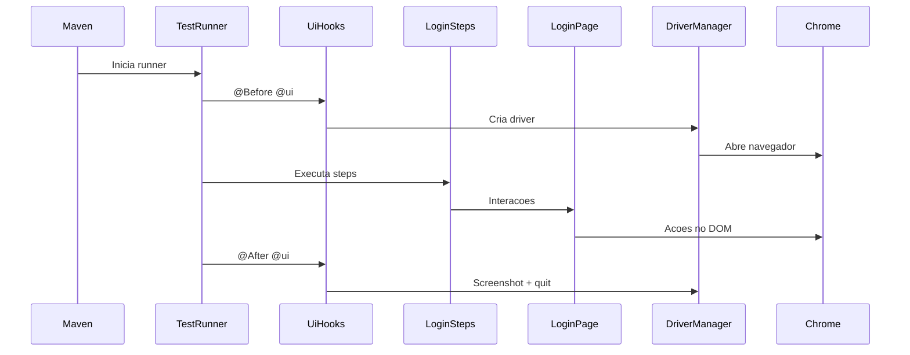

### DriverFactory — Criacao do Navegador

**DriverFactory** cria instancias de WebDriver. Detecta automaticamente se esta em CI (headless) ou local (visual).

```java
package drivers;

import org.openqa.selenium.WebDriver;
import org.openqa.selenium.chrome.ChromeDriver;
import org.openqa.selenium.chrome.ChromeOptions;
import utils.LogUtils;

public class DriverFactory {

    private static final boolean IN_CI =
            System.getenv("CI") != null || System.getenv("JENKINS_URL") != null;

    public WebDriver create(String browser) {
        LogUtils.info("Criando driver: " + browser + (IN_CI ? " [headless]" : " [visual]"));
        switch (browser.toLowerCase()) {
            case "chrome": return createChrome();
            default: throw new IllegalArgumentException("Browser nao suportado: " + browser);
        }
    }

    private WebDriver createChrome() {
        if (!IN_CI) {
            String path = System.getenv("CHROME_DRIVER_PATH") != null
                    ? System.getenv("CHROME_DRIVER_PATH")
                    : "C:\\chromedriver\\chromedriver-win64\\chromedriver.exe";
            System.setProperty("webdriver.chrome.driver", path);
        }

        ChromeOptions options = new ChromeOptions();
        if (IN_CI) {
            options.addArguments("--headless=new", "--no-sandbox",
                    "--disable-dev-shm-usage", "--window-size=1920,1080");
        } else {
            options.addArguments("--start-maximized");
        }
        options.addArguments("--disable-notifications", "--remote-allow-origins=*");
        return new ChromeDriver(options);
    }
}
```

> **Pratica**: nunca coloque o path do driver hardcoded em producao. Use variaveis de ambiente.

### DriverManager — ThreadLocal

**DriverManager** armazena o WebDriver em `ThreadLocal`, permitindo execucao paralela segura.

```java
package drivers;

import org.openqa.selenium.WebDriver;

public class DriverManager {

    private static final ThreadLocal<WebDriver> driver = new ThreadLocal<>();

    private DriverManager() {}

    public static WebDriver getDriver() {
        return driver.get();
    }

    public static void setDriver(WebDriver webDriver) {
        driver.set(webDriver);
    }

    public static void quit() {
        WebDriver d = driver.get();
        if (d != null) {
            d.quit();
            driver.remove();
        }
    }
}
```

> **Por que ThreadLocal?** Cada thread (cenario paralelo) tem sua propria instancia de driver, evitando conflitos.

### BasePage — Classe Abstrata

**BasePage** centraliza acoes comuns (navegar, digitar, clicar, esperar). Todas as pages herdam dela, evitando duplicacao de codigo.

```java
package pages.base;

import config.Environment;
import org.openqa.selenium.By;
import org.openqa.selenium.TimeoutException;
import org.openqa.selenium.WebDriver;
import org.openqa.selenium.WebElement;
import org.openqa.selenium.support.ui.ExpectedConditions;
import org.openqa.selenium.support.ui.WebDriverWait;
import utils.LogUtils;

public abstract class BasePage {

    protected final WebDriver driver;
    protected final WebDriverWait wait;

    protected BasePage(WebDriver driver) {
        this.driver = driver;
        int timeout = new Environment().getInt("timeout.explicit", 10);
        this.wait = new WebDriverWait(driver, timeout);
    }

    protected void navigate(String url) {
        LogUtils.info("Navegando: " + url);
        driver.get(url);
    }

    protected void type(By locator, String text) {
        WebElement element = wait.until(ExpectedConditions.visibilityOfElementLocated(locator));
        element.clear();
        element.sendKeys(text);
    }

    protected void click(By locator) {
        wait.until(ExpectedConditions.elementToBeClickable(locator)).click();
    }

    protected String getText(By locator) {
        return wait.until(ExpectedConditions.visibilityOfElementLocated(locator)).getText();
    }

    protected boolean urlContains(String fragment) {
        try {
            return wait.until(ExpectedConditions.urlContains(fragment));
        } catch (TimeoutException e) {
            LogUtils.warn("Timeout aguardando URL conter: " + fragment);
            return false;
        }
    }
}
```

> **Heranca vs Composicao**: aqui heranca e adequada porque toda page "e uma" pagina com comportamentos comuns de espera e interacao.

### LoginPage — Page Object

**LoginPage** encapsula os locators e acoes da tela de login. Nenhum step conhece detalhes de CSS/XPath.

```java
package pages.login;

import org.openqa.selenium.By;
import org.openqa.selenium.WebDriver;
import pages.base.BasePage;

public class LoginPage extends BasePage {

    private final By usernameField = By.name("username");
    private final By passwordField = By.name("password");
    private final By loginButton   = By.cssSelector("button[type='submit']");
    private final By errorMessage  = By.cssSelector(".oxd-alert-content-text");

    public LoginPage(WebDriver driver) {
        super(driver);
    }

    public void open(String url) {
        navigate(url);
    }

    public void fillUsername(String username) {
        type(usernameField, username);
    }

    public void fillPassword(String password) {
        type(passwordField, password);
    }

    public void clickLogin() {
        click(loginButton);
    }

    public String getErrorMessage() {
        return getText(errorMessage);
    }

    public boolean isOnDashboard() {
        return urlContains("/dashboard");
    }
}
```

> **Regra**: metodos publicos descrevem ACOES do usuario ("fillUsername"), nao detalhes tecnicos ("sendKeysToInput").

### Feature em Portugues — login.feature

O Cucumber suporta Gherkin em portugues com `# language: pt`. Isso permite que POs e QAs leiam os cenarios sem conhecer Java.

```gherkin
# language: pt
@ui
Funcionalidade: Login no sistema
  Como um usuário registrado
  Quero fazer login na aplicação
  Para acessar as funcionalidades do sistema

  Contexto:
    Dado que estou na página de login

  @smoke
  Cenário: Login com credenciais válidas
    Quando faço login como administrador
    Então devo ser redirecionado para a página inicial

  Cenário: Login com senha incorreta
    Quando faço login com usuário "admin" e senha incorreta
    Então devo ver a mensagem de erro "Invalid credentials"

  Esquema do Cenário: Login com credenciais inválidas
    Quando faço login com usuário "<usuario>" e senha "<senha>"
    Então devo ver a mensagem de erro "<mensagem>"

    Exemplos:
      | usuario       | senha      | mensagem            |
      | usuarioErrado | admin123   | Invalid credentials |
      | wronguser     | wrongpass  | Invalid credentials |
```

| Palavra-chave | Equivalente ingles | Uso |
|---|---|---|
| Funcionalidade | Feature | Agrupa cenarios |
| Cenário | Scenario | Caso de teste |
| Esquema do Cenário | Scenario Outline | Parametrizacao |
| Dado | Given | Pre-condicao |
| Quando | When | Acao |
| Então | Then | Validacao |
| E | And | Complemento |
| Contexto | Background | Steps comuns |

### LoginSteps — Glue Code

**Steps** conectam o Gherkin ao codigo Java. A `Environment` e injetada via PicoContainer (construtor).

```java
package steps.ui;

import config.Environment;
import drivers.DriverManager;
import io.cucumber.java.pt.Dado;
import io.cucumber.java.pt.Então;
import io.cucumber.java.pt.Quando;
import org.junit.Assert;
import pages.login.LoginPage;

public class LoginSteps {

    private final Environment env;
    private LoginPage loginPage;

    public LoginSteps(Environment env) {
        this.env = env;
    }

    @Dado("que estou na página de login")
    public void openLogin() {
        loginPage = new LoginPage(DriverManager.getDriver());
        loginPage.open(env.baseUrl);
    }

    @Quando("faço login como administrador")
    public void loginAsAdmin() {
        loginPage.fillUsername(env.get("usuario.admin"));
        loginPage.fillPassword(env.get("senha.admin"));
        loginPage.clickLogin();
    }

    @Quando("faço login com usuário {string} e senha {string}")
    public void loginWith(String user, String pass) {
        loginPage.fillUsername(user);
        loginPage.fillPassword(pass);
        loginPage.clickLogin();
    }

    @Quando("faço login com usuário {string} e senha incorreta")
    public void loginWithWrongPassword(String user) {
        loginPage.fillUsername(user);
        loginPage.fillPassword(env.get("senha.invalida"));
        loginPage.clickLogin();
    }

    @Então("devo ser redirecionado para a página inicial")
    public void shouldBeOnDashboard() {
        Assert.assertTrue("Nao redirecionou para o dashboard", loginPage.isOnDashboard());
    }

    @Então("devo ver a mensagem de erro {string}")
    public void shouldSeeError(String expected) {
        Assert.assertEquals("Mensagem incorreta", expected, loginPage.getErrorMessage());
    }
}
```

> **Injecao de Dependencia**: o PicoContainer cria `Environment` automaticamente e passa no construtor. Nenhuma anotacao necessaria.

### UiHooks — Ciclo de Vida do Navegador

**Hooks** gerenciam setup e teardown do browser. O `@Before` abre o Chrome; o `@After` tira screenshot e fecha.

```java
package hooks;

import config.Environment;
import drivers.DriverFactory;
import drivers.DriverManager;
import io.cucumber.java.After;
import io.cucumber.java.Before;
import io.cucumber.java.Scenario;
import org.openqa.selenium.WebDriver;
import utils.LogUtils;
import utils.ScreenshotUtils;

import java.util.concurrent.TimeUnit;

public class UiHooks {

    private final Environment env;

    public UiHooks() {
        this.env = new Environment();
    }

    @Before(value = "@ui", order = 0)
    public void logScenario(Scenario scenario) {
        LogUtils.info("=== [UI] " + scenario.getName() + " ===");
    }

    @Before(value = "@ui", order = 1)
    public void openBrowser() {
        if (DriverManager.getDriver() == null) {
            String browser = env.get("browser", "chrome");
            int implicitWait = env.getInt("timeout.implicit", 10);
            int pageLoad = env.getInt("timeout.pageLoad", 30);

            DriverFactory factory = new DriverFactory();
            WebDriver driver = factory.create(browser);
            driver.manage().timeouts().implicitlyWait(implicitWait, TimeUnit.SECONDS);
            driver.manage().timeouts().pageLoadTimeout(pageLoad, TimeUnit.SECONDS);
            DriverManager.setDriver(driver);
        }
    }

    @After(value = "@ui")
    public void closeBrowser(Scenario scenario) {
        WebDriver driver = DriverManager.getDriver();
        if (driver == null) return;

        String mode = env.get("screenshot.mode", "failure_only");
        boolean shouldCapture = "always".equals(mode) || scenario.isFailed();

        if (shouldCapture) {
            byte[] screenshot = ScreenshotUtils.capture(driver);
            if (screenshot.length > 0) {
                String status = scenario.isFailed() ? "FALHA" : "SUCESSO";
                scenario.attach(screenshot, "image/png", status + " - " + scenario.getName());
                LogUtils.info("Screenshot [" + status + "]");
            }
        }

        DriverManager.quit();
        LogUtils.info("=== Navegador encerrado ===");
    }
}
```

**Ciclo de vida por cenario:**

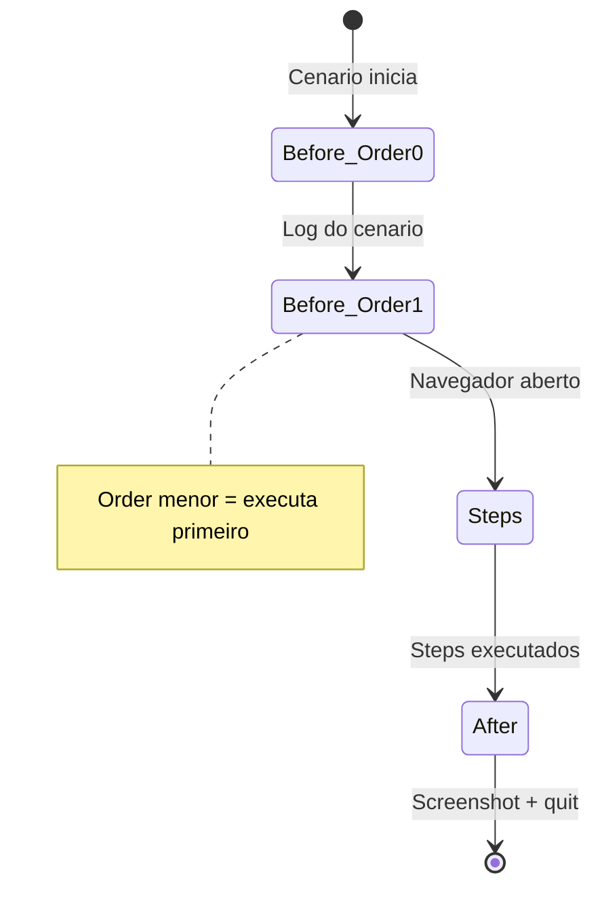

| Parametro | Funcao |
|---|---|
| `value = "@ui"` | Hook so executa para cenarios com tag @ui |
| `order = 0` | Prioridade (menor = primeiro) |
| `Scenario scenario` | Acesso ao nome, status e attach de evidencias |

> **Importante**: cada cenario abre e fecha o browser. Isso garante isolamento total entre testes.

---

## Modulo 3 — Automacao de APIs (REST Assured)

### Fluxo de Execucao API

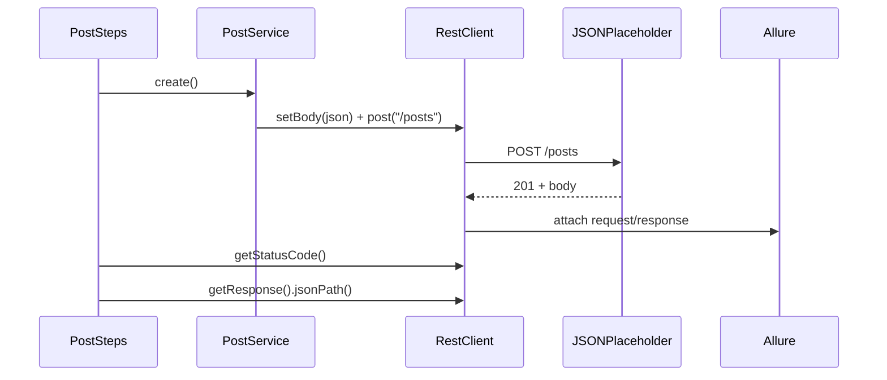

### RestClient — Cliente HTTP Corporativo

**RestClient** encapsula o REST Assured e anexa automaticamente request/response ao Allure. Uma instancia por cenario via PicoContainer.

```java
package api.clients;

import io.qameta.allure.Allure;
import io.restassured.http.ContentType;
import io.restassured.response.Response;
import io.restassured.specification.RequestSpecification;
import utils.LogUtils;

import static io.restassured.RestAssured.given;

public class RestClient {

    private Response response;
    private RequestSpecification request;
    private String baseUri;
    private String lastBody;

    public RestClient() {}

    public void setBaseUri(String baseUri) {
        this.baseUri = baseUri;
        this.request = given()
                .baseUri(baseUri)
                .contentType(ContentType.JSON)
                .accept(ContentType.JSON);
    }

    public void addHeader(String key, String value) {
        request = request.header(key, value);
    }

    public void setBody(String body) {
        this.lastBody = body;
        request = request.body(body);
    }

    public void get(String endpoint) { execute("GET", endpoint); }
    public void post(String endpoint) { execute("POST", endpoint); }
    public void put(String endpoint) { execute("PUT", endpoint); }
    public void delete(String endpoint) { execute("DELETE", endpoint); }

    public int getStatusCode() { return response.getStatusCode(); }
    public String getContentType() { return response.getContentType(); }
    public Response getResponse() { return response; }
    public String getResponseBody() { return response.getBody().asString(); }

    private void execute(String method, String endpoint) {
        LogUtils.info(method + " " + baseUri + endpoint);
        switch (method) {
            case "GET": response = request.when().get(endpoint).then().extract().response(); break;
            case "POST": response = request.when().post(endpoint).then().extract().response(); break;
            case "PUT": response = request.when().put(endpoint).then().extract().response(); break;
            case "DELETE": response = request.when().delete(endpoint).then().extract().response(); break;
        }
        attachToAllure(method, endpoint);
    }

    private void attachToAllure(String method, String endpoint) {
        try {
            String req = method + " " + baseUri + endpoint;
            if (lastBody != null) req += "\n\nBody:\n" + lastBody;
            Allure.addAttachment("Request", "text/plain", req);
            Allure.addAttachment("Response [" + response.getStatusCode() + "]",
                    "application/json", response.getBody().asPrettyString());
        } catch (Exception e) {
            LogUtils.debug("Allure attach falhou: " + e.getMessage());
        }
    }
}
```

**O que o Allure attachment faz:** cada chamada HTTP grava request e response como anexo no relatorio. Quando um teste falha, voce ve exatamente o que foi enviado e recebido — sem precisar re-executar.

> **Pratica**: o `RestClient` nao conhece regras de negocio. Ele so sabe fazer HTTP + logar.

### PostService — Camada de Servico

**PostService** encapsula a logica de negocio das chamadas. O pattern **Client-Service** separa "como fazer HTTP" (Client) de "o que fazer com o recurso" (Service).

```java
package api.services;

import api.clients.RestClient;
import utils.JsonUtils;

public class PostService {

    private final RestClient client;

    public PostService(RestClient client) {
        this.client = client;
    }

    public void listAll() {
        client.get("/posts");
    }

    public void getById(int id) {
        client.get("/posts/" + id);
    }

    public void getByUser(int userId) {
        client.get("/posts?userId=" + userId);
    }

    public void create() {
        String body = JsonUtils.load("payloads/posts/create-post.json");
        client.setBody(body);
        client.post("/posts");
    }

    public void update(int id) {
        String body = JsonUtils.load("payloads/posts/update-post.json")
                .replace("\"id\":1", "\"id\":" + id);
        client.setBody(body);
        client.put("/posts/" + id);
    }

    public void delete(int id) {
        client.delete("/posts/" + id);
    }
}
```

> **Por que separar?** Se a URL mudar de `/posts` para `/v2/posts`, voce altera apenas o Service. O Client e os Steps continuam iguais.

### PostBuilder + Faker — Dados Dinamicos

**PostBuilder** usa o padrao Builder com JavaFaker para gerar dados aleatorios em portugues. Ideal para testes que precisam de dados unicos a cada execucao.

```java
package api.builders;

import api.models.PostRequest;
import com.github.javafaker.Faker;

import java.util.Locale;

public class PostBuilder {

    private static final Faker faker = new Faker(new Locale("pt-BR"));

    private String title;
    private String body;
    private int userId;

    private PostBuilder() {
        this.title = faker.lorem().sentence(5);
        this.body = faker.lorem().paragraph(2);
        this.userId = 1;
    }

    public static PostBuilder valid() {
        return new PostBuilder();
    }

    public PostBuilder withTitle(String title) {
        this.title = title;
        return this;
    }

    public PostBuilder withBody(String body) {
        this.body = body;
        return this;
    }

    public PostBuilder withUserId(int userId) {
        this.userId = userId;
        return this;
    }

    public PostRequest build() {
        return new PostRequest(title, body, userId);
    }
}
```

**Uso tipico:**

```java
// Post com dados aleatorios
PostRequest random = PostBuilder.valid().build();

// Post customizado
PostRequest custom = PostBuilder.valid()
        .withTitle("Titulo especifico")
        .withUserId(5)
        .build();
```

> **Quando usar Faker vs Payload fixo**: use Faker para testes de carga e cenarios que precisam de unicidade. Use payload fixo quando o cenario valida um valor especifico na resposta.

### JSON Payloads — Arquivos Estaticos

Payloads ficam em `src/test/resources/payloads/` como arquivos `.json`. Isso permite versionamento, reutilizacao e revisao independente do codigo.

**create-post.json:**

```json
{
  "title": "Post de Teste Automatizado",
  "body": "Conteudo via REST Assured",
  "userId": 1
}
```

**update-post.json:**

```json
{
  "id": 1,
  "title": "Titulo Atualizado",
  "body": "Corpo atualizado",
  "userId": 1
}
```

**JsonUtils — Leitura do classpath:**

```java
package utils;

import exceptions.FrameworkException;

import java.io.InputStream;
import java.util.Scanner;

public class JsonUtils {

    private JsonUtils() {}

    public static String load(String path) {
        InputStream input = JsonUtils.class.getClassLoader().getResourceAsStream(path);
        if (input == null) {
            throw new FrameworkException("Arquivo JSON nao encontrado: " + path);
        }
        try (Scanner scanner = new Scanner(input, "UTF-8")) {
            return scanner.useDelimiter("\\A").next();
        }
    }
}
```

> **Dica**: `\\A` e um regex que significa "inicio do input" — faz o Scanner ler o arquivo inteiro de uma vez.

### JSON Schema Validation — Validacao de Contrato

**Schema validation** garante que a estrutura da resposta nao mudou (campos obrigatorios, tipos, limites). E um teste de contrato leve.

**post-schema.json:**

```json
{
  "type": "object",
  "required": ["userId", "id", "title", "body"],
  "properties": {
    "userId": { "type": "integer", "minimum": 1 },
    "id": { "type": "integer", "minimum": 1 },
    "title": { "type": "string", "minLength": 1 },
    "body": { "type": "string", "minLength": 1 }
  },
  "additionalProperties": true
}
```

**Step que valida o schema:**

```java
@E("a resposta deve estar de acordo com o schema {string}")
public void validateSchema(String schemaFile) {
    restClient.getResponse().then().assertThat()
            .body(io.restassured.module.jsv.JsonSchemaValidator
                    .matchesJsonSchemaInClasspath("schemas/" + schemaFile));
}
```

**Feature que usa:**

```gherkin
@smoke
Cenário: Validar contrato (schema) do post
    Quando busco o post de ID 1
    Então o status code da resposta deve ser 200
    E a resposta deve estar de acordo com o schema "post-schema.json"
```

> **Pratica**: crie um schema para cada recurso principal da API. Isso detecta breaking changes antes de chegarem a producao.

### TestData vs Payload — Quando Usar Cada Um

| Aspecto | Payload (JSON file) | Builder + Faker |
|---|---|---|
| Dados | Fixos, versionados | Dinamicos, aleatorios |
| Quando usar | Validar valor especifico na resposta | Testes de carga, unicidade |
| Manutencao | Alterar arquivo | Alterar Builder |
| Exemplo | `create-post.json` | `PostBuilder.valid().build()` |
| Vantagem | Reprodutivel, revisavel | Nao precisa inventar dados |
| Desvantagem | Pode ficar obsoleto | Resultado varia entre execucoes |

### Feature Completa — posts.feature

```gherkin
# language: pt
@api
Funcionalidade: API de Posts
  Como consumidor da API REST
  Quero validar os endpoints de posts
  Para garantir que a API responde corretamente

  Contexto:
    Dado que estou consumindo a API de posts

  @smoke
  Cenário: Listar todos os posts
    Quando busco todos os posts
    Então o status code da resposta deve ser 200
    E o Content-Type da resposta deve conter "application/json"
    E a resposta deve conter 100 posts

  @smoke
  Cenário: Buscar um post por ID
    Quando busco o post de ID 1
    Então o status code da resposta deve ser 200
    E o campo "userId" deve ter valor inteiro 1
    E o campo "id" deve ter valor inteiro 1
    E o campo "title" não deve estar vazio
    E o campo "body" não deve estar vazio

  Cenário: Buscar posts de um usuário específico
    Quando busco os posts do usuário 1
    Então o status code da resposta deve ser 200
    E todos os posts devem ter "userId" igual a 1

  Cenário: Criar um novo post
    Dado que tenho os dados de um novo post
    Quando envio o novo post
    Então o status code da resposta deve ser 201
    E o campo "title" deve ter valor de texto "Post de Teste Automatizado"
    E o campo "userId" deve ter valor inteiro 1
    E o campo "id" não deve estar vazio

  Cenário: Atualizar um post existente
    Dado que tenho os dados de atualização do post 1
    Quando atualizo o post 1
    Então o status code da resposta deve ser 200
    E o campo "title" deve ter valor de texto "Titulo Atualizado"

  Cenário: Deletar um post
    Quando deleto o post 1
    Então o status code da resposta deve ser 200

  Cenário: Buscar post inexistente retorna 404
    Quando busco o post de ID 9999
    Então o status code da resposta deve ser 404

  @smoke
  Cenário: Validar contrato (schema) do post
    Quando busco o post de ID 1
    Então o status code da resposta deve ser 200
    E a resposta deve estar de acordo com o schema "post-schema.json"
```

---

## Modulo 4 — Engenharia do Framework

### PicoContainer — Injecao de Dependencia

**PicoContainer** e o DI container do Cucumber. Ele cria automaticamente as dependencias de cada Step class analisando o construtor. Nao precisa de anotacoes, XML ou configuracao — basta declarar a dependencia no construtor.

```java
// PostSteps recebe 3 dependencias automaticamente
public class PostSteps {

    private final Environment env;
    private final RestClient restClient;
    private final PostService postService;

    public PostSteps(Environment env, RestClient restClient, PostService postService) {
        this.env = env;
        this.restClient = restClient;
        this.postService = postService;
    }
}
```

**Como funciona:**

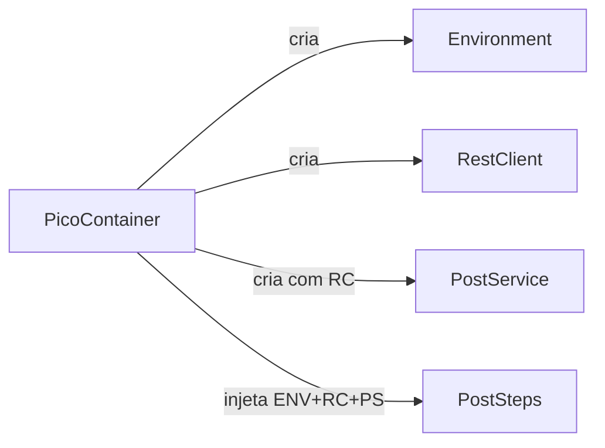

| Regra | Descricao |
|---|---|
| Escopo | Uma instancia por cenario (resetado entre cenarios) |
| Resolucao | Automatica pelo tipo do parametro no construtor |
| Compartilhamento | Mesma instancia para todos os Steps do cenario |
| Requisito | Classe precisa ter construtor publico |

> **Importante**: se duas Step classes pedem `RestClient`, ambas recebem a MESMA instancia dentro do cenario.

### Configuracao de Ambiente

**Environment** carrega o arquivo `.properties` correto baseado na JVM property `-Denvironment`. Hierarquia de resolucao:

1. System Property: `-Denvironment=hml`
2. Variavel de ambiente: `ENVIRONMENT=hml`
3. Padrao: `dev`

**dev.properties:**

```properties
# Ambiente: DEV
base.url=https://opensource-demo.orangehrmlive.com/web/index.php/auth/login
api.base.url=https://jsonplaceholder.typicode.com

# Navegador
browser=chrome

# Timeouts (segundos)
timeout.implicit=10
timeout.pageLoad=30
timeout.explicit=10

# Evidencias: always | failure_only
screenshot.mode=failure_only

# Credenciais de TESTE
usuario.admin=admin
senha.admin=admin123
senha.invalida=senhaErrada
```

**Environment.java:**

```java
package config;

public class Environment {

    private final ConfigReader config;
    private final String env;

    public String baseUrl;
    public String apiBaseUrl;

    public Environment() {
        this.env = resolveEnvironment();
        this.config = new ConfigReader("environments/" + env + ".properties");
        this.baseUrl = config.get("base.url");
        this.apiBaseUrl = config.get("api.base.url");
    }

    public String get(String key) {
        return config.get(key);
    }

    public String get(String key, String defaultValue) {
        return config.get(key, defaultValue);
    }

    public int getInt(String key, int defaultValue) {
        return config.getInt(key, defaultValue);
    }

    private String resolveEnvironment() {
        if (System.getProperty("environment") != null) {
            return System.getProperty("environment");
        }
        if (System.getenv("ENVIRONMENT") != null) {
            return System.getenv("ENVIRONMENT");
        }
        return "dev";
    }
}
```

**ConfigReader.java** — le `.properties` com fallback para variaveis de ambiente:

```java
package config;

import exceptions.FrameworkException;

import java.io.IOException;
import java.io.InputStream;
import java.util.Properties;

public class ConfigReader {

    private final Properties props = new Properties();

    public ConfigReader(String fileName) {
        try (InputStream input = getClass().getClassLoader().getResourceAsStream(fileName)) {
            if (input == null) {
                throw new FrameworkException("Arquivo nao encontrado no classpath: " + fileName);
            }
            props.load(input);
        } catch (IOException e) {
            throw new FrameworkException("Erro ao carregar " + fileName, e);
        }
    }

    public String get(String key) {
        // Prioridade: variavel de ambiente > arquivo
        String envValue = System.getenv(key.replace(".", "_").toUpperCase());
        if (envValue != null) return envValue;
        return props.getProperty(key);
    }

    public String get(String key, String defaultValue) {
        String value = get(key);
        return value != null ? value : defaultValue;
    }

    public int getInt(String key, int defaultValue) {
        String value = get(key);
        return value != null ? Integer.parseInt(value) : defaultValue;
    }
}
```

> **Seguranca**: em CI/CD, credenciais vem de variaveis de ambiente (GitHub Secrets). O `ConfigReader` prioriza env vars automaticamente.

### Logging — SLF4J + Logback

**LogUtils** e uma fachada simplificada sobre SLF4J. Toda a automacao usa esta classe para logar — nunca `System.out.println`.

```java
package utils;

import org.slf4j.Logger;
import org.slf4j.LoggerFactory;

public class LogUtils {

    private static final Logger log = LoggerFactory.getLogger("automation");

    private LogUtils() {}

    public static void info(String msg) { log.info(msg); }
    public static void warn(String msg) { log.warn(msg); }
    public static void error(String msg) { log.error(msg); }
    public static void error(String msg, Throwable t) { log.error(msg, t); }
    public static void debug(String msg) { log.debug(msg); }
}
```

**logback.xml** — configuracao de saida:

```xml
<?xml version="1.0" encoding="UTF-8"?>
<configuration>
    <appender name="CONSOLE" class="ch.qos.logback.core.ConsoleAppender">
        <encoder>
            <pattern>%d{HH:mm:ss} %-5level - %msg%n</pattern>
        </encoder>
    </appender>

    <appender name="FILE" class="ch.qos.logback.core.FileAppender">
        <file>target/test-execution.log</file>
        <encoder>
            <pattern>%d{yyyy-MM-dd HH:mm:ss} [%thread] %-5level %logger{36} - %msg%n</pattern>
        </encoder>
    </appender>

    <logger name="automation" level="INFO"/>

    <root level="WARN">
        <appender-ref ref="CONSOLE"/>
        <appender-ref ref="FILE"/>
    </root>
</configuration>
```

| Appender | Destino | Formato |
|---|---|---|
| CONSOLE | Terminal | `14:30:05 INFO  - Navegando: https://...` |
| FILE | `target/test-execution.log` | Com data, thread e logger |

> **Pratica**: use `WARN` no root para silenciar logs de bibliotecas. O logger `automation` fica em `INFO` para seus logs.

### FrameworkException — Excecao Customizada

**FrameworkException** diferencia erros de infraestrutura (config ausente, template nao encontrado) de erros de teste (assertion). Isso facilita debug no relatorio.

```java
package exceptions;

public class FrameworkException extends RuntimeException {

    public FrameworkException(String message) {
        super(message);
    }

    public FrameworkException(String message, Throwable cause) {
        super(message, cause);
    }
}
```

**Uso no projeto:**

```java
// ConfigReader lanca quando arquivo nao existe
if (input == null) {
    throw new FrameworkException("Arquivo nao encontrado no classpath: " + fileName);
}

// JsonUtils lanca quando payload nao existe
if (input == null) {
    throw new FrameworkException("Arquivo JSON nao encontrado: " + path);
}
```

> **Dica**: `RuntimeException` (unchecked) evita `throws` em toda a cadeia de chamadas.

### Screenshots — Modo Configuravel

O framework captura screenshots com base no `screenshot.mode` do properties:

| Modo | Comportamento |
|---|---|
| `failure_only` | Captura apenas quando o cenario falha |
| `always` | Captura em todo cenario (sucesso e falha) |

**ScreenshotUtils.java:**

```java
package utils;

import org.openqa.selenium.OutputType;
import org.openqa.selenium.TakesScreenshot;
import org.openqa.selenium.WebDriver;

public class ScreenshotUtils {

    private ScreenshotUtils() {}

    public static byte[] capture(WebDriver driver) {
        if (driver instanceof TakesScreenshot) {
            return ((TakesScreenshot) driver).getScreenshotAs(OutputType.BYTES);
        }
        return new byte[0];
    }
}
```

**Logica no Hook:**

```java
String mode = env.get("screenshot.mode", "failure_only");
boolean shouldCapture = "always".equals(mode) || scenario.isFailed();

if (shouldCapture) {
    byte[] screenshot = ScreenshotUtils.capture(driver);
    scenario.attach(screenshot, "image/png", status + " - " + scenario.getName());
}
```

> **Em CI**: use `failure_only` para nao sobrecarregar o storage de artefatos.

### Allure Report — Relatorio Visual

O **Allure** gera relatorios interativos com timeline, graficos, e anexos (screenshots, request/response).

**Gerar e visualizar:**

```bash
# Apos executar os testes
mvn allure:serve
```

Isso abre o relatorio no navegador automaticamente. Os resultados ficam em `target/allure-results/`.

**Integracao no pom.xml:**

```xml
<plugin>
    <groupId>io.qameta.allure</groupId>
    <artifactId>allure-maven</artifactId>
    <version>2.12.0</version>
    <configuration>
        <reportVersion>2.24.0</reportVersion>
        <resultsDirectory>allure-results</resultsDirectory>
    </configuration>
</plugin>
```

**Plugin Cucumber no TestRunner:**

```java
plugin = {
    "io.qameta.allure.cucumber7jvm.AllureCucumber7Jvm"
}
```

**O que aparece no relatorio:**

| Secao | Conteudo |
|---|---|
| Overview | Taxa de sucesso, duracao, timeline |
| Suites | Cenarios agrupados por feature |
| Behaviors | Cenarios agrupados por funcionalidade |
| Attachments | Screenshots (UI) e Request/Response (API) |
| Categories | Agrupamento por tipo de falha |

### CI/CD — GitHub Actions

O pipeline roda automaticamente em push/PR. Executa testes em headless e publica o Allure no GitHub Pages.

```yaml
name: Automacao de Testes - Selenium + REST Assured

on:
  push:
    branches: [ main, develop ]
  pull_request:
    branches: [ main ]
  workflow_dispatch:

permissions:
  contents: write
  pages: write

jobs:
  testes:
    name: Executar Testes (UI + API)
    runs-on: ubuntu-latest

    steps:
      - name: Checkout do repositorio
        uses: actions/checkout@v4

      - name: Configurar Java 8
        uses: actions/setup-java@v4
        with:
          java-version: '8'
          distribution: 'temurin'
          cache: maven

      - name: Instalar Google Chrome
        uses: browser-actions/setup-chrome@v1
        with:
          chrome-version: stable

      - name: Configurar ChromeDriver
        run: |
          CHROME_VERSION=$(google-chrome --version | grep -oP '\d+\.\d+\.\d+')
          DRIVER_URL="https://storage.googleapis.com/chrome-for-testing-public/${CHROME_VERSION}.0/linux64/chromedriver-linux64.zip"
          wget -q "$DRIVER_URL" -O /tmp/chromedriver.zip || true
          if [ -f /tmp/chromedriver.zip ]; then
            unzip -o /tmp/chromedriver.zip -d /tmp/
            sudo mv /tmp/chromedriver-linux64/chromedriver /usr/local/bin/
            sudo chmod +x /usr/local/bin/chromedriver
          fi

      - name: Executar testes Maven
        run: mvn test --no-transfer-progress
        env:
          CI: true

      - name: Gerar relatorio Allure
        uses: simple-elf/allure-report-action@master
        if: always()
        with:
          allure_results: target/allure-results
          allure_history: allure-history

      - name: Publicar Allure Report no GitHub Pages
        uses: peaceiris/actions-gh-pages@v4
        if: always()
        with:
          github_token: ${{ secrets.GITHUB_TOKEN }}
          publish_branch: gh-pages
          publish_dir: allure-history

      - name: Publicar relatorio Cucumber
        uses: actions/upload-artifact@v4
        if: always()
        with:
          name: cucumber-report-${{ github.run_number }}
          path: target/cucumber-reports/
          retention-days: 30
```

**Fluxo do pipeline:**

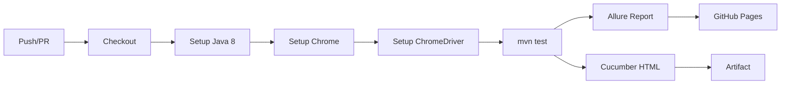

> **Variavel CI**: o `DriverFactory` detecta `CI=true` e ativa headless automaticamente.

### Estrategia de Tags

Tags controlam QUAIS testes executar. Combine tags para criar suites flexiveis.

| Tag | Escopo | Quando usar |
|---|---|---|
| `@ui` | Testes de interface | Cenarios que abrem navegador |
| `@api` | Testes de API | Cenarios REST (sem browser) |
| `@smoke` | Smoke test | Cenarios criticos (deploy gate) |
| `@regression` | Regressao completa | Suite noturna |
| `@wip` | Work in progress | Cenarios em desenvolvimento |

**Combinacoes uteis:**

```bash
# Smoke de API
mvn test -Dcucumber.filter.tags="@api and @smoke"

# Tudo exceto WIP
mvn test -Dcucumber.filter.tags="not @wip"

# UI ou API smoke
mvn test -Dcucumber.filter.tags="@smoke"

# Ambiente de homologacao
mvn test -Denvironment=hml -Dcucumber.filter.tags="@smoke"
```

### TestRunner — Ponto de Entrada

```java
package runners;

import io.cucumber.junit.Cucumber;
import io.cucumber.junit.CucumberOptions;
import org.junit.runner.RunWith;

@RunWith(Cucumber.class)
@CucumberOptions(
    features = "src/test/resources/features",
    glue = {"steps", "hooks"},
    plugin = {
        "pretty",
        "html:target/cucumber-reports/cucumber.html",
        "json:target/cucumber-reports/cucumber.json",
        "junit:target/cucumber-reports/cucumber.xml",
        "io.qameta.allure.cucumber7jvm.AllureCucumber7Jvm"
    },
    monochrome = true
)
public class TestRunner {
}
```

| Parametro | Funcao |
|---|---|
| `features` | Caminho das `.feature` |
| `glue` | Pacotes com Steps e Hooks |
| `plugin` | Formatadores de relatorio |
| `monochrome` | Saida legivel no terminal |

### Como Adicionar um Novo Teste UI

Checklist rapido para criar um novo cenario de interface:

- [ ] 1. Criar/atualizar Page Object em `pages/novapage/NovaPage.java`
- [ ] 2. Herdar de `BasePage` e usar `type()`, `click()`, `getText()`
- [ ] 3. Criar feature em `resources/features/ui/nova.feature` com tag `@ui`
- [ ] 4. Criar Steps em `steps/ui/NovaSteps.java`
- [ ] 5. Injetar `Environment` via construtor se precisar de configs
- [ ] 6. Executar: `mvn test -Dcucumber.filter.tags="@ui"`
- [ ] 7. Verificar screenshot no Allure se falhou

**Exemplo minimo de nova Page:**

```java
package pages.dashboard;

import org.openqa.selenium.By;
import org.openqa.selenium.WebDriver;
import pages.base.BasePage;

public class DashboardPage extends BasePage {

    private final By welcomeMsg = By.cssSelector(".oxd-userdropdown-name");

    public DashboardPage(WebDriver driver) {
        super(driver);
    }

    public String getWelcomeText() {
        return getText(welcomeMsg);
    }
}
```

### Como Adicionar um Novo Teste API

Checklist rapido para criar um novo cenario de API:

- [ ] 1. Criar payload em `resources/payloads/recurso/acao.json` (se necessario)
- [ ] 2. Criar schema em `resources/schemas/recurso-schema.json` (se necessario)
- [ ] 3. Criar Service em `api/services/RecursoService.java`
- [ ] 4. Injetar `RestClient` no construtor do Service
- [ ] 5. Criar feature em `resources/features/api/recurso.feature` com tag `@api`
- [ ] 6. Criar Steps em `steps/api/RecursoSteps.java`
- [ ] 7. Injetar `Environment`, `RestClient` e `RecursoService` via construtor
- [ ] 8. Executar: `mvn test -Dcucumber.filter.tags="@api"`

**Exemplo minimo de novo Service:**

```java
package api.services;

import api.clients.RestClient;
import utils.JsonUtils;

public class UserService {

    private final RestClient client;

    public UserService(RestClient client) {
        this.client = client;
    }

    public void getById(int id) {
        client.get("/users/" + id);
    }

    public void create() {
        String body = JsonUtils.load("payloads/users/create-user.json");
        client.setBody(body);
        client.post("/users");
    }
}
```

### Troubleshooting — 5 Erros Mais Comuns

| # | Erro | Causa | Solucao |
|---|---|---|---|
| 1 | `SessionNotCreatedException: session not created` | ChromeDriver incompativel com Chrome | Baixe o ChromeDriver da mesma versao major do Chrome |
| 2 | `FrameworkException: Arquivo nao encontrado no classpath` | Arquivo `.properties` ou JSON ausente | Verifique o nome exato e o diretorio em `src/test/resources/` |
| 3 | `javax.net.ssl.SSLHandshakeException` | Proxy/antivirus interceptando SSL | Configure truststore: veja secao argLine no `pom.xml` |
| 4 | `cucumber.runtime.CucumberException: No backends` | Glue path errado no TestRunner | Verifique que `glue = {"steps", "hooks"}` aponta para os pacotes corretos |
| 5 | `TimeoutException` nos testes UI | Elemento nao encontrado no tempo | Aumente `timeout.explicit` no properties ou revise o locator |

**Problema adicional — Maven nao baixa dependencias:**

```bash
# Limpar cache local e forcar re-download
mvn dependency:purge-local-repository
mvn clean test
```

**Problema — Testes API passam mas UI falha:**

Isso geralmente indica problema com ChromeDriver. Verifique:

```bash
# Versao do Chrome
google-chrome --version   # Linux
# ou no Windows: chrome.exe --version

# Versao do ChromeDriver
chromedriver --version
```

As versoes major devem ser iguais (ex: Chrome 120.x com ChromeDriver 120.x).

---

## Comandos Rapidos

### Execucao

| Comando | Descricao |
|---|---|
| `mvn test` | Executar todos os testes |
| `mvn test -Dcucumber.filter.tags="@smoke"` | Apenas smoke tests |
| `mvn test -Dcucumber.filter.tags="@ui"` | Apenas testes UI |
| `mvn test -Dcucumber.filter.tags="@api"` | Apenas testes API |
| `mvn test -Dcucumber.filter.tags="@api and @smoke"` | Smoke de API |
| `mvn test -Dcucumber.filter.tags="not @wip"` | Ignorar WIP |
| `mvn test -Denvironment=hml` | Ambiente homologacao |
| `mvn test -Denvironment=hml -Dcucumber.filter.tags="@smoke"` | Smoke em HML |

### Relatorios

| Comando | Descricao |
|---|---|
| `mvn allure:serve` | Abre Allure no navegador |
| `mvn allure:report` | Gera Allure sem abrir |
| Abrir `target/cucumber-reports/cucumber.html` | Relatorio Cucumber |
| Ver `target/test-execution.log` | Log completo da execucao |

### Maven Utilitarios

| Comando | Descricao |
|---|---|
| `mvn clean` | Limpa diretorio target |
| `mvn clean test` | Limpa e executa |
| `mvn dependency:tree` | Arvore de dependencias |
| `mvn dependency:purge-local-repository` | Limpa cache local |
| `mvn compile -X` | Compilar com debug verbose |

### Variaveis de Ambiente

| Variavel | Descricao | Exemplo |
|---|---|---|
| `CHROME_DRIVER_PATH` | Caminho do ChromeDriver | `C:\chromedriver\chromedriver.exe` |
| `ENVIRONMENT` | Ambiente de execucao | `dev`, `hml`, `prod` |
| `CI` | Indica ambiente CI (headless) | `true` |
| `USUARIO_ADMIN` | Override de credencial | `admin` |
| `SENHA_ADMIN` | Override de senha | `admin123` |

---

## Conceitos Avancados

### Arquitetura Client-Service em Detalhe

O padrao **Client-Service** separa responsabilidades HTTP de logica de negocio. Isso permite reutilizar o `RestClient` para qualquer recurso da API.

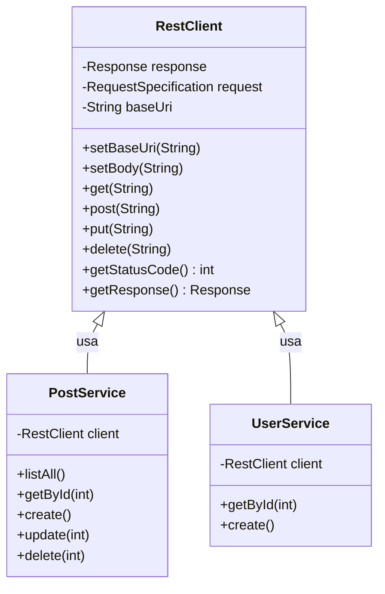

| Camada | Conhece | Nao conhece |
|---|---|---|
| RestClient | HTTP, headers, Allure | Endpoints, regras de negocio |
| Service | Endpoints, payloads, logica | Como o HTTP e feito internamente |
| Steps | Orquestracao do cenario | Implementacao do Service |

### Ciclo de Vida Completo de um Cenario

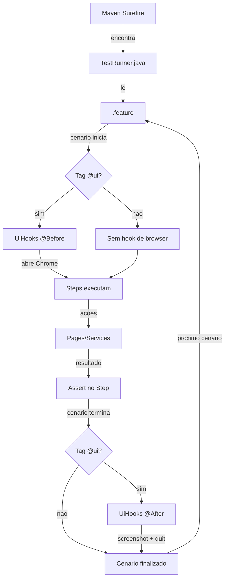

### PostRequest — Modelo POJO

```java
package api.models;

public class PostRequest {

    private String title;
    private String body;
    private int userId;

    public PostRequest() {}

    public PostRequest(String title, String body, int userId) {
        this.title = title;
        this.body = body;
        this.userId = userId;
    }

    public String getTitle() { return title; }
    public void setTitle(String title) { this.title = title; }
    public String getBody() { return body; }
    public void setBody(String body) { this.body = body; }
    public int getUserId() { return userId; }
    public void setUserId(int userId) { this.userId = userId; }

    public String toJson() {
        return "{\"title\":\"" + title + "\",\"body\":\"" + body + "\",\"userId\":" + userId + "}";
    }
}
```

> **Quando usar POJO vs JSON file**: use POJO quando precisar gerar JSON dinamicamente (com Builder/Faker). Use arquivo JSON quando o payload e fixo e precisa ser revisado pelo time.

### Boas Praticas Consolidadas

| Area | Pratica | Motivo |
|---|---|---|
| Pages | Um metodo por acao do usuario | Legibilidade e reutilizacao |
| Pages | Locators como `private final By` | Encapsulamento, facil manutencao |
| Steps | Sem logica de UI/API direta | Separacao de responsabilidades |
| Steps | Assert com mensagem descritiva | Facilita debug no relatorio |
| Features | Linguagem do negocio, nao tecnica | POs precisam ler |
| Features | Um cenario = um comportamento | Isolamento |
| Config | Sem credenciais no codigo | Seguranca |
| Config | Variaveis de ambiente em CI | Zero hardcode em producao |
| API | Schema validation nos endpoints criticos | Detecta breaking changes |
| API | Payload files versionados | Rastreabilidade |
| CI | `if: always()` nos relatorios | Reports mesmo quando falha |
| Geral | Log ao inves de println | Profissionalismo |

### Dependencias do pom.xml

| Dependencia | Grupo | Funcao |
|---|---|---|
| selenium-java 3.141.59 | Web | Automacao de browser |
| cucumber-java 7.18.0 | BDD | Gherkin + steps |
| cucumber-junit 7.18.0 | BDD | Integracao JUnit |
| junit 4.13.2 | Test | Framework de teste |
| rest-assured 4.5.1 | API | Cliente HTTP fluente |
| json-schema-validator 4.5.1 | API | Validacao de contrato |
| allure-cucumber7-jvm 2.24.0 | Report | Relatorio visual |
| aspectjweaver 1.9.19 | Report | Necessario para Allure |
| cucumber-picocontainer 7.18.0 | DI | Injecao de dependencia |
| slf4j-api 1.7.36 | Log | Fachada de logging |
| logback-classic 1.2.12 | Log | Implementacao SLF4J |
| javafaker 1.0.2 | Data | Dados dinamicos pt-BR |

### Plugins Maven

| Plugin | Funcao |
|---|---|
| maven-surefire-plugin 3.2.5 | Executa testes (encontra TestRunner) |
| maven-compiler-plugin 3.13.0 | Compila Java 8 |
| allure-maven 2.12.0 | Gera/serve relatorio Allure |

**argLine do Surefire:**

```xml
<argLine>
    -Djavax.net.ssl.trustStore=${user.home}/.maven-cacerts
    -Djavax.net.ssl.trustStorePassword=changeit
    -javaagent:"${settings.localRepository}/org/aspectj/aspectjweaver/1.9.19/aspectjweaver-1.9.19.jar"
</argLine>
```

- **trustStore**: resolve problemas de SSL com proxies corporativos que interceptam HTTPS
- **javaagent**: necessario para o Allure capturar informacoes de execucao

> **Se nao usar proxy corporativo**: remova a linha do trustStore. O AspectJ agent deve permanecer.

### Fluxo de Resolucao de Configuracao

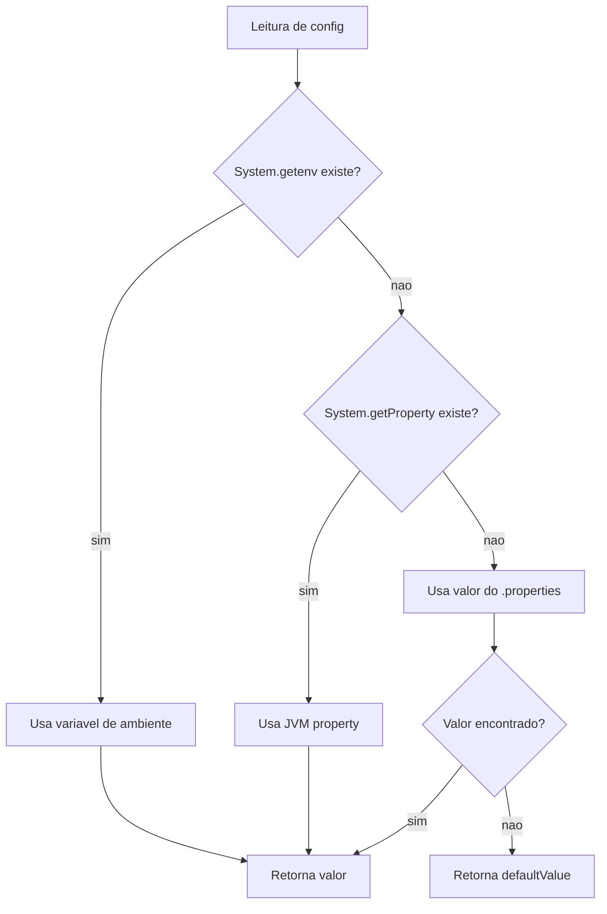

Isso permite 3 niveis de override sem alterar codigo:

1. **Variavel de ambiente** (CI/CD — GitHub Secrets)
2. **JVM property** (linha de comando — `-Dchave=valor`)
3. **Arquivo .properties** (desenvolvimento local)

### Estrutura de Dados da Automacao

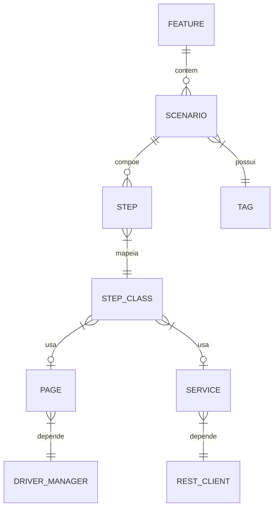

---

## Apendice — Mapa Mental do Framework

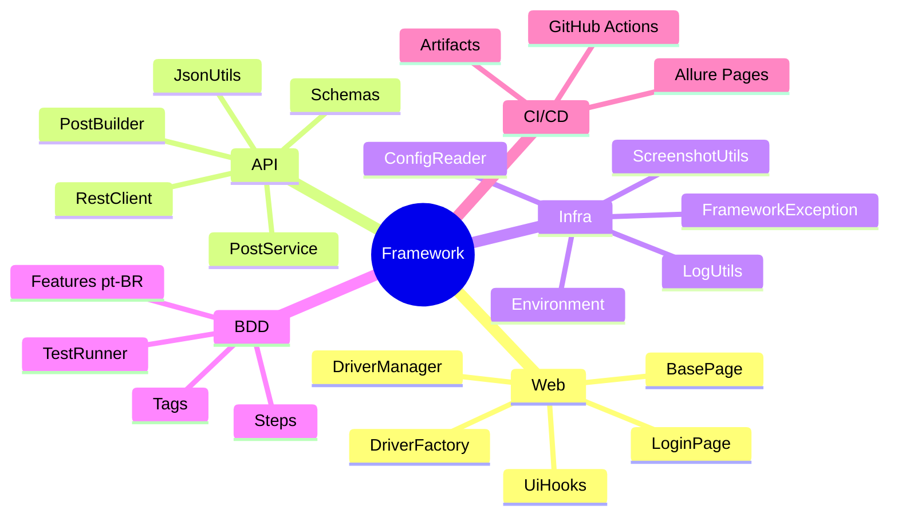

---

## Glossario

| Termo | Definicao |
|---|---|
| **BDD** | Behavior-Driven Development — escrever testes em linguagem natural |
| **Gherkin** | Linguagem das features (Dado/Quando/Entao) |
| **Page Object** | Padrao que encapsula elementos e acoes de uma pagina |
| **Glue** | Conexao entre Gherkin e codigo Java (Steps + Hooks) |
| **DI** | Dependency Injection — injecao automatica de dependencias |
| **PicoContainer** | Container DI leve usado pelo Cucumber |
| **ThreadLocal** | Variavel isolada por thread (para paralelismo) |
| **Headless** | Modo de navegador sem interface grafica (para CI) |
| **Schema Validation** | Validacao da estrutura JSON contra um contrato |
| **Smoke Test** | Subconjunto minimo de testes para validar deploy |
| **argLine** | Parametros JVM passados ao processo forked do Maven |
| **AspectJ** | Framework AOP necessario para o Allure interceptar execucao |
| **Classpath** | Conjunto de caminhos onde a JVM busca classes e recursos |
| **Runner** | Classe que inicia a execucao dos testes Cucumber |
| **Hook** | Metodo executado antes/depois de cenarios |

---

## Proximos Passos Sugeridos

Apos dominar este projeto, considere expandir:

1. **Adicionar Firefox/Edge** — novo case no `DriverFactory.createFirefox()`
2. **Criar ambiente HML** — copie `dev.properties` para `hml.properties` com URLs reais
3. **Paralelismo** — configure `maven-surefire-plugin` com `<forkCount>2</forkCount>`
4. **Token Auth** — adicione `RestClient.addHeader("Authorization", "Bearer ...")` nos Services
5. **Database validation** — crie um `DbClient` para validar estado apos operacoes
6. **Visual testing** — integre com ferramentas de comparacao de screenshots
7. **Performance** — adicione metricas de tempo com `System.currentTimeMillis()` nos hooks
8. **Multi-browser CI** — matrix strategy no GitHub Actions com Chrome + Firefox

---

*Projeto de automacao profissional — Selenium + REST Assured + Cucumber BDD*
