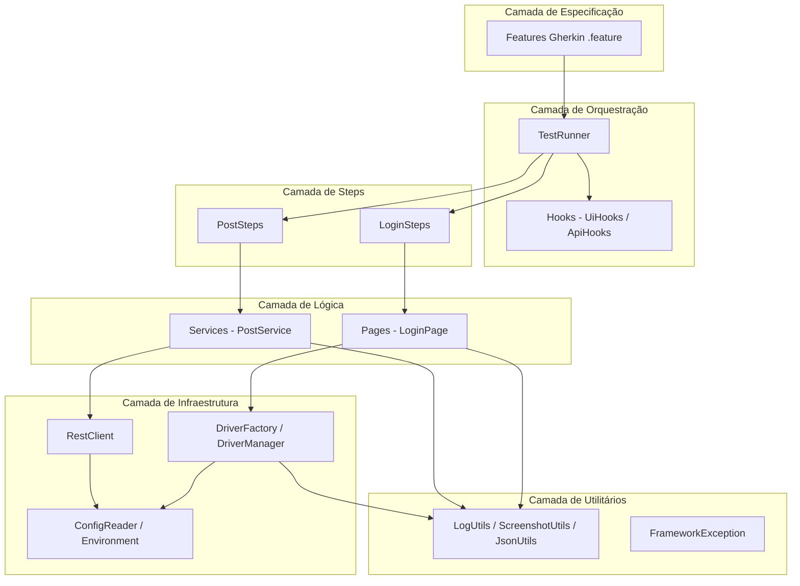
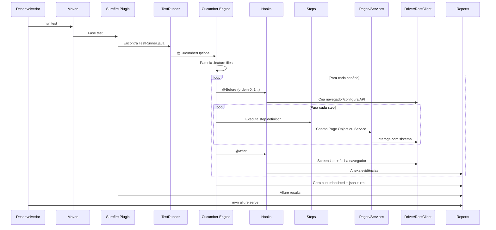
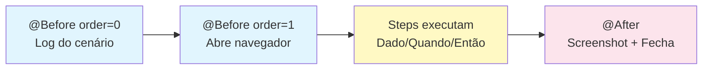
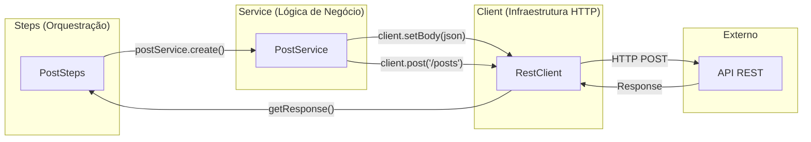
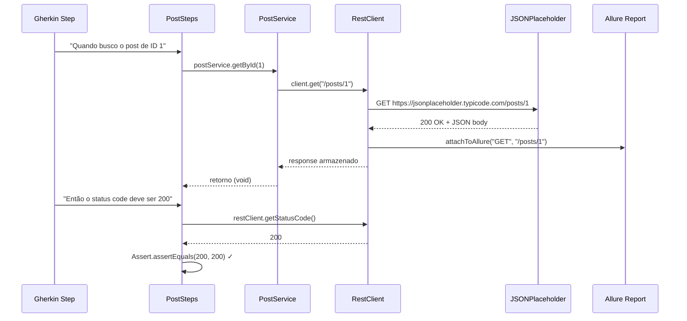
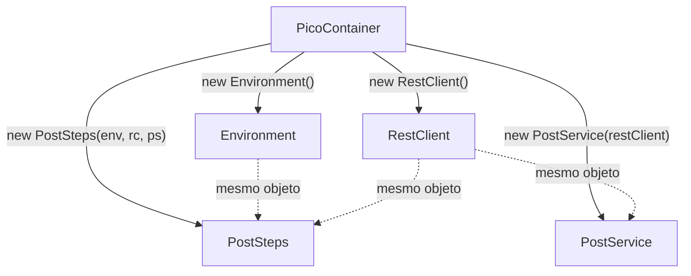
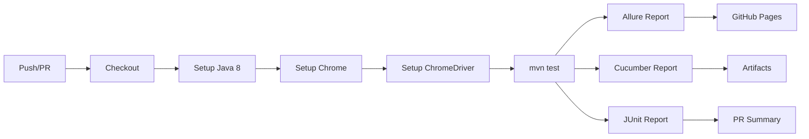

# Framework Profissional de Automação de Testes
## Construindo uma Arquitetura Enterprise do Zero

> Este material acompanha o projeto de referência. Cada parte corresponde a uma etapa da construção do framework, desde a fundação até a integração contínua.

---

## Sumário

- [Parte 1 — Visão Geral e Arquitetura](#parte-1--visão-geral-e-arquitetura)
  - [1.1 O que é automação de testes e por que automatizar](#11-o-que-é-automação-de-testes-e-por-que-automatizar)
  - [1.2 O que é um framework](#12-o-que-é-um-framework)
  - [1.3 Pirâmide de testes](#13-pirâmide-de-testes)
  - [1.4 Arquitetura em camadas](#14-arquitetura-em-camadas)
  - [1.5 Fluxo completo de execução](#15-fluxo-completo-de-execução)
  - [1.6 Responsabilidade de cada camada](#16-responsabilidade-de-cada-camada)
  - [1.7 Decisões tecnológicas e justificativas](#17-decisões-tecnológicas-e-justificativas)
  - [1.8 Estrutura completa de diretórios](#18-estrutura-completa-de-diretórios)
  - [1.9 Pré-requisitos](#19-pré-requisitos)
- [Parte 2 — Construção do Framework UI](#parte-2--construção-do-framework-ui)
  - [2.1 Criação do projeto Maven](#21-criação-do-projeto-maven)
  - [2.2 DriverFactory](#22-driverfactory)
  - [2.3 DriverManager](#23-drivermanager)
  - [2.4 BasePage](#24-basepage)
  - [2.5 LoginPage](#25-loginpage)
  - [2.6 Cucumber — Features em português](#26-cucumber--features-em-português)
  - [2.7 TestRunner](#27-testrunner)
  - [2.8 LoginSteps](#28-loginsteps)
  - [2.9 UiHooks](#29-uihooks)
  - [2.10 Evidências — Screenshots automáticas](#210-evidências--screenshots-automáticas)
- [Parte 3 — Construção do Framework API](#parte-3--construção-do-framework-api)
  - [3.1 REST Assured — Introdução](#31-rest-assured--introdução)
  - [3.2 RestClient](#32-restclient)
  - [3.3 Padrão Client-Service](#33-padrão-client-service)
  - [3.4 PostService](#34-postservice)
  - [3.5 PostRequest — Modelo POJO](#35-postrequest--modelo-pojo)
  - [3.6 PostBuilder — Builder Pattern com Faker](#36-postbuilder--builder-pattern-com-faker)
  - [3.7 JsonUtils](#37-jsonutils)
  - [3.8 Payloads externalizados](#38-payloads-externalizados)
  - [3.9 JSON Schema Validation](#39-json-schema-validation)
  - [3.10 Feature de API em português](#310-feature-de-api-em-português)
  - [3.11 PostSteps](#311-poststeps)
  - [3.12 TestData vs Payload](#312-testdata-vs-payload)
- [Parte 4 — Engenharia do Framework](#parte-4--engenharia-do-framework)
  - [4.1 PicoContainer — Injeção de dependência](#41-picocontainer--injeção-de-dependência)
  - [4.2 ConfigReader](#42-configreader)
  - [4.3 Environment](#43-environment)
  - [4.4 Configuração por ambiente](#44-configuração-por-ambiente)
  - [4.5 Logging corporativo](#45-logging-corporativo)
  - [4.6 FrameworkException](#46-frameworkexception)
  - [4.7 Screenshots configuráveis](#47-screenshots-configuráveis)
  - [4.8 Allure Report](#48-allure-report)
  - [4.9 Estratégia de Tags](#49-estratégia-de-tags)
  - [4.10 Organização e nomenclatura](#410-organização-e-nomenclatura)
- [Parte 5 — Integração e Manutenção](#parte-5--integração-e-manutenção)
  - [5.1 GitHub Actions — Pipeline completo](#51-github-actions--pipeline-completo)
  - [5.2 Como adicionar um novo teste UI](#52-como-adicionar-um-novo-teste-ui)
  - [5.3 Como adicionar um novo teste API](#53-como-adicionar-um-novo-teste-api)
  - [5.4 Padrões de Code Review](#54-padrões-de-code-review)
  - [5.5 Checklist para iniciar novo projeto](#55-checklist-para-iniciar-novo-projeto)
  - [5.6 Troubleshooting](#56-troubleshooting)
  - [5.7 FAQ](#57-faq)
  - [5.8 Glossário](#58-glossário)
  - [5.9 Comandos rápidos](#59-comandos-rápidos)
  - [5.10 Como evoluir a arquitetura](#510-como-evoluir-a-arquitetura)

---

## Parte 1 — Visão Geral e Arquitetura

### 1.1 O que é automação de testes e por que automatizar

Automação de testes é a prática de usar software para executar testes que seriam feitos manualmente. Em vez de um QA clicar em cada campo, preencher formulários e verificar resultados toda vez que o sistema muda, um script faz isso de forma repetível, rápida e confiável.

A justificativa econômica é clara: um teste manual que leva 10 minutos, executado 50 vezes por sprint, consome mais de 8 horas de trabalho humano. Automatizado, ele roda em segundos a cada commit. O investimento inicial se paga em poucas semanas.

**O ciclo de vida de um bug:**

Quanto mais tarde um bug é encontrado, mais caro ele é para corrigir. A automação atua na camada de prevenção — detecta regressões ANTES de chegarem à produção.

```
Custo de correção por fase:
  Desenvolvimento:   1x  (barato)
  Testes manuais:    5x
  QA formal:        10x
  Homologação:      20x
  Produção:        100x  (caro + dano reputacional)
```

A automação de testes opera na fase de "Testes" — encontra o bug quando custa 5x, não quando custa 100x.

**Quando NÃO automatizar:**

Nem tudo deve ser automatizado. Automatize quando:
- O teste será executado mais de 5 vezes
- O fluxo é estável (não muda toda sprint)
- O resultado é determinístico (mesma entrada = mesma saída)
- Há ROI positivo (custo de automação < custo de execução manual)

Não automatize quando:
- O fluxo muda constantemente (tela em desenvolvimento ativo)
- É um teste exploratório (sem roteiro definido)
- É um teste de usabilidade (requer percepção humana)
- O sistema não tem interface estável (protótipos)

**Benefícios concretos:**

| Aspecto | Manual | Automatizado |
|---------|--------|--------------|
| Velocidade de execução | 10-30 min por fluxo | 5-30 seg por fluxo |
| Consistência | Sujeito a erro humano | Execução idêntica sempre |
| Feedback | Após horas/dias | Em minutos (CI/CD) |
| Cobertura de regressão | Parcial (tempo limitado) | Completa (todas as suítes) |
| Custo por execução | Alto (hora-homem) | Praticamente zero |
| Execução noturna | Inviável | Trivial |

> **Dica:** Automatizar não significa eliminar testes manuais. Testes exploratórios, de usabilidade e cenários ad-hoc continuam sendo manuais. Automatize o que é repetitivo e regressivo.

---

### 1.2 O que é um framework

Há uma diferença crítica entre "ter scripts de teste" e "ter um framework de automação". Scripts soltos são arquivos Java que abrem o navegador, clicam em elementos e verificam resultados — sem padrão, sem reuso, sem estrutura.

Um framework é uma arquitetura organizada que define:
- **Onde** colocar cada tipo de código (separação de responsabilidades)
- **Como** elementos são localizados e interagidos (Page Objects)
- **Como** dados de teste são gerenciados (configurações por ambiente)
- **Como** os testes são executados e reportados (Runner + Reports)
- **Como** novos testes são adicionados (padrão replicável)

| Característica | Scripts Soltos | Framework |
|----------------|---------------|-----------|
| Manutenção | Alterar em N arquivos | Alterar em 1 lugar |
| Reuso de código | Copiar e colar | Herança + composição |
| Onboarding de novos QAs | Dias | Horas |
| Escala para +100 testes | Caos | Organizado |
| Integração com CI/CD | Difícil | Nativa |
| Reports profissionais | Inexistente | Allure/Cucumber |

> **Dica:** Se você precisa de mais de 1 hora para explicar como adicionar um novo teste, seu framework precisa de refatoração.

---

### 1.3 Pirâmide de testes

A pirâmide de testes (Martin Fowler / Mike Cohn) define a proporção ideal de testes em um sistema:

```
         /\
        /  \      E2E (UI)          - Poucos, lentos, frágeis
       /----\     
      /      \    Integração (API)   - Médios, rápidos, estáveis
     /--------\   
    /          \  Unitários          - Muitos, rápidos, isolados
   /____________\
```

**Neste framework, cobrimos as duas camadas superiores:**
- **Testes de UI (E2E):** Validam fluxos completos do usuário via navegador (Selenium)
- **Testes de API (Integração):** Validam contratos, status codes e regras de negócio via HTTP (REST Assured)

A estratégia é: manter poucos testes UI nos caminhos críticos (login, checkout) e muitos testes API para validações de dados e regras.

**Características de cada camada:**

| Camada | Quantidade | Velocidade | Estabilidade | Manutenção | Confiança |
|--------|-----------|-----------|-------------|-----------|-----------|
| Unitários | Centenas | Milissegundos | Muito alta | Baixa | Isolada |
| API | Dezenas | 0.5-3 segundos | Alta | Média | Integração |
| UI | Poucos | 5-30 segundos | Média-baixa | Alta | E2E |

**Distribuição recomendada:**
- 70% unitários (responsabilidade do time de desenvolvimento)
- 20% API (responsabilidade compartilhada QA + DEV)
- 10% UI (responsabilidade principal do QA)

**Anti-padrão: Pirâmide invertida (Ice Cream Cone)**
```
   ______________
  /              \    UI: Tudo testado via interface (LENTO)
  \______________/
      /    \          API: Quase nenhum
      \____/
       /  \           Unit: Inexistente
       \__/
```

Se sua organização tem mais testes UI do que API e unit, você está no anti-padrão "cone de sorvete". Migre gradualmente: para cada novo teste UI, pergunte "isso poderia ser um teste de API?".

> **Dica:** Cada teste de UI que pode ser substituído por um teste de API deve ser. Testes de API são 10x mais rápidos e 5x mais estáveis.

---

### 1.4 Arquitetura em camadas

O framework segue uma arquitetura em camadas, onde cada camada tem responsabilidade única e se comúnica apenas com a camada imediatamente abaixo.



Cada camada é isolada e testável independentemente. Se amanhã o Selenium for substituído por Playwright, apenas a camada de infraestrutura muda — os Steps e Features permanecem intactos.

> **Dica:** A regra de ouro da arquitetura em camadas: uma camada NUNCA deve depender de uma camada acima dela. Steps conhecem Pages, mas Pages nunca importam Steps.

---

### 1.5 Fluxo completo de execução

Quando você executa `mvn test`, uma cadeia precisa de eventos acontece. Entender esse fluxo é fundamental para debugar problemas.



O ponto-chave é que o Cucumber controla o ciclo de vida. Ele lê os `.feature`, mapeia cada frase para um método Java (step definition) e gerencia os hooks de setup/teardown.

> **Dica:** Se um teste falha no @Before, o cenário inteiro é marcado como falho. Sempre verifique os logs de hook primeiro ao investigar falhas.

---

### 1.6 Responsabilidade de cada camada

| Camada | Responsabilidade | Exemplos de Classes |
|--------|-----------------|---------------------|
| Especificação | Descrever comportamento em linguagem natural | `login.feature`, `posts.feature` |
| Orquestração | Configurar execução e ciclo de vida | `TestRunner`, `UiHooks`, `ApiHooks` |
| Steps | Traduzir Gherkin para ações Java | `LoginSteps`, `PostSteps` |
| Lógica (UI) | Encapsular interações com páginas | `BasePage`, `LoginPage` |
| Lógica (API) | Encapsular regras de negócio HTTP | `PostService`, `PostBuilder` |
| Infraestrutura | Gerenciar conexões e configurações | `DriverFactory`, `RestClient`, `Environment` |
| Utilitários | Funções transversais de suporte | `LogUtils`, `ScreenshotUtils`, `JsonUtils` |
| Modelos | Representar dados estruturados | `PostRequest` |
| Exceções | Erros semânticos do framework | `FrameworkException` |

> **Dica:** Se uma classe não se encaixa claramente em nenhuma camada, provavelmente ela está fazendo coisas demais e deve ser dividida.

---

### 1.7 Decisões tecnológicas e justificativas

| Tecnologia | Versão | Justificativa |
|------------|--------|---------------|
| Java | 8 | Compatibilidade máxima com ambientes corporativos; LTS |
| Maven | 3.x | Gerenciador de build padrão; integração nativa com CI |
| Selenium WebDriver | 3.141.59 | Última versão compatível com Java 8; estável em produção |
| Cucumber | 7.18.0 | BDD em português; integração madura com JUnit |
| JUnit 4 | 4.13.2 | Runner padrão para Cucumber; compatível com Surefire |
| REST Assured | 4.5.1 | Última versão Java 8; API fluente given/when/then |
| PicoContainer | 7.18.0 | DI leve por cenário; zero configuração |
| Allure Report | 2.24.0 | Relatórios visuais ricos; histórico de execuções |
| SLF4J + Logback | 1.7.36 / 1.2.12 | Logging desacoplado; configurável por ambiente |
| JavaFaker | 1.0.2 | Dados dinâmicos; evita dados fixos em testes |
| AspectJ | 1.9.19 | Necessário para integração Allure (weaving) |
| GitHub Actions | - | CI/CD gratuito; integração nativa com repositório |

> **Dica:** A escolha do Java 8 é estratégica: a maioria dos ambientes corporativos brasileiros ainda roda Java 8 em produção. Seu framework de testes deve ser compatível com o ambiente onde será executado.

---

### 1.8 Estrutura completa de diretórios

```
selenium-cucumber-project/
├── .github/
│   └── workflows/
│       └── testes.yml                  # Pipeline CI/CD
├── src/
│   └── test/
│       ├── java/
│       │   ├── api/
│       │   │   ├── builders/
│       │   │   │   └── PostBuilder.java        # Builder Pattern + Faker
│       │   │   ├── clients/
│       │   │   │   └── RestClient.java         # Cliente HTTP corporativo
│       │   │   ├── models/
│       │   │   │   └── PostRequest.java        # POJO de request
│       │   │   └── services/
│       │   │       └── PostService.java        # Lógica de negócio API
│       │   ├── config/
│       │   │   ├── ConfigReader.java           # Leitura de .properties
│       │   │   └── Environment.java            # Gerenciamento de ambientes
│       │   ├── drivers/
│       │   │   ├── DriverFactory.java          # Criação do navegador
│       │   │   └── DriverManager.java          # ThreadLocal para paralelo
│       │   ├── exceptions/
│       │   │   └── FrameworkException.java     # Exceção customizada
│       │   ├── hooks/
│       │   │   ├── ApiHooks.java               # Hooks para @api
│       │   │   └── UiHooks.java                # Hooks para @ui
│       │   ├── pages/
│       │   │   ├── base/
│       │   │   │   └── BasePage.java           # Classe abstrata base
│       │   │   └── login/
│       │   │       └── LoginPage.java          # Page Object do login
│       │   ├── runners/
│       │   │   └── TestRunner.java             # Ponto de entrada
│       │   ├── steps/
│       │   │   ├── api/
│       │   │   │   └── PostSteps.java          # Steps de API
│       │   │   └── ui/
│       │   │       └── LoginSteps.java         # Steps de UI
│       │   └── utils/
│       │       ├── JsonUtils.java              # Carregamento de JSON
│       │       ├── LogUtils.java               # Logging corporativo
│       │       └── ScreenshotUtils.java        # Captura de tela
│       └── resources/
│           ├── environments/
│           │   ├── dev.properties              # Configuração DEV
│           │   └── hml.properties              # Configuração HML
│           ├── features/
│           │   ├── api/
│           │   │   └── posts.feature           # Cenários de API
│           │   └── ui/
│           │       └── login.feature           # Cenários de UI
│           ├── payloads/
│           │   └── posts/
│           │       ├── create-post.json        # Payload de criação
│           │       └── update-post.json        # Payload de atualização
│           ├── schemas/
│           │   └── post-schema.json            # Schema de validação
│           └── logback.xml                     # Configuração de logging
└── pom.xml                                     # Configuração Maven
```

A organização segue o princípio de **coesão**: arquivos que mudam juntos ficam juntos. Todas as classes de API ficam em `api/`, todos os resources de API ficam em subpastas correspondentes.

> **Dica:** Ao criar um novo recurso (ex: Users), replique a mesma estrutura: `api/services/UserService.java`, `api/models/UserRequest.java`, `payloads/users/create-user.json`, `features/api/users.feature`.

---

### 1.9 Pré-requisitos

Para executar este framework localmente, você precisa de quatro componentes fundamentais. Cada um cumpre um papel específico na cadeia de execução.

**Visão geral dos componentes:**

```
┌──────────┐     ┌──────────┐     ┌──────────────┐     ┌──────────┐
│   JDK 8  │────>│  Maven   │────>│ ChromeDriver │────>│  Chrome  │
│ (compila)│     │ (executa)│     │  (controla)  │     │(renderiza)│
└──────────┘     └──────────┘     └──────────────┘     └──────────┘
```

- **JDK 8** compila o código Java do framework
- **Maven** gerencia dependências e executa os testes
- **ChromeDriver** é a ponte entre o Selenium e o Chrome
- **Chrome** é o navegador que renderiza as páginas

**1. JDK 8 (Java Development Kit)**

O JDK inclui o compilador (`javac`) e a JVM (`java`). Certifique-se de instalar o JDK (não apenas o JRE).

Verifique se já está instalado:
```bash
java -version
# Esperado: java version "1.8.x"

javac -version
# Esperado: javac 1.8.x
```

Caso não tenha, instale o Temurin (AdoptOpenJDK):
- Windows: Baixe em https://adoptium.net/ e escolha JDK 8 LTS
- Configure `JAVA_HOME` apontando para a pasta de instalação
- Adicione `%JAVA_HOME%\bin` ao PATH
- Reinicie o terminal após configurar

**Verificação pós-instalação:**
```bash
echo %JAVA_HOME%
# Esperado: C:\Program Files\Eclipse Adoptium\jdk-8.x.x-hotspot (ou similar)
```

**2. Apache Maven 3.x**

O Maven gerencia dependências e o ciclo de build. Ele baixa automaticamente todas as bibliotecas declaradas no pom.xml.

```bash
mvn -version
# Esperado: Apache Maven 3.x.x
# Esperado: Java version: 1.8.x (confirma que usa o JDK correto)
```

- Windows: Baixe em https://maven.apache.org/download.cgi
- Extraia para `C:\maven`
- Configure `MAVEN_HOME` e adicione `%MAVEN_HOME%\bin` ao PATH

**Primeiro uso:** Na primeira execução, o Maven baixa todas as dependências (~100 MB). As execuções seguintes são rápidas porque usa cache local (`~/.m2/repository/`).

**3. Google Chrome (última versão)**

O framework usa Chrome como navegador padrão. Mantenha-o atualizado para evitar incompatibilidades com o ChromeDriver.

Para verificar a versão: acesse `chrome://version` na barra de endereço.

**4. ChromeDriver**

O ChromeDriver deve ser compatível com a versão do Chrome instalada:
- Verifique a versão do Chrome em `chrome://version`
- Baixe o driver correspondente em https://chromedriver.chromium.org/downloads
- Para Chrome 115+: https://googlechromelabs.github.io/chrome-for-testing/
- Coloque em um diretório acessível (ex: `C:\chromedriver\`)
- Configure a variável de ambiente `CHROME_DRIVER_PATH` ou use o path padrão

**Compatibilidade Chrome/ChromeDriver:**

| Chrome | ChromeDriver |
|--------|-------------|
| 120.x | chromedriver 120.x |
| 121.x | chromedriver 121.x |
| 125.x | chromedriver 125.x |

A regra é simples: a versão MAJOR (primeiro número) deve ser idêntica.

**Validação completa do ambiente:**
```bash
java -version && mvn -version && google-chrome --version && chromedriver --version
```

Se todos os quatro comandos retornam versões, seu ambiente está pronto.

> **Dica:** Em ambientes CI (GitHub Actions), o Chrome e o ChromeDriver são instalados automaticamente pelo pipeline. A configuração local é necessária apenas para desenvolvimento.

---

## Parte 2 — Construção do Framework UI

### 2.1 Criação do projeto Maven

O `pom.xml` é o coração de qualquer projeto Java gerenciado pelo Maven. Ele define as dependências, plugins de build e configurações de compilação. Cada dependência foi escolhida com critério de compatibilidade com Java 8 e maturidade em produção.

```xml
<?xml version="1.0" encoding="UTF-8"?>
<project xmlns="http://maven.apache.org/POM/4.0.0"
         xmlns:xsi="http://www.w3.org/2001/XMLSchema-instance"
         xsi:schemaLocation="http://maven.apache.org/POM/4.0.0
         http://maven.apache.org/xsd/maven-4.0.0.xsd">

    <modelVersion>4.0.0</modelVersion>

    <groupId>com.automacao</groupId>
    <artifactId>selenium-restassured-cucumber-github-actions</artifactId>
    <version>1.0.0</version>
    <packaging>jar</packaging>

    <name>selenium-restassured-cucumber-github-actions</name>
    <description>Automação de testes Web (Selenium) e API (REST Assured) com Cucumber BDD</description>

    <properties>
        <java.version>8</java.version>
        <maven.compiler.source>${java.version}</maven.compiler.source>
        <maven.compiler.target>${java.version}</maven.compiler.target>
        <project.build.sourceEncoding>UTF-8</project.build.sourceEncoding>

        <!-- Versões das dependências -->
        <!-- Selenium 3.x — última versão compatível com Java 8 -->
        <selenium.version>3.141.59</selenium.version>
        <!-- Cucumber 7.x requer Java 8+ -->
        <cucumber.version>7.18.0</cucumber.version>
        <junit.version>4.13.2</junit.version>
        <!-- REST Assured 4.x — última versão com suporte a Java 8 -->
        <rest.assured.version>4.5.1</rest.assured.version>
        <!-- Allure Report -->
        <allure.version>2.24.0</allure.version>
    </properties>

    <dependencies>

        <!-- Selenium WebDriver -->
        <dependency>
            <groupId>org.seleniumhq.selenium</groupId>
            <artifactId>selenium-java</artifactId>
            <version>${selenium.version}</version>
        </dependency>

        <!-- Cucumber JVM -->
        <dependency>
            <groupId>io.cucumber</groupId>
            <artifactId>cucumber-java</artifactId>
            <version>${cucumber.version}</version>
        </dependency>

        <!-- Cucumber + JUnit integration -->
        <dependency>
            <groupId>io.cucumber</groupId>
            <artifactId>cucumber-junit</artifactId>
            <version>${cucumber.version}</version>
            <scope>test</scope>
        </dependency>

        <!-- JUnit -->
        <dependency>
            <groupId>junit</groupId>
            <artifactId>junit</artifactId>
            <version>${junit.version}</version>
            <scope>test</scope>
        </dependency>

        <!-- REST Assured - testes de API REST -->
        <dependency>
            <groupId>io.rest-assured</groupId>
            <artifactId>rest-assured</artifactId>
            <version>${rest.assured.version}</version>
            <scope>test</scope>
        </dependency>

        <!-- JSON Schema Validator - valida estrutura da resposta -->
        <dependency>
            <groupId>io.rest-assured</groupId>
            <artifactId>json-schema-validator</artifactId>
            <version>${rest.assured.version}</version>
            <scope>test</scope>
        </dependency>

        <!-- Allure Cucumber Integration -->
        <dependency>
            <groupId>io.qameta.allure</groupId>
            <artifactId>allure-cucumber7-jvm</artifactId>
            <version>${allure.version}</version>
            <scope>test</scope>
            <exclusions>
                <exclusion>
                    <groupId>io.cucumber</groupId>
                    <artifactId>gherkin</artifactId>
                </exclusion>
                <exclusion>
                    <groupId>io.cucumber</groupId>
                    <artifactId>messages</artifactId>
                </exclusion>
            </exclusions>
        </dependency>

        <!-- AspectJ Weaver (necessário para Allure) -->
        <dependency>
            <groupId>org.aspectj</groupId>
            <artifactId>aspectjweaver</artifactId>
            <version>1.9.19</version>
            <scope>test</scope>
        </dependency>

        <!-- PicoContainer — Injeção de Dependência por cenário no Cucumber -->
        <dependency>
            <groupId>io.cucumber</groupId>
            <artifactId>cucumber-picocontainer</artifactId>
            <version>${cucumber.version}</version>
            <scope>test</scope>
        </dependency>

        <!-- SLF4J API — fachada de logging -->
        <dependency>
            <groupId>org.slf4j</groupId>
            <artifactId>slf4j-api</artifactId>
            <version>1.7.36</version>
        </dependency>

        <!-- Logback — implementação SLF4J -->
        <dependency>
            <groupId>ch.qos.logback</groupId>
            <artifactId>logback-classic</artifactId>
            <version>1.2.12</version>
        </dependency>

        <!-- JavaFaker — geração de dados de teste dinâmicos -->
        <dependency>
            <groupId>com.github.javafaker</groupId>
            <artifactId>javafaker</artifactId>
            <version>1.0.2</version>
            <scope>test</scope>
        </dependency>

    </dependencies>

    <build>
        <plugins>

            <!-- Maven Surefire Plugin - executa os testes JUnit -->
            <plugin>
                <groupId>org.apache.maven.plugins</groupId>
                <artifactId>maven-surefire-plugin</artifactId>
                <version>3.2.5</version>
                <configuration>
                    <includes>
                        <include>**/TestRunner.java</include>
                    </includes>
                    <argLine>
                        -Djavax.net.ssl.trustStore=${user.home}/.maven-cacerts
                        -Djavax.net.ssl.trustStorePassword=changeit
                        -javaagent:"${settings.localRepository}/org/aspectj/aspectjweaver/1.9.19/aspectjweaver-1.9.19.jar"
                    </argLine>
                    <systemPropertyVariables>
                        <allure.results.directory>target/allure-results</allure.results.directory>
                    </systemPropertyVariables>
                </configuration>
            </plugin>

            <!-- Maven Compiler Plugin -->
            <plugin>
                <groupId>org.apache.maven.plugins</groupId>
                <artifactId>maven-compiler-plugin</artifactId>
                <version>3.13.0</version>
                <configuration>
                    <source>${java.version}</source>
                    <target>${java.version}</target>
                    <encoding>UTF-8</encoding>
                </configuration>
            </plugin>

            <!-- Allure Maven Plugin - gera relatório -->
            <plugin>
                <groupId>io.qameta.allure</groupId>
                <artifactId>allure-maven</artifactId>
                <version>2.12.0</version>
                <configuration>
                    <reportVersion>${allure.version}</reportVersion>
                    <resultsDirectory>allure-results</resultsDirectory>
                </configuration>
            </plugin>

        </plugins>
    </build>

</project>
```

**Decisões de design do pom.xml:**

- Todas as versões estão centralizadas em `<properties>` para fácilitar atualizações futuras — basta alterar um número em um lugar.
- O Surefire está configurado para encontrar apenas `TestRunner.java`, garantindo que o Cucumber controla a execução (e não o JUnit direto).
- O `argLine` do Surefire injeta o AspectJ como agente JVM, necessário para que o Allure intercepte os steps automaticamente.
- As exclusões no `allure-cucumber7-jvm` evitam conflitos de versão com as bibliotecas Gherkin que já vêm com o Cucumber.

> **Dica:** Sempre defina versões como properties. Quando precisar atualizar o Cucumber de 7.18 para 7.19, você muda em UM lugar e todas as dependências se ajustam.

---

### 2.2 DriverFactory

A DriverFactory é responsável por criar instâncias do WebDriver. Ela encapsula toda a lógica de configuração do navegador, incluindo a detecção automática de ambiente CI para modo headless.

```java
package drivers;

import org.openqa.selenium.WebDriver;
import org.openqa.selenium.chrome.ChromeDriver;
import org.openqa.selenium.chrome.ChromeOptions;
import utils.LogUtils;

/**
 * Cria instâncias de WebDriver.
 */
public class DriverFactory {

    private static final boolean IN_CI =
            System.getenv("CI") != null || System.getenv("JENKINS_URL") != null;

    public WebDriver create(String browser) {
        LogUtils.info("Criando driver: " + browser + (IN_CI ? " [headless]" : " [visual]"));
        switch (browser.toLowerCase()) {
            case "chrome": return createChrome();
            default: throw new IllegalArgumentException("Browser não suportado: " + browser);
        }
    }

    private WebDriver createChrome() {
        if (!IN_CI) {
            String path = System.getenv("CHROME_DRIVER_PATH") != null
                    ? System.getenv("CHROME_DRIVER_PATH")
                    : "C:\\chromedriver\\chromedriver-win64\\chromedriver.exe";
            System.setProperty("webdriver.chrome.driver", path);
        }

        ChromeOptions options = new ChromeOptions();
        if (IN_CI) {
            options.addArguments("--headless=new", "--no-sandbox",
                    "--disable-dev-shm-usage", "--window-size=1920,1080");
        } else {
            options.addArguments("--start-maximized");
        }
        options.addArguments("--disable-notifications", "--remote-allow-origins=*");
        return new ChromeDriver(options);
    }
}
```

**Decisões de design:**

- A detecção de CI usa variáveis de ambiente padrão (`CI` para GitHub Actions, `JENKINS_URL` para Jenkins). Isso permite que o mesmo código rode local e no pipeline sem nenhuma alteração.
- Em CI, o Chrome roda headless com `--no-sandbox` e `--disable-dev-shm-usage` — flags obrigatórias para containers Linux.
- O `--window-size=1920,1080` garante que screenshots em CI tenham resolução consistente.
- Localmente, o path do ChromeDriver aceita variável de ambiente ou usa um padrão sensato.

> **Dica:** Nunca faça commit de caminhos absolutos locais (ex: `C:\Users\joao\...`). Use variáveis de ambiente para paths que variam entre máquinas.

---

### 2.3 DriverManager

O DriverManager resolve um problema crítico: como compartilhar a mesma instância de WebDriver entre Hooks, Steps e Pages sem acoplá-los via campo estático comum. A resposta é ThreadLocal.

```java
package drivers;

import org.openqa.selenium.WebDriver;

/**
 * Gerencia o WebDriver via ThreadLocal (seguro para paralelo).
 */
public class DriverManager {

    private static final ThreadLocal<WebDriver> driver = new ThreadLocal<>();

    private DriverManager() {}

    public static WebDriver getDriver() {
        return driver.get();
    }

    public static void setDriver(WebDriver webDriver) {
        driver.set(webDriver);
    }

    public static void quit() {
        WebDriver d = driver.get();
        if (d != null) {
            d.quit();
            driver.remove();
        }
    }
}
```

**Decisões de design:**

- `ThreadLocal<WebDriver>` garante que cada thread tem sua própria instância do navegador. Quando o Cucumber executar cenários em paralelo (futuro), cada cenário terá seu Chrome isolado sem interferência.
- O construtor é privado (padrão útility class) porque todos os métodos são estáticos.
- O `quit()` faz `driver.remove()` após fechar — isso previne memory leaks em execuções longas com muitos cenários.

> **Dica:** ThreadLocal é essencial para paralelismo, mas também é útil em execução serial: ele garante um ponto único de acesso ao driver sem precisar passar o objeto por parâmetro em toda a cadeia.

---

### 2.4 BasePage

A BasePage é a classe abstrata que serve de fundação para todos os Page Objects. Ela encapsula as interações comuns com o Selenium (clicar, digitar, navegar) e configura o WebDriverWait com timeout do ambiente.

```java
package pages.base;

import config.Environment;
import org.openqa.selenium.By;
import org.openqa.selenium.TimeoutException;
import org.openqa.selenium.WebDriver;
import org.openqa.selenium.WebElement;
import org.openqa.selenium.support.ui.ExpectedConditions;
import org.openqa.selenium.support.ui.WebDriverWait;
import utils.LogUtils;

/**
 * Classe base para todos os Page Objects.
 */
public abstract class BasePage {

    protected final WebDriver driver;
    protected final WebDriverWait wait;

    protected BasePage(WebDriver driver) {
        this.driver = driver;
        int timeout = new Environment().getInt("timeout.explicit", 10);
        this.wait = new WebDriverWait(driver, timeout);
    }

    protected void navigate(String url) {
        LogUtils.info("Navegando: " + url);
        driver.get(url);
    }

    protected void type(By locator, String text) {
        WebElement element = wait.until(ExpectedConditions.visibilityOfElementLocated(locator));
        element.clear();
        element.sendKeys(text);
    }

    protected void click(By locator) {
        wait.until(ExpectedConditions.elementToBeClickable(locator)).click();
    }

    protected String getText(By locator) {
        return wait.until(ExpectedConditions.visibilityOfElementLocated(locator)).getText();
    }

    protected boolean urlContains(String fragment) {
        try {
            return wait.until(ExpectedConditions.urlContains(fragment));
        } catch (TimeoutException e) {
            LogUtils.warn("Timeout aguardando URL conter: " + fragment);
            return false;
        }
    }
}
```

**Decisões de design:**

- A classe é `abstract` porque nunca deve ser instânciada diretamente — ela só existe para ser herdada por Pages concretas.
- Os métodos são `protected` (não public) porque são destinados apenas às subclasses, não ao mundo externo. Steps nunca devem chamar `type()` diretamente.
- O timeout vem do `Environment`, então cada ambiente pode ter timeouts diferentes (DEV = 10s, HML = 15s).
- Todo `type()` faz `clear()` antes de `sendKeys()` para evitar concatenação de texto em campos pré-preenchidos.
- O `urlContains()` captura `TimeoutException` e retorna `false` em vez de propagar a exceção — isso torna as asserções mais limpas nos Steps.

> **Dica:** Se você precisa de uma interação específica que não existe na BasePage (ex: drag-and-drop), adicione-a aqui. Todas as Pages herdam automaticamente.

---

### 2.5 LoginPage

O LoginPage implementa o Page Object Pattern: cada página da aplicação tem uma classe Java correspondente que encapsula seus elementos e ações. O código externo (Steps) nunca lida com localizadores — apenas com métodos semânticos.

```java
package pages.login;

import org.openqa.selenium.By;
import org.openqa.selenium.WebDriver;
import pages.base.BasePage;

/**
 * Page Object da página de Login.
 */
public class LoginPage extends BasePage {

    private final By usernameField = By.name("username");
    private final By passwordField = By.name("password");
    private final By loginButton   = By.cssSelector("button[type='submit']");
    private final By errorMessage  = By.cssSelector(".oxd-alert-content-text");

    public LoginPage(WebDriver driver) {
        super(driver);
    }

    public void open(String url) {
        navigate(url);
    }

    public void fillUsername(String username) {
        type(usernameField, username);
    }

    public void fillPassword(String password) {
        type(passwordField, password);
    }

    public void clickLogin() {
        click(loginButton);
    }

    public String getErrorMessage() {
        return getText(errorMessage);
    }

    public boolean isOnDashboard() {
        return urlContains("/dashboard");
    }
}
```

**Decisões de design:**

- Localizadores são `private final` — eles pertencem exclusivamente a esta Page e nunca mudam após construção.
- Métodos têm nomes semânticos (`fillUsername`, `clickLogin`) em vez de técnicos (`typeInField1`, `clickButton`). Isso torna os Steps legíveis como documentação.
- A Page recebe o driver no construtor (injeção de dependência) em vez de buscar de um singleton. Isso fácilita testes unitários da própria Page.
- Não há lógica de negócio na Page: ela não decide se o login foi bem-sucedido — apenas expõe `isOnDashboard()` para o Step decidir.

> **Dica:** Um Page Object nunca deve conter asserções (Assert). A responsabilidade de verificar é do Step. A Page apenas informa o estado atual.

---

### 2.6 Cucumber — Features em português

O Cucumber permite escrever especificações executáveis em linguagem natural. Com a diretiva `# language: pt`, todas as keywords ficam em português, tornando os cenários acessíveis para analistas de negócio e POs.

```gherkin
# language: pt
@ui
Funcionalidade: Login no sistema
  Como um usuário registrado
  Quero fazer login na aplicação
  Para acessar as funcionalidades do sistema

  Contexto:
    Dado que estou na página de login

  @smoke
  Cenário: Login com credenciais válidas
    Quando faço login como administrador
    Então devo ser redirecionado para a página inicial

  Cenário: Login com senha incorreta
    Quando faço login com usuário "admin" e senha incorreta
    Então devo ver a mensagem de erro "Invalid credentials"

  Esquema do Cenário: Login com credenciais inválidas
    Quando faço login com usuário "<usuario>" e senha "<senha>"
    Então devo ver a mensagem de erro "<mensagem>"

    Exemplos:
      | usuario       | senha      | mensagem            |
      | usuarioErrado | admin123   | Invalid credentials |
      | wronguser     | wrongpass  | Invalid credentials |
```

**Tabela de keywords Gherkin em português:**

| Português | Inglês | Função |
|-----------|--------|--------|
| Funcionalidade | Feature | Agrupa cenários relacionados |
| Contexto | Background | Steps executados antes de cada cenário |
| Cenário | Scenario | Caso de teste individual |
| Esquema do Cenário | Scenario Outline | Template com múltiplas combinações |
| Exemplos | Examples | Tabela de dados para Outline |
| Dado | Given | Pré-condição (setup) |
| Quando | When | Ação do usuário |
| Então | Then | Resultado esperado |
| E | And | Continuação do step anterior |

**Decisões de design:**

- A tag `@ui` permite filtrar apenas testes de interface. A tag `@smoke` marca cenários críticos para execução rápida.
- O `Contexto` (Background) evita repetir "Dado que estou na página de login" em todo cenário.
- O `Esquema do Cenário` com `Exemplos` é um teste parametrizado — executa o mesmo fluxo com dados diferentes.

> **Dica:** Features devem ser escritas na perspectiva do usuário, não do sistema. Use "Quando faço login" (usuário) em vez de "Quando o sistema valida credenciais" (técnico).

---

### 2.7 TestRunner

O TestRunner é o ponto de entrada que conecta Maven, JUnit e Cucumber. Ele define onde estão as features, onde estão os steps e quais plugins de report serão usados.

```java
package runners;

import io.cucumber.junit.Cucumber;
import io.cucumber.junit.CucumberOptions;
import org.junit.runner.RunWith;

/**
 * Runner principal.
 *
 * mvn test                                    -> todos
 * mvn test -Dcucumber.filter.tags="@smoke"    -> smoke
 * mvn test -Dcucumber.filter.tags="@api"      -> API
 * mvn test -Dcucumber.filter.tags="@ui"       -> UI
 * mvn test -Denvironment=hml                  -> ambiente HML
 * mvn allure:serve                            -> relatório
 */
@RunWith(Cucumber.class)
@CucumberOptions(
    features = "src/test/resources/features",
    glue = {"steps", "hooks"},
    plugin = {
        "pretty",
        "html:target/cucumber-reports/cucumber.html",
        "json:target/cucumber-reports/cucumber.json",
        "junit:target/cucumber-reports/cucumber.xml",
        "io.qameta.allure.cucumber7jvm.AllureCucumber7Jvm"
    },
    monochrome = true
)
public class TestRunner {
}
```

**Decisões de design:**

- `features` aponta para a pasta raiz — o Cucumber escaneia recursivamente todas as subpastas (`ui/`, `api/`).
- `glue` inclui tanto `steps` quanto `hooks`. Se você esquecer de incluir `hooks`, os @Before/@After não serão executados.
- Os quatro plugins geram: saída colorida no console (`pretty`), relatório HTML nativo, JSON para integração com ferramentas, XML para JUnit report e dados para o Allure.
- `monochrome = true` remove caracteres de escape ANSI do output — útil em logs de CI.
- A filtragem por tags é feita via linha de comando (`-Dcucumber.filter.tags`), não no Runner. Isso permite flexibilidade sem recompilar.

> **Dica:** Nunca coloque `tags` fixas no @CucumberOptions em produção. Isso impediria a execução de todos os testes. Use `-Dcucumber.filter.tags` no comando Maven.

---

### 2.8 LoginSteps

Os Step Definitions conectam a linguagem natural do Gherkin com código Java executável. Cada frase "Dado/Quando/Então" mapeia para um método anotado. O PicoContainer injeta dependências automaticamente via construtor.

```java
package steps.ui;

import config.Environment;
import drivers.DriverManager;
import io.cucumber.java.pt.Dado;
import io.cucumber.java.pt.Então;
import io.cucumber.java.pt.Quando;
import org.junit.Assert;
import pages.login.LoginPage;

/**
 * Steps de Login (UI).
 * Environment injetado via PicoContainer.
 */
public class LoginSteps {

    private final Environment env;
    private LoginPage loginPage;

    public LoginSteps(Environment env) {
        this.env = env;
    }

    @Dado("que estou na página de login")
    public void openLogin() {
        loginPage = new LoginPage(DriverManager.getDriver());
        loginPage.open(env.baseUrl);
    }

    @Quando("faço login como administrador")
    public void loginAsAdmin() {
        loginPage.fillUsername(env.get("usuario.admin"));
        loginPage.fillPassword(env.get("senha.admin"));
        loginPage.clickLogin();
    }

    @Quando("faço login com usuário {string} e senha {string}")
    public void loginWith(String user, String pass) {
        loginPage.fillUsername(user);
        loginPage.fillPassword(pass);
        loginPage.clickLogin();
    }

    @Quando("faço login com usuário {string} e senha incorreta")
    public void loginWithWrongPassword(String user) {
        loginPage.fillUsername(user);
        loginPage.fillPassword(env.get("senha.invalida"));
        loginPage.clickLogin();
    }

    @Então("devo ser redirecionado para a página inicial")
    public void shouldBeOnDashboard() {
        Assert.assertTrue("Não redirecionou para o dashboard", loginPage.isOnDashboard());
    }

    @Então("devo ver a mensagem de erro {string}")
    public void shouldSeeError(String expected) {
        Assert.assertEquals("Mensagem incorreta", expected, loginPage.getErrorMessage());
    }
}
```

**Decisões de design:**

- O `Environment` é injetado via construtor pelo PicoContainer. Nenhuma configuração XML ou anotação adicional é necessária — basta declarar no construtor.
- Credenciais vêm do arquivo de propriedades (`env.get("usuario.admin")`), nunca hardcoded no Step. Isso permite trocar credenciais por ambiente sem alterar código.
- O `LoginPage` é instânciado no step `@Dado` (não no construtor) porque o driver só existe após o Hook abrir o navegador.
- Steps usam `{string}` como expression do Cucumber para capturar parâmetros dinâmicos do Gherkin.

> **Dica:** Cada classe de Steps deve ser coesa — trate apenas de um assunto. LoginSteps cuida de login, não de cadastro. Se a feature crescer, crie novas classes de Steps.

---

### 2.9 UiHooks

Os Hooks controlam o ciclo de vida do navegador: abrir antes de cada cenário UI e fechar depois. Eles também gerenciam a captura de evidências (screenshots).

```java
package hooks;

import config.Environment;
import drivers.DriverFactory;
import drivers.DriverManager;
import io.cucumber.java.After;
import io.cucumber.java.Before;
import io.cucumber.java.Scenario;
import org.openqa.selenium.WebDriver;
import utils.LogUtils;
import utils.ScreenshotUtils;

import java.util.concurrent.TimeUnit;

/**
 * Hooks para cenários @ui.
 */
public class UiHooks {

    private final Environment env;

    public UiHooks() {
        this.env = new Environment();
    }

    @Before(value = "@ui", order = 0)
    public void logScenario(Scenario scenario) {
        LogUtils.info("=== [UI] " + scenario.getName() + " ===");
    }

    @Before(value = "@ui", order = 1)
    public void openBrowser() {
        if (DriverManager.getDriver() == null) {
            String browser = env.get("browser", "chrome");
            int implicitWait = env.getInt("timeout.implicit", 10);
            int pageLoad = env.getInt("timeout.pageLoad", 30);

            DriverFactory factory = new DriverFactory();
            WebDriver driver = factory.create(browser);
            driver.manage().timeouts().implicitlyWait(implicitWait, TimeUnit.SECONDS);
            driver.manage().timeouts().pageLoadTimeout(pageLoad, TimeUnit.SECONDS);
            DriverManager.setDriver(driver);
        }
    }

    @After(value = "@ui")
    public void closeBrowser(Scenario scenario) {
        WebDriver driver = DriverManager.getDriver();
        if (driver == null) return;

        String mode = env.get("screenshot.mode", "failure_only");
        boolean shouldCapture = "always".equals(mode) || scenario.isFailed();

        if (shouldCapture) {
            byte[] screenshot = ScreenshotUtils.capture(driver);
            if (screenshot.length > 0) {
                String status = scenario.isFailed() ? "FALHA" : "SUCESSO";
                scenario.attach(screenshot, "image/png", status + " - " + scenario.getName());
                LogUtils.info("Screenshot [" + status + "]");
            }
        }

        DriverManager.quit();
        LogUtils.info("=== Navegador encerrado ===");
    }
}
```

**Ciclo de vida do cenário UI:**



**Decisões de design:**

- `value = "@ui"` faz o hook rodar APENAS em cenários com a tag @ui. Cenários de API não abrem navegador.
- `order = 0` e `order = 1` garantem sequência: primeiro loga, depois abre o browser. Ordens menores executam primeiro.
- O `if (DriverManager.getDriver() == null)` previne reabrir o navegador se ele já estiver aberto (defensivo).
- O screenshot mode é configurável por ambiente: em DEV capture apenas falhas (economiza tempo), em HML capture sempre (mais evidências).
- `scenario.attach()` anexa a screenshot diretamente ao relatório Cucumber/Allure.

> **Dica:** O `@After` sempre executa, mesmo se o cenário falhou. Por isso ele é o local perfeito para cleanup (fechar browser, limpar dados). Nunca faça cleanup no último step.

---

### 2.10 Evidências — Screenshots automáticas

A captura de evidências é essencial para rastreabilidade. O ScreenshotUtils encapsula a lógica de captura, enquanto o UiHooks decide QUANDO capturar com base na configuração.

```java
package utils;

import org.openqa.selenium.OutputType;
import org.openqa.selenium.TakesScreenshot;
import org.openqa.selenium.WebDriver;

/**
 * Captura de screenshots.
 */
public class ScreenshotUtils {

    private ScreenshotUtils() {}

    public static byte[] capture(WebDriver driver) {
        if (driver instanceof TakesScreenshot) {
            return ((TakesScreenshot) driver).getScreenshotAs(OutputType.BYTES);
        }
        return new byte[0];
    }
}
```

**Modos de captura:**

| Modo | Configuração | Quando captura | Uso recomendado |
|------|-------------|----------------|-----------------|
| `failure_only` | `screenshot.mode=failure_only` | Apenas quando cenário falha | DEV (economiza tempo) |
| `always` | `screenshot.mode=always` | Sempre (sucesso e falha) | HML (mais evidências) |

A decisão de modo fica no arquivo de propriedades do ambiente. O código em UiHooks avalia:

```java
String mode = env.get("screenshot.mode", "failure_only");
boolean shouldCapture = "always".equals(mode) || scenario.isFailed();
```

A screenshot é retornada como `byte[]` e anexada ao cenário Cucumber via `scenario.attach()`. Isso garante que a imagem aparece tanto no relatório Cucumber HTML quanto no Allure Report.

> **Dica:** Em ambientes de homologação, use `always` — isso gera evidências visuais para auditoria mesmo quando os testes passam.

---

## Parte 3 — Construção do Framework API

### 3.1 REST Assured — Introdução

REST Assured é uma biblioteca Java para testar APIs RESTful de forma fluente. Ela usa a mesma estrutura Given/When/Then do BDD para construir requisições HTTP e validar respostas.

**Conceitos fundamentais:**

```
given()                    // Configuração (headers, body, auth)
    .baseUri("https://api.example.com")
    .contentType(ContentType.JSON)
    .body(payload)
.when()                    // Ação (verbo HTTP)
    .post("/users")
.then()                    // Verificação (asserções)
    .statusCode(201)
    .body("id", notNullValue());
```

**Anatomia de uma chamada REST:**

Uma chamada de API é composta por:

```
REQUEST:
┌─────────────────────────────────────────────┐
│ POST /posts HTTP/1.1                        │  ← Método + Endpoint
│ Host: jsonplaceholder.typicode.com          │  ← Base URI
│ Content-Type: application/json              │  ← Headers
│ Accept: application/json                    │
│                                             │
│ {"title": "Novo Post", "userId": 1}        │  ← Body (payload)
└─────────────────────────────────────────────┘

RESPONSE:
┌─────────────────────────────────────────────┐
│ HTTP/1.1 201 Created                        │  ← Status Code
│ Content-Type: application/json; utf-8       │  ← Headers
│                                             │
│ {"id": 101, "title": "Novo Post", ...}     │  ← Body (resposta)
└─────────────────────────────────────────────┘
```

Nos testes, validamos:
1. **Status Code** — a API retornou o código esperado?
2. **Headers** — o Content-Type está correto?
3. **Body** — os campos têm os valores esperados?
4. **Schema** — a estrutura da resposta está correta?

**Por que REST Assured em vez de HttpClient puro:**

| Aspecto | HttpClient | REST Assured |
|---------|-----------|--------------|
| Sintaxe | Verbosa (20+ linhas) | Fluente (5 linhas) |
| Validações | Manuais (parse JSON + assert) | Built-in (jsonPath, schema) |
| Logging | Manual | Automático (log().all()) |
| Integração BDD | Nenhuma | Nativa (given/when/then) |
| Curva de aprendizado | Alta | Baixa |
| Serialização JSON | Manual | Automática |
| Cookie handling | Manual | Automático |

**Exemplo comparativo:**

HttpClient (verboso):
```java
HttpClient client = HttpClient.newHttpClient();
HttpRequest request = HttpRequest.newBuilder()
    .uri(URI.create("https://api.example.com/posts/1"))
    .header("Accept", "application/json")
    .GET()
    .build();
HttpResponse<String> response = client.send(request, BodyHandlers.ofString());
JSONObject json = new JSONObject(response.body());
assertEquals(200, response.statusCode());
assertEquals(1, json.getInt("id"));
```

REST Assured (fluente):
```java
given()
    .baseUri("https://api.example.com")
.when()
    .get("/posts/1")
.then()
    .statusCode(200)
    .body("id", equalTo(1));
```

O REST Assured reduz o código de teste em ~70% mantendo a mesma cobertura.

Neste framework, o REST Assured é encapsulado dentro do `RestClient` para adicionar features corporativas (logging, Allure attachments, reuso de configuração).

> **Dica:** REST Assured foi projetado para TESTES, não para produção. Nunca use em código de aplicação — use HttpClient ou OkHttp para isso.

---

### 3.2 RestClient

O RestClient é o cliente HTTP corporativo do framework. Ele encapsula o REST Assured adicionando logging automático, attachments para o Allure e uma interface simplificada para os Services.

```java
package api.clients;

import io.qameta.allure.Allure;
import io.restassured.http.ContentType;
import io.restassured.response.Response;
import io.restassured.specification.RequestSpecification;
import utils.LogUtils;

import static io.restassured.RestAssured.given;

/**
 * Cliente HTTP corporativo.
 * Instância por cenário (thread-safe via PicoContainer).
 * Anexa request/response ao Allure automaticamente.
 */
public class RestClient {

    private Response response;
    private RequestSpecification request;
    private String baseUri;
    private String lastBody;

    public RestClient() {}

    public void setBaseUri(String baseUri) {
        this.baseUri = baseUri;
        this.request = given()
                .baseUri(baseUri)
                .contentType(ContentType.JSON)
                .accept(ContentType.JSON);
    }

    public void addHeader(String key, String value) {
        request = request.header(key, value);
    }

    public void setBody(String body) {
        this.lastBody = body;
        request = request.body(body);
    }

    public void get(String endpoint) { execute("GET", endpoint); }
    public void post(String endpoint) { execute("POST", endpoint); }
    public void put(String endpoint) { execute("PUT", endpoint); }
    public void delete(String endpoint) { execute("DELETE", endpoint); }

    public int getStatusCode() { return response.getStatusCode(); }
    public String getContentType() { return response.getContentType(); }
    public Response getResponse() { return response; }
    public String getResponseBody() { return response.getBody().asString(); }

    private void execute(String method, String endpoint) {
        LogUtils.info(method + " " + baseUri + endpoint);
        switch (method) {
            case "GET": response = request.when().get(endpoint).then().extract().response(); break;
            case "POST": response = request.when().post(endpoint).then().extract().response(); break;
            case "PUT": response = request.when().put(endpoint).then().extract().response(); break;
            case "DELETE": response = request.when().delete(endpoint).then().extract().response(); break;
        }
        attachToAllure(method, endpoint);
    }

    private void attachToAllure(String method, String endpoint) {
        try {
            String req = method + " " + baseUri + endpoint;
            if (lastBody != null) req += "\n\nBody:\n" + lastBody;
            Allure.addAttachment("Request", "text/plain", req);
            Allure.addAttachment("Response [" + response.getStatusCode() + "]",
                    "application/json", response.getBody().asPrettyString());
        } catch (Exception e) {
            LogUtils.debug("Allure attach falhou: " + e.getMessage());
        }
    }
}
```

**Decisões de design:**

- O `baseUri` é setado por instância (não estático), permitindo que diferentes Services apontem para APIs diferentes no mesmo cenário.
- O método `execute()` centraliza toda execução HTTP — logging e Allure acontecem em um único ponto. Isso evita duplicação.
- O `attachToAllure()` envolve tudo em try-catch porque o Allure não deve quebrar o teste se falhar ao anexar.
- A classe é instânciada por cenário via PicoContainer, garantindo isolamento total entre testes.
- O `lastBody` armazena o payload para exibir no attachment — útil para debug de falhas.

> **Dica:** Nunca instancie `RestClient` manualmente. Declare-o no construtor do Step e o PicoContainer faz o resto.

---

### 3.3 Padrão Client-Service

O framework separa responsabilidades HTTP (Client) de lógica de negócio (Service). Essa separação permite que o mesmo Client seja reusado por diferentes Services, e que os Services sejam testados independentemente.



| Camada | Responsabilidade | Sabe sobre HTTP? | Sabe sobre negócio? |
|--------|-----------------|------------------|---------------------|
| Steps | Orquestrar ações do cenário | Não | Indiretamente |
| Service | Montar requests e definir fluxos | Parcialmente | Sim |
| Client | Executar HTTP e capturar resposta | Sim | Não |

A vantagem é clara: se amanhã a API trocar de REST para GraphQL, apenas o Client muda. Se a regra de negócio mudar (ex: campo obrigatório novo), apenas o Service muda. Os Steps permanecem intactos.

> **Dica:** Um Service nunca deve fazer asserções. Ele executa a ação e retorna. Quem verifica o resultado é o Step (via `restClient.getStatusCode()`).

---

### 3.4 PostService

O PostService encapsula toda a lógica de negócio relacionada ao recurso `/posts`. Ele sabe QUAIS endpoints chamar, COM QUAIS dados, mas delega a execução HTTP para o RestClient.

```java
package api.services;

import api.clients.RestClient;
import utils.JsonUtils;

/**
 * Service para o recurso /posts.
 * Encapsula lógica de negócio das chamadas API.
 */
public class PostService {

    private final RestClient client;

    public PostService(RestClient client) {
        this.client = client;
    }

    public void listAll() {
        client.get("/posts");
    }

    public void getById(int id) {
        client.get("/posts/" + id);
    }

    public void getByUser(int userId) {
        client.get("/posts?userId=" + userId);
    }

    public void create() {
        String body = JsonUtils.load("payloads/posts/create-post.json");
        client.setBody(body);
        client.post("/posts");
    }

    public void update(int id) {
        String body = JsonUtils.load("payloads/posts/update-post.json")
                .replace("\"id\":1", "\"id\":" + id);
        client.setBody(body);
        client.put("/posts/" + id);
    }

    public void delete(int id) {
        client.delete("/posts/" + id);
    }
}
```

**Decisões de design:**

- O Service recebe o `RestClient` via construtor (injeção de dependência). Isso permite que o PicoContainer gerencie o ciclo de vida e garanta que Steps e Service compartilhem a MESMA instância do client.
- Payloads são carregados de arquivos JSON externos via `JsonUtils.load()`. Isso separa dados de lógica e fácilita manutenção.
- O `update()` faz replace do ID no JSON — uma estratégia simples para parametrizar payloads sem montar objetos complexos.
- Cada método tem nome semântico: `create()`, `listAll()`, `getByUser()`. Os Steps ficam legíveis: `postService.create()`.

> **Dica:** Para APIs com muitos endpoints (10+), considere dividir em sub-services: `PostQueryService` (GETs) e `PostCommandService` (POST/PUT/DELETE).

---

### 3.5 PostRequest — Modelo POJO

O PostRequest é um Plain Old Java Object (POJO) que representa a estrutura de dados de um post. Ele serve como modelo tipado quando você precisa construir payloads programaticamente em vez de carregá-los de arquivo.

```java
package api.models;

/**
 * Modelo de request para Post.
 */
public class PostRequest {

    private String title;
    private String body;
    private int userId;

    public PostRequest() {}

    public PostRequest(String title, String body, int userId) {
        this.title = title;
        this.body = body;
        this.userId = userId;
    }

    public String getTitle() { return title; }
    public void setTitle(String title) { this.title = title; }
    public String getBody() { return body; }
    public void setBody(String body) { this.body = body; }
    public int getUserId() { return userId; }
    public void setUserId(int userId) { this.userId = userId; }

    public String toJson() {
        return "{\"title\":\"" + title + "\",\"body\":\"" + body + "\",\"userId\":" + userId + "}";
    }
}
```

**Decisões de design:**

- O construtor vazio permite deserialização por bibliotecas como Jackson/Gson. O construtor com argumentos permite criação direta.
- O método `toJson()` gera JSON manualmente — simples e sem dependência de biblioteca de serialização. Para POJOs pequenos isso é suficiente.
- Getters e setters seguem a convenção JavaBeans, garantindo compatibilidade com qualquer framework de serialização.
- O campo `body` no POJO tem o mesmo nome do campo no JSON da API. Essa correspondência é intencional para fácilitar mapeamento.

> **Dica:** Para APIs com payloads grandes (10+ campos), considere usar Jackson com `ObjectMapper` em vez de `toJson()` manual. A chance de erro com concatenação de strings aumenta com a complexidade.

---

### 3.6 PostBuilder — Builder Pattern com Faker

O PostBuilder implementa o Builder Pattern combinado com JavaFaker para gerar dados de teste dinâmicos. Ele permite criar posts com dados aleatórios (padrão) ou customizados (quando o cenário exige valores específicos).

```java
package api.builders;

import api.models.PostRequest;
import com.github.javafaker.Faker;

import java.util.Locale;

/**
 * Builder para dados de Post.
 * Gera dados dinâmicos via Faker ou permite customização.
 */
public class PostBuilder {

    private static final Faker faker = new Faker(new Locale("pt-BR"));

    private String title;
    private String body;
    private int userId;

    private PostBuilder() {
        this.title = faker.lorem().sentence(5);
        this.body = faker.lorem().paragraph(2);
        this.userId = 1;
    }

    public static PostBuilder valid() {
        return new PostBuilder();
    }

    public PostBuilder withTitle(String title) {
        this.title = title;
        return this;
    }

    public PostBuilder withBody(String body) {
        this.body = body;
        return this;
    }

    public PostBuilder withUserId(int userId) {
        this.userId = userId;
        return this;
    }

    public PostRequest build() {
        return new PostRequest(title, body, userId);
    }
}
```

**Exemplo de uso:**

```java
// Post com dados totalmente aleatórios
PostRequest random = PostBuilder.valid().build();

// Post com título específico, resto aleatório
PostRequest custom = PostBuilder.valid()
    .withTitle("Meu Título Fixo")
    .withUserId(5)
    .build();
```

**Decisões de design:**

- O construtor é privado — a única forma de criar um Builder é via `PostBuilder.valid()`. Isso garante que todo post começa com dados válidos.
- O Faker usa `Locale("pt-BR")` para gerar dados em português (nomes, textos).
- O padrão Builder (`withX().withY().build()`) é mais legível que construtores com muitos parâmetros.
- A separação Builder/Model permite ter múltiplos builders para o mesmo modelo: `PostBuilder.valid()`, `PostBuilder.invalid()`, `PostBuilder.minimal()`.

> **Dica:** Dados dinâmicos (Faker) evitam o problema de "dados viciados" — quando testes passam apenas com dados específicos e falham com dados reais.

---

### 3.7 JsonUtils

O JsonUtils é um útilitário para carregar arquivos JSON do classpath. Ele abstrai a leitura de arquivos e lança exceção semântica quando o arquivo não existe.

```java
package utils;

import exceptions.FrameworkException;

import java.io.InputStream;
import java.util.Scanner;

/**
 * Utilitário para leitura de arquivos JSON do classpath.
 */
public class JsonUtils {

    private JsonUtils() {}

    /**
     * Carrega um arquivo JSON do classpath.
     * @param path caminho relativo (ex: "payloads/posts/create-post.json")
     */
    public static String load(String path) {
        InputStream input = JsonUtils.class.getClassLoader().getResourceAsStream(path);
        if (input == null) {
            throw new FrameworkException("Arquivo JSON não encontrado: " + path);
        }
        try (Scanner scanner = new Scanner(input, "UTF-8")) {
            return scanner.useDelimiter("\\A").next();
        }
    }
}
```

**Decisões de design:**

- Usa `getClassLoader().getResourceAsStream()` que busca no classpath (dentro de `src/test/resources/`). Isso funciona tanto local quanto em JARs.
- O `Scanner` com delimiter `\\A` (início do input) lê o arquivo inteiro de uma vez — técnica concisa para Java 8.
- Lança `FrameworkException` com mensagem clara em vez de retornar null. Falhar rápido com mensagem explicativa é melhor que NullPointerException 5 linhas depois.
- Construtor privado porque a classe é útilitária (apenas métodos estáticos).

> **Dica:** Sempre use caminhos relativos ao classpath (ex: `payloads/posts/create-post.json`), nunca caminhos absolutos do sistema de arquivos. Isso garante portabilidade entre máquinas.

---

### 3.8 Payloads externalizados

Payloads JSON ficam em arquivos separados dentro de `src/test/resources/payloads/`. Isso permite que analistas editem dados sem mexer em código Java, e fácilita versionamento.

**create-post.json:**

```json
{
  "title": "Post de Teste Automatizado",
  "body": "Conteúdo via REST Assured",
  "userId": 1
}
```

**update-post.json:**

```json
{
  "id": 1,
  "title": "Título Atualizado",
  "body": "Corpo atualizado",
  "userId": 1
}
```

**Quando usar arquivo JSON vs Builder:**

O framework oferece duas estratégias para gerar payloads. A escolha depende do cenário:

- **Arquivo JSON:** Para dados fixos e determinísticos que o cenário valida explicitamente (ex: "o título deve ser X").
- **Builder + Faker:** Para dados dinâmicos onde o valor exato não importa (ex: teste de performance, carga).

O `PostService.create()` usa arquivo JSON porque a feature valida o título retornado. Se usasse Faker, o título seria aleatório e a asserção `"title" deve ter valor "Post de Teste Automatizado"` falharia.

> **Dica:** Nomeie payloads com o padrão `{ação}-{recurso}.json`. Isso cria uma convenção previsível: `create-user.json`, `update-order.json`, `partial-update-product.json`.

---

### 3.9 JSON Schema Validation

A validação de schema garante que a API retorna a estrutura correta independentemente dos VALORES. É um teste de contrato: a API prometeu retornar campos X, Y, Z com tipos específicos.

**post-schema.json:**

```json
{
  "type": "object",
  "required": ["userId", "id", "title", "body"],
  "properties": {
    "userId": { "type": "integer", "minimum": 1 },
    "id": { "type": "integer", "minimum": 1 },
    "title": { "type": "string", "minLength": 1 },
    "body": { "type": "string", "minLength": 1 }
  },
  "additionalProperties": true
}
```

**Step de validação:**

```java
@E("a resposta deve estar de acordo com o schema {string}")
public void validateSchema(String schemaFile) {
    restClient.getResponse().then().assertThat()
            .body(io.restassured.module.jsv.JsonSchemaValidator
                    .matchesJsonSchemaInClasspath("schemas/" + schemaFile));
}
```

**O que o schema valida:**

| Regra | Significado |
|-------|-------------|
| `"required": [...]` | Esses campos DEVEM existir na resposta |
| `"type": "integer"` | O campo deve ser numérico inteiro |
| `"type": "string"` | O campo deve ser texto |
| `"minimum": 1` | O valor numérico deve ser >= 1 |
| `"minLength": 1` | A string não pode ser vazia |
| `"additionalProperties": true` | Permite campos extras (não quebra se API adicionar campos) |

A validação de schema é complementar à validação de valores. O schema garante ESTRUTURA, os outros steps garantem CONTEÚDO.

> **Dica:** Coloque `"additionalProperties": true` nos schemas. Isso evita que o teste quebre quando a API adiciona um campo novo (evolução normal de APIs).

---

### 3.10 Feature de API em português

A feature de API segue a mesma estrutura BDD da UI, mas sem interação visual. Cada cenário valida um endpoint específico com asserções sobre status code, campos e estrutura.

```gherkin
# language: pt
@api
Funcionalidade: API de Posts
  Como consumidor da API REST
  Quero validar os endpoints de posts
  Para garantir que a API responde corretamente

  Contexto:
    Dado que estou consumindo a API de posts

  @smoke
  Cenário: Listar todos os posts
    Quando busco todos os posts
    Então o status code da resposta deve ser 200
    E o Content-Type da resposta deve conter "application/json"
    E a resposta deve conter 100 posts

  @smoke
  Cenário: Buscar um post por ID
    Quando busco o post de ID 1
    Então o status code da resposta deve ser 200
    E o campo "userId" deve ter valor inteiro 1
    E o campo "id" deve ter valor inteiro 1
    E o campo "title" não deve estar vazio
    E o campo "body" não deve estar vazio

  Cenário: Buscar posts de um usuário específico
    Quando busco os posts do usuário 1
    Então o status code da resposta deve ser 200
    E todos os posts devem ter "userId" igual a 1

  Cenário: Criar um novo post
    Dado que tenho os dados de um novo post
    Quando envio o novo post
    Então o status code da resposta deve ser 201
    E o campo "title" deve ter valor de texto "Post de Teste Automatizado"
    E o campo "userId" deve ter valor inteiro 1
    E o campo "id" não deve estar vazio

  Cenário: Atualizar um post existente
    Dado que tenho os dados de atualização do post 1
    Quando atualizo o post 1
    Então o status code da resposta deve ser 200
    E o campo "title" deve ter valor de texto "Título Atualizado"

  Cenário: Deletar um post
    Quando deleto o post 1
    Então o status code da resposta deve ser 200

  Cenário: Buscar post inexistente retorna 404
    Quando busco o post de ID 9999
    Então o status code da resposta deve ser 404

  @smoke
  Cenário: Validar contrato (schema) do post
    Quando busco o post de ID 1
    Então o status code da resposta deve ser 200
    E a resposta deve estar de acordo com o schema "post-schema.json"
```

**Decisões de design:**

- O `Contexto` configura a API uma única vez para todos os cenários (define baseUri).
- Cenários cobrem o CRUD completo: Create (POST 201), Read (GET 200), Update (PUT 200), Delete (DELETE 200).
- O cenário 404 valida o caminho negativo — essencial para garantir que a API retorna erro adequado.
- Steps de validação são genéricos (`"o campo X deve ter valor Y"`) — reútilizáveis para qualquer endpoint.

> **Dica:** Organize cenários do mais simples ao mais complexo: primeiro GETs (sem body), depois POST/PUT (com body), depois DELETE, depois negativos.


---

### 3.11 PostSteps

O PostSteps é a classe que conecta a feature Gherkin à lógica de negócio. Ele não executa HTTP diretamente — delega para o Service — e não sabe montar payloads — delega para o Builder/JSON. Sua responsabilidade é exclusivamente ORQUESTRAR e VERIFICAR.

```java
package steps.api;

import api.clients.RestClient;
import api.services.PostService;
import config.Environment;
import io.cucumber.java.pt.Dado;
import io.cucumber.java.pt.E;
import io.cucumber.java.pt.Então;
import io.cucumber.java.pt.Quando;
import org.junit.Assert;

import java.util.List;

/**
 * Steps de API Posts.
 * Todas as dependencias injetadas via PicoContainer.
 */
public class PostSteps {

    private final Environment env;
    private final RestClient restClient;
    private final PostService postService;

    public PostSteps(Environment env, RestClient restClient, PostService postService) {
        this.env = env;
        this.restClient = restClient;
        this.postService = postService;
    }

    @Dado("que estou consumindo a API de posts")
    public void setupApi() {
        restClient.setBaseUri(env.apiBaseUrl);
    }

    @Dado("que tenho os dados de um novo post")
    public void prepareNewPost() {
        postService.create();
    }

    @Dado("que tenho os dados de atualização do post {int}")
    public void prepareUpdate(int id) {
        postService.update(id);
    }

    @Quando("busco todos os posts")
    public void getAll() {
        postService.listAll();
    }

    @Quando("busco o post de ID {int}")
    public void getById(int id) {
        postService.getById(id);
    }

    @Quando("busco os posts do usuário {int}")
    public void getByUser(int userId) {
        postService.getByUser(userId);
    }

    @Quando("envio o novo post")
    public void submitPost() {
        // POST executado no @Dado via postService.create()
    }

    @Quando("atualizo o post {int}")
    public void updatePost(int id) {
        // PUT executado no @Dado via postService.update()
    }

    @Quando("deleto o post {int}")
    public void deletePost(int id) {
        postService.delete(id);
    }

    @Então("o status code da resposta deve ser {int}")
    public void validateStatus(int expected) {
        Assert.assertEquals("Status incorreto", expected, restClient.getStatusCode());
    }

    @E("o Content-Type da resposta deve conter {string}")
    public void validateContentType(String expected) {
        Assert.assertTrue("Content-Type incorreto", restClient.getContentType().contains(expected));
    }

    @E("a resposta deve conter {int} posts")
    public void validateCount(int expected) {
        Assert.assertEquals("Quantidade incorreta", expected,
                restClient.getResponse().jsonPath().getList("$").size());
    }

    @E("o campo {string} deve ter valor inteiro {int}")
    public void validateIntField(String field, int expected) {
        Assert.assertEquals("Campo '" + field + "' incorreto", expected,
                restClient.getResponse().jsonPath().getInt(field));
    }

    @E("o campo {string} deve ter valor de texto {string}")
    public void validateTextField(String field, String expected) {
        Assert.assertEquals("Campo '" + field + "' incorreto", expected,
                restClient.getResponse().jsonPath().getString(field));
    }

    @E("o campo {string} não deve estar vazio")
    public void validateNotEmpty(String field) {
        Object value = restClient.getResponse().jsonPath().get(field);
        Assert.assertNotNull("Campo nulo", value);
        Assert.assertNotEquals("Campo vazio", "", value.toString().trim());
    }

    @E("todos os posts devem ter {string} igual a {int}")
    public void validateAllFields(String field, int expected) {
        List<Integer> values = restClient.getResponse().jsonPath().getList(field, Integer.class);
        Assert.assertFalse("Lista vazia", values.isEmpty());
        for (int i = 0; i < values.size(); i++) {
            Assert.assertEquals("Post[" + i + "] incorreto", expected, (int) values.get(i));
        }
    }

    @E("a resposta deve estar de acordo com o schema {string}")
    public void validateSchema(String schemaFile) {
        restClient.getResponse().then().assertThat()
                .body(io.restassured.module.jsv.JsonSchemaValidator
                        .matchesJsonSchemaInClasspath("schemas/" + schemaFile));
    }
}
```


**Como o PicoContainer injeta as dependências:**

O Cucumber usa PicoContainer como container de injeção de dependência. Quando o cenário inicia, o PicoContainer analisa o construtor do `PostSteps` e resolve automaticamente cada parâmetro:

1. `Environment` — instanciada uma vez por cenário (lê `dev.properties`)
2. `RestClient` — instanciada uma vez por cenário (garante isolamento)
3. `PostService` — instanciada uma vez, recebendo o mesmo `RestClient` no SEU construtor

O resultado é que `PostSteps` e `PostService` compartilham a **mesma instância** de `RestClient`. Quando o Service executa `client.post()`, o Step pode verificar `restClient.getStatusCode()` porque é o mesmo objeto.



**Decisões de design:**

- Steps genéricos (`"o campo X deve ter valor Y"`) são reutilizáveis em qualquer endpoint — evitam duplicação.
- Nenhuma lógica HTTP no Step. Se a API mudar de endpoint, apenas o Service muda.
- Asserções ficam SEMPRE no Step — o Service nunca verifica resultados.
- O `submitPost()` tem corpo vazio porque o POST real já foi executado no `@Dado`. O Gherkin fica semântico sem duplicar execução.

> **Dica:** Se um Step ficar com mais de 5 linhas de lógica, provavelmente ele deveria delegar para um método no Service ou em uma classe auxiliar.


---

### 3.12 TestData vs Payload

O framework oferece duas estratégias para dados de teste. A escolha depende do contexto:

| Aspecto | Payload (JSON file) | Builder + Faker |
|---------|--------------------|-----------------| 
| Localização | `src/test/resources/payloads/` | `api.builders.*` |
| Dados | Fixos, versionados no Git | Dinâmicos, gerados em runtime |
| Manutenção | Editar o arquivo JSON | Alterar lógica no Builder |
| Legibilidade | Alta (JSON é visual) | Média (requer ler código Java) |
| Cenários ideais | Happy path, contratos fixos, smoke | Testes de carga, fuzzing, cenários negativos |
| Risco de flakiness | Baixo (determinístico) | Médio (dados aleatórios podem atingir edge cases) |
| Cobertura | Limitada ao que está no arquivo | Ampla (combinações infinitas) |
| Debug de falhas | Fácil (dados visíveis no JSON) | Requer log do dado gerado |

**Quando usar Payload (JSON file):**
- Teste de contrato (schema validation) — dados fixos garantem determinismo
- Smoke test — precisa ser 100% repetível
- Cenários com regras de negócio específicas (ex: CPF válido com dígito calculado)

**Quando usar Builder + Faker:**
- Testes de criação em massa (ex: criar 100 posts diferentes)
- Testes exploratórios automatizados
- Quando o backend valida unicidade (ex: email não pode repetir)

**Exemplo de payload fixo — `testdata/login.json`:**

```json
{
  "adminUser": {
    "username": "admin",
    "password": "admin123"
  },
  "invalidUser": {
    "username": "wronguser",
    "password": "wrongpass"
  }
}
```

Esse JSON é usado por cenários UI que precisam de credenciais determinísticas. Ele fica em `src/test/resources/testdata/` e pode ser lido via `JsonUtils.load("testdata/login.json")`.

> **Dica:** Nunca misture as duas abordagens no mesmo cenário. Ou o cenário usa payload fixo, ou usa Builder. Misturar dificulta debug quando o teste falha.


---

## Parte 4 — Engenharia do Framework

### 4.1 PicoContainer — Injeção de Dependência

O Cucumber não permite instanciar Steps manualmente — ele cria as instâncias internamente. O PicoContainer resolve isso: ele analisa os construtores, identifica dependências e instancia tudo automaticamente, uma vez por cenário. Isso garante isolamento total entre testes sem nenhuma configuração XML ou anotação especial. Basta declarar a dependência no construtor.

**Exemplo de injeção no PostSteps:**

```java
public PostSteps(Environment env, RestClient restClient, PostService postService) {
    this.env = env;
    this.restClient = restClient;
    this.postService = postService;
}
```

O PicoContainer vê esse construtor e resolve a cadeia completa:



**Regras do PicoContainer:**

| Regra | Descrição |
|-------|-----------|
| Um construtor público | Cada classe deve ter exatamente UM construtor público |
| Sem interface necessária | Não precisa implementar nenhuma interface |
| Escopo por cenário | Todas as instâncias são destruídas ao final de cada cenário |
| Singleton por tipo | Dentro de um cenário, cada tipo é instanciado apenas uma vez |
| Resolução recursiva | Se A depende de B, e B depende de C, resolve C → B → A |
| Sem configuração | Não precisa de arquivo XML, YAML ou anotação `@Inject` |
| Construtores sem argumento | Classes sem dependências precisam de construtor padrão |

> **Dica:** Se você receber `PicoContainer cannot resolve`, verifique se a classe dependente tem construtor público e se está no pacote declarado no `glue` do Runner.


---

### 4.2 ConfigReader

O ConfigReader é a classe de infraestrutura que lê arquivos `.properties` do classpath e oferece override por variável de ambiente. Isso permite que CI/CD sobrescreva valores sem alterar arquivos.

```java
package config;

import exceptions.FrameworkException;

import java.io.IOException;
import java.io.InputStream;
import java.util.Properties;

/**
 * Le arquivos .properties do classpath.
 */
public class ConfigReader {

    private final Properties props = new Properties();

    public ConfigReader(String fileName) {
        try (InputStream input = getClass().getClassLoader().getResourceAsStream(fileName)) {
            if (input == null) {
                throw new FrameworkException("Arquivo nao encontrado no classpath: " + fileName);
            }
            props.load(input);
        } catch (IOException e) {
            throw new FrameworkException("Erro ao carregar " + fileName, e);
        }
    }

    public String get(String key) {
        String envValue = System.getenv(key.replace(".", "_").toUpperCase());
        if (envValue != null) return envValue;
        return props.getProperty(key);
    }

    public String get(String key, String defaultValue) {
        String value = get(key);
        return value != null ? value : defaultValue;
    }

    public int getInt(String key, int defaultValue) {
        String value = get(key);
        return value != null ? Integer.parseInt(value) : defaultValue;
    }
}
```

**Mecanismo de override por variável de ambiente:**

Quando você chama `config.get("api.base.url")`, o ConfigReader faz:

1. Converte a chave: `api.base.url` → `API_BASE_URL`
2. Busca em `System.getenv("API_BASE_URL")`
3. Se encontrar → retorna o valor da env var (ignora o .properties)
4. Se não encontrar → retorna o valor do arquivo .properties

Isso permite que no GitHub Actions você defina `API_BASE_URL=https://staging-api.com` e o framework use automaticamente, sem alterar código.

**Decisões de design:**

- `FrameworkException` é lançada se o arquivo não existir — fail-fast. Melhor quebrar na inicialização do que no meio do teste.
- `try-with-resources` garante que o InputStream é fechado mesmo se `props.load()` lançar exceção.
- O método `getInt()` com default evita `NumberFormatException` quando a chave não existe.

> **Dica:** Para adicionar uma nova configuração, basta colocar no `.properties`. Não é necessário alterar o ConfigReader.


---

### 4.3 Environment

O Environment é a fachada de alto nível para configurações. Ele resolve QUAL ambiente usar (dev, hml, prod) e expõe as propriedades de forma tipada.

```java
package config;

/**
 * Gerencia configuracoes de ambiente.
 * Carrega o .properties correto com base em -Denvironment=dev|hml|prod
 *
 * Hierarquia:
 *   1. System Property (-Denvironment=hml)
 *   2. Variavel de ambiente (ENVIRONMENT=hml)
 *   3. Padrao: dev
 */
public class Environment {

    private final ConfigReader config;
    private final String env;

    public String baseUrl;
    public String apiBaseUrl;

    public Environment() {
        this.env = resolveEnvironment();
        this.config = new ConfigReader("environments/" + env + ".properties");
        this.baseUrl = config.get("base.url");
        this.apiBaseUrl = config.get("api.base.url");
    }

    public String get(String key) {
        return config.get(key);
    }

    public String get(String key, String defaultValue) {
        return config.get(key, defaultValue);
    }

    public int getInt(String key, int defaultValue) {
        return config.getInt(key, defaultValue);
    }

    public String getEnv() {
        return env;
    }

    private String resolveEnvironment() {
        if (System.getProperty("environment") != null) {
            return System.getProperty("environment");
        }
        if (System.getenv("ENVIRONMENT") != null) {
            return System.getenv("ENVIRONMENT");
        }
        return "dev";
    }
}
```

**Hierarquia de resolução do ambiente:**

```
┌─────────────────────────────────────────────────────────┐
│ 1. System Property: -Denvironment=hml (mvn test -D...)  │  ← Maior prioridade
├─────────────────────────────────────────────────────────┤
│ 2. Env Var: ENVIRONMENT=hml (export / GitHub Secrets)   │
├─────────────────────────────────────────────────────────┤
│ 3. Default: "dev"                                       │  ← Menor prioridade
└─────────────────────────────────────────────────────────┘
```

**Decisões de design:**

- `baseUrl` e `apiBaseUrl` são campos públicos por conveniência — acessados com frequência pelos Steps e Hooks.
- O método `resolveEnvironment()` é privado e chamado apenas no construtor — o ambiente é imutável após inicialização.
- A delegação para `ConfigReader` centraliza a lógica de leitura + override. O Environment só decide QUAL arquivo carregar.

> **Dica:** Em testes locais, rode `mvn test -Denvironment=hml` para simular o ambiente de homologação sem alterar nenhum arquivo.


---

### 4.4 Configuração por Ambiente

Cada ambiente tem seu próprio arquivo `.properties` em `src/test/resources/environments/`:

**dev.properties:**

```properties
# ============================================================
# Ambiente: DEV
# ============================================================

base.url=https://opensource-demo.orangehrmlive.com/web/index.php/auth/login
api.base.url=https://jsonplaceholder.typicode.com

# Navegador
browser=chrome

# Timeouts (segundos)
timeout.implicit=10
timeout.pageLoad=30
timeout.explicit=10

# Evidencias: always | failure_only
screenshot.mode=failure_only

# ============================================================
# Credenciais de TESTE
# Em CI/CD use variaveis de ambiente (GitHub Secrets).
# Em producao use um Secrets Manager (Vault, AWS Secrets).
# ============================================================
usuario.admin=admin
senha.admin=admin123
senha.invalida=senhaErrada
```

**hml.properties:**

```properties
# ============================================================
# Ambiente: HML (Homologacao)
# ============================================================

base.url=https://opensource-demo.orangehrmlive.com/web/index.php/auth/login
api.base.url=https://jsonplaceholder.typicode.com

browser=chrome
timeout.implicit=15
timeout.pageLoad=45
timeout.explicit=15
screenshot.mode=always

usuario.admin=admin
senha.admin=admin123
senha.invalida=senhaErrada
```

**Comparação de timeouts:**

| Propriedade | DEV | HML | Justificativa |
|-------------|-----|-----|---------------|
| `timeout.implicit` | 10s | 15s | HML é mais lento (infra compartilhada) |
| `timeout.pageLoad` | 30s | 45s | Páginas pesadas carregam devagar em HML |
| `timeout.explicit` | 10s | 15s | Esperas explícitas acompanham o implicit |
| `screenshot.mode` | failure_only | always | Em HML queremos evidência de TUDO |

**Comando para trocar de ambiente:**

```bash
# Executar em DEV (padrão)
mvn test

# Executar em HML
mvn test -Denvironment=hml

# Executar em HML via variável de ambiente
export ENVIRONMENT=hml && mvn test
```

> **Dica:** Para adicionar um novo ambiente (ex: `prod`), basta criar `environments/prod.properties` com as configurações desejadas. Nenhuma alteração em código Java é necessária.


---

### 4.5 Logging Corporativo

O framework usa SLF4J como fachada + Logback como implementação. Isso desacopla o código de qualquer implementação de log específica.

**LogUtils.java:**

```java
package utils;

import org.slf4j.Logger;
import org.slf4j.LoggerFactory;

/**
 * Logging corporativo via SLF4J + Logback.
 */
public class LogUtils {

    private static final Logger log = LoggerFactory.getLogger("automation");

    private LogUtils() {}

    public static void info(String msg) { log.info(msg); }
    public static void warn(String msg) { log.warn(msg); }
    public static void error(String msg) { log.error(msg); }
    public static void error(String msg, Throwable t) { log.error(msg, t); }
    public static void debug(String msg) { log.debug(msg); }
}
```

**logback.xml (`src/test/resources/logback.xml`):**

```xml
<?xml version="1.0" encoding="UTF-8"?>
<configuration>
    <appender name="CONSOLE" class="ch.qos.logback.core.ConsoleAppender">
        <encoder>
            <pattern>%d{HH:mm:ss} %-5level - %msg%n</pattern>
        </encoder>
    </appender>

    <appender name="FILE" class="ch.qos.logback.core.FileAppender">
        <file>target/test-execution.log</file>
        <encoder>
            <pattern>%d{yyyy-MM-dd HH:mm:ss} [%thread] %-5level %logger{36} - %msg%n</pattern>
        </encoder>
    </appender>

    <logger name="automation" level="INFO"/>

    <root level="WARN">
        <appender-ref ref="CONSOLE"/>
        <appender-ref ref="FILE"/>
    </root>
</configuration>
```

**Tabela de appenders:**

| Appender | Destino | Padrão | Quando usar |
|----------|---------|--------|-------------|
| CONSOLE | Terminal (stdout) | `HH:mm:ss LEVEL - mensagem` | Desenvolvimento local, feedback imediato |
| FILE | `target/test-execution.log` | `yyyy-MM-dd HH:mm:ss [thread] LEVEL logger - msg` | CI/CD, debug pós-execução, evidência |

**Por que NÃO usar System.out.println:**

| Aspecto | System.out.println | SLF4J + Logback |
|---------|-------------------|-----------------|
| Níveis de log | Não tem | DEBUG, INFO, WARN, ERROR |
| Filtrar por nível | Impossível | Configurável no XML |
| Saída em arquivo | Requer código manual | Configuração declarativa |
| Timestamp automático | Não | Sim |
| Thread-safe | Sim, mas sem contexto | Mostra thread name |
| Desligar em prod | Requer remover/comentar código | Altera 1 linha no XML |
| Performance | Sempre executa | Lazy evaluation (não monta string se nível desligado) |

> **Dica:** Use `LogUtils.debug()` para informações detalhadas que só serão visíveis se alguém alterar o nível para DEBUG no `logback.xml`. Nunca faça `debug("Resposta: " + objeto.toString())` — em produção isso é overhead desnecessário.


---

### 4.6 FrameworkException

A FrameworkException é uma exceção customizada para erros de INFRAESTRUTURA do framework — não de teste. Ela sinaliza que algo no framework está mal configurado, não que o sistema sob teste falhou.

```java
package exceptions;

/**
 * Excecao customizada do framework.
 * Usada para erros de infraestrutura (config nao encontrado, template ausente, etc).
 */
public class FrameworkException extends RuntimeException {

    public FrameworkException(String message) {
        super(message);
    }

    public FrameworkException(String message, Throwable cause) {
        super(message, cause);
    }
}
```

**Quando usar FrameworkException vs Assert:**

| Situação | Usar | Exemplo |
|----------|------|---------|
| Arquivo de config não encontrado | `FrameworkException` | `throw new FrameworkException("dev.properties ausente")` |
| Status code diferente do esperado | `Assert` | `Assert.assertEquals(200, actual)` |
| Driver não inicializou | `FrameworkException` | `throw new FrameworkException("Chrome não iniciou")` |
| Campo do JSON incorreto | `Assert` | `Assert.assertEquals("titulo", actual)` |
| Payload JSON não encontrado | `FrameworkException` | `throw new FrameworkException("payload.json ausente")` |
| Timeout ao carregar página | `Assert` / depende | Se é condição do teste → Assert |
| Template de email ausente | `FrameworkException` | Erro de setup, não do teste |
| Schema validation falhou | `Assert` | É o resultado esperado do teste |

**Regra prática:**
- **FrameworkException** → "O framework está quebrado, nenhum teste vai funcionar até consertar."
- **Assert** → "O sistema sob teste não se comportou como esperado."

**Decisões de design:**

- Estende `RuntimeException` (unchecked) — não obriga try-catch em cada chamada. O teste simplesmente falha com stack trace claro.
- Construtor com `Throwable cause` preserva a exceção original — essencial para debug (ex: `IOException` de leitura de arquivo).
- Mensagem descritiva obrigatória — nunca lance `new FrameworkException("")`.

> **Dica:** No relatório Allure, um teste que falha por FrameworkException aparece como "broken" (ícone roxo), diferente de um teste que falha por Assert (ícone vermelho). Isso ajuda a distinguir bugs do sistema vs problemas de infraestrutura.


---

### 4.7 Captura de Screenshots

O ScreenshotUtils é uma utility class stateless que captura screenshots do WebDriver. A lógica de QUANDO capturar fica no Hook, não no Utils.

**ScreenshotUtils.java:**

```java
package utils;

import org.openqa.selenium.OutputType;
import org.openqa.selenium.TakesScreenshot;
import org.openqa.selenium.WebDriver;

/**
 * Captura de screenshots.
 */
public class ScreenshotUtils {

    private ScreenshotUtils() {}

    public static byte[] capture(WebDriver driver) {
        if (driver instanceof TakesScreenshot) {
            return ((TakesScreenshot) driver).getScreenshotAs(OutputType.BYTES);
        }
        return new byte[0];
    }
}
```

**Lógica no UiHooks (trecho relevante):**

```java
@After(value = "@ui")
public void closeBrowser(Scenario scenario) {
    WebDriver driver = DriverManager.getDriver();
    if (driver == null) return;

    String mode = env.get("screenshot.mode", "failure_only");
    boolean shouldCapture = "always".equals(mode) || scenario.isFailed();

    if (shouldCapture) {
        byte[] screenshot = ScreenshotUtils.capture(driver);
        if (screenshot.length > 0) {
            String status = scenario.isFailed() ? "FALHA" : "SUCESSO";
            scenario.attach(screenshot, "image/png", status + " - " + scenario.getName());
            LogUtils.info("Screenshot [" + status + "]");
        }
    }

    DriverManager.quit();
}
```

**Modos de captura:**

| Modo | Configuração | Comportamento | Uso ideal |
|------|-------------|---------------|-----------|
| `failure_only` | `screenshot.mode=failure_only` | Captura apenas quando `scenario.isFailed()` | DEV (economiza I/O e espaço) |
| `always` | `screenshot.mode=always` | Captura em todo cenário (passou ou falhou) | HML, CI/CD (evidência completa) |

**Decisões de design:**

- `ScreenshotUtils` retorna `byte[]` — o formato mais versátil. O Hook decide o que fazer: anexar ao Cucumber, ao Allure, salvar em disco.
- O check `instanceof TakesScreenshot` protege contra drivers que não suportam screenshot (ex: HtmlUnitDriver).
- O array vazio (`new byte[0]`) como fallback evita NullPointerException no chamador.
- A lógica condicional fica no Hook (não no Utils) — separation of concerns.

> **Dica:** Para testes API, screenshots não fazem sentido. O hook é filtrado por `@ui`, então cenários `@api` nunca tentam capturar tela.


---

### 4.8 Allure Report

O Allure é o sistema de relatórios do framework. Ele transforma resultados de teste em um dashboard interativo com gráficos, timelines, anexos e histórico.

**Setup (3 peças necessárias):**

1. **Plugin no pom.xml:**

```xml
<!-- Allure Cucumber Integration -->
<dependency>
    <groupId>io.qameta.allure</groupId>
    <artifactId>allure-cucumber7-jvm</artifactId>
    <version>2.24.0</version>
    <scope>test</scope>
</dependency>

<!-- AspectJ Weaver (necessario para Allure) -->
<dependency>
    <groupId>org.aspectj</groupId>
    <artifactId>aspectjweaver</artifactId>
    <version>1.9.19</version>
    <scope>test</scope>
</dependency>

<!-- Allure Maven Plugin - gera relatorio -->
<plugin>
    <groupId>io.qameta.allure</groupId>
    <artifactId>allure-maven</artifactId>
    <version>2.12.0</version>
    <configuration>
        <reportVersion>2.24.0</reportVersion>
        <resultsDirectory>allure-results</resultsDirectory>
    </configuration>
</plugin>
```

2. **Plugin no TestRunner:**

```java
plugin = {
    "io.qameta.allure.cucumber7jvm.AllureCucumber7Jvm"
}
```

3. **AspectJ no Surefire:**

```xml
<argLine>
    -javaagent:"${settings.localRepository}/org/aspectj/aspectjweaver/1.9.19/aspectjweaver-1.9.19.jar"
</argLine>
<systemPropertyVariables>
    <allure.results.directory>target/allure-results</allure.results.directory>
</systemPropertyVariables>
```

**Comandos:**

```bash
# Executar testes e gerar relatório (abre no navegador)
mvn test && mvn allure:serve

# Apenas gerar sem abrir
mvn allure:report

# Limpar resultados anteriores
mvn clean test
```

**O que aparece no relatório:**

| Seção | Conteúdo | Origem |
|-------|----------|--------|
| Overview | Gráfico de pizza (passed/failed/broken) | Automático |
| Suites | Agrupamento por feature file | AllureCucumber7Jvm |
| Timeline | Execução paralela por thread | Automático |
| Behaviors | Agrupamento por funcionalidade | Tags Gherkin |
| Attachments | Screenshots, request/response | `scenario.attach()` + `Allure.addAttachment()` |

**Como o RestClient anexa request/response:**

```java
private void attachToAllure(String method, String endpoint) {
    String req = method + " " + baseUri + endpoint;
    if (lastBody != null) req += "\n\nBody:\n" + lastBody;
    Allure.addAttachment("Request", "text/plain", req);
    Allure.addAttachment("Response [" + response.getStatusCode() + "]",
            "application/json", response.getBody().asPrettyString());
}
```

Cada chamada API gera dois anexos no relatório: o request completo (método + URL + body) e o response (status + JSON formatado). Isso permite debug de falhas sem re-executar o teste.

> **Dica:** O `allure:serve` cria um servidor HTTP temporário e abre o navegador. Para CI/CD, use GitHub Pages (ver seção 5.1) para publicação permanente.


---

### 4.9 Estratégia de Tags

Tags Cucumber controlam QUAIS testes executar. Elas são declaradas nas features e filtradas via linha de comando.

**Tags disponíveis:**

| Tag | Propósito | Escopo | Comando |
|-----|-----------|--------|---------|
| `@ui` | Testes de interface (Selenium) | Hooks de browser | `mvn test -Dcucumber.filter.tags="@ui"` |
| `@api` | Testes de API (REST Assured) | Sem browser | `mvn test -Dcucumber.filter.tags="@api"` |
| `@smoke` | Testes rápidos e críticos | Subconjunto de @ui + @api | `mvn test -Dcucumber.filter.tags="@smoke"` |
| `@wip` | Work in progress (não executar em CI) | Desenvolvimento | `mvn test -Dcucumber.filter.tags="not @wip"` |
| `@bug` | Cenário que reproduz bug conhecido | Documentação | `mvn test -Dcucumber.filter.tags="@bug"` |

**Combinações úteis:**

```bash
# Apenas smoke de API
mvn test -Dcucumber.filter.tags="@smoke and @api"

# Tudo exceto WIP
mvn test -Dcucumber.filter.tags="not @wip"

# UI OU API smoke
mvn test -Dcucumber.filter.tags="@ui or (@api and @smoke)"

# Específico por feature
mvn test -Dcucumber.filter.tags="@login"
```

**Onde declarar tags:**

```gherkin
@api
Funcionalidade: Posts API

  @smoke
  Cenário: Listar todos os posts
    ...

  Cenário: Criar um novo post
    ...
```

- Tag na `Funcionalidade` → aplica a todos os cenários dela
- Tag no `Cenário` → aplica apenas àquele cenário
- Tags são cumulativas: o cenário "Listar todos" tem `@api` E `@smoke`

> **Dica:** No CI/CD, use `@smoke` como gate de qualidade — se o smoke falha, o deploy é bloqueado. Os testes completos rodam em paralelo sem bloquear.


---

### 4.10 Padrões de Nomenclatura

Convenções consistentes permitem que qualquer pessoa encontre e entenda o código rapidamente.

**Classes:**

| Tipo | Padrão | Exemplo |
|------|--------|---------|
| Page Object | `{Funcionalidade}Page` | `LoginPage`, `DashboardPage` |
| Steps UI | `{Funcionalidade}Steps` | `LoginSteps`, `InventorySteps` |
| Steps API | `{Recurso}Steps` | `PostSteps`, `UserSteps` |
| Service API | `{Recurso}Service` | `PostService`, `AuthService` |
| Builder | `{Recurso}Builder` | `PostBuilder`, `UserBuilder` |
| Model/POJO | `{Recurso}Request` | `PostRequest`, `LoginRequest` |
| Hooks | `{Tipo}Hooks` | `UiHooks`, `ApiHooks` |
| Runner | `TestRunner` | `TestRunner` (único) |
| Utils | `{Domínio}Utils` | `LogUtils`, `ScreenshotUtils`, `JsonUtils` |
| Exception | `{Contexto}Exception` | `FrameworkException` |

**Métodos:**

| Tipo | Padrão | Exemplo |
|------|--------|---------|
| Page - ação | `verbo + Substantivo` | `fillUsername()`, `clickLogin()` |
| Page - verificação | `is/has + Condição` | `isErrorVisible()`, `hasWelcomeMessage()` |
| Service - CRUD | `verbo simples` | `create()`, `listAll()`, `getById()`, `delete()` |
| Step | `verbo descritivo` (match Gherkin) | `setupApi()`, `validateStatus()` |
| Builder | `with + Campo` | `withTitle()`, `withUserId()` |
| Utils | `verbo + O quê` | `capture()`, `load()`, `info()` |

**Arquivos de recurso:**

| Tipo | Padrão | Exemplo |
|------|--------|---------|
| Feature | `{funcionalidade}.feature` | `login.feature`, `posts.feature` |
| Payload | `{ação}-{recurso}.json` | `create-post.json`, `update-post.json` |
| Schema | `{recurso}-schema.json` | `post-schema.json`, `user-schema.json` |
| Properties | `{ambiente}.properties` | `dev.properties`, `hml.properties` |
| Test data | `{contexto}.json` | `login.json`, `usuarios.json` |

**Pacotes:**

| Pacote | Conteúdo |
|--------|----------|
| `steps.ui` | Steps de interface |
| `steps.api` | Steps de API |
| `pages` | Page Objects |
| `api.clients` | RestClient |
| `api.services` | Services de negócio |
| `api.models` | POJOs de request/response |
| `api.builders` | Builders com Faker |
| `config` | Environment, ConfigReader |
| `drivers` | DriverFactory, DriverManager |
| `hooks` | UiHooks, ApiHooks |
| `utils` | Utilitários (Log, Screenshot, Json) |
| `exceptions` | Exceções customizadas |
| `runners` | TestRunner |

> **Dica:** Se o nome de uma classe não deixa óbvio o que ela faz, o nome está errado. Prefira nomes longos e descritivos a nomes curtos e ambíguos.


---

## Parte 5 — Integração e Manutenção

### 5.1 GitHub Actions

O pipeline CI/CD executa os testes automaticamente a cada push/PR e publica os relatórios.

**`.github/workflows/testes.yml`:**

```yaml
name: Automacao de Testes - Selenium + REST Assured

on:
  push:
    branches: [ main, develop ]
  pull_request:
    branches: [ main ]
  workflow_dispatch:

permissions:
  contents: write
  pages: write

jobs:
  testes:
    name: Executar Testes (UI + API)
    runs-on: ubuntu-latest

    steps:
      - name: Checkout do repositorio
        uses: actions/checkout@v4

      - name: Configurar Java 8
        uses: actions/setup-java@v4
        with:
          java-version: '8'
          distribution: 'temurin'
          cache: maven

      - name: Instalar Google Chrome
        uses: browser-actions/setup-chrome@v1
        with:
          chrome-version: stable

      - name: Configurar ChromeDriver
        run: |
          CHROME_VERSION=$(google-chrome --version | grep -oP '\d+\.\d+\.\d+')
          echo "Chrome version: $CHROME_VERSION"
          DRIVER_URL="https://storage.googleapis.com/chrome-for-testing-public/${CHROME_VERSION}.0/linux64/chromedriver-linux64.zip"
          wget -q "$DRIVER_URL" -O /tmp/chromedriver.zip || true
          if [ -f /tmp/chromedriver.zip ]; then
            unzip -o /tmp/chromedriver.zip -d /tmp/
            sudo mv /tmp/chromedriver-linux64/chromedriver /usr/local/bin/
            sudo chmod +x /usr/local/bin/chromedriver
          fi
          chromedriver --version

      - name: Executar testes Maven
        run: mvn test --no-transfer-progress
        env:
          CI: true

      - name: Gerar relatorio Allure
        uses: simple-elf/allure-report-action@master
        if: always()
        with:
          allure_results: target/allure-results
          allure_history: allure-history

      - name: Publicar Allure Report no GitHub Pages
        uses: peaceiris/actions-gh-pages@v4
        if: always()
        with:
          github_token: ${{ secrets.GITHUB_TOKEN }}
          publish_branch: gh-pages
          publish_dir: allure-history

      - name: Publicar relatorio Cucumber
        uses: actions/upload-artifact@v4
        if: always()
        with:
          name: cucumber-report-${{ github.run_number }}
          path: target/cucumber-reports/
          retention-days: 30

      - name: Publicar resultado JUnit
        uses: mikepenz/action-junit-report@v4
        if: always()
        with:
          report_paths: target/cucumber-reports/cucumber.xml
          detailed_summary: true
          include_passed: true
```


**Diagrama do pipeline:**



**Explicação de cada step:**

| Step | Ação | Por que é necessário |
|------|------|---------------------|
| Checkout | Clona o repositório | Precisa do código para compilar |
| Setup Java 8 | Instala JDK Temurin + cache Maven | Runtime para compilação e execução |
| Setup Chrome | Instala Chrome stable | Necessário para testes `@ui` |
| ChromeDriver | Baixa driver compatível com Chrome | Selenium precisa do driver correto |
| mvn test | Compila e executa todos os testes | Core do pipeline |
| Allure Report | Gera HTML interativo | Relatório detalhado para análise |
| GitHub Pages | Publica relatório online | Acesso permanente via URL |
| Cucumber Report | Upload do JSON/HTML Cucumber | Backup + histórico |
| JUnit Report | Mostra resultado no PR | Feedback rápido sem abrir relatório |

> **Dica:** O `if: always()` garante que os relatórios são gerados mesmo se os testes falharem. Sem isso, uma falha no `mvn test` impediria a publicação do relatório — justamente quando ele é mais necessário.

---

### 5.2 Como Adicionar Novo Teste UI

Checklist para criar um novo teste de interface do zero:

1. **Criar/atualizar Page Object** em `src/test/java/pages/`
   - Herdar de `BasePage`
   - Mapear elementos com `By`
   - Criar métodos de ação e verificação

2. **Criar Feature** em `src/test/resources/features/`
   - Adicionar tag `@ui` na funcionalidade
   - Escrever cenários em português (Dado/Quando/Então)
   - Usar parâmetros `{string}` e `{int}` para reuso

3. **Criar Steps** em `src/test/java/steps/ui/`
   - Injetar `Environment` e Page(s) no construtor
   - Mapear cada step Gherkin com `@Dado`, `@Quando`, `@Então`
   - Delegar ações para o Page Object

4. **Verificar Hooks** — `UiHooks` já cuida de abrir/fechar browser

5. **Adicionar tag `@smoke`** nos cenários críticos (opcional)

6. **Executar localmente:**
   ```bash
   mvn test -Dcucumber.filter.tags="@ui and @minha-tag"
   ```

7. **Verificar relatório:**
   ```bash
   mvn allure:serve
   ```

8. **Commit e push** — pipeline executa automaticamente

---

### 5.3 Como Adicionar Novo Teste API

Checklist para criar um novo teste de API do zero:

1. **Criar payload JSON** em `src/test/resources/payloads/{recurso}/`
   - Definir request body para POST/PUT
   - Usar dados realistas

2. **Criar schema JSON** em `src/test/resources/schemas/`
   - Definir estrutura esperada da resposta
   - Incluir `required` fields e `type` corretos

3. **Criar Model (POJO)** em `src/test/java/api/models/`
   - Campos correspondentes ao JSON
   - Construtor vazio + construtor completo + getters/setters

4. **Criar Builder** em `src/test/java/api/builders/` (se usar dados dinâmicos)
   - Métodos `withCampo()` + `build()` + `buildRandom()`
   - Usar `Faker` com locale `pt-BR`

5. **Criar Service** em `src/test/java/api/services/`
   - Receber `RestClient` no construtor
   - Métodos para cada operação (create, get, update, delete)

6. **Criar Feature** em `src/test/resources/features/`
   - Adicionar tag `@api`
   - Contexto com `Dado que estou consumindo a API de {recurso}`

7. **Criar Steps** em `src/test/java/steps/api/`
   - Injetar `Environment`, `RestClient`, `Service`
   - Reutilizar steps genéricos de validação quando possível

8. **Executar localmente:**
   ```bash
   mvn test -Dcucumber.filter.tags="@api"
   ```

9. **Validar contrato:**
   ```bash
   mvn test -Dcucumber.filter.tags="@api and @smoke"
   ```

10. **Verificar no Allure** que request/response foram anexados corretamente


---

### 5.4 Checklist de Code Review

Use esta tabela ao revisar PRs de automação de testes:

**Features (.feature):**

| ✓ | Critério |
|---|----------|
| ☐ | Feature tem tag correta (`@ui`, `@api`) |
| ☐ | Cenários em português com acentuação correta |
| ☐ | Steps reutilizáveis (parâmetros em vez de hardcoded) |
| ☐ | Cenário independente (não depende de outro cenário) |
| ☐ | Contexto (Background) usado quando aplicável |
| ☐ | Tag `@smoke` nos cenários críticos |

**Steps:**

| ✓ | Critério |
|---|----------|
| ☐ | Dependências injetadas via construtor (PicoContainer) |
| ☐ | Nenhuma lógica HTTP no Step (delegar para Service) |
| ☐ | Asserções claras com mensagem descritiva |
| ☐ | Sem `Thread.sleep()` — usar waits explícitos |
| ☐ | Sem `System.out.println()` — usar `LogUtils` |

**Pages:**

| ✓ | Critério |
|---|----------|
| ☐ | Herda de `BasePage` |
| ☐ | Elementos mapeados como `By` (não WebElement) |
| ☐ | Métodos de ação retornam `void` ou `this` (fluent) |
| ☐ | Sem asserções no Page Object |
| ☐ | Sem lógica de negócio — apenas interação com UI |

**API (Service/Client):**

| ✓ | Critério |
|---|----------|
| ☐ | Service recebe RestClient via construtor |
| ☐ | Payloads em arquivo JSON (não hardcoded no Java) |
| ☐ | Schema validation para endpoints críticos |
| ☐ | Sem asserções no Service |
| ☐ | Builder usado para dados dinâmicos |

**Geral:**

| ✓ | Critério |
|---|----------|
| ☐ | Nenhum dado sensível no código (usar properties + env vars) |
| ☐ | Nomenclatura segue padrões do framework (seção 4.10) |
| ☐ | Teste executa isoladamente (`mvn test -Dcucumber.filter.tags="@tag"`) |
| ☐ | Relatório Allure mostra resultado correto |
| ☐ | Sem dependências novas desnecessárias no pom.xml |

---

### 5.5 Checklist para Novo Projeto

Use este checklist ao iniciar um novo projeto de automação baseado neste framework.

**Fase 1 — Infraestrutura:**

| ✓ | Tarefa |
|---|--------|
| ☐ | Criar repositório Git com .gitignore (Java + Maven) |
| ☐ | Copiar `pom.xml` base e ajustar groupId/artifactId |
| ☐ | Criar estrutura de pastas (`src/test/java`, `src/test/resources`) |
| ☐ | Configurar `environments/dev.properties` com URLs do projeto |
| ☐ | Configurar `logback.xml` |
| ☐ | Testar com `mvn compile` (sem testes ainda) |

**Fase 2 — Estrutura do framework:**

| ✓ | Tarefa |
|---|--------|
| ☐ | Copiar classes base: `DriverFactory`, `DriverManager`, `BasePage` |
| ☐ | Copiar infra: `ConfigReader`, `Environment`, `LogUtils`, `FrameworkException` |
| ☐ | Copiar `RestClient` e `JsonUtils` |
| ☐ | Copiar `UiHooks` e `ScreenshotUtils` |
| ☐ | Criar `TestRunner` com plugins corretos |
| ☐ | Executar um cenário "hello world" para validar setup |

**Fase 3 — CI/CD:**

| ✓ | Tarefa |
|---|--------|
| ☐ | Criar `.github/workflows/testes.yml` |
| ☐ | Configurar GitHub Pages para Allure |
| ☐ | Adicionar secrets necessários (credenciais, URLs) |
| ☐ | Validar pipeline com push para branch develop |
| ☐ | Confirmar que relatório Allure está publicado |

**Fase 4 — Qualidade:**

| ✓ | Tarefa |
|---|--------|
| ☐ | Escrever primeiro teste `@smoke` (UI + API) |
| ☐ | Validar que screenshot funciona em falha |
| ☐ | Validar que Allure mostra request/response da API |
| ☐ | Documentar URLs (Allure Pages, repositório) |
| ☐ | Treinar equipe no workflow de criação de testes |


---

### 5.6 Troubleshooting

Problemas mais comuns e suas soluções:

| # | Erro | Causa | Solução |
|---|------|-------|---------|
| 1 | `SessionNotCreatedException: ChromeDriver only supports Chrome version X` | ChromeDriver incompatível com versão do Chrome instalado | Atualizar ChromeDriver ou Chrome para versões compatíveis. Em CI, o workflow já resolve isso automaticamente |
| 2 | `NoSuchElementException` | Elemento não encontrado na página (timing ou seletor errado) | Usar waits explícitos (`WebDriverWait`). Verificar se o seletor está correto com DevTools |
| 3 | `PicoContainer cannot resolve` | Classe não tem construtor público ou não está no pacote `glue` | Verificar que a classe tem UM construtor público. Checar `glue = {"steps", "hooks"}` no Runner |
| 4 | `FrameworkException: Arquivo nao encontrado no classpath` | Arquivo .properties ou JSON não está em `src/test/resources/` | Mover arquivo para `src/test/resources/`. Verificar caminho relativo passado ao `ConfigReader` |
| 5 | `Connection refused` / `ConnectException` | API alvo fora do ar ou URL incorreta | Verificar URL no `.properties`. Testar com `curl` manualmente. Checar firewall/proxy |
| 6 | `JsonSchemaValidationException` | Resposta da API não bate com o schema esperado | Atualizar schema ou investigar mudança na API. Comparar JSON real vs schema |
| 7 | `StaleElementReferenceException` | Elemento foi removido do DOM após ser encontrado | Re-localizar o elemento antes de interagir. Usar PageFactory com @FindBy ou waits |
| 8 | `TimeoutException` em CI mas não local | CI é mais lento (recursos limitados) | Aumentar timeouts no `hml.properties`. Usar `WebDriverWait` em vez de implicit wait |
| 9 | `javax.net.ssl.SSLHandshakeException` | Proxy corporativo intercepta SSL | Configurar truststore: `-Djavax.net.ssl.trustStore=...` (já configurado no pom.xml) |
| 10 | `allure:serve` não abre relatório | Resultados Allure não foram gerados | Verificar se `target/allure-results/` contém arquivos. Re-executar `mvn test` antes |

> **Dica:** Para qualquer erro novo, primeiro verifique o `target/test-execution.log` — ele contém todo o logging com timestamps.

---

### 5.7 FAQ

**1. Posso executar testes UI e API ao mesmo tempo?**

Sim. O comando `mvn test` executa tudo. Para separar: `mvn test -Dcucumber.filter.tags="@ui"` ou `"@api"`.

**2. Preciso de banco de dados para rodar os testes?**

Não. Os testes UI interagem com a aplicação web e os testes API usam JSONPlaceholder (API pública). Nenhum banco local necessário.

**3. Como rodar em headless (sem abrir navegador)?**

Adicione a opção no `DriverFactory` ao criar o ChromeOptions: `options.addArguments("--headless")`. Em CI, isso já é recomendado para performance.

**4. Posso usar este framework para testes mobile?**

A arquitetura suporta, mas requer adaptação. O `DriverFactory` precisaria retornar um `AppiumDriver` e as Pages usariam seletores mobile. O padrão Client-Service da API funciona sem alteração.

**5. Por que Java 8 e não 11/17?**

Compatibilidade com ambientes corporativos que ainda usam Java 8. O Selenium 3.x e REST Assured 4.x são as últimas versões que suportam Java 8 oficialmente.

**6. Como adicionar autenticação OAuth/JWT nos testes API?**

Crie um `AuthService` que faz login e extrai o token. No Step de `Contexto`, chame `authService.login()` e depois `restClient.addHeader("Authorization", "Bearer " + token)`.

**7. Os testes podem rodar em paralelo?**

Sim, mas requer configuração adicional: plugin `maven-surefire-plugin` com `<parallel>` e isolamento de estado via PicoContainer (que já é por cenário). Cuidado com dados compartilhados.

**8. Como versionar junto com o código da aplicação?**

Recomendação: repositório separado. O framework de testes tem ciclo de vida próprio. Se ficar junto, use uma pasta `e2e/` na raiz do projeto da aplicação.

**9. Onde colocar credenciais de produção?**

Nunca no código. Use variáveis de ambiente (GitHub Secrets em CI, export local) e o mecanismo de override do `ConfigReader` (seção 4.2).

**10. Como debugar um teste que falha apenas no CI?**

Verifique: 1) Timeouts (CI é mais lento), 2) Resolução de tela (headless padrão: 800x600), 3) Locale/timezone diferente, 4) Relatório Allure publicado no GitHub Pages com screenshot/response da falha.


---

### 5.8 Glossário

| Termo | Definição |
|-------|-----------|
| **BDD** | Behavior-Driven Development — metodologia onde testes são escritos em linguagem natural (Gherkin) antes da implementação |
| **Cucumber** | Framework que conecta cenários Gherkin a código Java via anotações |
| **Gherkin** | Linguagem estruturada (Dado/Quando/Então) para descrever comportamentos de forma legível por não-técnicos |
| **Page Object** | Padrão de design que encapsula elementos e ações de uma página em uma classe Java |
| **PicoContainer** | Container de injeção de dependência usado pelo Cucumber para instanciar Steps e compartilhar estado |
| **REST Assured** | Biblioteca Java para testes de APIs REST com DSL fluente |
| **Allure** | Framework de relatórios que gera dashboards interativos a partir de resultados de teste |
| **Selenium WebDriver** | Ferramenta que automatiza navegadores web via protocolo W3C |
| **ChromeDriver** | Executável que faz a ponte entre Selenium e o navegador Chrome |
| **Maven** | Ferramenta de build e gerenciamento de dependências para projetos Java |
| **Surefire** | Plugin Maven que executa testes unitários/integração e gera relatórios XML |
| **AspectJ** | Framework de programação orientada a aspectos — usado pelo Allure para interceptar execução |
| **POJO** | Plain Old Java Object — classe simples sem herança ou framework, usada como modelo de dados |
| **Builder Pattern** | Padrão criacional que separa a construção de um objeto complexo da sua representação |
| **Faker** | Biblioteca que gera dados aleatórios realistas (nomes, endereços, textos) para testes |
| **Schema Validation** | Verificação de que a estrutura JSON da resposta segue um contrato pré-definido |
| **Headless** | Modo de execução do navegador sem interface gráfica (usado em CI/CD) |
| **Flaky Test** | Teste instável que às vezes passa e às vezes falha sem alteração no código |
| **Smoke Test** | Subconjunto mínimo de testes que valida se o sistema está "respirando" |
| **CI/CD** | Continuous Integration / Continuous Delivery — prática de integrar e entregar código frequentemente com automação |

---

### 5.9 Comandos Rápidos

**Execução de testes:**

| Comando | Descrição |
|---------|-----------|
| `mvn test` | Executa TODOS os testes |
| `mvn test -Dcucumber.filter.tags="@ui"` | Apenas testes de UI |
| `mvn test -Dcucumber.filter.tags="@api"` | Apenas testes de API |
| `mvn test -Dcucumber.filter.tags="@smoke"` | Apenas smoke tests |
| `mvn test -Dcucumber.filter.tags="not @wip"` | Tudo exceto work-in-progress |
| `mvn test -Dcucumber.filter.tags="@api and @smoke"` | Smoke de API apenas |
| `mvn test -Denvironment=hml` | Executar em ambiente HML |
| `mvn test -Denvironment=hml -Dcucumber.filter.tags="@smoke"` | Smoke em HML |

**Relatórios:**

| Comando | Descrição |
|---------|-----------|
| `mvn allure:serve` | Gera e abre relatório Allure no navegador |
| `mvn allure:report` | Gera relatório sem abrir (salva em `target/site/allure-maven-plugin/`) |
| `open target/cucumber-reports/cucumber.html` | Abre relatório Cucumber (básico) |

**Utilitários Maven:**

| Comando | Descrição |
|---------|-----------|
| `mvn clean` | Limpa `target/` (remove resultados anteriores) |
| `mvn clean test` | Limpa + executa (fresh start) |
| `mvn compile` | Apenas compila (sem executar testes) |
| `mvn dependency:tree` | Mostra árvore de dependências |
| `mvn versions:display-dependency-updates` | Mostra dependências desatualizadas |
| `mvn surefire-report:report` | Gera relatório Surefire (JUnit básico) |

**Variáveis de ambiente:**

| Variável | Efeito | Exemplo |
|----------|--------|---------|
| `ENVIRONMENT` | Define qual .properties carregar | `export ENVIRONMENT=hml` |
| `BASE_URL` | Override da URL base (UI) | `export BASE_URL=https://staging.app.com` |
| `API_BASE_URL` | Override da URL base (API) | `export API_BASE_URL=https://staging-api.com` |
| `BROWSER` | Override do navegador | `export BROWSER=firefox` |
| `CI` | Indica execução em CI (headless) | Setado automaticamente pelo GitHub Actions |

> **Dica:** Combine variáveis de ambiente com o comando Maven para máxima flexibilidade: `ENVIRONMENT=hml mvn test -Dcucumber.filter.tags="@smoke"`