# Documentação Técnica Completa - Framework de Automação de Testes

> **Guia completo para construção de um framework de automação de testes com Selenium, Cucumber, REST Assured e CI/CD**

---

## Sumário

- [Capítulo 1 - Introdução à Automação de Testes](#capítulo-1---introdução-à-automação-de-testes)
- [Capítulo 2 - O que é um Framework de Automação e Por Que Utilizá-lo](#capítulo-2---o-que-é-um-framework-de-automação-e-por-que-utilizá-lo)
- [Capítulo 3 - Arquitetura Geral do Framework](#capítulo-3---arquitetura-geral-do-framework)
- [Capítulo 4 - Como Planejar uma Automação em um Projeto Corporativo](#capítulo-4---como-planejar-uma-automação-em-um-projeto-corporativo)
- [Capítulo 5 - Escolha das Tecnologias e Justificativas](#capítulo-5---escolha-das-tecnologias-e-justificativas)
- [Capítulo 6 - Preparação do Ambiente de Desenvolvimento](#capítulo-6---preparação-do-ambiente-de-desenvolvimento)
- [Capítulo 7 - Criação do Projeto Maven](#capítulo-7---criação-do-projeto-maven)
- [Capítulo 8 - Configuração das Dependências](#capítulo-8---configuração-das-dependências)
- [Capítulo 9 - Estrutura Inicial de Diretórios](#capítulo-9---estrutura-inicial-de-diretórios)
- [Capítulo 10 - Organização das Camadas do Projeto](#capítulo-10---organização-das-camadas-do-projeto)
- [Capítulo 11 - Implementação do Padrão Page Object](#capítulo-11---implementação-do-padrão-page-object)
- [Capítulo 12 - Criação da BasePage e Explicação sobre Herança](#capítulo-12---criação-da-basepage-e-explicação-sobre-herança)
- [Capítulo 13 - Configuração do Selenium WebDriver](#capítulo-13---configuração-do-selenium-webdriver)
- [Capítulo 14 - Criação do Gerenciamento de Drivers](#capítulo-14---criação-do-gerenciamento-de-drivers)
- [Capítulo 15 - Configuração do Cucumber](#capítulo-15---configuração-do-cucumber)
- [Capítulo 16 - Escrita de Cenários BDD em Português](#capítulo-16---escrita-de-cenários-bdd-em-português)
- [Capítulo 17 - Implementação das Step Definitions](#capítulo-17---implementação-das-step-definitions)
- [Capítulo 18 - Integração entre Features, Steps e Pages](#capítulo-18---integração-entre-features-steps-e-pages)
- [Capítulo 19 - Implementação da Camada de Services para APIs](#capítulo-19---implementação-da-camada-de-services-para-apis)
- [Capítulo 20 - Configuração do REST Assured](#capítulo-20---configuração-do-rest-assured)
- [Capítulo 21 - Criação de Payloads JSON Externalizados](#capítulo-21---criação-de-payloads-json-externalizados)
- [Capítulo 22 - Validação de Contratos com JSON Schema](#capítulo-22---validação-de-contratos-com-json-schema)
- [Capítulo 23 - Configuração por Ambiente (DEV, HML, PROD)](#capítulo-23---configuração-por-ambiente-dev-hml-prod)
- [Capítulo 24 - Gerenciamento de Arquivos de Configuração](#capítulo-24---gerenciamento-de-arquivos-de-configuração)
- [Capítulo 25 - Captura Automática de Evidências e Screenshots](#capítulo-25---captura-automática-de-evidências-e-screenshots)
- [Capítulo 26 - Geração de Relatórios com Allure](#capítulo-26---geração-de-relatórios-com-allure)
- [Capítulo 27 - Configuração da Execução Local e em Modo Headless](#capítulo-27---configuração-da-execução-local-e-em-modo-headless)
- [Capítulo 28 - Configuração de CI/CD com GitHub Actions](#capítulo-28---configuração-de-cicd-com-github-actions)
- [Capítulo 29 - Estratégias de Organização do Código](#capítulo-29---estratégias-de-organização-do-código)
- [Capítulo 30 - Padrões de Nomenclatura](#capítulo-30---padrões-de-nomenclatura)
- [Capítulo 31 - Estratégias de Reutilização de Código](#capítulo-31---estratégias-de-reutilização-de-código)
- [Capítulo 32 - Tratamento de Exceções](#capítulo-32---tratamento-de-exceções)
- [Capítulo 33 - Logging e Observabilidade](#capítulo-33---logging-e-observabilidade)
- [Capítulo 34 - Estratégias de Manutenção do Framework](#capítulo-34---estratégias-de-manutenção-do-framework)
- [Capítulo 35 - Como Adicionar uma Nova Automação de UI](#capítulo-35---como-adicionar-uma-nova-automação-de-ui)
- [Capítulo 36 - Como Adicionar uma Nova Automação de API](#capítulo-36---como-adicionar-uma-nova-automação-de-api)
- [Capítulo 37 - Como Criar Novos Cenários BDD](#capítulo-37---como-criar-novos-cenários-bdd)
- [Capítulo 38 - Como Evoluir o Framework ao Longo do Tempo](#capítulo-38---como-evoluir-o-framework-ao-longo-do-tempo)
- [Capítulo 39 - Checklist para Iniciar um Novo Projeto de Automação](#capítulo-39---checklist-para-iniciar-um-novo-projeto-de-automação)
- [Capítulo 40 - Checklist para Revisão de Código](#capítulo-40---checklist-para-revisão-de-código)
- [Capítulo 41 - Guia de Troubleshooting](#capítulo-41---guia-de-troubleshooting)
- [Capítulo 42 - Perguntas Frequentes (FAQ)](#capítulo-42---perguntas-frequentes-faq)

---

## Capítulo 1 - Introdução à Automação de Testes

### Objetivo do Capítulo

Apresentar os conceitos fundamentais de automação de testes de software, explicando por que automatizar, quando automatizar e quais os benefícios reais para projetos de desenvolvimento.

### Conceitos Fundamentais

**Automação de testes** é a prática de utilizar software (scripts, frameworks e ferramentas) para executar testes que, de outra forma, seriam realizados manualmente por um testador humano. O objetivo principal é reduzir o esforço repetitivo, aumentar a cobertura de testes e garantir que regressões sejam detectadas rapidamente.

**Tipos de teste que podem ser automatizados:**

| Tipo | Descrição | Exemplo |
|------|-----------|---------|
| Unitário | Testa funções/métodos isoladamente | JUnit, TestNG |
| Integração | Testa a comunicação entre módulos | REST Assured, Spring Test |
| UI/E2E | Simula ações do usuário no navegador | Selenium, Cypress |
| API | Valida endpoints REST/SOAP | REST Assured, Postman |
| Performance | Mede tempo de resposta e carga | JMeter, Gatling |
| Contrato | Valida a estrutura de respostas | JSON Schema Validator |

**Pirâmide de Testes:**

A pirâmide de testes indica que devemos ter mais testes unitários (rápidos e baratos) na base, testes de integração/API no meio e poucos testes de UI no topo (lentos e frágeis).

### Problema que Será Resolvido

Em projetos sem automação, os problemas mais comuns são:

1. **Regressões não detectadas** — funcionalidades que paravam de funcionar após novas implementações
2. **Ciclos de teste longos** — liberações atrasadas porque testes manuais levam dias
3. **Inconsistência** — testadores diferentes executam os mesmos cenários de formas diferentes
4. **Fadiga do testador** — repetição leva a erros humanos
5. **Falta de confiança para refatorar** — desenvolvedores têm medo de alterar código sem cobertura de testes

### Solução Adotada

Construir um framework de automação de testes que:

- Automatize testes de **UI** (interface gráfica) com Selenium WebDriver
- Automatize testes de **API REST** com REST Assured
- Utilize **BDD (Behavior-Driven Development)** com Cucumber para documentação viva
- Execute em **CI/CD** com GitHub Actions para feedback contínuo
- Gere **relatórios** ricos com Allure Report

### Justificativa da Escolha

A automação foi escolhida porque o projeto possui:

- Funcionalidades críticas que precisam ser validadas a cada deploy
- APIs REST que exigem validação de contrato e comportamento
- Interface web que precisa ser testada em cenários de login e navegação
- Necessidade de execução em pipeline CI/CD

### Implementação Passo a Passo

1. Identificar os cenários mais críticos do sistema
2. Definir a estratégia de teste (quais camadas automatizar)
3. Escolher as ferramentas adequadas
4. Criar a estrutura do projeto
5. Implementar os testes priorizados
6. Integrar com CI/CD
7. Manter e evoluir continuamente

### Estrutura de Arquivos Criada

Neste capítulo introdutório, nenhum arquivo é criado. A estrutura será construída progressivamente nos próximos capítulos.

### Código de Exemplo Comentado

Exemplo conceitual de um teste automatizado simples:

```java
// Conceito: um teste automatizado valida um comportamento esperado
// Entrada → Ação → Verificação (padrão AAA: Arrange-Act-Assert)

// Arrange (preparar)
WebDriver driver = new ChromeDriver();
driver.get("https://sistema.com/login");

// Act (executar)
driver.findElement(By.name("username")).sendKeys("admin");
driver.findElement(By.name("password")).sendKeys("admin123");
driver.findElement(By.cssSelector("button[type='submit']")).click();

// Assert (verificar)
Assert.assertTrue(driver.getCurrentUrl().contains("/dashboard"));

// Cleanup (limpar)
driver.quit();
```

### Fluxo de Execução

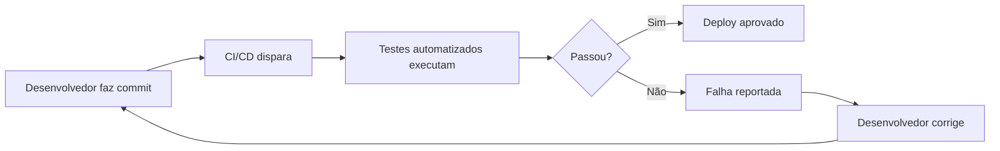

### Boas Práticas

- Automatize apenas o que traz valor (cenários críticos e repetitivos)
- Comece pela camada de API (mais estável e rápida)
- Mantenha os testes independentes entre si
- Testes devem ser determinísticos (mesmo resultado toda vez)
- Invista em manutenibilidade desde o início

### Erros Mais Comuns

| Erro | Consequência |
|------|-------------|
| Automatizar tudo de uma vez | Projeto abandonado por complexidade |
| Testes dependentes entre si | Falhas em cascata difíceis de debugar |
| Não investir em estrutura | Código duplicado e frágil |
| Ignorar flaky tests | Perda de confiança nos resultados |
| Não rodar em CI/CD | Testes esquecidos e desatualizados |

### Como Validar se a Implementação Está Correta

- Você entende a diferença entre teste manual e automatizado
- Sabe identificar quais cenários devem ser automatizados primeiro
- Compreende a pirâmide de testes e onde cada tipo se encaixa
- Entende o padrão AAA (Arrange-Act-Assert)

### Próximos Passos

No próximo capítulo, entenderemos o que é um framework de automação, por que não devemos criar scripts soltos e como uma estrutura organizada resolve os problemas de manutenção.

---

## Capítulo 2 - O que é um Framework de Automação e Por Que Utilizá-lo

### Objetivo do Capítulo

Explicar a diferença entre scripts de teste isolados e um framework de automação estruturado, demonstrando os benefícios de uma abordagem organizada.

### Conceitos Fundamentais

Um **framework de automação** é uma estrutura de código organizada que fornece:

- **Padrões de projeto** — regras sobre onde colocar cada tipo de código
- **Reutilização** — componentes compartilhados entre testes
- **Abstração** — camadas que isolam a complexidade técnica
- **Configurabilidade** — parâmetros externalizados para diferentes ambientes
- **Extensibilidade** — facilidade para adicionar novos testes

**Diferença entre script e framework:**

| Aspecto | Script Isolado | Framework |
|---------|---------------|-----------|
| Organização | Arquivo único | Múltiplas camadas |
| Reutilização | Copiar/colar | Herança e composição |
| Manutenção | Alterar em N lugares | Alterar em 1 lugar |
| Novos testes | Reescrever tudo | Seguir padrão existente |
| Colaboração | Difícil | Padronizado |

### Problema que Será Resolvido

Sem um framework, o que acontece em projetos reais:

1. Cada pessoa escreve testes de forma diferente
2. Mudanças na interface quebram dezenas de testes
3. Credenciais e URLs ficam hardcoded nos scripts
4. Não há como executar em diferentes ambientes
5. Novos membros do time demoram semanas para entender o código

### Solução Adotada

Implementar um framework com as seguintes características:

- **Page Object Model (POM)** — para testes de UI
- **Service Layer** — para testes de API
- **Cucumber BDD** — para documentação viva dos cenários
- **Configuração externalizada** — arquivo `config.properties`
- **Hooks** — gerenciamento automático do ciclo de vida
- **Relatórios** — evidências automáticas com Allure

### Justificativa da Escolha

O framework foi projetado para resolver problemas reais de projetos corporativos:

- Times de 3+ pessoas precisam de padronização
- Projetos que duram mais de 6 meses precisam de manutenibilidade
- Ambientes múltiplos (DEV, HML, PROD) exigem configuração dinâmica
- Stakeholders precisam entender os cenários (daí o BDD)

### Implementação Passo a Passo

A construção do framework segue esta ordem lógica:

1. Criar projeto Maven com dependências
2. Definir estrutura de diretórios
3. Implementar camada de suporte (drivers, configuração, helpers)
4. Implementar camada de páginas (Page Objects)
5. Implementar camada de serviços (Services para API)
6. Implementar camada de testes (Steps + Features)
7. Configurar relatórios e CI/CD

### Estrutura de Arquivos Criada

Visão geral da estrutura que será construída ao longo deste livro:

```
selenium-cucumber-project/
├── pom.xml                          # Dependências e build
├── config.properties                # Configurações do framework
├── .github/workflows/testes.yml     # Pipeline CI/CD
└── src/test/
    ├── java/
    │   ├── pages/                   # Page Objects (UI)
    │   ├── services/                # Services (API)
    │   ├── steps/                   # Step Definitions (BDD)
    │   ├── support/                 # Infraestrutura
    │   │   ├── communication/       # Cliente REST
    │   │   ├── environment/         # Gerenciamento de ambiente
    │   │   ├── helpers/             # Utilitários
    │   │   ├── hooks/               # Ciclo de vida
    │   │   ├── testEvidence/        # Screenshots
    │   │   └── webDriver/           # Fábrica de drivers
    │   └── Runner.java              # Ponto de entrada
    └── resources/
        ├── features/                # Cenários BDD (.feature)
        ├── schemas/                 # JSON Schemas para validação
        └── template.api/            # Payloads JSON
```

### Código de Exemplo Comentado

```java
// Sem framework: código frágil e repetitivo
public void testLogin() {
    System.setProperty("webdriver.chrome.driver", "C:/driver/chromedriver.exe");
    WebDriver driver = new ChromeDriver();
    driver.get("https://sistema.com/login");
    driver.findElement(By.name("username")).sendKeys("admin");
    // ... todo o código misturado em um único método
}

// Com framework: código organizado e reutilizável
public class LoginSteps {
    private LoginPage loginPage;
    
    @Quando("faço login como administrador")
    public void loginAdmin() {
        // A Page cuida dos detalhes de interação
        loginPage.preencherUsuario(env.getProperty("usuario.admin"));
        loginPage.preencherSenha(env.getProperty("senha.admin"));
        loginPage.clicarLogin();
    }
}
```

### Fluxo de Execução

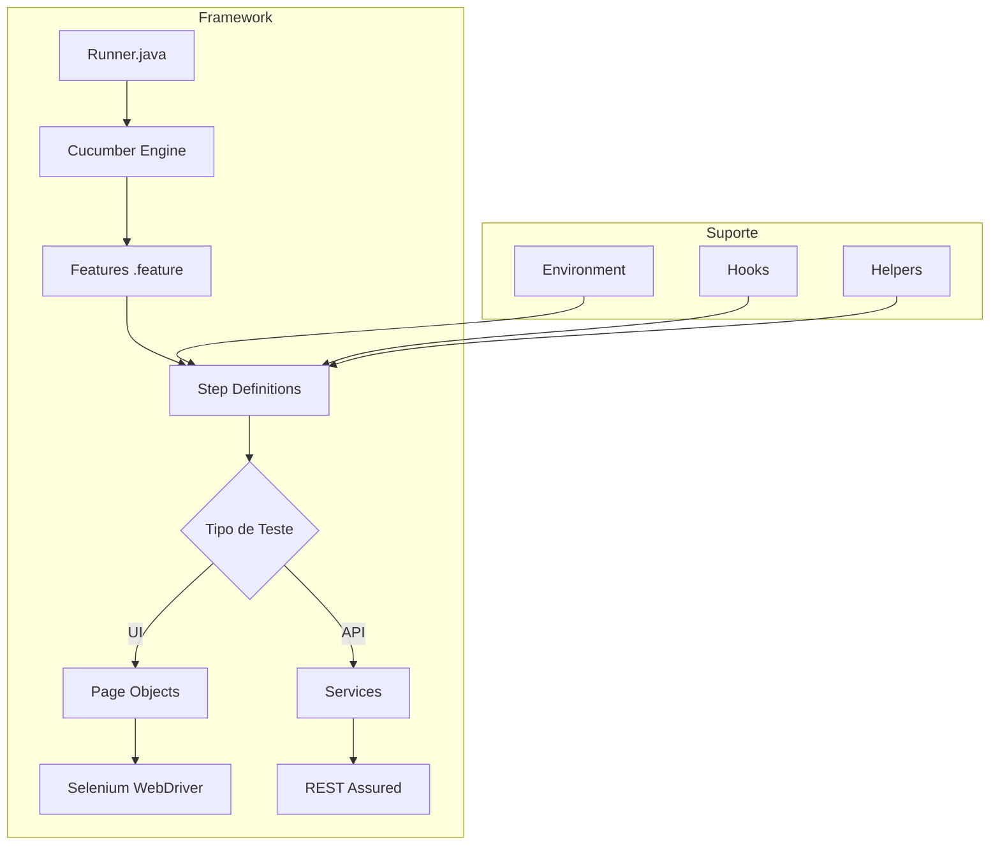

### Boas Práticas

- Cada camada deve ter uma responsabilidade clara
- Nunca misture lógica de teste com lógica de infraestrutura
- Favoreça composição sobre herança (exceto Page Objects)
- Mantenha o framework simples — complexidade mata projetos
- Documente as decisões de arquitetura

### Erros Mais Comuns

| Erro | Solução |
|------|---------|
| Framework muito complexo | Comece simples, evolua conforme necessidade |
| Camadas desnecessárias | Se não resolve um problema real, não crie |
| Acoplamento entre testes | Cada teste deve ser independente |
| Over-engineering | YAGNI — não crie o que não vai usar agora |

### Como Validar se a Implementação Está Correta

- Você consegue explicar o papel de cada camada do framework
- Sabe onde colocar um novo teste de UI vs um novo teste de API
- Entende por que a configuração fica separada do código
- Consegue adicionar um novo cenário sem alterar o framework

### Próximos Passos

No próximo capítulo, veremos a arquitetura detalhada do framework com diagramas de como cada componente se comunica.

---

## Capítulo 3 - Arquitetura Geral do Framework

### Objetivo do Capítulo

Apresentar a arquitetura completa do framework com diagramas visuais, explicando como cada componente se conecta e qual o fluxo de dados durante a execução dos testes.

### Conceitos Fundamentais

A arquitetura do framework segue o princípio de **separação de responsabilidades (SoC)**. Cada pacote tem uma função específica e comunica-se com outros pacotes através de interfaces bem definidas.

**Princípios arquiteturais aplicados:**

- **Single Responsibility** — cada classe faz uma coisa
- **Open/Closed** — extensível sem modificação
- **Dependency Inversion** — dependa de abstrações
- **DRY (Don't Repeat Yourself)** — código compartilhado em classes base

### Problema que Será Resolvido

Projetos de automação sem arquitetura definida tornam-se impossíveis de manter após 3 meses. A falta de uma visão macro impede que novos desenvolvedores contribuam efetivamente.

### Solução Adotada

Uma arquitetura em camadas com separação clara entre:

1. **Camada de Apresentação** — Features BDD (linguagem de negócio)
2. **Camada de Orquestração** — Steps (traduz BDD para ações)
3. **Camada de Negócio** — Pages e Services (encapsulam interações)
4. **Camada de Infraestrutura** — Support (drivers, config, helpers)

### Justificativa da Escolha

- Camadas isolam mudanças: se o seletor CSS muda, apenas a Page é alterada
- Steps ficam legíveis porque delegam para Pages/Services
- Features ficam compreensíveis para qualquer stakeholder
- Infraestrutura é reutilizada por todos os testes

### Implementação Passo a Passo

#### Diagrama de Arquitetura Completa

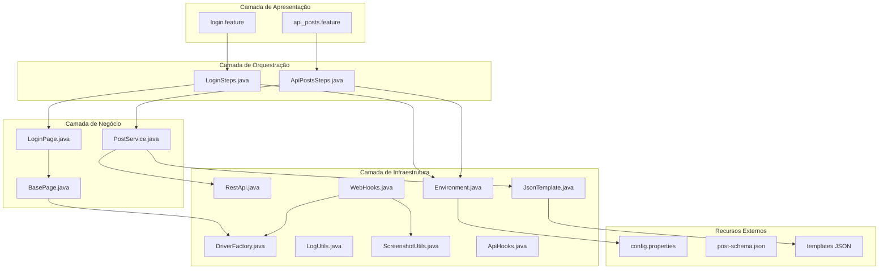

#### Fluxo de Execução UI (Feature → Step → Page → Selenium)

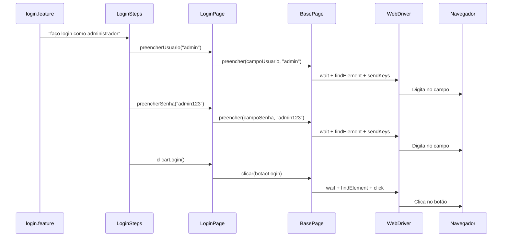

#### Fluxo de Execução API (Feature → Step → Service → API)

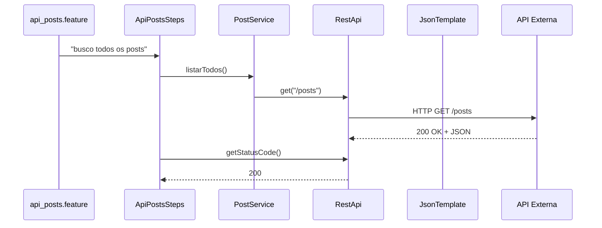

#### Organização de Camadas

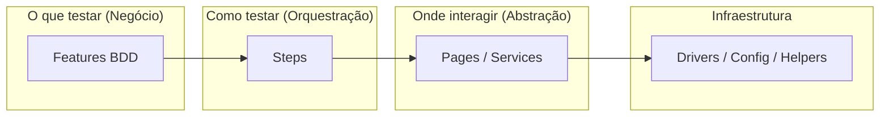

### Estrutura de Arquivos Criada

```
src/test/java/
├── Runner.java                      # Ponto de entrada JUnit + Cucumber
├── pages/                           # Camada de abstração UI
│   ├── BasePage.java               # Métodos genéricos de interação
│   └── LoginPage.java             # Page Object específica
├── services/                        # Camada de abstração API
│   └── PostService.java           # Serviço de posts
├── steps/                           # Tradução BDD → código
│   ├── LoginSteps.java            # Steps de UI
│   └── ApiPostsSteps.java        # Steps de API
└── support/                         # Infraestrutura compartilhada
    ├── communication/
    │   └── RestApi.java           # Cliente HTTP genérico
    ├── environment/
    │   └── Environment.java       # Gerenciador de ambiente
    ├── helpers/
    │   ├── LogUtils.java          # Utilitário de log
    │   └── JsonTemplate.java      # Leitor de templates JSON
    ├── hooks/
    │   ├── WebHooks.java          # Ciclo de vida UI
    │   └── ApiHooks.java          # Ciclo de vida API
    ├── testEvidence/
    │   └── ScreenshotUtils.java   # Captura de tela
    └── webDriver/
        └── DriverFactory.java     # Fábrica de navegadores
```

### Código de Exemplo Comentado

```java
// Runner.java — Ponto de entrada que conecta todas as camadas
@RunWith(Cucumber.class)          // JUnit executa via Cucumber
@CucumberOptions(
    features = "src/test/resources/features",  // Onde estão as features
    glue = {"steps", "support.hooks"},         // Onde estão os Steps e Hooks
    plugin = {                                  // Plugins de relatório
        "pretty",
        "io.qameta.allure.cucumber7jvm.AllureCucumber7Jvm"
    }
)
public class Runner {}
```

### Fluxo de Execução

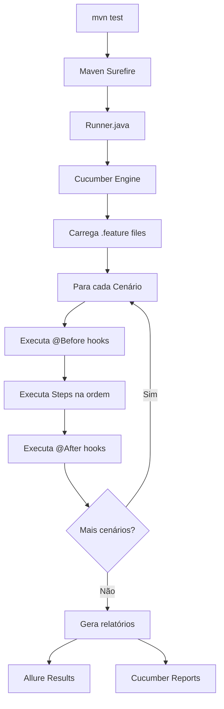

### Boas Práticas

- Mantenha o diagrama de arquitetura atualizado
- Cada nova classe deve se encaixar em uma camada existente
- Se precisar criar uma nova camada, questione se é realmente necessário
- Documente decisões arquiteturais (ADRs)

### Erros Mais Comuns

| Erro | Consequência |
|------|-------------|
| Steps chamando driver diretamente | Acoplamento e duplicação |
| Page Objects fazendo assertions | Mistura de responsabilidades |
| Services conhecendo o Cucumber | Acoplamento com framework de teste |
| Hooks fazendo lógica de negócio | Difícil de debugar |

### Como Validar se a Implementação Está Correta

- Cada classe pertence a exatamente uma camada
- Nenhuma classe de camada inferior conhece classes de camada superior
- É possível trocar o Selenium por outro driver sem alterar Steps ou Features
- É possível trocar o REST Assured por outra lib sem alterar Steps ou Features

### Próximos Passos

No próximo capítulo, veremos como planejar a automação em um projeto corporativo real, definindo escopo, prioridades e cronograma.

---

## Capítulo 4 - Como Planejar uma Automação em um Projeto Corporativo

### Objetivo do Capítulo

Fornecer um guia prático para planejar a introdução de automação de testes em um projeto corporativo, desde a análise inicial até a definição de métricas de sucesso.

### Conceitos Fundamentais

**Planejamento de automação** envolve:

- **Análise de viabilidade** — nem todo projeto se beneficia igualmente
- **Definição de escopo** — o que automatizar primeiro
- **Estimativa de ROI** — retorno sobre investimento
- **Definição de critérios de sucesso** — como medir se funcionou

**Critérios para priorização de cenários:**

| Critério | Peso | Descrição |
|----------|------|-----------|
| Frequência de execução | Alto | Cenários executados a cada sprint |
| Criticidade | Alto | Funcionalidades core do negócio |
| Estabilidade | Médio | Funcionalidades que não mudam frequentemente |
| Complexidade manual | Médio | Cenários trabalhosos de executar manualmente |
| Risco de regressão | Alto | Áreas frequentemente quebradas |

### Problema que Será Resolvido

Empresas que iniciam automação sem planejamento enfrentam:
- Investimento em cenários de baixo valor
- Expectativas irreais sobre prazo de retorno
- Abandono do projeto por falta de resultados visíveis
- Falta de buy-in dos stakeholders

### Solução Adotada

Um plano de automação em fases progressivas:

**Fase 1 — Foundation (Semanas 1-2):**
- Setup do framework e infraestrutura
- Automação de 2-3 cenários smoke (login, API básica)
- CI/CD configurado

**Fase 2 — Core (Semanas 3-6):**
- Automação dos cenários críticos
- Validação de contratos de API
- Integração com pipeline de deploy

**Fase 3 — Expansion (Semanas 7+):**
- Cenários de borda e negativos
- Performance básica
- Monitoramento e métricas

### Justificativa da Escolha

O planejamento faseado permite:
- Demonstrar valor rapidamente (Fase 1)
- Construir confiança gradualmente
- Ajustar o plano com base em feedback real
- Evitar o "efeito big bang" que causa abandono

### Implementação Passo a Passo

1. **Levantamento:**
   - Listar todas as funcionalidades do sistema
   - Classificar por criticidade (Alta/Média/Baixa)
   - Identificar cenários de regressão mais frequentes

2. **Priorização:**
   - Aplicar a matriz de priorização (criticidade × frequência)
   - Selecionar os top 10 cenários para automação inicial
   - Validar com PO/QA Lead

3. **Estimativa:**
   - Framework setup: 2-3 dias
   - Cada cenário UI simples: 2-4 horas
   - Cada cenário API: 1-2 horas
   - CI/CD setup: 4-8 horas

4. **Execução:**
   - Sprint 1: Framework + 5 cenários smoke
   - Sprint 2: 10 cenários core + relatórios
   - Sprint 3+: Expansão contínua

### Estrutura de Arquivos Criada

Neste capítulo não criamos arquivos. Produzimos documentação de planejamento.

### Código de Exemplo Comentado

```gherkin
# Exemplo de cenário prioritário (Smoke Test)
# Critérios: Alta frequência, Alta criticidade, Alta estabilidade
@smoke
Cenário: Login com credenciais válidas
  Dado que estou na página de login
  Quando faço login como administrador
  Então devo ser redirecionado para a página inicial
```

### Fluxo de Execução

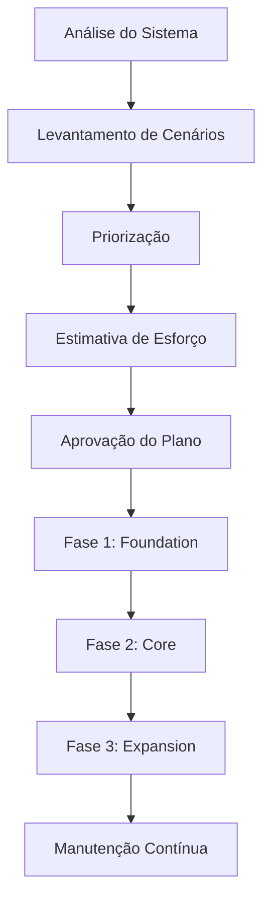

### Boas Práticas

- Comece com smoke tests (cenários rápidos que validam o básico)
- Priorize API sobre UI (mais estável e rápido)
- Defina métricas claras: tempo de execução, cobertura, taxa de falha
- Revise o plano a cada sprint
- Comunique resultados frequentemente

### Erros Mais Comuns

| Erro | Solução |
|------|---------|
| Querer automatizar 100% | Comece com 20% mais críticos |
| Não envolver o time | Faça sessões de refinamento de cenários |
| Subestimar manutenção | Reserve 30% do tempo para manutenção |
| Não medir resultados | Defina KPIs antes de começar |

### Como Validar se a Implementação Está Correta

- Existe um documento de planejamento aprovado
- Os cenários estão priorizados em uma lista ordenada
- Há critérios claros de "pronto" para cada fase
- Stakeholders sabem o que esperar e quando

### Próximos Passos

No próximo capítulo, veremos como escolher as tecnologias certas para cada necessidade do framework.

---

## Capítulo 5 - Escolha das Tecnologias e Justificativas

### Objetivo do Capítulo

Apresentar cada tecnologia utilizada no framework, explicar por que foi escolhida e quais alternativas foram consideradas.

### Conceitos Fundamentais

A escolha de tecnologias deve considerar:

- **Compatibilidade** — as ferramentas devem funcionar juntas
- **Maturidade** — ferramentas estáveis com comunidade ativa
- **Suporte à versão Java** — Java 8 como requisito corporativo
- **Curva de aprendizado** — quanto tempo para o time dominar

### Problema que Será Resolvido

Escolher ferramentas incompatíveis ou sem suporte causa:
- Problemas de integração entre bibliotecas
- Falta de documentação e comunidade para resolver problemas
- Necessidade de migração prematura

### Solução Adotada

| Tecnologia | Versão | Função |
|------------|--------|--------|
| Java | 8 | Linguagem de programação |
| Maven | 3.x | Gerenciador de build e dependências |
| Selenium WebDriver | 3.141.59 | Automação de navegador |
| Cucumber | 7.18.0 | Framework BDD |
| JUnit | 4.13.2 | Framework de teste e runner |
| REST Assured | 4.5.1 | Testes de API REST |
| Allure Report | 2.24.0 | Geração de relatórios |
| GitHub Actions | - | CI/CD |
| ChromeDriver | Compatível | Driver do Chrome |

### Justificativa da Escolha

**Java 8:**
- Versão mais utilizada em ambientes corporativos
- Suporte LTS estendido
- Compatível com todas as bibliotecas escolhidas

**Maven:**
- Padrão de mercado para projetos Java
- Gerenciamento automático de dependências
- Integração nativa com CI/CD
- Alternativas consideradas: Gradle (menos popular em automação de testes)

**Selenium 3.141.59:**
- Última versão estável compatível com Java 8
- Maior comunidade e documentação disponível
- Alternativas consideradas: Selenium 4 (requer Java 11+), Playwright (não-Java)

**Cucumber 7.18:**
- BDD em linguagem natural (Gherkin)
- Suporte a português nativo
- Integração com JUnit e Allure
- Alternativas consideradas: JBehave (menos popular), TestNG + relatórios custom

**JUnit 4.13.2:**
- Simples e eficiente como runner
- Integração perfeita com Maven Surefire
- Alternativas consideradas: JUnit 5 (mais moderno, mas Cucumber 7 funciona melhor com JUnit 4)

**REST Assured 4.5.1:**
- API fluente e legível
- Última versão compatível com Java 8
- Validação de JSON Schema integrada
- Alternativas consideradas: Apache HttpClient (verboso), OkHttp (menos features para teste)

**Allure 2.24.0:**
- Relatórios visuais e interativos
- Integração nativa com Cucumber
- Screenshots e evidências anexáveis
- Alternativas consideradas: ExtentReports (menos integrado com Cucumber)

### Implementação Passo a Passo

A implementação das tecnologias acontece via `pom.xml`:

```xml
<properties>
    <java.version>8</java.version>
    <selenium.version>3.141.59</selenium.version>
    <cucumber.version>7.18.0</cucumber.version>
    <junit.version>4.13.2</junit.version>
    <rest.assured.version>4.5.1</rest.assured.version>
    <allure.version>2.24.0</allure.version>
</properties>
```

### Estrutura de Arquivos Criada

```
pom.xml   # Todas as dependências e versões centralizadas aqui
```

### Código de Exemplo Comentado

```xml
<!-- pom.xml — Trecho com justificativa de cada dependência -->

<!-- Selenium: automação de navegador -->
<dependency>
    <groupId>org.seleniumhq.selenium</groupId>
    <artifactId>selenium-java</artifactId>
    <version>${selenium.version}</version>
</dependency>

<!-- Cucumber: framework BDD -->
<dependency>
    <groupId>io.cucumber</groupId>
    <artifactId>cucumber-java</artifactId>
    <version>${cucumber.version}</version>
</dependency>

<!-- REST Assured: testes de API com sintaxe fluente -->
<dependency>
    <groupId>io.rest-assured</groupId>
    <artifactId>rest-assured</artifactId>
    <version>${rest.assured.version}</version>
    <scope>test</scope>
</dependency>
```

### Fluxo de Execução

```mermaid
flowchart LR
    A[Maven] --> B[Compila Java 8]
    B --> C[JUnit Runner]
    C --> D[Cucumber Engine]
    D --> E{Tipo}
    E -->|@ui| F[Selenium]
    E -->|@api| G[REST Assured]
    F --> H[Allure Report]
    G --> H
```

### Boas Práticas

- Fixe versões no pom.xml (nunca use LATEST ou ranges)
- Teste compatibilidade entre bibliotecas antes de definir
- Prefira bibliotecas com releases frequentes e issues respondidas
- Mantenha um documento de decisão técnica (ADR)

### Erros Mais Comuns

| Erro | Consequência |
|------|-------------|
| Usar Selenium 4 com Java 8 | Incompatibilidade de compilação |
| REST Assured 5.x com Java 8 | Requires Java 11+ |
| Não fixar versões | Build quebrado por atualização inesperada |
| Muitas dependências | Conflitos de classpath |

### Como Validar se a Implementação Está Correta

- `mvn compile` executa sem erros
- Não há conflitos de dependências (verificar com `mvn dependency:tree`)
- Todas as versões são compatíveis com Java 8
- O projeto compila em CI/CD com as mesmas versões

### Próximos Passos

No próximo capítulo, prepararemos o ambiente de desenvolvimento com todas as ferramentas necessárias.

---

## Capítulo 6 - Preparação do Ambiente de Desenvolvimento

### Objetivo do Capítulo

Guiar o leitor na instalação e configuração de todas as ferramentas necessárias para desenvolver e executar o framework de automação.

### Conceitos Fundamentais

O ambiente de desenvolvimento para automação de testes Java requer:

- **JDK (Java Development Kit)** — compilador e runtime Java
- **Maven** — gerenciador de build e dependências
- **IDE** — ambiente de desenvolvimento integrado
- **ChromeDriver** — driver para comunicação com o Chrome
- **Git** — controle de versão

### Problema que Será Resolvido

Sem um ambiente padronizado, cada membro do time terá problemas diferentes de configuração, dificultando a colaboração e o onboarding de novos membros.

### Solução Adotada

Padronizar a instalação com versões específicas e validação de cada componente.

### Justificativa da Escolha

- JDK 8 por compatibilidade corporativa
- IntelliJ IDEA / Eclipse por suporte completo a Java e Maven
- Chrome por ser o navegador mais utilizado em automação

### Implementação Passo a Passo

#### 1. Instalar JDK 8

**Windows:**
```bash
# Download do Temurin (AdoptOpenJDK)
# https://adoptium.net/temurin/releases/?version=8

# Após instalação, configurar variáveis de ambiente:
# JAVA_HOME = C:\Program Files\Eclipse Adoptium\jdk-8.x.x
# PATH += %JAVA_HOME%\bin

# Validar:
java -version
# Saída esperada: openjdk version "1.8.0_xxx"
```

**Linux/Mac:**
```bash
# Via SDKMAN (recomendado)
curl -s "https://get.sdkman.io" | bash
sdk install java 8.0.392-tem

# Validar
java -version
```

#### 2. Instalar Maven

**Windows:**
```bash
# Download: https://maven.apache.org/download.cgi
# Extrair para C:\apache-maven-3.9.x
# Configurar:
# MAVEN_HOME = C:\apache-maven-3.9.x
# PATH += %MAVEN_HOME%\bin

# Validar:
mvn --version
```

#### 3. Instalar Chrome e ChromeDriver

```bash
# Chrome: https://www.google.com/chrome/
# ChromeDriver: https://chromedriver.chromium.org/downloads
# A versão do ChromeDriver DEVE corresponder à versão do Chrome

# Windows: extrair chromedriver.exe para C:\chromedriver\
# Linux: mover para /usr/local/bin/

# Validar:
chromedriver --version
```

#### 4. Instalar IDE

Recomendações:
- **IntelliJ IDEA Community** (gratuito) — melhor suporte a Java
- **VS Code** com extensões Java — leve e versátil
- **Eclipse** — alternativa tradicional

Plugins necessários (IntelliJ):
- Cucumber for Java
- Gherkin
- Maven Helper

#### 5. Instalar Git

```bash
git --version
# Se não instalado: https://git-scm.com/downloads
```

### Estrutura de Arquivos Criada

Nenhum arquivo de projeto é criado neste passo. Configuramos apenas o ambiente local.

### Código de Exemplo Comentado

```bash
# Script de validação do ambiente (executar no terminal)
echo "=== Validando Ambiente ==="
echo "Java:" && java -version
echo "Maven:" && mvn --version
echo "Chrome:" && google-chrome --version 2>/dev/null || echo "Verificar manualmente"
echo "ChromeDriver:" && chromedriver --version
echo "Git:" && git --version
echo "=== Ambiente OK ==="
```

### Fluxo de Execução

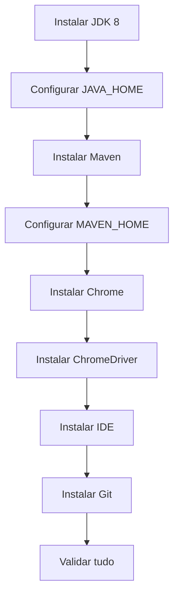

### Boas Práticas

- Use a mesma versão de JDK em dev e CI
- Mantenha ChromeDriver atualizado com a versão do Chrome
- Configure variáveis de ambiente no perfil do sistema (não por sessão)
- Documente as versões exatas em um README

### Erros Mais Comuns

| Erro | Solução |
|------|---------|
| `java: command not found` | JAVA_HOME não configurado no PATH |
| ChromeDriver version mismatch | Baixar versão compatível com o Chrome instalado |
| Maven não encontra JDK | Verificar JAVA_HOME aponta para JDK (não JRE) |
| Permissão negada ao chromedriver | `chmod +x chromedriver` no Linux |

### Como Validar se a Implementação Está Correta

- `java -version` retorna 1.8.x
- `mvn --version` retorna Maven 3.x com Java 1.8
- `chromedriver --version` retorna versão compatível
- `git --version` retorna versão instalada
- IDE abre sem erros e reconhece projetos Maven

### Próximos Passos

Com o ambiente pronto, no próximo capítulo criaremos o projeto Maven do zero.

---

## Capítulo 7 - Criação do Projeto Maven

### Objetivo do Capítulo

Criar o projeto Maven que será a base do framework de automação, explicando cada elemento do `pom.xml`.

### Conceitos Fundamentais

**Maven** é uma ferramenta de gerenciamento de projetos Java que fornece:

- **Build lifecycle** — compilar, testar, empacotar
- **Dependency management** — baixa bibliotecas automaticamente do Maven Central
- **Convention over configuration** — estrutura padrão de diretórios
- **POM (Project Object Model)** — arquivo XML que descreve o projeto

**Estrutura Maven padrão:**
```
projeto/
├── pom.xml              # Configuração do projeto
├── src/
│   ├── main/java/       # Código fonte (não usado em automação)
│   └── test/
│       ├── java/        # Código de teste
│       └── resources/   # Arquivos de recurso
└── target/              # Saída compilada (gerado automaticamente)
```

### Problema que Será Resolvido

Sem um gerenciador de build:
- Dependências precisam ser baixadas e gerenciadas manualmente
- Cada máquina pode ter versões diferentes das bibliotecas
- Não há um comando padrão para compilar e executar testes
- CI/CD fica complexo de configurar

### Solução Adotada

Criar um projeto Maven com:
- GroupId: `com.automacao`
- ArtifactId: `selenium-restassured-cucumber-kiro-github-actions`
- Versão: `1.0.0`
- Packaging: `jar`

### Justificativa da Escolha

Maven foi escolhido por:
- Padrão de mercado para projetos Java corporativos
- Integração nativa com todas as ferramentas escolhidas
- Repositório central com milhares de bibliotecas
- Suporte em todas as IDEs e ferramentas de CI/CD

### Implementação Passo a Passo

#### 1. Criar o projeto via comando

```bash
mvn archetype:generate \
  -DgroupId=com.automacao \
  -DartifactId=selenium-restassured-cucumber-kiro-github-actions \
  -DarchetypeArtifactId=maven-archetype-quickstart \
  -DinteractiveMode=false
```

#### 2. Configurar o pom.xml base

```xml
<?xml version="1.0" encoding="UTF-8"?>
<project xmlns="http://maven.apache.org/POM/4.0.0"
         xmlns:xsi="http://www.w3.org/2001/XMLSchema-instance"
         xsi:schemaLocation="http://maven.apache.org/POM/4.0.0
         http://maven.apache.org/xsd/maven-4.0.0.xsd">

    <modelVersion>4.0.0</modelVersion>

    <groupId>com.automacao</groupId>
    <artifactId>selenium-restassured-cucumber-kiro-github-actions</artifactId>
    <version>1.0.0</version>
    <packaging>jar</packaging>

    <name>selenium-restassured-cucumber-kiro-github-actions</name>
    <description>Automação de testes Web (Selenium) e API (REST Assured) 
    com Cucumber BDD, JUnit e pipeline CI/CD via GitHub Actions.</description>

    <properties>
        <java.version>8</java.version>
        <maven.compiler.source>${java.version}</maven.compiler.source>
        <maven.compiler.target>${java.version}</maven.compiler.target>
        <project.build.sourceEncoding>UTF-8</project.build.sourceEncoding>
    </properties>

</project>
```

### Estrutura de Arquivos Criada

```
selenium-cucumber-project/
├── pom.xml
└── src/
    └── test/
        ├── java/
        └── resources/
```

### Código de Exemplo Comentado

```xml
<!-- pom.xml completo do projeto -->
<?xml version="1.0" encoding="UTF-8"?>
<project xmlns="http://maven.apache.org/POM/4.0.0"
         xmlns:xsi="http://www.w3.org/2001/XMLSchema-instance"
         xsi:schemaLocation="http://maven.apache.org/POM/4.0.0
         http://maven.apache.org/xsd/maven-4.0.0.xsd">

    <!-- Versão do modelo POM — sempre 4.0.0 -->
    <modelVersion>4.0.0</modelVersion>

    <!-- Identificação única do projeto no Maven Central -->
    <groupId>com.automacao</groupId>
    <artifactId>selenium-restassured-cucumber-kiro-github-actions</artifactId>
    <version>1.0.0</version>
    <packaging>jar</packaging>

    <!-- Metadados descritivos -->
    <name>selenium-restassured-cucumber-kiro-github-actions</name>
    <description>Automação de testes Web e API com Cucumber BDD</description>

    <!-- Propriedades centralizadas — facilita atualização de versões -->
    <properties>
        <java.version>8</java.version>
        <maven.compiler.source>${java.version}</maven.compiler.source>
        <maven.compiler.target>${java.version}</maven.compiler.target>
        <project.build.sourceEncoding>UTF-8</project.build.sourceEncoding>
        <selenium.version>3.141.59</selenium.version>
        <cucumber.version>7.18.0</cucumber.version>
        <junit.version>4.13.2</junit.version>
        <rest.assured.version>4.5.1</rest.assured.version>
        <allure.version>2.24.0</allure.version>
    </properties>

</project>
```

### Fluxo de Execução

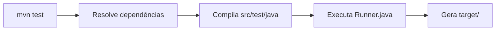

### Boas Práticas

- Use properties para centralizar versões
- Mantenha groupId consistente com a organização
- Use encoding UTF-8 para suporte a caracteres especiais
- Versione o projeto semanticamente (major.minor.patch)

### Erros Mais Comuns

| Erro | Solução |
|------|---------|
| Encoding incorreto em features | Adicionar `<project.build.sourceEncoding>UTF-8` |
| Java version mismatch | Alinhar `maven.compiler.source/target` com JDK instalado |
| Artifact não encontrado | Verificar se Maven Central está acessível |

### Como Validar se a Implementação Está Correta

```bash
# Deve compilar sem erros
mvn compile

# Deve mostrar a árvore do projeto
mvn validate
```

### Próximos Passos

No próximo capítulo, adicionaremos todas as dependências necessárias ao pom.xml.

---

## Capítulo 8 - Configuração das Dependências

### Objetivo do Capítulo

Adicionar e explicar cada dependência necessária no `pom.xml`, incluindo plugins de build e configurações especiais.

### Conceitos Fundamentais

**Dependências Maven** são bibliotecas externas que o projeto utiliza. Elas são declaradas no `pom.xml` e baixadas automaticamente do Maven Central Repository.

**Escopo (scope) das dependências:**

| Scope | Quando disponível | Uso |
|-------|-------------------|-----|
| `compile` (padrão) | Compilação + execução | Código principal |
| `test` | Apenas em testes | Frameworks de teste |
| `provided` | Compilação apenas | Fornecido pelo container |

**Plugins Maven** executam tarefas durante o build:
- `maven-surefire-plugin` — executa testes
- `maven-compiler-plugin` — compila código
- `allure-maven` — gera relatórios Allure

### Problema que Será Resolvido

Sem dependências bem configuradas:
- Código não compila por falta de bibliotecas
- Conflitos entre versões de bibliotecas transitivas
- Testes não executam por falta de plugins adequados

### Solução Adotada

Configurar o `pom.xml` completo com todas as dependências e plugins necessários.

### Justificativa da Escolha

Cada dependência foi escolhida pela compatibilidade com Java 8 e pela integração entre as ferramentas.

### Implementação Passo a Passo

#### Dependências do projeto:

```xml
<dependencies>

    <!-- 1. Selenium WebDriver — automação de navegador -->
    <dependency>
        <groupId>org.seleniumhq.selenium</groupId>
        <artifactId>selenium-java</artifactId>
        <version>${selenium.version}</version>
    </dependency>

    <!-- 2. Cucumber Java — step definitions em Java -->
    <dependency>
        <groupId>io.cucumber</groupId>
        <artifactId>cucumber-java</artifactId>
        <version>${cucumber.version}</version>
    </dependency>

    <!-- 3. Cucumber JUnit — integração Cucumber + JUnit runner -->
    <dependency>
        <groupId>io.cucumber</groupId>
        <artifactId>cucumber-junit</artifactId>
        <version>${cucumber.version}</version>
        <scope>test</scope>
    </dependency>

    <!-- 4. JUnit — framework de teste e runner -->
    <dependency>
        <groupId>junit</groupId>
        <artifactId>junit</artifactId>
        <version>${junit.version}</version>
        <scope>test</scope>
    </dependency>

    <!-- 5. REST Assured — testes de API REST -->
    <dependency>
        <groupId>io.rest-assured</groupId>
        <artifactId>rest-assured</artifactId>
        <version>${rest.assured.version}</version>
        <scope>test</scope>
    </dependency>

    <!-- 6. JSON Schema Validator — validação de contratos -->
    <dependency>
        <groupId>io.rest-assured</groupId>
        <artifactId>json-schema-validator</artifactId>
        <version>${rest.assured.version}</version>
        <scope>test</scope>
    </dependency>

    <!-- 7. Allure Cucumber Integration — relatórios -->
    <dependency>
        <groupId>io.qameta.allure</groupId>
        <artifactId>allure-cucumber7-jvm</artifactId>
        <version>${allure.version}</version>
        <scope>test</scope>
        <exclusions>
            <exclusion>
                <groupId>io.cucumber</groupId>
                <artifactId>gherkin</artifactId>
            </exclusion>
            <exclusion>
                <groupId>io.cucumber</groupId>
                <artifactId>messages</artifactId>
            </exclusion>
        </exclusions>
    </dependency>

    <!-- 8. AspectJ Weaver — necessário para Allure interceptar passos -->
    <dependency>
        <groupId>org.aspectj</groupId>
        <artifactId>aspectjweaver</artifactId>
        <version>1.9.19</version>
        <scope>test</scope>
    </dependency>

</dependencies>
```

#### Plugins de build:

```xml
<build>
    <plugins>

        <!-- Maven Surefire — executa testes JUnit -->
        <plugin>
            <groupId>org.apache.maven.plugins</groupId>
            <artifactId>maven-surefire-plugin</artifactId>
            <version>3.2.5</version>
            <configuration>
                <includes>
                    <include>**/Runner.java</include>
                </includes>
                <argLine>
                    -javaagent:"${settings.localRepository}/org/aspectj/aspectjweaver/1.9.19/aspectjweaver-1.9.19.jar"
                </argLine>
                <systemPropertyVariables>
                    <allure.results.directory>target/allure-results</allure.results.directory>
                </systemPropertyVariables>
            </configuration>
        </plugin>

        <!-- Maven Compiler — configura versão Java -->
        <plugin>
            <groupId>org.apache.maven.plugins</groupId>
            <artifactId>maven-compiler-plugin</artifactId>
            <version>3.13.0</version>
            <configuration>
                <source>${java.version}</source>
                <target>${java.version}</target>
                <encoding>UTF-8</encoding>
            </configuration>
        </plugin>

        <!-- Allure Maven — gera relatórios localmente -->
        <plugin>
            <groupId>io.qameta.allure</groupId>
            <artifactId>allure-maven</artifactId>
            <version>2.12.0</version>
            <configuration>
                <reportVersion>${allure.version}</reportVersion>
                <resultsDirectory>allure-results</resultsDirectory>
            </configuration>
        </plugin>

    </plugins>
</build>
```

### Estrutura de Arquivos Criada

```
pom.xml  # Arquivo atualizado com todas as dependências
```

### Código de Exemplo Comentado

A configuração do Surefire merece atenção especial:

```xml
<plugin>
    <groupId>org.apache.maven.plugins</groupId>
    <artifactId>maven-surefire-plugin</artifactId>
    <version>3.2.5</version>
    <configuration>
        <!-- Diz ao Surefire QUAL classe executar como ponto de entrada -->
        <includes>
            <include>**/Runner.java</include>
        </includes>
        <!-- O AspectJ Weaver é um agente Java que intercepta a execução
             para o Allure capturar cada step automaticamente -->
        <argLine>
            -javaagent:"${settings.localRepository}/org/aspectj/aspectjweaver/1.9.19/aspectjweaver-1.9.19.jar"
        </argLine>
        <!-- Propriedade de sistema que diz ao Allure onde salvar resultados -->
        <systemPropertyVariables>
            <allure.results.directory>target/allure-results</allure.results.directory>
        </systemPropertyVariables>
    </configuration>
</plugin>
```

### Fluxo de Execução

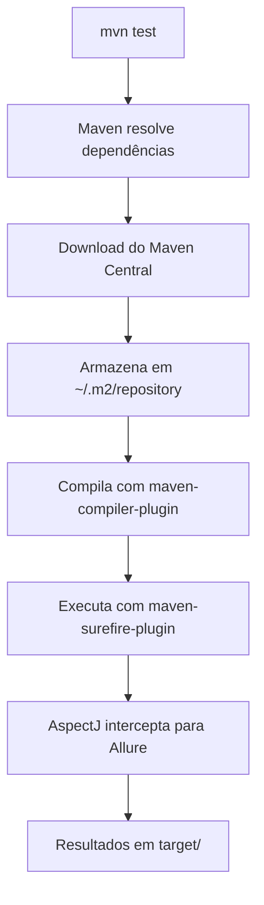

### Boas Práticas

- Use `<exclusions>` para resolver conflitos de versão transitiva
- Centralize todas as versões em `<properties>`
- Use scope `test` para dependências que não são do código principal
- Valide com `mvn dependency:tree` se há conflitos

### Erros Mais Comuns

| Erro | Solução |
|------|---------|
| `NoClassDefFoundError` | Dependência faltando ou scope incorreto |
| Conflito Gherkin/Messages | Adicionar exclusions no allure-cucumber7-jvm |
| AspectJ não encontrado | Verificar path no argLine do Surefire |
| Allure não gera resultados | Verificar systemPropertyVariables |

### Como Validar se a Implementação Está Correta

```bash
# Compilar sem erros
mvn compile -q

# Verificar árvore de dependências
mvn dependency:tree

# Verificar se não há conflitos
mvn dependency:analyze
```

### Próximos Passos

No próximo capítulo, criaremos a estrutura completa de diretórios do projeto.

---

## Capítulo 9 - Estrutura Inicial de Diretórios

### Objetivo do Capítulo

Criar a estrutura completa de pastas do projeto seguindo as convenções Maven e as boas práticas de organização para automação de testes.

### Conceitos Fundamentais

A estrutura de diretórios define a organização física do código. Em Maven, existe uma convenção padrão que não deve ser alterada:

- `src/test/java/` — código Java de teste
- `src/test/resources/` — arquivos de recurso (features, configs, templates)
- `target/` — saída do build (gerado automaticamente, não versionado)

Dentro dessas convenções, criamos subpacotes para organizar por responsabilidade.

### Problema que Será Resolvido

Sem uma estrutura definida:
- Arquivos ficam misturados sem padrão
- É difícil encontrar onde algo está
- Novos membros não sabem onde criar novos arquivos
- Manutenção fica caótica em projetos grandes

### Solução Adotada

Uma estrutura baseada em responsabilidades com pacotes semânticos:

```
src/test/java/
├── pages/          → Page Objects (interação com UI)
├── services/       → Service Objects (interação com APIs)
├── steps/          → Step Definitions (cola entre BDD e código)
├── support/        → Infraestrutura compartilhada
│   ├── communication/  → Cliente HTTP
│   ├── environment/    → Configuração de ambiente
│   ├── helpers/        → Utilitários gerais
│   ├── hooks/          → Ciclo de vida dos testes
│   ├── testEvidence/   → Captura de evidências
│   └── webDriver/      → Fábrica de drivers
└── Runner.java     → Ponto de entrada

src/test/resources/
├── features/       → Arquivos .feature (BDD)
├── schemas/        → JSON Schemas para validação de contrato
└── template.api/   → Payloads JSON externalizados
```

### Justificativa da Escolha

- **pages/** — isolam a interação com elementos da UI
- **services/** — isolam a interação com endpoints de API
- **steps/** — contêm apenas a tradução de Gherkin para chamadas
- **support/** — infraestrutura reutilizável por todos os testes
- **resources/features/** — Cucumber procura features aqui por padrão
- **resources/schemas/** — JSON Schemas ficam próximos aos testes
- **resources/template.api/** — payloads externalizados para manutenção fácil

### Implementação Passo a Passo

```bash
# Criar a estrutura de diretórios
mkdir -p src/test/java/pages
mkdir -p src/test/java/services
mkdir -p src/test/java/steps
mkdir -p src/test/java/support/communication
mkdir -p src/test/java/support/environment
mkdir -p src/test/java/support/helpers
mkdir -p src/test/java/support/hooks
mkdir -p src/test/java/support/testEvidence
mkdir -p src/test/java/support/webDriver
mkdir -p src/test/resources/features
mkdir -p src/test/resources/schemas
mkdir -p src/test/resources/template.api
```

### Estrutura de Arquivos Criada

```
selenium-cucumber-project/
├── pom.xml
├── config.properties
├── .github/
│   └── workflows/
│       └── testes.yml
└── src/test/
    ├── java/
    │   ├── Runner.java
    │   ├── pages/
    │   │   ├── BasePage.java
    │   │   └── LoginPage.java
    │   ├── services/
    │   │   └── PostService.java
    │   ├── steps/
    │   │   ├── LoginSteps.java
    │   │   └── ApiPostsSteps.java
    │   └── support/
    │       ├── communication/
    │       │   └── RestApi.java
    │       ├── environment/
    │       │   └── Environment.java
    │       ├── helpers/
    │       │   ├── LogUtils.java
    │       │   └── JsonTemplate.java
    │       ├── hooks/
    │       │   ├── WebHooks.java
    │       │   └── ApiHooks.java
    │       ├── testEvidence/
    │       │   └── ScreenshotUtils.java
    │       └── webDriver/
    │           └── DriverFactory.java
    └── resources/
        ├── features/
        │   ├── login.feature
        │   └── api_posts.feature
        ├── schemas/
        │   └── post-schema.json
        └── template.api/
            ├── POST_CriarPost.json
            └── PUT_AtualizarPost.json
```

### Código de Exemplo Comentado

```java
// Cada pacote tem uma declaração no topo de cada arquivo
package pages;           // Classes de Page Object
package services;        // Classes de Service
package steps;           // Classes de Step Definition
package support.hooks;   // Classes de Hooks
package support.helpers; // Classes utilitárias

// O Runner.java fica no pacote default (raiz de src/test/java)
// Isso é necessário para que o Cucumber encontre os glue paths
```

### Fluxo de Execução

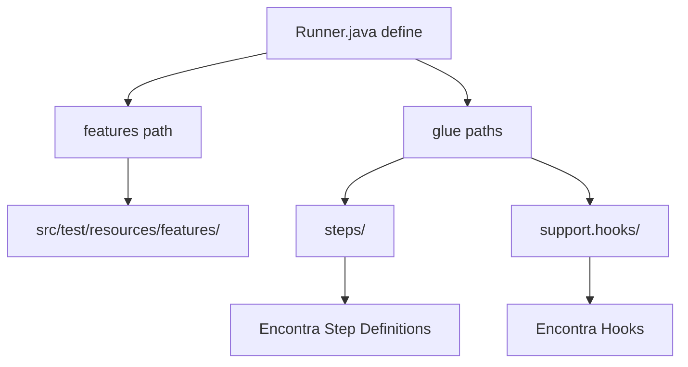

### Boas Práticas

- Não crie pacotes profundos demais (máximo 3 níveis)
- Mantenha a nomenclatura dos pacotes em minúsculas
- Um pacote deve ter pelo menos 2 classes para justificar sua existência
- Pacotes devem refletir responsabilidade, não tipo de arquivo

### Erros Mais Comuns

| Erro | Solução |
|------|---------|
| Steps não encontrados pelo Cucumber | Verificar `glue` no Runner |
| Features não encontradas | Verificar `features` path no Runner |
| Resources não acessíveis | Devem estar em src/test/resources (não src/main) |
| Package mismatch | Nome do pacote deve corresponder à estrutura de pastas |

### Como Validar se a Implementação Está Correta

- `mvn compile` não reclama de pacotes inexistentes
- A IDE mostra todos os pacotes na árvore do projeto
- O Runner encontra features e steps sem erros de classpath
- Arquivos em resources são acessíveis via `ClassLoader.getResource()`

### Próximos Passos

No próximo capítulo, detalharemos a organização das camadas e suas responsabilidades específicas.

---

## Capítulo 10 - Organização das Camadas do Projeto

### Objetivo do Capítulo

Detalhar o papel de cada camada do framework, explicando as regras de comunicação entre elas e como isso garante manutenibilidade.

### Conceitos Fundamentais

**Arquitetura em camadas** significa que o código é organizado em níveis hierárquicos onde:

- Cada camada tem uma responsabilidade única
- Camadas superiores podem chamar inferiores
- Camadas inferiores **nunca** chamam superiores
- Comunicação lateral (entre camadas do mesmo nível) deve ser minimizada

### Problema que Será Resolvido

Quando todas as classes se comunicam livremente:
- Uma mudança em um lugar quebra código em outro
- É impossível testar componentes isoladamente
- O código se torna "espaguete" — entrelaçado e incompreensível

### Solução Adotada

Quatro camadas com regras claras de dependência:

```
┌─────────────────────────────────────────────┐
│  CAMADA 1: Apresentação (Features BDD)       │
│  Quem lê: PO, QA, Dev                       │
│  Linguagem: Gherkin (português)              │
├─────────────────────────────────────────────┤
│  CAMADA 2: Orquestração (Steps)              │
│  Quem lê: QA, Dev                            │
│  Linguagem: Java com anotações Cucumber     │
├─────────────────────────────────────────────┤
│  CAMADA 3: Negócio (Pages / Services)        │
│  Quem lê: Dev, QA técnico                   │
│  Linguagem: Java puro                        │
├─────────────────────────────────────────────┤
│  CAMADA 4: Infraestrutura (Support)          │
│  Quem lê: Dev responsável pelo framework    │
│  Linguagem: Java + configs                   │
└─────────────────────────────────────────────┘
```

### Justificativa da Escolha

| Regra | Razão |
|-------|-------|
| Features não contêm código | Legíveis por não-técnicos |
| Steps não interagem com drivers | Focam na orquestração |
| Pages não fazem assertions | Separação de interação e validação |
| Services não conhecem Steps | Reutilizáveis em outros contextos |
| Support não conhece ninguém acima | Infraestrutura pura |

### Implementação Passo a Passo

#### Regras de dependência por camada:

**Camada 1 — Features (.feature):**
- NÃO importa nada
- Apenas define cenários em Gherkin
- Referencia steps implicitamente via padrão de texto

**Camada 2 — Steps (steps/):**
- PODE usar: Pages, Services, Environment, Hooks
- NÃO PODE usar: Driver diretamente, REST Assured diretamente
- RESPONSABILIDADE: traduzir Gherkin → chamadas de métodos

**Camada 3 — Pages e Services:**
- PODE usar: Support (Environment, Helpers, RestApi)
- NÃO PODE usar: Steps, Features, outras Pages/Services
- RESPONSABILIDADE: encapsular interação com sistemas externos

**Camada 4 — Support:**
- PODE usar: apenas bibliotecas externas e configurações
- NÃO PODE usar: nada das camadas acima
- RESPONSABILIDADE: fornecer infraestrutura

### Estrutura de Arquivos Criada

Nenhum arquivo novo. Este capítulo documenta as regras que governam a organização.

### Código de Exemplo Comentado

```java
// CORRETO: Step usa Page (camada 2 → camada 3)
public class LoginSteps {
    private LoginPage loginPage;  // ✅ Step conhece Page
    
    @Quando("faço login como administrador")
    public void loginAdmin() {
        loginPage.preencherUsuario(env.getProperty("usuario.admin"));
    }
}

// INCORRETO: Step usa driver diretamente (camada 2 → camada 4)
public class LoginSteps {
    @Quando("faço login como administrador")
    public void loginAdmin() {
        // ❌ NUNCA faça isso — viola a separação de camadas
        WebDriver driver = WebHooks.getDriver();
        driver.findElement(By.name("username")).sendKeys("admin");
    }
}

// CORRETO: Page usa BasePage (camada 3 → camada 4)
public class LoginPage extends BasePage {
    public void preencherUsuario(String usuario) {
        preencher(campoUsuario, usuario);  // ✅ Delega para BasePage
    }
}

// INCORRETO: Page faz assertion (mistura responsabilidades)
public class LoginPage extends BasePage {
    public void verificarLogin() {
        // ❌ NUNCA faça assertions na Page
        Assert.assertTrue(urlContem("/dashboard"));
    }
}
```

### Fluxo de Execução

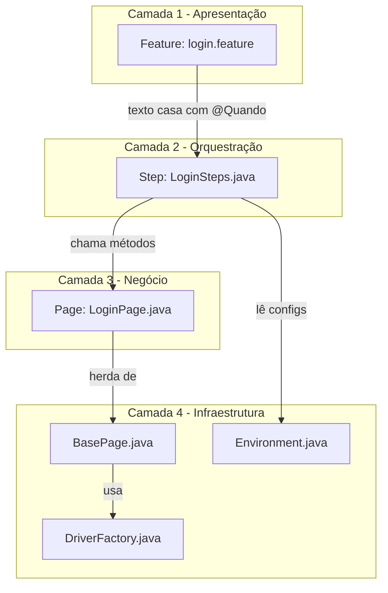

### Boas Práticas

- Se você precisa importar de uma camada superior, há um problema de design
- Steps devem ter no máximo 5-10 linhas por método
- Pages devem expor apenas métodos de negócio (não seletores)
- Services devem ser stateless quando possível

### Erros Mais Comuns

| Erro | Sintoma | Solução |
|------|---------|---------|
| Step com 50+ linhas | Lógica misturada | Extrair para Page/Service |
| Page com Assert | Teste frágil | Mover assertion para Step |
| Import circular | Não compila | Rever design de dependências |
| Código duplicado entre Steps | Manutenção difícil | Extrair para Helper |

### Como Validar se a Implementação Está Correta

- Nenhum arquivo em `steps/` importa `org.openqa.selenium`
- Nenhum arquivo em `pages/` importa `org.junit.Assert`
- Nenhum arquivo em `support/` importa de `steps/` ou `pages/`
- Cada classe importa apenas das camadas permitidas

### Próximos Passos

Nos próximos capítulos, implementaremos cada camada em detalhe, começando pelo padrão Page Object.

---

## Capítulo 11 - Implementação do Padrão Page Object

### Objetivo do Capítulo

Implementar o padrão Page Object Model (POM) que encapsula a interação com elementos da interface gráfica em classes reutilizáveis.

### Conceitos Fundamentais

O **Page Object Model** é um padrão de design onde:

- Cada página (ou componente) da aplicação é representada por uma classe Java
- A classe contém os **localizadores** (seletores) dos elementos
- A classe expõe **métodos** que representam ações do usuário
- Os métodos escondem os detalhes de implementação (como encontrar e interagir com elementos)

**Benefícios:**
- Se um seletor muda, você altera em **um único lugar**
- Steps ficam legíveis pois chamam métodos com nomes de negócio
- Reutilização de interações entre diferentes cenários

### Problema que Será Resolvido

Sem Page Object, quando o seletor de um botão muda:
- Você precisa encontrar TODOS os testes que usam aquele botão
- Alterar em cada um deles
- Risco de esquecer algum
- Testes quebram em cascata

### Solução Adotada

Criar uma classe `LoginPage` que:
- Centraliza todos os seletores da página de login
- Expõe métodos como `preencherUsuario()`, `clicarLogin()`
- Herda de `BasePage` para reutilizar métodos genéricos

### Justificativa da Escolha

- Page Object é o padrão mais adotado em automação de UI
- Recomendado pela documentação oficial do Selenium
- Facilita manutenção quando a interface muda
- Permite que Steps fiquem focados em lógica de teste

### Implementação Passo a Passo

#### 1. Definir os seletores como atributos privados

```java
// Seletores são declarados como constantes By
private final By campoUsuario = By.name("username");
private final By campoSenha   = By.name("password");
private final By botaoLogin   = By.cssSelector("button[type='submit']");
private final By mensagemErro = By.cssSelector(".oxd-alert-content-text");
```

#### 2. Criar métodos que representam ações do usuário

```java
public void preencherUsuario(String usuario) {
    preencher(campoUsuario, usuario);
}

public void clicarLogin() {
    clicar(botaoLogin);
}
```

#### 3. Criar métodos de verificação (queries, não assertions)

```java
public String obterMensagemErro() {
    return obterTexto(mensagemErro);
}

public boolean estaNoDashboard() {
    return urlContem("/dashboard");
}
```

### Estrutura de Arquivos Criada

```
src/test/java/pages/
├── BasePage.java      # Classe abstrata com métodos genéricos
└── LoginPage.java     # Page Object da página de login
```

### Código de Exemplo Comentado

```java
package pages;

import org.openqa.selenium.By;
import org.openqa.selenium.WebDriver;

/**
 * Page Object da página de Login.
 * 
 * Responsabilidades:
 * - Centralizar seletores da página de login
 * - Expor métodos de interação com nomes de negócio
 * - Expor métodos de consulta (sem fazer assertions)
 * 
 * NÃO deve:
 * - Fazer assertions (responsabilidade do Step)
 * - Navegar para outras páginas (usar outra Page Object)
 * - Conter lógica de teste
 */
public class LoginPage extends BasePage {

    // Seletores — privados e imutáveis
    // Se o seletor muda na aplicação, altere APENAS aqui
    private final By campoUsuario = By.name("username");
    private final By campoSenha   = By.name("password");
    private final By botaoLogin   = By.cssSelector("button[type='submit']");
    private final By mensagemErro = By.cssSelector(".oxd-alert-content-text");

    // Construtor recebe o WebDriver (injetado pelo Hook)
    public LoginPage(WebDriver driver) {
        super(driver);  // Passa para BasePage configurar waits
    }

    // --- Métodos de AÇÃO (simulam o que o usuário faz) ---

    public void abrirPagina(String url) {
        navegar(url);  // Método herdado de BasePage
    }

    public void preencherUsuario(String usuario) {
        preencher(campoUsuario, usuario);  // Aguarda visibilidade + preenche
    }

    public void preencherSenha(String senha) {
        preencher(campoSenha, senha);
    }

    public void clicarLogin() {
        clicar(botaoLogin);  // Aguarda clicável + clica
    }

    // --- Métodos de CONSULTA (retornam informação, sem assertions) ---

    public String obterMensagemErro() {
        return obterTexto(mensagemErro);
    }

    public boolean estaNoDashboard() {
        return urlContem("/dashboard");
    }
}
```

### Fluxo de Execução

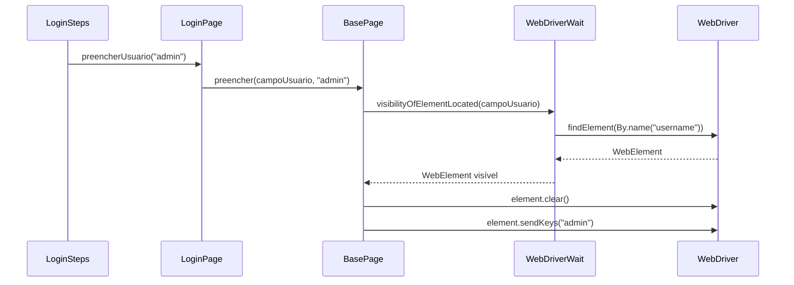

### Boas Práticas

- Nomeie métodos com verbos de ação do usuário (`preencherUsuario`, `clicarLogin`)
- Mantenha seletores `private final` — nunca exponha seletores
- Um método deve fazer uma ação atômica
- Retorne `this` se quiser permitir encadeamento (fluent interface)
- Agrupe seletores no topo da classe para fácil localização

### Erros Mais Comuns

| Erro | Solução |
|------|---------|
| Seletor público | Tornar `private final` |
| Page faz Assert | Mover assertion para Step |
| Método genérico demais | `interagirComElemento()` → `clicarLogin()` |
| Page Object gigante (50+ métodos) | Dividir em componentes menores |

### Como Validar se a Implementação Está Correta

- Page Object não importa JUnit/Assert
- Todos os seletores são `private final`
- Métodos têm nomes que um não-técnico entenderia
- Nenhum método retorna WebElement para fora da classe

### Próximos Passos

No próximo capítulo, criaremos a BasePage com métodos genéricos que todas as Pages herdarão.

---

## Capítulo 12 - Criação da BasePage e Explicação sobre Herança

### Objetivo do Capítulo

Implementar a classe abstrata `BasePage` que centraliza métodos genéricos de interação com o navegador, explicando o conceito de herança em Java.

### Conceitos Fundamentais

**Herança** em Java permite que uma classe (filha) herde atributos e métodos de outra classe (pai/mãe). No nosso contexto:

- `BasePage` é a classe **abstrata** (não pode ser instanciada diretamente)
- `LoginPage` **herda** de BasePage (keyword `extends`)
- Métodos `protected` ficam disponíveis para as filhas, mas não para classes externas

**Classe abstrata** serve como template — define a estrutura que as filhas devem seguir.

**WebDriverWait** é um mecanismo de espera explícita que aguarda uma condição ser satisfeita antes de interagir com um elemento.

### Problema que Será Resolvido

Sem BasePage, cada Page Object precisaria:
- Configurar seu próprio WebDriverWait
- Reimplementar `preencher()`, `clicar()`, `obterTexto()`
- Duplicar tratamento de exceções
- Resultado: código repetitivo e inconsistente

### Solução Adotada

Uma classe abstrata que fornece:
- Gerenciamento de `WebDriver` e `WebDriverWait`
- Métodos protegidos para interações comuns
- Timeout configurável via `config.properties`

### Justificativa da Escolha

- Herança é o mecanismo natural para este caso (relação "é um tipo de")
- `LoginPage` **é** uma `BasePage`
- Classe abstrata impede instanciação acidental
- Métodos `protected` encapsulam sem expor para o mundo externo

### Implementação Passo a Passo

```java
package pages;

import org.openqa.selenium.By;
import org.openqa.selenium.WebDriver;
import org.openqa.selenium.WebElement;
import org.openqa.selenium.support.ui.ExpectedConditions;
import org.openqa.selenium.support.ui.WebDriverWait;
import support.environment.Environment;

/**
 * Classe base para todos os Page Objects.
 * 
 * REGRAS:
 * 1. É abstrata — não pode ser instanciada diretamente
 * 2. Fornece métodos protected — disponíveis APENAS para subclasses
 * 3. Gerencia WebDriver e WebDriverWait
 * 4. Timeout é lido do config.properties (não hardcoded)
 */
public abstract class BasePage {

    // Atributos protected — acessíveis pelas classes filhas
    protected final WebDriver driver;
    protected final WebDriverWait wait;

    /**
     * Construtor recebe o WebDriver e configura o timeout de espera.
     * O timeout vem do config.properties (chave: timeout.explicit)
     */
    protected BasePage(WebDriver driver) {
        this.driver = driver;
        // Lê timeout do arquivo de configuração
        int timeout = Integer.parseInt(new Environment().getProperty("timeout.explicit"));
        // WebDriverWait espera até N segundos antes de lançar exceção
        this.wait = new WebDriverWait(driver, timeout);
    }

    /**
     * Navega para uma URL completa.
     */
    protected void navegar(String url) {
        driver.get(url);
    }

    /**
     * Preenche um campo de texto.
     * 1. Aguarda o elemento ficar visível
     * 2. Limpa o conteúdo existente
     * 3. Digita o novo valor
     */
    protected void preencher(By locator, String valor) {
        WebElement campo = wait.until(
            ExpectedConditions.visibilityOfElementLocated(locator)
        );
        campo.clear();
        campo.sendKeys(valor);
    }

    /**
     * Clica em um elemento.
     * Aguarda o elemento estar clicável (visível + habilitado).
     */
    protected void clicar(By locator) {
        wait.until(
            ExpectedConditions.elementToBeClickable(locator)
        ).click();
    }

    /**
     * Retorna o texto de um elemento.
     * Aguarda o elemento ficar visível antes de ler.
     */
    protected String obterTexto(By locator) {
        return wait.until(
            ExpectedConditions.visibilityOfElementLocated(locator)
        ).getText();
    }

    /**
     * Verifica se a URL atual contém um fragmento.
     * Útil para validar navegação (ex: "/dashboard").
     */
    protected boolean urlContem(String fragmento) {
        try {
            return wait.until(ExpectedConditions.urlContains(fragmento));
        } catch (Exception e) {
            return false;
        }
    }
}
```

### Estrutura de Arquivos Criada

```
src/test/java/pages/
└── BasePage.java    # Classe abstrata base
```

### Código de Exemplo Comentado

Demonstração de como a herança funciona:

```java
// BasePage define o contrato (métodos disponíveis)
public abstract class BasePage {
    protected void preencher(By locator, String valor) { ... }
    protected void clicar(By locator) { ... }
}

// LoginPage herda e UTILIZA os métodos
public class LoginPage extends BasePage {
    
    public LoginPage(WebDriver driver) {
        super(driver);  // Chama construtor de BasePage
    }
    
    public void preencherUsuario(String usuario) {
        // Chama método herdado de BasePage
        preencher(campoUsuario, usuario);
    }
}

// Uso no Step (não precisa saber dos detalhes de wait/find)
loginPage.preencherUsuario("admin");
```

### Fluxo de Execução

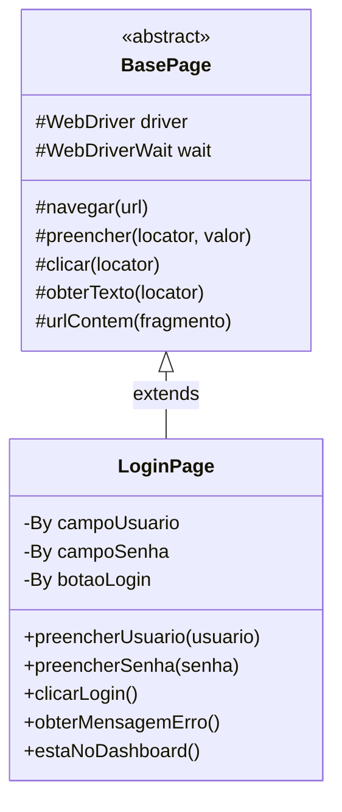

### Boas Práticas

- Use `abstract` para impedir instanciação direta
- Use `protected` para métodos destinados apenas às subclasses
- Use `final` nos atributos para imutabilidade
- Mantenha a BasePage enxuta (máximo 10-15 métodos)
- Timeout sempre vindo de configuração, nunca hardcoded

### Erros Mais Comuns

| Erro | Solução |
|------|---------|
| Timeout hardcoded `new WebDriverWait(driver, 10)` | Ler do config.properties |
| Métodos `public` na BasePage | Usar `protected` |
| Não chamar `super(driver)` no construtor filho | Compilação falha |
| BasePage muito grande | Extrair mixins ou classes utilitárias |

### Como Validar se a Implementação Está Correta

- BasePage é `abstract` (não é possível `new BasePage()`)
- Todos os métodos são `protected` (não aparecem fora do pacote pages)
- O timeout é lido de config.properties
- LoginPage compila e funciona chamando métodos herdados

### Próximos Passos

No próximo capítulo, configuraremos o Selenium WebDriver e entenderemos como ele se comunica com o navegador.

---

## Capítulo 13 - Configuração do Selenium WebDriver

### Objetivo do Capítulo

Entender como o Selenium WebDriver funciona, como ele se comunica com o navegador e como configurá-lo corretamente.

### Conceitos Fundamentais

**Selenium WebDriver** é uma API que permite controlar navegadores programaticamente. O fluxo é:

```
Código Java → WebDriver API → ChromeDriver (executável) → Chrome (navegador)
```

**Componentes:**
- **WebDriver** — interface Java que define os comandos (get, findElement, click...)
- **ChromeDriver** — implementação específica para Google Chrome
- **ChromeDriver.exe** — executável que traduz comandos WebDriver em chamadas para o Chrome
- **Chrome** — o navegador que efetivamente renderiza as páginas

**ChromeOptions** permite configurar o comportamento do navegador:
- `--headless` — executa sem interface gráfica (para CI)
- `--start-maximized` — abre maximizado
- `--no-sandbox` — necessário em containers Linux
- `--disable-dev-shm-usage` — evita problemas de memória em Docker

### Problema que Será Resolvido

Sem configuração adequada:
- ChromeDriver não encontrado (path incorreto)
- Versão incompatível entre Chrome e ChromeDriver
- Testes falham em CI por falta de modo headless
- Navegador não fecha após os testes

### Solução Adotada

Uma `DriverFactory` que:
- Detecta automaticamente se está em CI ou local
- Configura ChromeOptions adequadamente para cada ambiente
- Gerencia o path do ChromeDriver

### Justificativa da Escolha

- Chrome é o navegador mais estável para automação
- ChromeOptions permite configuração flexível
- Detecção automática de CI simplifica o pipeline
- Selenium 3.x com ChromeDriver é a combinação mais documentada

### Implementação Passo a Passo

```java
package support.webDriver;

import org.openqa.selenium.WebDriver;
import org.openqa.selenium.chrome.ChromeDriver;
import org.openqa.selenium.chrome.ChromeOptions;

/**
 * Fábrica de WebDriver.
 * Inicializa o navegador de acordo com o ambiente (local ou CI).
 */
public class DriverFactory {

    // Detecta se estamos em ambiente de CI
    // GitHub Actions define CI=true, Jenkins define JENKINS_URL
    private static final boolean EM_CI =
            System.getenv("CI") != null || System.getenv("JENKINS_URL") != null;

    /**
     * Cria uma instância de WebDriver baseada no nome do navegador.
     * @param browserName nome do navegador (ex: "chrome")
     * @return WebDriver configurado
     */
    public WebDriver init_driver(String browserName) {
        switch (browserName.toLowerCase()) {
            case "chrome":
                return criarChrome();
            default:
                throw new IllegalArgumentException(
                    "Navegador nao suportado: " + browserName
                );
        }
    }

    /**
     * Cria ChromeDriver com opções adequadas ao ambiente.
     */
    private WebDriver criarChrome() {
        // Em ambiente local, precisa definir o path do chromedriver
        if (!EM_CI) {
            String path = System.getenv("CHROME_DRIVER_PATH") != null
                    ? System.getenv("CHROME_DRIVER_PATH")
                    : "C:\\chromedriver\\chromedriver-win64\\chromedriver.exe";
            System.setProperty("webdriver.chrome.driver", path);
        }
        // Em CI, o chromedriver já está no PATH (configurado no workflow)

        ChromeOptions options = new ChromeOptions();

        if (EM_CI) {
            // CI: sem interface gráfica, tamanho fixo
            options.addArguments(
                "--headless=new",           // Modo headless moderno
                "--no-sandbox",             // Necessário em containers
                "--disable-dev-shm-usage",  // Evita problemas de memória
                "--window-size=1920,1080"   // Resolução fixa para screenshots
            );
        } else {
            // Local: maximizado para o desenvolvedor ver
            options.addArguments("--start-maximized");
        }

        // Opções comuns para ambos os ambientes
        options.addArguments(
            "--disable-notifications",   // Bloqueia popups de notificação
            "--remote-allow-origins=*"   // Permite conexões cross-origin
        );

        return new ChromeDriver(options);
    }
}
```

### Estrutura de Arquivos Criada

```
src/test/java/support/webDriver/
└── DriverFactory.java
```

### Código de Exemplo Comentado

```java
// Como a DriverFactory é utilizada pelo WebHooks:
DriverFactory driverFactory = new DriverFactory();
WebDriver driver = driverFactory.init_driver("chrome");

// O driver está pronto para uso
driver.get("https://site.com");
driver.findElement(By.name("username")).sendKeys("admin");
// ...
driver.quit();  // IMPORTANTE: sempre fechar ao final
```

### Fluxo de Execução

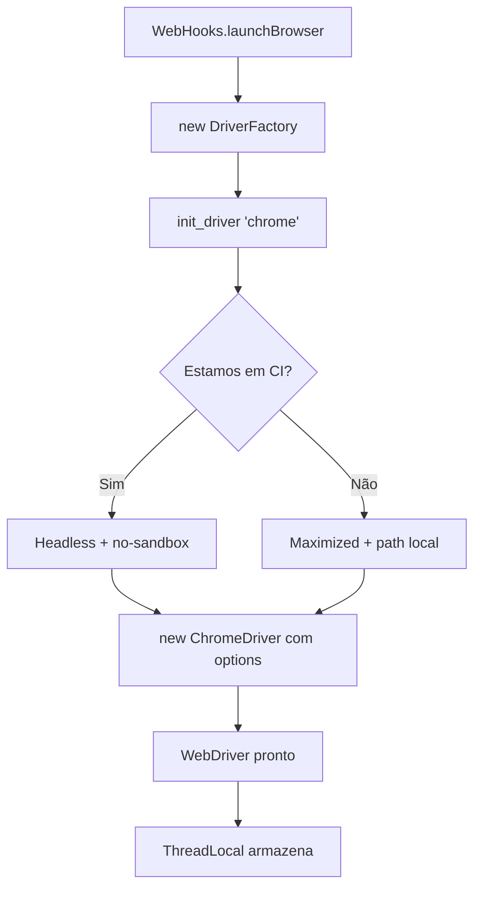

### Boas Práticas

- Sempre detecte o ambiente automaticamente (nunca force headless manualmente)
- Use `--window-size` no CI para screenshots consistentes
- Feche o driver em `@After` (nunca deixe navegadores abertos)
- Considere variável de ambiente para o path do driver

### Erros Mais Comuns

| Erro | Solução |
|------|---------|
| `WebDriverException: chromedriver not found` | Verificar path e System.setProperty |
| `SessionNotCreatedException: version mismatch` | Atualizar chromedriver para versão do Chrome |
| Screenshots pretos no CI | Adicionar `--window-size=1920,1080` |
| `DevToolsActivePort` error | Adicionar `--no-sandbox` |

### Como Validar se a Implementação Está Correta

- Em ambiente local: navegador abre maximizado e é controlável
- Em CI: testes executam sem erro de "display not found"
- Screenshots no CI têm resolução 1920x1080
- Após os testes, nenhum processo `chrome` fica rodando

### Próximos Passos

No próximo capítulo, veremos como gerenciar o ciclo de vida do driver com ThreadLocal e Hooks.

---

## Capítulo 14 - Criação do Gerenciamento de Drivers

### Objetivo do Capítulo

Implementar o gerenciamento do ciclo de vida do WebDriver usando Hooks do Cucumber e ThreadLocal para garantir isolamento entre cenários.

### Conceitos Fundamentais

**ThreadLocal** é um mecanismo Java que mantém uma cópia da variável para cada thread. Em automação de testes, garante que cada cenário tenha sua própria instância do WebDriver, evitando conflitos em execução paralela.

**Hooks do Cucumber** são métodos executados antes (`@Before`) e depois (`@After`) de cada cenário:
- `@Before` — setup (abrir navegador, configurar)
- `@After` — teardown (capturar evidências, fechar navegador)

**Order** define a sequência de execução quando há múltiplos hooks:
- `order = 0` — executa primeiro
- `order = 1` — executa segundo

### Problema que Será Resolvido

Sem gerenciamento adequado:
- Navegadores não fecham após testes falharem
- Execução paralela causa interferência entre testes
- Screenshots não são capturadas em caso de falha
- Memory leaks por drivers não encerrados

### Solução Adotada

A classe `WebHooks` que:
1. Cria o driver antes de cada cenário (@Before)
2. Armazena em ThreadLocal para segurança em paralelo
3. Captura screenshot após cada cenário (@After)
4. Fecha o navegador e limpa a referência

### Justificativa da Escolha

- ThreadLocal garante isolamento entre threads
- Hooks do Cucumber se integram naturalmente ao ciclo BDD
- A tag `@ui` permite que hooks de UI não afetem testes de API
- Order permite controlar a sequência de inicialização

### Implementação Passo a Passo

```java
package support.hooks;

import io.cucumber.java.After;
import io.cucumber.java.Before;
import io.cucumber.java.Scenario;
import org.openqa.selenium.OutputType;
import org.openqa.selenium.TakesScreenshot;
import org.openqa.selenium.WebDriver;
import support.environment.Environment;
import support.helpers.LogUtils;
import support.webDriver.DriverFactory;

import java.util.Properties;
import java.util.concurrent.TimeUnit;

/**
 * Hooks para cenários Web (@ui).
 * Gerencia o ciclo de vida do WebDriver.
 * 
 * Ciclo de vida:
 * 1. @Before(order=0): Log do cenário
 * 2. @Before(order=1): Cria/reutiliza driver
 * 3. [Execução dos steps]
 * 4. @After: Screenshot + quit
 */
public class WebHooks {

    private DriverFactory driverFactory;
    // ThreadLocal garante que cada thread tem seu próprio driver
    private static ThreadLocal<WebDriver> driver = new ThreadLocal<>();
    private Environment env;
    private Scenario scenario;

    public WebHooks() {
        env = new Environment();
    }

    /**
     * Hook executado PRIMEIRO — registra o cenário.
     * value="@ui" garante que só executa para cenários com tag @ui.
     */
    @Before(value = "@ui", order = 0)
    public void getProperty(Scenario scenario) {
        this.scenario = scenario;
        LogUtils.printMessage("Iniciando cenario: " + scenario.getName());
    }

    /**
     * Hook executado SEGUNDO — cria o WebDriver.
     * Verifica se já existe um driver ativo (reutilização).
     */
    @Before(value = "@ui", order = 1)
    public void launchBrowser() {
        if (getDriver() == null) {
            LogUtils.printMessage("Driver nao inicializado, criando nova instancia...");
            
            // Determina qual navegador usar
            Properties properties = System.getProperties();
            String browserName = properties.getProperty("browser");
            boolean forceBrowser = Boolean.parseBoolean(env.getProperty("forceBrowser"));

            if (browserName == null || forceBrowser) {
                browserName = env.getProperty("browser");
            }

            // Lê timeouts do config.properties
            int implicitTimeout = Integer.parseInt(env.getProperty("timeout.implicit"));
            int pageLoadTimeout = Integer.parseInt(env.getProperty("timeout.pageLoad"));

            // Cria o driver via Factory
            driverFactory = new DriverFactory();
            driver.set(driverFactory.init_driver(browserName));
            
            // Configura timeouts globais
            getDriver().manage().timeouts()
                .implicitlyWait(implicitTimeout, TimeUnit.SECONDS);
            getDriver().manage().timeouts()
                .pageLoadTimeout(pageLoadTimeout, TimeUnit.SECONDS);
        } else {
            LogUtils.printMessage("Driver inicializado, reutilizando instancia...");
        }
    }

    /**
     * Hook executado APÓS cada cenário @ui.
     * Responsabilidades:
     * 1. Capturar screenshot (sucesso ou falha)
     * 2. Anexar evidência ao relatório Cucumber/Allure
     * 3. Fechar o navegador
     * 4. Limpar o ThreadLocal
     */
    @After(value = "@ui")
    public void tearDown(Scenario scenario) {
        WebDriver d = getDriver();
        if (d == null) return;

        // Captura screenshot se o driver suporta
        if (d instanceof TakesScreenshot) {
            byte[] screenshot = ((TakesScreenshot) d).getScreenshotAs(OutputType.BYTES);
            String status = scenario.isFailed() ? "FALHA" : "SUCESSO";
            // attach() adiciona ao relatório Cucumber e Allure automaticamente
            scenario.attach(screenshot, "image/png", 
                status + " - " + scenario.getName());
            LogUtils.printMessage("Screenshot [" + status + "]: " + scenario.getName());
        }

        // Fecha o navegador
        d.quit();
        // Remove a referência do ThreadLocal (evita memory leak)
        driver.remove();
        LogUtils.printMessage("Navegador encerrado.");
    }

    /**
     * Método estático para que Steps e Pages acessem o driver.
     * É o ponto de acesso único ao WebDriver ativo.
     */
    public static WebDriver getDriver() {
        return driver.get();
    }
}
```

### Estrutura de Arquivos Criada

```
src/test/java/support/hooks/
├── WebHooks.java     # Ciclo de vida para testes UI
└── ApiHooks.java     # Ciclo de vida para testes API
```

### Código de Exemplo Comentado

```java
// Como os Steps acessam o driver:
public class LoginSteps {
    @Dado("que estou na página de login")
    public void abrirLogin() {
        // Obtém o driver do ThreadLocal via WebHooks
        loginPage = new LoginPage(WebHooks.getDriver());
        loginPage.abrirPagina(env.baseUrl);
    }
}

// ApiHooks — mais simples, sem driver
public class ApiHooks {
    @Before(value = "@api", order = 0)
    public void setupApi(Scenario scenario) {
        LogUtils.printMessage("Iniciando cenario API: " + scenario.getName());
    }
}
```

### Fluxo de Execução

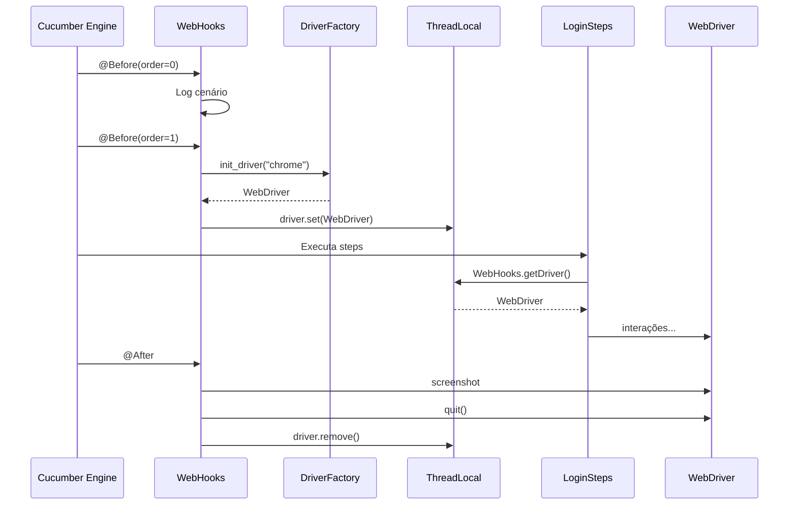

### Boas Práticas

- Sempre use `driver.remove()` após `quit()` para evitar memory leak
- A tag no hook (`@ui`) evita que testes de API abram navegador
- Capture screenshot ANTES de fazer `quit()`
- Use `order` para garantir sequência de inicialização

### Erros Mais Comuns

| Erro | Solução |
|------|---------|
| `NullPointerException` ao acessar driver | Verificar se @Before executou (tag correta?) |
| Navegador não fecha após falha | Garantir que @After executa com `if (d == null) return` |
| Screenshots em branco | Capturar antes do `quit()` |
| Memory leak de ThreadLocal | Sempre chamar `driver.remove()` |

### Como Validar se a Implementação Está Correta

- Executar um cenário @ui: navegador abre e fecha
- Executar um cenário @api: nenhum navegador abre
- Forçar falha em um teste: screenshot aparece no relatório
- Verificar no Task Manager: nenhum chrome.exe fica pendente após os testes

### Próximos Passos

No próximo capítulo, configuraremos o Cucumber para entender cenários escritos em português.

---

## Capítulo 15 - Configuração do Cucumber

### Objetivo do Capítulo

Configurar o Cucumber como motor BDD do framework, explicando o Runner, as opções de configuração e a integração com JUnit.

### Conceitos Fundamentais

**Cucumber** é um framework BDD (Behavior-Driven Development) que:

1. Lê arquivos `.feature` escritos em linguagem natural (Gherkin)
2. Mapeia cada passo para um método Java (Step Definition)
3. Executa os métodos na ordem definida no cenário
4. Reporta resultados em múltiplos formatos

**Gherkin** é a linguagem usada para escrever cenários. Suporta múltiplos idiomas, incluindo português:
- `Funcionalidade` → Feature
- `Cenário` → Scenario
- `Dado` → Given
- `Quando` → When
- `Então` → Then
- `E` → And

**Runner** é a classe que configura e dispara a execução do Cucumber via JUnit.

### Problema que Será Resolvido

Sem configuração adequada do Runner:
- Cucumber não encontra as features
- Steps não são mapeados
- Relatórios não são gerados
- Hooks não são executados

### Solução Adotada

Um Runner centralizado com @CucumberOptions definindo:
- Onde estão as features
- Onde estão os steps e hooks (glue)
- Quais plugins de relatório usar

### Justificativa da Escolha

- `@RunWith(Cucumber.class)` integra Cucumber com JUnit
- Maven Surefire reconhece e executa a classe
- CucumberOptions centraliza toda a configuração em um lugar
- Plugins geram múltiplos formatos de relatório simultaneamente

### Implementação Passo a Passo

```java
import io.cucumber.junit.Cucumber;
import io.cucumber.junit.CucumberOptions;
import org.junit.runner.RunWith;

/**
 * Runner principal do Cucumber.
 * 
 * Esta classe NÃO contém lógica — é apenas configuração.
 * O JUnit a executa, e o Cucumber assume o controle.
 * 
 * Comandos de execução:
 *   mvn test                                    → todos os cenários
 *   mvn test -Dcucumber.filter.tags="@smoke"    → suite smoke
 *   mvn test -Dcucumber.filter.tags="@api"      → apenas API
 *   mvn test -Dcucumber.filter.tags="@ui"       → apenas UI
 *   mvn test -Denvironment=HQA                  → ambiente HQA
 * 
 * Relatório Allure:
 *   mvn allure:serve    → abre no navegador
 *   mvn allure:report   → gera em target/site/allure-maven-plugin
 */
@RunWith(Cucumber.class)
@CucumberOptions(
    // Caminho para os arquivos .feature
    features = "src/test/resources/features",
    
    // Pacotes onde o Cucumber procura Steps e Hooks
    // "steps" → LoginSteps, ApiPostsSteps
    // "support.hooks" → WebHooks, ApiHooks
    glue = {"steps", "support.hooks"},
    
    // Plugins de relatório (todos executam simultaneamente)
    plugin = {
        "pretty",                                          // Log colorido no console
        "html:target/cucumber-reports/cucumber.html",      // Relatório HTML
        "json:target/cucumber-reports/cucumber.json",      // JSON (para ferramentas)
        "junit:target/cucumber-reports/cucumber.xml",      // JUnit XML (para CI)
        "io.qameta.allure.cucumber7jvm.AllureCucumber7Jvm" // Allure Report
    },
    
    // monochrome = true → saída sem códigos de cor (melhor para logs de CI)
    monochrome = true
)
public class Runner {
    // Classe vazia — toda a configuração está nas anotações
}
```

### Estrutura de Arquivos Criada

```
src/test/java/
└── Runner.java
```

### Código de Exemplo Comentado

Detalhamento de cada opção do @CucumberOptions:

```java
@CucumberOptions(
    // features: caminho relativo ao diretório do projeto
    // Pode ser uma pasta (todas as .feature) ou arquivo específico
    features = "src/test/resources/features",
    
    // glue: pacotes Java onde o Cucumber busca Step Definitions e Hooks
    // IMPORTANTE: deve incluir o pacote dos Hooks para @Before/@After funcionar
    glue = {"steps", "support.hooks"},
    
    // plugin: geradores de relatório
    plugin = {
        // "pretty" — imprime os steps coloridos no terminal
        "pretty",
        // "html:path" — gera relatório HTML estático
        "html:target/cucumber-reports/cucumber.html",
        // "json:path" — gera JSON consumível por outras ferramentas
        "json:target/cucumber-reports/cucumber.json",
        // "junit:path" — gera XML JUnit (GitHub Actions usa para sumário)
        "junit:target/cucumber-reports/cucumber.xml",
        // Plugin do Allure — gera dados para Allure Report
        "io.qameta.allure.cucumber7jvm.AllureCucumber7Jvm"
    },
    
    // monochrome: remove códigos ANSI de cor (útil para CI)
    monochrome = true
    
    // Opções adicionais disponíveis (não usadas aqui):
    // tags = "@smoke" — filtra cenários por tag
    // dryRun = true — verifica mapeamento sem executar
    // strict = true — falha em steps pendentes
)
```

### Fluxo de Execução

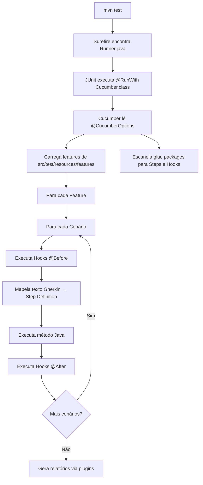

### Boas Práticas

- Mantenha apenas UM Runner no projeto
- Use tags para filtrar execução, não múltiplos Runners
- Inclua plugin JUnit XML para integração com CI
- Use `monochrome = true` para CI, `false` para desenvolvimento local

### Erros Mais Comuns

| Erro | Solução |
|------|---------|
| `No features found` | Verificar path em `features` |
| `Undefined step` | Verificar se pacote está no `glue` |
| Hooks não executam | Adicionar pacote dos hooks no `glue` |
| `No tests were found` | Verificar nome da classe no Surefire `<include>` |

### Como Validar se a Implementação Está Correta

```bash
# Deve listar todos os cenários sem executar
mvn test -Dcucumber.features="src/test/resources/features" -DdryRun=true

# Deve gerar relatórios em target/cucumber-reports/
mvn test
ls target/cucumber-reports/
```

### Próximos Passos

No próximo capítulo, escreveremos cenários BDD completos em português usando a sintaxe Gherkin.

---

## Capítulo 16 - Escrita de Cenários BDD em Português

### Objetivo do Capítulo

Escrever cenários de teste em português usando a sintaxe Gherkin, demonstrando funcionalidades como Contexto, Esquema do Cenário e tags.

### Conceitos Fundamentais

**Gherkin** suporta português nativamente com a diretiva `# language: pt`. As palavras-chave são:

| Inglês | Português | Função |
|--------|-----------|--------|
| Feature | Funcionalidade | Agrupa cenários relacionados |
| Scenario | Cenário | Um caso de teste individual |
| Given | Dado | Pré-condição |
| When | Quando | Ação do usuário |
| Then | Então | Verificação esperada |
| And | E | Continuação do passo anterior |
| Background | Contexto | Steps comuns a todos os cenários |
| Scenario Outline | Esquema do Cenário | Cenário parametrizado |
| Examples | Exemplos | Dados para o Esquema |

**Tags** classificam cenários para filtrar execução:
- `@ui` — testes de interface
- `@api` — testes de API
- `@smoke` — testes rápidos de sanidade

### Problema que Será Resolvido

Cenários escritos em código são incompreensíveis para POs, analistas e gestores. BDD em português permite que toda a equipe entenda e contribua com os cenários de teste.

### Solução Adotada

Escrever features completas em português com:
- Narrativa explicando o valor de negócio
- Contexto para evitar repetição
- Tags para organização e filtro
- Esquema do Cenário para testes data-driven

### Justificativa da Escolha

- Português remove barreira de idioma
- BDD serve como documentação viva do sistema
- Tags permitem execução seletiva (smoke, regressão, etc.)
- Esquema do Cenário evita duplicação de cenários similares

### Implementação Passo a Passo

#### Feature de Login (UI):

```gherkin
# language: pt
@ui
Funcionalidade: Login no sistema
  Como um usuário registrado
  Quero fazer login na aplicação
  Para acessar as funcionalidades do sistema

  Contexto:
    Dado que estou na página de login

  @smoke
  Cenário: Login com credenciais válidas
    Quando faço login como administrador
    Então devo ser redirecionado para a página inicial

  Cenário: Login com senha incorreta
    Quando faço login com usuário "admin" e senha incorreta
    Então devo ver a mensagem de erro "Invalid credentials"

  Esquema do Cenário: Login com credenciais inválidas
    Quando faço login com usuário "<usuario>" e senha "<senha>"
    Então devo ver a mensagem de erro "<mensagem>"

    Exemplos:
      | usuario       | senha      | mensagem            |
      | usuarioErrado | admin123   | Invalid credentials |
      | wronguser     | wrongpass  | Invalid credentials |
```

#### Feature de API (REST):

```gherkin
# language: pt
@api
Funcionalidade: API de Posts
  Como consumidor da API REST
  Quero validar os endpoints de posts
  Para garantir que a API responde corretamente

  Contexto:
    Dado que estou consumindo a API de posts

  @smoke
  Cenário: Listar todos os posts
    Quando busco todos os posts
    Então o status code da resposta deve ser 200
    E o Content-Type da resposta deve conter "application/json"
    E a resposta deve conter 100 posts

  @smoke
  Cenário: Buscar um post por ID
    Quando busco o post de ID 1
    Então o status code da resposta deve ser 200
    E o campo "userId" deve ter valor inteiro 1
    E o campo "id" deve ter valor inteiro 1
    E o campo "title" não deve estar vazio
    E o campo "body" não deve estar vazio

  Cenário: Criar um novo post
    Dado que tenho os dados de um novo post
    Quando envio o novo post
    Então o status code da resposta deve ser 201
    E o campo "title" deve ter valor de texto "Post de Teste Automatizado"
    E o campo "userId" deve ter valor inteiro 1
    E o campo "id" não deve estar vazio

  Cenário: Atualizar um post existente
    Dado que tenho os dados de atualização do post 1
    Quando atualizo o post 1
    Então o status code da resposta deve ser 200
    E o campo "title" deve ter valor de texto "Titulo Atualizado"

  Cenário: Deletar um post
    Quando deleto o post 1
    Então o status code da resposta deve ser 200

  Cenário: Buscar post inexistente retorna 404
    Quando busco o post de ID 9999
    Então o status code da resposta deve ser 404

  @smoke
  Cenário: Validar contrato (schema) do post
    Quando busco o post de ID 1
    Então o status code da resposta deve ser 200
    E a resposta deve estar de acordo com o schema "post-schema.json"
```

### Estrutura de Arquivos Criada

```
src/test/resources/features/
├── login.feature        # Cenários de UI
└── api_posts.feature    # Cenários de API
```

### Código de Exemplo Comentado

```gherkin
# language: pt                     ← Define idioma português
@ui                                ← Tag para filtro (todos cenários herdam)
Funcionalidade: Login no sistema   ← Título da funcionalidade
  Como um usuário registrado       ← WHO (quem se beneficia)
  Quero fazer login na aplicação   ← WHAT (o que quer fazer)
  Para acessar as funcionalidades  ← WHY (por que é importante)

  Contexto:                        ← Executado ANTES de cada cenário
    Dado que estou na página de login

  @smoke                           ← Tag adicional (cenário tem @ui E @smoke)
  Cenário: Login com credenciais válidas
    Quando faço login como administrador       ← Ação
    Então devo ser redirecionado para a página ← Verificação

  Esquema do Cenário: Login inválido  ← Template parametrizado
    Quando faço login com "<user>" e "<pass>"
    Então devo ver "<msg>"

    Exemplos:                      ← Tabela de dados (N linhas = N execuções)
      | user  | pass  | msg            |
      | wrong | wrong | Invalid creds  |
```

### Fluxo de Execução

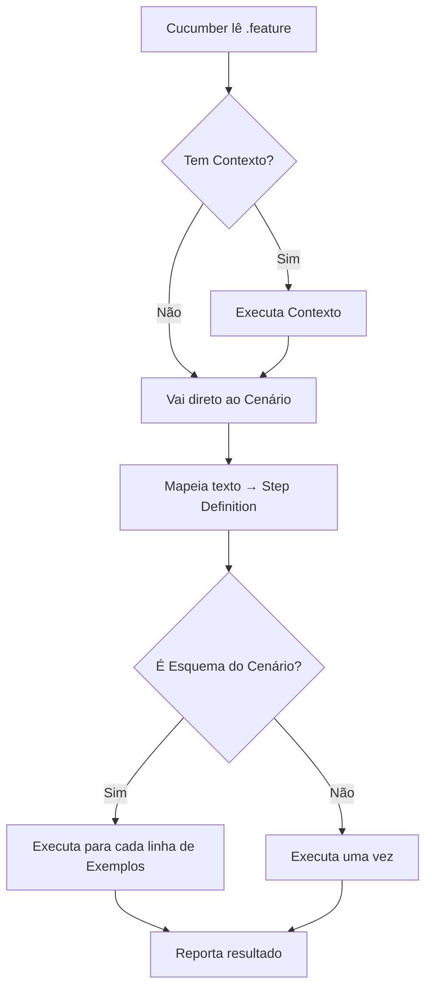

### Boas Práticas

- Use a narrativa (Como/Quero/Para) para documentar o valor de negócio
- Mantenha cenários curtos (3-7 passos)
- Use Contexto para passos repetidos em TODOS os cenários da feature
- Use Esquema do Cenário para testar múltiplas combinações
- Tags devem ser significativas (`@smoke`, `@regressao`, `@api`)
- Um arquivo .feature por funcionalidade

### Erros Mais Comuns

| Erro | Solução |
|------|---------|
| `# language: pt` esquecido | Cucumber tenta mapear em inglês |
| Contexto com step específico | Contexto deve ser comum a TODOS os cenários |
| Cenário com 15+ passos | Dividir em cenários menores |
| Tags sem significado | `@test1` → `@smoke` |

### Como Validar se a Implementação Está Correta

- A feature abre sem erros de sintaxe na IDE
- `# language: pt` está na primeira linha
- Tags estão aplicadas corretamente
- Esquema do Cenário tem tabela de Exemplos
- Cenários são compreensíveis por um não-técnico

### Próximos Passos

No próximo capítulo, criaremos as Step Definitions que conectam o texto Gherkin ao código Java.

---

## Capítulo 17 - Implementação das Step Definitions

### Objetivo do Capítulo

Criar as classes de Step Definitions que traduzem os passos escritos em Gherkin para código Java executável.

### Conceitos Fundamentais

**Step Definitions** são métodos Java anotados com `@Dado`, `@Quando`, `@Então` ou `@E` que o Cucumber mapeia a partir do texto do cenário.

O mapeamento funciona por:
- **Texto exato** — `"que estou na página de login"`
- **Expressões Cucumber** — `{string}`, `{int}` capturam valores
- **Regex** (avançado) — para padrões complexos

**Regras de mapeamento:**
- Cada texto do .feature DEVE ter exatamente UM step definition correspondente
- O mesmo step definition pode ser usado por múltiplas features
- Parâmetros `{string}` capturam texto entre aspas
- Parâmetros `{int}` capturam números inteiros

### Problema que Será Resolvido

Sem Step Definitions:
- Cucumber não sabe o que executar quando encontra um passo
- Features ficam como documentação morta (não executável)
- Não há conexão entre negócio (BDD) e código (Java)

### Solução Adotada

Criar duas classes de Steps:
- `LoginSteps` — para cenários de UI (@ui)
- `ApiPostsSteps` — para cenários de API (@api)

### Justificativa da Escolha

- Uma classe de Steps por Feature mantém organização
- Steps delegam para Pages/Services (não contêm lógica de interação)
- Assertions ficam nos Steps (não nas Pages/Services)
- Parâmetros Cucumber permitem reutilização de steps

### Implementação Passo a Passo

#### LoginSteps (UI):

```java
package steps;

import io.cucumber.java.pt.Dado;
import io.cucumber.java.pt.Então;
import io.cucumber.java.pt.Quando;
import org.junit.Assert;
import pages.LoginPage;
import support.environment.Environment;
import support.hooks.WebHooks;

/**
 * Steps de Login.
 * 
 * Responsabilidades:
 * - Traduzir Gherkin → chamadas para LoginPage
 * - Fazer assertions (verificar resultados)
 * - Orquestrar o fluxo do cenário
 * 
 * NÃO deve:
 * - Interagir diretamente com WebDriver
 * - Conhecer seletores CSS/XPath
 * - Conter lógica complexa (>10 linhas por método)
 */
public class LoginSteps {

    private LoginPage loginPage;
    private Environment env = new Environment();

    @Dado("que estou na página de login")
    public void abrirLogin() {
        // Obtém driver do Hook e cria a Page
        loginPage = new LoginPage(WebHooks.getDriver());
        loginPage.abrirPagina(env.baseUrl);
    }

    @Quando("faço login como administrador")
    public void loginAdmin() {
        // Credenciais vêm do config.properties (nunca hardcoded)
        loginPage.preencherUsuario(env.getProperty("usuario.admin"));
        loginPage.preencherSenha(env.getProperty("senha.admin"));
        loginPage.clicarLogin();
    }

    @Quando("faço login com usuário {string} e senha {string}")
    public void loginComCredenciais(String usuario, String senha) {
        // {string} captura valores entre aspas do .feature
        loginPage.preencherUsuario(usuario);
        loginPage.preencherSenha(senha);
        loginPage.clicarLogin();
    }

    @Quando("faço login com usuário {string} e senha incorreta")
    public void loginComSenhaIncorreta(String usuario) {
        loginPage.preencherUsuario(usuario);
        loginPage.preencherSenha(env.getProperty("senha.invalida"));
        loginPage.clicarLogin();
    }

    @Então("devo ser redirecionado para a página inicial")
    public void validarDashboard() {
        // Assert fica no Step — Page apenas retorna boolean
        Assert.assertTrue(
            "Nao redirecionou para o dashboard",
            loginPage.estaNoDashboard()
        );
    }

    @Então("devo ver a mensagem de erro {string}")
    public void validarMensagemErro(String esperada) {
        Assert.assertEquals(
            "Mensagem incorreta",
            esperada,
            loginPage.obterMensagemErro()
        );
    }
}
```

#### ApiPostsSteps (API):

```java
package steps;

import io.cucumber.java.pt.Dado;
import io.cucumber.java.pt.E;
import io.cucumber.java.pt.Então;
import io.cucumber.java.pt.Quando;
import org.junit.Assert;
import services.PostService;
import support.communication.RestApi;
import support.environment.Environment;

import java.util.List;

/**
 * Steps de API de Posts.
 * Delega chamadas HTTP para PostService.
 * Assertions verificam response via RestApi.
 */
public class ApiPostsSteps {

    private final Environment env = new Environment();
    private final RestApi restApi = new RestApi();
    private final PostService postService = new PostService(restApi);

    @Dado("que estou consumindo a API de posts")
    public void configurarApi() {
        restApi.setBaseUri(env.apiBasePath);
    }

    @Quando("busco todos os posts")
    public void getTodos() {
        postService.listarTodos();
    }

    @Quando("busco o post de ID {int}")
    public void getPorId(int id) {
        postService.buscarPorId(id);
    }

    @Então("o status code da resposta deve ser {int}")
    public void validarStatus(int esperado) {
        Assert.assertEquals("Status incorreto",
            esperado, restApi.getStatusCode());
    }

    @E("o campo {string} deve ter valor inteiro {int}")
    public void validarCampoInt(String campo, int esperado) {
        Assert.assertEquals("Campo '" + campo + "' incorreto",
            esperado, restApi.getResponse().jsonPath().getInt(campo));
    }

    @E("a resposta deve estar de acordo com o schema {string}")
    public void validarSchema(String schemaFile) {
        restApi.getResponse().then()
            .assertThat()
            .body(io.restassured.module.jsv.JsonSchemaValidator
                .matchesJsonSchemaInClasspath("schemas/" + schemaFile));
    }
}
```

### Estrutura de Arquivos Criada

```
src/test/java/steps/
├── LoginSteps.java       # Steps para cenários @ui
└── ApiPostsSteps.java    # Steps para cenários @api
```

### Código de Exemplo Comentado

```java
// Como o Cucumber mapeia texto → método:

// Feature: "faço login com usuário "admin" e senha "123""
//                                   ↓              ↓
@Quando("faço login com usuário {string} e senha {string}")
public void loginComCredenciais(String usuario, String senha) {
    // usuario = "admin", senha = "123" (capturados automaticamente)
    loginPage.preencherUsuario(usuario);
    loginPage.preencherSenha(senha);
    loginPage.clicarLogin();
}

// Feature: "o status code da resposta deve ser 200"
//                                              ↓
@Então("o status code da resposta deve ser {int}")
public void validarStatus(int esperado) {
    // esperado = 200 (convertido automaticamente para int)
    Assert.assertEquals(esperado, restApi.getStatusCode());
}
```

### Fluxo de Execução

```mermaid
flowchart LR
    A["Feature: 'faço login como administrador'"] --> B[Cucumber busca match]
    B --> C["@Quando('faço login como administrador')"]
    C --> D[loginAdmin executa]
    D --> E[loginPage.preencherUsuario]
    D --> F[loginPage.preencherSenha]
    D --> G[loginPage.clicarLogin]
```

### Boas Práticas

- Um Step Definition não deve ter mais de 10 linhas
- Use mensagens descritivas no Assert: `"Nao redirecionou para o dashboard"`
- Reutilize steps genéricos entre cenários
- Steps de validação genéricos (como `validarStatus`) servem para toda feature

### Erros Mais Comuns

| Erro | Solução |
|------|---------|
| `Duplicate step definitions` | Mesmo texto mapeado em 2 classes |
| `Undefined step` | Texto não casa com nenhum @Dado/@Quando/@Então |
| `CucumberExpression mismatch` | {string} precisa de aspas no .feature |
| Parâmetro null | Verificar se expressão está capturando corretamente |

### Como Validar se a Implementação Está Correta

- `mvn test` executa sem "Undefined step"
- Cada step do .feature tem um método correspondente
- Assertions produzem mensagens claras em caso de falha
- Steps são curtos e delegam para Pages/Services

### Próximos Passos

No próximo capítulo, veremos como as camadas Feature → Step → Page se integram em um fluxo completo.

---

## Capítulo 18 - Integração entre Features, Steps e Pages

### Objetivo do Capítulo

Demonstrar o fluxo completo de execução desde o arquivo .feature até a interação com o navegador, mostrando como as camadas se comunicam.

### Conceitos Fundamentais

A integração entre camadas segue um padrão de **delegação em cascata**:

1. **Feature** define O QUE testar (linguagem de negócio)
2. **Step** orquestra COMO executar (tradução para código)
3. **Page** encapsula ONDE interagir (abstração de UI)
4. **BasePage** fornece OS MECANISMOS (wait, find, click)

### Problema que Será Resolvido

Sem clareza na integração:
- Desenvolvedores não sabem onde colocar novo código
- Responsabilidades se misturam entre camadas
- Debugging de falhas fica difícil (qual camada falhou?)

### Solução Adotada

Fluxo padronizado e documentado com exemplos reais do projeto.

### Justificativa da Escolha

A delegação em cascata permite:
- Localizar rapidamente onde uma falha ocorreu
- Alterar uma camada sem impactar as outras
- Reutilizar componentes em diferentes contextos

### Implementação Passo a Passo

#### Exemplo completo: Login com credenciais válidas

**1. Feature (o que):**
```gherkin
Cenário: Login com credenciais válidas
  Dado que estou na página de login
  Quando faço login como administrador
  Então devo ser redirecionado para a página inicial
```

**2. Step (como):**
```java
@Dado("que estou na página de login")
public void abrirLogin() {
    loginPage = new LoginPage(WebHooks.getDriver());
    loginPage.abrirPagina(env.baseUrl);
}

@Quando("faço login como administrador")
public void loginAdmin() {
    loginPage.preencherUsuario(env.getProperty("usuario.admin"));
    loginPage.preencherSenha(env.getProperty("senha.admin"));
    loginPage.clicarLogin();
}

@Então("devo ser redirecionado para a página inicial")
public void validarDashboard() {
    Assert.assertTrue(loginPage.estaNoDashboard());
}
```

**3. Page (onde):**
```java
public void preencherUsuario(String usuario) {
    preencher(campoUsuario, usuario);  // delega para BasePage
}

public boolean estaNoDashboard() {
    return urlContem("/dashboard");  // delega para BasePage
}
```

**4. BasePage (mecanismo):**
```java
protected void preencher(By locator, String valor) {
    WebElement campo = wait.until(
        ExpectedConditions.visibilityOfElementLocated(locator));
    campo.clear();
    campo.sendKeys(valor);
}
```

### Estrutura de Arquivos Criada

Nenhum arquivo novo — este capítulo demonstra a integração dos existentes.

### Código de Exemplo Comentado

```java
// Trace completo de uma execução:
// 
// 1. Cucumber lê: "Quando faço login como administrador"
// 2. Encontra: @Quando("faço login como administrador") em LoginSteps
// 3. Executa loginAdmin():
//    3a. env.getProperty("usuario.admin") → "admin" (de config.properties)
//    3b. loginPage.preencherUsuario("admin")
//        → BasePage.preencher(By.name("username"), "admin")
//          → WebDriverWait espera elemento visível
//          → WebElement.clear()
//          → WebElement.sendKeys("admin")
//    3c. loginPage.preencherSenha("admin123")
//        → BasePage.preencher(By.name("password"), "admin123")
//    3d. loginPage.clicarLogin()
//        → BasePage.clicar(By.cssSelector("button[type='submit']"))
//          → WebDriverWait espera clicável
//          → WebElement.click()
// 4. Cucumber lê: "Então devo ser redirecionado para a página inicial"
// 5. Executa validarDashboard():
//    5a. loginPage.estaNoDashboard()
//        → BasePage.urlContem("/dashboard")
//          → WebDriverWait.until(urlContains("/dashboard"))
//          → retorna true/false
//    5b. Assert.assertTrue(resultado)
```

### Fluxo de Execução

```mermaid
sequenceDiagram
    participant F as Feature (.feature)
    participant C as Cucumber Engine
    participant S as LoginSteps
    participant E as Environment
    participant P as LoginPage
    participant B as BasePage
    participant W as WebDriverWait
    participant D as Chrome

    F->>C: "Dado que estou na página de login"
    C->>S: abrirLogin()
    S->>E: env.baseUrl
    E-->>S: "https://...login"
    S->>P: new LoginPage(driver)
    S->>P: abrirPagina(url)
    P->>B: navegar(url)
    B->>D: driver.get(url)
    
    F->>C: "Quando faço login como administrador"
    C->>S: loginAdmin()
    S->>E: getProperty("usuario.admin")
    E-->>S: "admin"
    S->>P: preencherUsuario("admin")
    P->>B: preencher(By.name("username"), "admin")
    B->>W: wait until visible
    W->>D: findElement + sendKeys
    
    F->>C: "Então devo ser redirecionado..."
    C->>S: validarDashboard()
    S->>P: estaNoDashboard()
    P->>B: urlContem("/dashboard")
    B->>W: wait until urlContains
    W-->>B: true
    B-->>P: true
    P-->>S: true
    S->>S: Assert.assertTrue(true) ✓
```

### Boas Práticas

- Mantenha cada camada fazendo apenas sua responsabilidade
- Se um Step tem mais de 10 linhas, extraia lógica para Page/Service
- Se uma Page faz Assert, mova para o Step
- Debugging: leia o stack trace de baixo para cima para encontrar a camada culpada

### Erros Mais Comuns

| Erro | Camada | Solução |
|------|--------|---------|
| Element not found | BasePage/Page | Verificar seletor |
| Timeout | BasePage | Aumentar timeout ou verificar carregamento |
| Assert failure | Step | Verificar lógica do teste |
| NullPointer no driver | Hook | Verificar se @Before executou |

### Como Validar se a Implementação Está Correta

- Executar o cenário completo sem erros
- Stack trace de erro aponta para a camada correta
- Alterar um seletor na Page não exige alterar Steps
- Alterar texto na Feature não exige alterar Pages

### Próximos Passos

No próximo capítulo, implementaremos a camada de Services para testes de API.

---

## Capítulo 19 - Implementação da Camada de Services para APIs

### Objetivo do Capítulo

Criar a camada de Services que encapsula as chamadas HTTP para endpoints da API, seguindo o mesmo princípio de abstração do Page Object para UI.

### Conceitos Fundamentais

**Service Object** é o equivalente do Page Object para APIs:

| Page Object (UI) | Service Object (API) |
|-------------------|---------------------|
| Encapsula seletores | Encapsula endpoints |
| Métodos: preencher, clicar | Métodos: get, post, put, delete |
| Esconde detalhes de WebDriver | Esconde detalhes de HTTP |
| LoginPage | PostService |

**Camada de Services:**
- Agrupa operações por recurso (Posts, Users, etc.)
- Conhece os endpoints e payloads
- Não faz assertions (responsabilidade do Step)
- Delega comunicação HTTP para RestApi

### Problema que Será Resolvido

Sem Services, os Steps ficam responsáveis por:
- Construir URLs de endpoint
- Carregar templates JSON
- Fazer substituições de valores
- Resultado: Steps gordos e difíceis de manter

### Solução Adotada

Criar `PostService` que:
- Recebe `RestApi` no construtor (injeção de dependência)
- Encapsula cada operação do endpoint /posts
- Carrega payloads via `JsonTemplate`
- Expõe métodos com nomes de negócio

### Justificativa da Escolha

- Injeção de dependência permite testar Services isoladamente
- Um Service por recurso da API mantém organização
- Payloads externalizados em JSON facilitam manutenção
- Steps ficam enxutos, apenas orquestrando

### Implementação Passo a Passo

```java
package services;

import support.communication.RestApi;
import support.helpers.JsonTemplate;

/**
 * Classe de serviço para o endpoint /posts.
 * Encapsula as chamadas de API relacionadas a Posts.
 * Os payloads JSON ficam em src/test/resources/template.api/.
 * 
 * Padrão: Um Service por recurso da API
 * - PostService → /posts
 * - UserService → /users (futuro)
 * - CommentService → /comments (futuro)
 */
public class PostService {

    // RestApi é injetado (não criado internamente)
    // Isso permite reutilizar a mesma instância entre chamadas
    private final RestApi restApi;

    public PostService(RestApi restApi) {
        this.restApi = restApi;
    }

    /**
     * GET /posts — lista todos os posts.
     */
    public void listarTodos() {
        restApi.get("/posts");
    }

    /**
     * GET /posts/{id} — busca um post específico.
     */
    public void buscarPorId(int id) {
        restApi.get("/posts/" + id);
    }

    /**
     * GET /posts?userId={userId} — filtra posts por usuário.
     */
    public void buscarPorUsuario(int userId) {
        restApi.get("/posts?userId=" + userId);
    }

    /**
     * POST /posts — cria um novo post.
     * O payload é carregado do arquivo POST_CriarPost.json
     */
    public void criarPost() {
        String body = JsonTemplate.load("POST_CriarPost.json");
        restApi.setBody(body);
        restApi.post("/posts");
    }

    /**
     * PUT /posts/{id} — atualiza um post existente.
     * O payload é carregado e o ID é substituído dinamicamente.
     */
    public void atualizarPost(int id) {
        String body = JsonTemplate.load("PUT_AtualizarPost.json")
                .replace("\"id\":1", "\"id\":" + id);
        restApi.setBody(body);
        restApi.put("/posts/" + id);
    }

    /**
     * DELETE /posts/{id} — remove um post.
     */
    public void deletarPost(int id) {
        restApi.delete("/posts/" + id);
    }
}
```

### Estrutura de Arquivos Criada

```
src/test/java/services/
└── PostService.java
```

### Código de Exemplo Comentado

```java
// Como o Step usa o Service:
public class ApiPostsSteps {
    private final RestApi restApi = new RestApi();
    // Service recebe RestApi — pode acessar response depois
    private final PostService postService = new PostService(restApi);

    @Quando("busco todos os posts")
    public void getTodos() {
        postService.listarTodos();  // Service faz o GET
    }

    @Então("o status code da resposta deve ser {int}")
    public void validarStatus(int esperado) {
        // Acessa response via restApi (compartilhado com Service)
        Assert.assertEquals(esperado, restApi.getStatusCode());
    }
}
```

### Fluxo de Execução

```mermaid
sequenceDiagram
    participant Step as ApiPostsSteps
    participant Service as PostService
    participant Template as JsonTemplate
    participant Rest as RestApi
    participant API as JSONPlaceholder

    Step->>Service: criarPost()
    Service->>Template: load("POST_CriarPost.json")
    Template-->>Service: {"title":"Post de Teste..."}
    Service->>Rest: setBody(json)
    Service->>Rest: post("/posts")
    Rest->>API: HTTP POST /posts
    API-->>Rest: 201 Created + body
    Step->>Rest: getStatusCode()
    Rest-->>Step: 201
    Step->>Step: Assert.assertEquals(201, 201) ✓
```

### Boas Práticas

- Um Service por recurso da API (PostService, UserService)
- Service NÃO faz assertions
- Payloads sempre externalizados em arquivos JSON
- Use injeção de dependência (não `new RestApi()` dentro do Service)

### Erros Mais Comuns

| Erro | Solução |
|------|---------|
| Service cria RestApi internamente | Injetar no construtor |
| Service faz Assert | Mover para Step |
| Payload hardcoded no Service | Externalizar em JsonTemplate |
| Endpoint com URL completa | Usar apenas o path ("/posts") |

### Como Validar se a Implementação Está Correta

- Service não importa JUnit/Assert
- Service não importa Cucumber annotations
- Service recebe RestApi via construtor
- Payloads vêm de arquivos externos
- Step consegue acessar a response via restApi compartilhado

### Próximos Passos

No próximo capítulo, configuraremos o REST Assured como cliente HTTP.

---

## Capítulo 20 - Configuração do REST Assured

### Objetivo do Capítulo

Implementar a classe `RestApi` que encapsula o REST Assured como cliente HTTP genérico, reutilizável por todos os Services.

### Conceitos Fundamentais

**REST Assured** é uma biblioteca Java para testar APIs REST com sintaxe fluente:

```java
// Sintaxe clássica REST Assured (Given-When-Then)
given()
    .contentType(ContentType.JSON)
    .body(payload)
.when()
    .post("/endpoint")
.then()
    .statusCode(201);
```

No nosso framework, encapsulamos o REST Assured em `RestApi` para:
- Centralizar configuração (baseURI, headers)
- Manter estado (request/response) entre chamadas
- Facilitar acesso aos dados da resposta

### Problema que Será Resolvido

Sem encapsulamento:
- Cada Service configuraria REST Assured independentemente
- Duplicação de código de configuração
- Difícil trocar a biblioteca no futuro
- Logs de request/response espalhados

### Solução Adotada

Uma classe `RestApi` que:
- Configura baseURI e headers padrão
- Mantém referências de request e response
- Fornece métodos para cada verbo HTTP
- Integra com LogUtils para rastreabilidade

### Justificativa da Escolha

- Encapsulamento permite trocar REST Assured por outra lib no futuro
- Estado mantido na instância permite verificações após a chamada
- Logs automáticos facilitam debugging
- Content-Type JSON como padrão (maioria dos casos)

### Implementação Passo a Passo

```java
package support.communication;

import io.restassured.RestAssured;
import io.restassured.http.ContentType;
import io.restassured.response.Response;
import io.restassured.specification.RequestSpecification;
import support.helpers.LogUtils;

import static io.restassured.RestAssured.given;

/**
 * Classe para comunicação REST.
 * Cada instância mantém seu próprio estado (request/response),
 * permitindo execução paralela sem conflitos.
 * 
 * Uso:
 *   RestApi api = new RestApi();
 *   api.setBaseUri("https://api.example.com");
 *   api.get("/posts");
 *   int status = api.getStatusCode(); // 200
 */
public class RestApi {

    private Response response;              // Resposta da última chamada
    private RequestSpecification request;   // Request em construção

    /**
     * Configura a URL base e inicializa o request com headers padrão.
     * Deve ser chamado ANTES de qualquer operação HTTP.
     */
    public void setBaseUri(String baseUri) {
        RestAssured.baseURI = baseUri;
        request = given()
                .contentType(ContentType.JSON)   // Envio: JSON
                .accept(ContentType.JSON);        // Aceita: JSON
    }

    /**
     * Define o corpo (body) do request.
     * Usado para POST e PUT.
     */
    public void setBody(String body) {
        request = request.body(body);
    }

    /**
     * Executa GET no endpoint e armazena a response.
     */
    public void get(String endpoint) {
        LogUtils.printMessage("GET " + RestAssured.baseURI + endpoint);
        response = request.when().get(endpoint).then().extract().response();
    }

    /**
     * Executa POST no endpoint e armazena a response.
     */
    public void post(String endpoint) {
        LogUtils.printMessage("POST " + RestAssured.baseURI + endpoint);
        response = request.when().post(endpoint).then().extract().response();
    }

    /**
     * Executa PUT no endpoint e armazena a response.
     */
    public void put(String endpoint) {
        LogUtils.printMessage("PUT " + RestAssured.baseURI + endpoint);
        response = request.when().put(endpoint).then().extract().response();
    }

    /**
     * Executa DELETE no endpoint e armazena a response.
     */
    public void delete(String endpoint) {
        LogUtils.printMessage("DELETE " + RestAssured.baseURI + endpoint);
        response = request.when().delete(endpoint).then().extract().response();
    }

    // --- Métodos de acesso à response ---

    public int getStatusCode() {
        return response.getStatusCode();
    }

    public String getContentType() {
        return response.getContentType();
    }

    public Response getResponse() {
        return response;
    }
}
```

### Estrutura de Arquivos Criada

```
src/test/java/support/communication/
└── RestApi.java
```

### Código de Exemplo Comentado

```java
// Fluxo completo de uso:

// 1. Step configura a API
RestApi restApi = new RestApi();
restApi.setBaseUri("https://jsonplaceholder.typicode.com");

// 2. Service faz a chamada
restApi.get("/posts/1");

// 3. Step verifica o resultado
int status = restApi.getStatusCode();        // 200
String title = restApi.getResponse()
    .jsonPath().getString("title");           // "sunt aut facere..."

// Para POST com body:
String json = "{\"title\":\"Novo\",\"body\":\"Texto\",\"userId\":1}";
restApi.setBody(json);
restApi.post("/posts");
int id = restApi.getResponse().jsonPath().getInt("id");  // 101
```

### Fluxo de Execução

```mermaid
flowchart TD
    A[Step: restApi.setBaseUri] --> B[RestAssured.baseURI configurado]
    B --> C[request = given + JSON headers]
    C --> D[Service: restApi.get '/posts']
    D --> E[Log: 'GET https://...']
    E --> F[request.when.get.then.extract.response]
    F --> G[Response armazenada]
    G --> H[Step: restApi.getStatusCode]
    H --> I[response.getStatusCode → 200]
```

### Boas Práticas

- Sempre log a requisição (verbo + URL) para debugging
- Mantenha response acessível para verificações posteriores
- Default Content-Type JSON (maioria dos casos de API REST)
- Uma instância de RestApi por cenário (evita estado compartilhado)

### Erros Mais Comuns

| Erro | Solução |
|------|---------|
| `NullPointerException` na response | Chamar setBaseUri antes de get/post |
| SSL Certificate error | Configurar trustStore ou `relaxedHTTPSValidation()` |
| Response body vazio | Verificar se endpoint retorna conteúdo |
| baseURI com barra no final | Remover barra: `"https://api.com"` não `"https://api.com/"` |

### Como Validar se a Implementação Está Correta

- GET para endpoint conhecido retorna status 200
- POST com body retorna status 201
- Logs mostram verbo + URL completa
- getResponse() retorna objeto não-nulo após chamada

### Próximos Passos

No próximo capítulo, criaremos payloads JSON externalizados para manter os dados de teste organizados.

---

## Capítulo 21 - Criação de Payloads JSON Externalizados

### Objetivo do Capítulo

Implementar a externalização de payloads JSON em arquivos separados e a classe `JsonTemplate` que os carrega dinamicamente.

### Conceitos Fundamentais

**Payload** é o corpo (body) de uma requisição HTTP. Em APIs REST com JSON:
- POST usa payload para enviar dados de criação
- PUT usa payload para enviar dados de atualização
- GET e DELETE geralmente não têm payload

**Externalização** significa tirar dados do código Java e colocá-los em arquivos separados:
- Facilita manutenção (alterar JSON sem recompilar)
- Permite que QAs não-desenvolvedores modifiquem dados
- Mantém o código Java limpo e focado em lógica

### Problema que Será Resolvido

Payloads hardcoded no código Java:
```java
// RUIM: payload misturado com lógica
String body = "{\"title\":\"Post\",\"body\":\"Conteudo\",\"userId\":1}";
```
Problemas:
- Difícil de ler e manter
- Escape de aspas polui o código
- Não é possível reutilizar em diferentes contextos
- Alteração requer recompilação

### Solução Adotada

1. Payloads em arquivos `.json` na pasta `template.api/`
2. Classe `JsonTemplate` com método `load()` para carregar
3. Substituição dinâmica de valores quando necessário

### Justificativa da Escolha

- Arquivos JSON são editáveis por qualquer ferramenta
- Classpath do Maven inclui `src/test/resources` automaticamente
- Scanner do Java lê o arquivo inteiro de forma eficiente
- Padrão de Template permite parametrização simples

### Implementação Passo a Passo

#### 1. Criar os arquivos de template:

**POST_CriarPost.json:**
```json
{
  "title": "Post de Teste Automatizado",
  "body": "Conteudo via REST Assured",
  "userId": 1
}
```

**PUT_AtualizarPost.json:**
```json
{
  "id": 1,
  "title": "Titulo Atualizado",
  "body": "Corpo atualizado",
  "userId": 1
}
```

#### 2. Implementar a classe JsonTemplate:

```java
package support.helpers;

import java.io.InputStream;
import java.util.Scanner;

/**
 * Lê arquivos JSON da pasta template.api no classpath.
 * Permite centralizar payloads de request em arquivos externos.
 * 
 * Convenção de nomes:
 * - VERBO_NomeOperacao.json
 * - Exemplos: POST_CriarPost.json, PUT_AtualizarPost.json
 */
public class JsonTemplate {

    // Construtor privado — classe utilitária com métodos estáticos
    private JsonTemplate() {}

    /**
     * Lê o conteúdo de um arquivo JSON em template.api/.
     * O arquivo deve estar em src/test/resources/template.api/
     * 
     * @param fileName nome do arquivo (ex: "POST_CriarPost.json")
     * @return conteúdo do arquivo como String
     * @throws RuntimeException se arquivo não encontrado
     */
    public static String load(String fileName) {
        // getResourceAsStream busca no classpath (src/test/resources)
        InputStream input = JsonTemplate.class.getClassLoader()
                .getResourceAsStream("template.api/" + fileName);
        
        if (input == null) {
            throw new RuntimeException(
                "Template nao encontrado: template.api/" + fileName);
        }
        
        // Scanner com delimiter \\A lê o stream inteiro de uma vez
        try (Scanner scanner = new Scanner(input, "UTF-8")) {
            return scanner.useDelimiter("\\A").next();
        }
    }

    /**
     * Lê o template e substitui um placeholder por um valor.
     * Útil para parametrizar IDs, datas, etc.
     * 
     * Exemplo: load("PUT_AtualizarPost.json", "\"id\":1", "\"id\":5")
     */
    public static String load(String fileName, String placeholder, String value) {
        return load(fileName).replace(placeholder, value);
    }
}
```

### Estrutura de Arquivos Criada

```
src/test/resources/template.api/
├── POST_CriarPost.json        # Payload para criar post
└── PUT_AtualizarPost.json     # Payload para atualizar post
```

### Código de Exemplo Comentado

```java
// Uso no PostService:
public void criarPost() {
    // Carrega o JSON do arquivo externo
    String body = JsonTemplate.load("POST_CriarPost.json");
    // body = {"title":"Post de Teste Automatizado","body":"Conteudo via REST Assured","userId":1}
    
    restApi.setBody(body);
    restApi.post("/posts");
}

public void atualizarPost(int id) {
    // Carrega e substitui o ID dinamicamente
    String body = JsonTemplate.load("PUT_AtualizarPost.json")
            .replace("\"id\":1", "\"id\":" + id);
    // Se id=5: body = {"id":5,"title":"Titulo Atualizado",...}
    
    restApi.setBody(body);
    restApi.put("/posts/" + id);
}
```

### Fluxo de Execução

```mermaid
flowchart TD
    A[PostService.criarPost] --> B[JsonTemplate.load]
    B --> C[ClassLoader.getResourceAsStream]
    C --> D[Lê template.api/POST_CriarPost.json]
    D --> E[Retorna String JSON]
    E --> F[RestApi.setBody json]
    F --> G[RestApi.post /posts]
```

### Boas Práticas

- Nomeie templates com VERBO_Operação.json (autoexplicativo)
- Mantenha templates com dados válidos por padrão
- Use replace() para valores dinâmicos simples
- Para templates complexos, considere um engine de templates (Freemarker)
- Nunca coloque credenciais em templates (use config.properties)

### Erros Mais Comuns

| Erro | Solução |
|------|---------|
| `Template nao encontrado` | Verificar se arquivo está em src/test/resources/template.api/ |
| JSON inválido no template | Validar com ferramenta online (jsonlint.com) |
| Encoding incorreto | Garantir UTF-8 no Scanner e no arquivo |
| Replace não funciona | Verificar se string de busca é exata (com aspas) |

### Como Validar se a Implementação Está Correta

- `JsonTemplate.load("POST_CriarPost.json")` retorna String não-nula
- O JSON retornado é válido (parseable)
- O replace funciona corretamente para IDs dinâmicos
- Arquivo inexistente lança RuntimeException com mensagem clara

### Próximos Passos

No próximo capítulo, implementaremos validação de contratos com JSON Schema.

---

## Capítulo 22 - Validação de Contratos com JSON Schema

### Objetivo do Capítulo

Implementar validação de contrato de API usando JSON Schema, garantindo que a estrutura da resposta está de acordo com o esperado.

### Conceitos Fundamentais

**JSON Schema** é uma especificação que define a estrutura esperada de um documento JSON:
- Quais campos são obrigatórios
- Qual o tipo de cada campo (string, integer, boolean)
- Restrições de valor (mínimo, máximo, formato)
- Se campos adicionais são permitidos

**Validação de contrato** garante que:
- A API não removeu campos esperados
- Tipos de dados não mudaram
- A estrutura continua compatível com o frontend/consumidores

### Problema que Será Resolvido

Sem validação de contrato:
- API pode mudar a estrutura sem aviso
- Frontend quebra porque campo `id` virou `postId`
- Tipo muda de integer para string sem detecção
- Campos obrigatórios desaparecem silenciosamente

### Solução Adotada

1. Definir JSON Schema para cada recurso da API
2. Usar `json-schema-validator` do REST Assured para validar
3. Armazenar schemas em `src/test/resources/schemas/`

### Justificativa da Escolha

- REST Assured tem integração nativa com JSON Schema Validator
- Schemas são declarativos (fácil de ler e manter)
- Validação automática em cada execução de testes
- Detecta breaking changes antes que cheguem à produção

### Implementação Passo a Passo

#### 1. Criar o JSON Schema:

```json
{
  "type": "object",
  "required": ["userId", "id", "title", "body"],
  "properties": {
    "userId": {
      "type": "integer",
      "minimum": 1
    },
    "id": {
      "type": "integer",
      "minimum": 1
    },
    "title": {
      "type": "string",
      "minLength": 1
    },
    "body": {
      "type": "string",
      "minLength": 1
    }
  },
  "additionalProperties": false
}
```

#### 2. Usar no Step Definition:

```java
@E("a resposta deve estar de acordo com o schema {string}")
public void validarSchema(String schemaFile) {
    restApi.getResponse().then()
        .assertThat()
        .body(io.restassured.module.jsv.JsonSchemaValidator
            .matchesJsonSchemaInClasspath("schemas/" + schemaFile));
}
```

#### 3. Feature correspondente:

```gherkin
@smoke
Cenário: Validar contrato (schema) do post
  Quando busco o post de ID 1
  Então o status code da resposta deve ser 200
  E a resposta deve estar de acordo com o schema "post-schema.json"
```

### Estrutura de Arquivos Criada

```
src/test/resources/schemas/
└── post-schema.json
```

### Código de Exemplo Comentado

```json
// post-schema.json — Contrato do recurso Post
{
  // O JSON deve ser um objeto (não array, não primitivo)
  "type": "object",
  
  // Campos OBRIGATÓRIOS — se faltarem, teste falha
  "required": ["userId", "id", "title", "body"],
  
  // Definição de cada campo
  "properties": {
    "userId": {
      "type": "integer",   // Deve ser número inteiro
      "minimum": 1         // Valor mínimo 1 (não pode ser 0 ou negativo)
    },
    "id": {
      "type": "integer",
      "minimum": 1
    },
    "title": {
      "type": "string",    // Deve ser texto
      "minLength": 1       // Não pode ser vazio
    },
    "body": {
      "type": "string",
      "minLength": 1
    }
  },
  
  // NÃO permite campos extras — detecta campos inesperados
  "additionalProperties": false
}
```

### Fluxo de Execução

```mermaid
flowchart TD
    A[Step: validarSchema] --> B[restApi.getResponse]
    B --> C[.then.assertThat.body]
    C --> D[matchesJsonSchemaInClasspath]
    D --> E[Carrega schemas/post-schema.json]
    E --> F{Response JSON válido?}
    F -->|Sim| G[Teste passa ✓]
    F -->|Não| H[AssertionError com detalhes]
```

### Boas Práticas

- Um schema por recurso da API (post-schema.json, user-schema.json)
- Use `"additionalProperties": false` para detectar campos extras
- Defina constraints (minimum, minLength) além de types
- Versione schemas junto com o código
- Atualize schemas quando a API mudar intencionalmente

### Erros Mais Comuns

| Erro | Solução |
|------|---------|
| Schema não encontrado | Verificar path em src/test/resources/schemas/ |
| `additionalProperties` bloqueia campo novo | Atualizar schema com novo campo |
| Tipo errado no schema | Verificar response real com `response.prettyPrint()` |
| Array vs Object | Se API retorna lista, schema deve ter `"type": "array"` |

### Como Validar se a Implementação Está Correta

- Cenário de validação de schema passa com response válida
- Response com campo faltando causa falha explícita
- Response com tipo errado causa falha explícita
- Schema é carregado corretamente do classpath

### Próximos Passos

No próximo capítulo, implementaremos configuração por ambiente para suportar DEV, HML e PROD.

---

## Capítulo 23 - Configuração por Ambiente (DEV, HML, PROD)

### Objetivo do Capítulo

Implementar suporte a múltiplos ambientes de execução, permitindo que os mesmos testes rodem contra DEV, HML ou PROD sem alteração de código.

### Conceitos Fundamentais

Em projetos corporativos, existem múltiplos ambientes:

| Ambiente | Propósito | Dados |
|----------|-----------|-------|
| DEV | Desenvolvimento | Dados de teste |
| HML/HQA | Homologação | Dados próximos à produção |
| PROD | Produção | Dados reais |

Cada ambiente tem URLs diferentes para a aplicação web e para as APIs.

### Problema que Será Resolvido

Sem configuração por ambiente:
- URLs hardcoded forçam alteração manual antes de cada execução
- Risco de rodar testes destrutivos em produção
- Impossível executar em CI/CD contra ambientes diferentes

### Solução Adotada

- Arquivo `config.properties` com URLs para cada ambiente
- Classe `Environment` que seleciona o ambiente ativo
- Parâmetro Maven `-Denvironment=HQA` para override em CI

### Justificativa da Escolha

- Properties file é simples e nativo do Java
- Parâmetro de sistema permite override sem alterar arquivo
- Switch-case claro e extensível para novos ambientes
- Credenciais centralizadas em um único arquivo

### Implementação Passo a Passo

#### 1. config.properties:

```properties
# ============================================================
# Configurações de Ambiente
# Executar em outro ambiente: mvn test -Denvironment=HQA
# ============================================================

# Ambiente padrão (usado quando não há override)
environment=DEV

# URLs Web por ambiente
url_DEV=https://opensource-demo.orangehrmlive.com/web/index.php/auth/login
url_HQA=https://opensource-demo.orangehrmlive.com/web/index.php/auth/login

# URLs API por ambiente
api_DEV=https://jsonplaceholder.typicode.com
api_HQA=https://jsonplaceholder.typicode.com

# Navegador
browser=chrome
forceBrowser=false
domain=orangehrm

# Timeouts (segundos)
timeout.implicit=10
timeout.pageLoad=30
timeout.explicit=10

# Credenciais
usuario.admin=admin
senha.admin=admin123
senha.invalida=senhaErrada
```

#### 2. Classe Environment:

```java
package support.environment;

import java.io.File;
import java.io.FileInputStream;
import java.io.IOException;
import java.util.Properties;

/**
 * Carrega configurações de ambiente a partir do config.properties.
 * Permite execução em diferentes ambientes via Maven:
 *   mvn test -Denvironment=HQA
 */
public class Environment {

    public String environment;
    public String domain;
    public String apiBasePath;
    public String baseUrl;

    private static Properties config;
    public static String projectPath = System.getProperty("user.dir");

    // Bloco static — carrega config.properties UMA VEZ quando a classe é usada
    static {
        config = getPropertiesFromFile(
            projectPath + File.separator + "config.properties");
    }

    // URLs carregadas como constantes de classe
    public static String ambiente_DEV = config.getProperty("url_DEV");
    public static String ambiente_HQA = config.getProperty("url_HQA");
    public static String api_DEV = config.getProperty("api_DEV");
    public static String api_HQA = config.getProperty("api_HQA");

    public Environment() {
        setupEnvironment();
    }

    /**
     * Determina o ambiente ativo.
     * Prioridade:
     * 1. System property (-Denvironment=HQA via Maven)
     * 2. Valor no config.properties
     */
    private void setupEnvironment() {
        if (System.getProperty("environment") != null) {
            environment = System.getProperty("environment");
        } else {
            environment = config.getProperty("environment");
        }

        // Seleciona URLs baseado no ambiente
        switch (environment) {
            case "DEV":
                baseUrl = ambiente_DEV;
                apiBasePath = api_DEV;
                break;
            case "HQA":
                baseUrl = ambiente_HQA;
                apiBasePath = api_HQA;
                break;
            default:
                baseUrl = ambiente_DEV;
                apiBasePath = api_DEV;
        }

        domain = config.getProperty("domain");
    }

    /**
     * Acessa qualquer propriedade do config.properties.
     */
    public String getProperty(String key) {
        return config.getProperty(key);
    }

    private static Properties getPropertiesFromFile(String filePath) {
        Properties properties = new Properties();
        try (FileInputStream input = new FileInputStream(filePath)) {
            properties.load(input);
        } catch (IOException e) {
            throw new RuntimeException(
                "Erro ao carregar config.properties: " + e.getMessage());
        }
        return properties;
    }
}
```

### Estrutura de Arquivos Criada

```
selenium-cucumber-project/
├── config.properties                    # Arquivo de configuração
└── src/test/java/support/environment/
    └── Environment.java                 # Classe de gerenciamento
```

### Código de Exemplo Comentado

```java
// Uso nos Steps:
Environment env = new Environment();

// Acessa URL do ambiente ativo
String url = env.baseUrl;      // "https://...login" (DEV ou HQA)
String api = env.apiBasePath;  // "https://jsonplaceholder.typicode.com"

// Acessa qualquer propriedade
String browser = env.getProperty("browser");     // "chrome"
String timeout = env.getProperty("timeout.implicit"); // "10"
String user = env.getProperty("usuario.admin");  // "admin"

// Execução em diferentes ambientes:
// mvn test                         → usa DEV (padrão)
// mvn test -Denvironment=HQA       → usa HQA
// mvn test -Denvironment=PROD      → usaria PROD (se configurado)
```

### Fluxo de Execução

```mermaid
flowchart TD
    A[mvn test -Denvironment=HQA] --> B[System.getProperty 'environment']
    B --> C{Tem valor?}
    C -->|Sim: HQA| D[environment = HQA]
    C -->|Não| E[Lê do config.properties]
    E --> D2[environment = DEV]
    D --> F[switch HQA]
    D2 --> G[switch DEV]
    F --> H[baseUrl = url_HQA]
    G --> I[baseUrl = url_DEV]
```

### Boas Práticas

- Sempre tenha um ambiente padrão (DEV) para execução local
- Nunca commite credenciais de produção no config.properties
- Use System.getProperty para permitir override via Maven/CI
- Documente os ambientes disponíveis no próprio arquivo

### Erros Mais Comuns

| Erro | Solução |
|------|---------|
| `config.properties not found` | Verificar se está na raiz do projeto |
| Propriedade retorna null | Verificar nome da chave no arquivo |
| Ambiente errado em CI | Passar `-Denvironment=X` no comando Maven |
| Credenciais de prod commitadas | Usar variáveis de ambiente ou secrets |

### Como Validar se a Implementação Está Correta

```bash
# Executa em DEV (padrão)
mvn test -Dcucumber.filter.tags="@smoke"

# Executa em HQA
mvn test -Denvironment=HQA -Dcucumber.filter.tags="@smoke"
```

### Próximos Passos

No próximo capítulo, aprofundaremos o gerenciamento de arquivos de configuração.

---

## Capítulo 24 - Gerenciamento de Arquivos de Configuração

### Objetivo do Capítulo

Explicar a estratégia completa de gerenciamento de configurações, incluindo boas práticas para diferentes tipos de dados sensíveis e não-sensíveis.

### Conceitos Fundamentais

Configurações de um projeto de automação se dividem em:

| Tipo | Exemplos | Onde guardar |
|------|----------|-------------|
| URLs | Endereços de ambientes | config.properties |
| Timeouts | Tempos de espera | config.properties |
| Navegador | chrome, firefox | config.properties |
| Credenciais dev | Usuários de teste | config.properties |
| Credenciais prod | Tokens reais | Variáveis de ambiente / Secrets |
| Dados de teste | Payloads JSON | template.api/ |
| Contratos | JSON Schemas | schemas/ |

### Problema que Será Resolvido

Problemas com configurações mal gerenciadas:
- Credenciais versionadas no Git (risco de segurança)
- Timeout diferente em cada máquina (resultados inconsistentes)
- Não saber qual configuração está ativa (debugging difícil)

### Solução Adotada

Estratégia de configuração em três níveis:
1. **Arquivo** (config.properties) — valores padrão
2. **System Property** (-D) — override por execução
3. **Environment Variable** — secrets e CI

### Justificativa da Escolha

```
Prioridade: Env Var > System Property > config.properties
```

Isso permite que:
- Desenvolvimento local use config.properties
- CI/CD override via -D no Maven
- Secrets fiquem em variáveis de ambiente (nunca no código)

### Implementação Passo a Passo

A estrutura de configuração já implementada no `Environment.java` segue esse modelo. A hierarquia é:

```java
// 1. System Property tem prioridade
if (System.getProperty("environment") != null) {
    environment = System.getProperty("environment");
}
// 2. Senão, usa config.properties
else {
    environment = config.getProperty("environment");
}
```

Para credenciais sensíveis em CI:
```yaml
# .github/workflows/testes.yml
- name: Executar testes
  run: mvn test
  env:
    API_TOKEN: ${{ secrets.API_TOKEN }}
```

### Estrutura de Arquivos Criada

```
selenium-cucumber-project/
├── config.properties              # Configuração principal
├── .gitignore                     # Exclui config.local.properties
└── src/test/resources/
    ├── template.api/              # Dados de payload
    └── schemas/                   # Contratos
```

### Código de Exemplo Comentado

```properties
# config.properties — Exemplo completo comentado

# === AMBIENTE ===
# Valor padrão para execução local
# Override: mvn test -Denvironment=HQA
environment=DEV

# === URLs WEB ===
# Uma chave por ambiente com prefixo url_
url_DEV=https://dev.sistema.com/login
url_HQA=https://hml.sistema.com/login

# === URLs API ===
# Uma chave por ambiente com prefixo api_
api_DEV=https://api-dev.sistema.com
api_HQA=https://api-hml.sistema.com

# === NAVEGADOR ===
# chrome | firefox | edge
browser=chrome
# Se true, ignora -Dbrowser e usa este valor
forceBrowser=false

# === TIMEOUTS (segundos) ===
# implicit: tempo que o WebDriver espera antes de NoSuchElement
timeout.implicit=10
# pageLoad: tempo máximo para carregar uma página
timeout.pageLoad=30
# explicit: tempo do WebDriverWait (esperas explícitas)
timeout.explicit=10

# === CREDENCIAIS DE TESTE ===
# ATENÇÃO: apenas credenciais de ambientes de TESTE
# Nunca coloque credenciais de produção aqui
usuario.admin=admin
senha.admin=admin123
senha.invalida=senhaErrada
```

### Fluxo de Execução

```mermaid
flowchart TD
    A[Classe precisa de configuração] --> B[new Environment]
    B --> C[Static block: carrega config.properties]
    C --> D[setupEnvironment]
    D --> E{System.getProperty existe?}
    E -->|Sim| F[Usa System Property]
    E -->|Não| G[Usa config.properties]
    F --> H[Seleciona URLs do ambiente]
    G --> H
    H --> I[Environment pronto para uso]
```

### Boas Práticas

- Centralize TODA configuração em config.properties
- Use convenção de nomes: `tipo.subtipo` (timeout.implicit)
- Documente cada propriedade com comentário
- Nunca commite credenciais reais (use secrets do CI)
- Mantenha um `.gitignore` para configs locais

### Erros Mais Comuns

| Erro | Solução |
|------|---------|
| Config não encontrado | Verificar `user.dir` aponta para raiz do projeto |
| Propriedade com espaço | Trim() ou verificar arquivo |
| Override não funciona | Usar `-D` antes do `test` no Maven |
| Credencial exposta | Mover para GitHub Secrets |

### Como Validar se a Implementação Está Correta

- `env.getProperty("browser")` retorna "chrome"
- `-Denvironment=HQA` muda as URLs usadas
- config.properties não contém dados de produção
- Todos os timeouts são lidos de configuração (nenhum hardcoded)

### Próximos Passos

No próximo capítulo, implementaremos a captura automática de evidências e screenshots.

---

## Capítulo 25 - Captura Automática de Evidências e Screenshots

### Objetivo do Capítulo

Implementar a captura automática de screenshots após cada cenário de UI, anexando como evidência aos relatórios Cucumber e Allure.

### Conceitos Fundamentais

**Evidência de teste** é qualquer artefato que comprova a execução:
- Screenshots (imagem do estado final da tela)
- Logs de requisição/resposta
- Dados do cenário executado

**Captura automática** significa que não precisamos adicionar código em cada teste — o Hook faz isso para todos os cenários.

### Problema que Será Resolvido

Sem evidências automáticas:
- Quando um teste falha, não há como saber o estado da tela
- QAs precisam re-executar para reproduzir o problema
- Stakeholders não confiam nos resultados sem prova visual

### Solução Adotada

1. `ScreenshotUtils` — classe utilitária para captura
2. `WebHooks.tearDown()` — captura automaticamente após cada cenário
3. `scenario.attach()` — anexa ao relatório Cucumber/Allure

### Justificativa da Escolha

- `TakesScreenshot` é interface nativa do Selenium
- `OutputType.BYTES` é eficiente e compatível com attach()
- Captura em @After garante execução mesmo em falhas
- Allure exibe screenshots inline no relatório

### Implementação Passo a Passo

#### Classe ScreenshotUtils:

```java
package support.testEvidence;

import org.openqa.selenium.OutputType;
import org.openqa.selenium.TakesScreenshot;
import org.openqa.selenium.WebDriver;
import support.helpers.LogUtils;

import java.io.File;
import java.io.FileOutputStream;
import java.io.IOException;

/**
 * Utilitário para captura e armazenamento de evidências de teste.
 * 
 * Dois modos de uso:
 * 1. capturar() — retorna bytes para anexar a relatórios
 * 2. salvarEmDisco() — persiste em arquivo para evidência extra
 */
public class ScreenshotUtils {

    private ScreenshotUtils() {}

    /**
     * Captura screenshot como array de bytes.
     * Retorna array vazio se o driver não suporta screenshots.
     */
    public static byte[] capturar(WebDriver driver) {
        if (driver instanceof TakesScreenshot) {
            return ((TakesScreenshot) driver).getScreenshotAs(OutputType.BYTES);
        }
        return new byte[0];
    }

    /**
     * Salva screenshot em disco (útil para evidências offline).
     * Cria diretórios automaticamente se não existirem.
     */
    public static void salvarEmDisco(byte[] screenshot, String caminho) {
        try {
            File file = new File(caminho);
            file.getParentFile().mkdirs(); // Cria diretórios pai
            try (FileOutputStream fos = new FileOutputStream(file)) {
                fos.write(screenshot);
            }
            LogUtils.printMessage("Evidencia salva em: " + caminho);
        } catch (IOException e) {
            LogUtils.printMessage("Erro ao salvar evidencia: " + e.getMessage());
        }
    }
}
```

#### Captura no WebHooks (já implementada):

```java
@After(value = "@ui")
public void tearDown(Scenario scenario) {
    WebDriver d = getDriver();
    if (d == null) return;

    if (d instanceof TakesScreenshot) {
        // Captura a tela no estado atual
        byte[] screenshot = ((TakesScreenshot) d).getScreenshotAs(OutputType.BYTES);
        
        // Define nome com status (FALHA ou SUCESSO)
        String status = scenario.isFailed() ? "FALHA" : "SUCESSO";
        
        // attach() adiciona ao relatório Cucumber E Allure automaticamente
        scenario.attach(screenshot, "image/png", 
            status + " - " + scenario.getName());
        
        LogUtils.printMessage("Screenshot [" + status + "]: " + scenario.getName());
    }

    d.quit();
    driver.remove();
}
```

### Estrutura de Arquivos Criada

```
src/test/java/support/testEvidence/
└── ScreenshotUtils.java
```

### Código de Exemplo Comentado

```java
// O fluxo de evidências para CADA cenário @ui:

// 1. Cenário executa (pode passar ou falhar)
// 2. Hook @After é chamado SEMPRE (mesmo em falha)
// 3. Screenshot é capturada no estado final da tela
// 4. scenario.attach() anexa a imagem com:
//    - MIME type: "image/png"
//    - Nome: "SUCESSO - Login com credenciais válidas"
//           ou "FALHA - Login com credenciais válidas"
// 5. Cucumber grava no JSON report
// 6. Allure captura automaticamente via plugin
// 7. Relatório HTML exibe a imagem inline
```

### Fluxo de Execução

```mermaid
flowchart TD
    A[Cenário termina] --> B[@After tearDown]
    B --> C{Driver existe?}
    C -->|Não| D[Return]
    C -->|Sim| E{Suporta screenshot?}
    E -->|Não| F[Skip]
    E -->|Sim| G[Captura BYTES]
    G --> H{Cenário falhou?}
    H -->|Sim| I["Nome: FALHA - cenário"]
    H -->|Não| J["Nome: SUCESSO - cenário"]
    I --> K[scenario.attach png]
    J --> K
    K --> L[driver.quit]
    L --> M[driver.remove]
```

### Boas Práticas

- Capture SEMPRE (sucesso e falha) para auditoria
- Use nome descritivo com status no attach
- Capture ANTES de fechar o navegador
- Não falhe o teste se a captura der erro (try-catch)
- Em CI com headless, use `--window-size` para screenshots consistentes

### Erros Mais Comuns

| Erro | Solução |
|------|---------|
| Screenshot em branco | Adicionar `--window-size=1920,1080` em headless |
| `NullPointerException` no driver | Verificar `if (d == null) return` |
| Imagem não aparece no Allure | Verificar plugin Allure no Runner |
| Arquivo muito grande | PNG é suficiente, não precisa de qualidade máxima |

### Como Validar se a Implementação Está Correta

- Executar cenário de sucesso: screenshot aparece no relatório com "SUCESSO"
- Forçar falha em um cenário: screenshot aparece com "FALHA"
- Verificar relatório Allure: imagens visíveis inline
- Nenhum processo Chrome fica pendente após execução

### Próximos Passos

No próximo capítulo, configuraremos o Allure Report para geração de relatórios ricos.

---

## Capítulo 26 - Geração de Relatórios com Allure

### Objetivo do Capítulo

Configurar o Allure Report para gerar relatórios visuais e interativos dos testes executados.

### Conceitos Fundamentais

**Allure Report** gera relatórios HTML interativos com:
- Visão geral de execução (passou/falhou/quebrado)
- Timeline de execução
- Categorização por funcionalidade/história
- Screenshots e evidências anexadas
- Detalhes de cada step executado
- Histórico de execuções anteriores

**Componentes do Allure no projeto:**
- `allure-cucumber7-jvm` — integração Cucumber + Allure
- `aspectjweaver` — intercepta steps para captura automática
- `allure-maven` — plugin Maven para gerar/servir relatório
- `target/allure-results/` — dados brutos gerados durante execução

### Problema que Será Resolvido

Relatórios padrão do Cucumber (HTML/JSON) são:
- Pouco visuais e difíceis de navegar
- Sem timeline ou gráficos
- Sem histórico entre execuções
- Inadequados para apresentar a stakeholders

### Solução Adotada

Allure Report integrado via:
1. Plugin no Runner (`AllureCucumber7Jvm`)
2. AspectJ Weaver para captura automática de steps
3. Maven plugin para geração local
4. GitHub Actions para publicação automática

### Justificativa da Escolha

- Allure é o relatório mais visual e interativo disponível
- Integração nativa com Cucumber 7
- Screenshots aparecem inline automaticamente
- GitHub Pages permite compartilhar com toda a equipe
- Histórico de execuções mostra tendências

### Implementação Passo a Passo

#### 1. Dependências no pom.xml:

```xml
<!-- Allure + Cucumber integration -->
<dependency>
    <groupId>io.qameta.allure</groupId>
    <artifactId>allure-cucumber7-jvm</artifactId>
    <version>2.24.0</version>
    <scope>test</scope>
</dependency>

<!-- AspectJ necessário para Allure interceptar steps -->
<dependency>
    <groupId>org.aspectj</groupId>
    <artifactId>aspectjweaver</artifactId>
    <version>1.9.19</version>
    <scope>test</scope>
</dependency>
```

#### 2. Plugin no Runner:

```java
plugin = {
    "io.qameta.allure.cucumber7jvm.AllureCucumber7Jvm"
}
```

#### 3. Configuração do Surefire:

```xml
<argLine>
    -javaagent:"${settings.localRepository}/org/aspectj/aspectjweaver/1.9.19/aspectjweaver-1.9.19.jar"
</argLine>
<systemPropertyVariables>
    <allure.results.directory>target/allure-results</allure.results.directory>
</systemPropertyVariables>
```

#### 4. Plugin Allure Maven:

```xml
<plugin>
    <groupId>io.qameta.allure</groupId>
    <artifactId>allure-maven</artifactId>
    <version>2.12.0</version>
    <configuration>
        <reportVersion>2.24.0</reportVersion>
        <resultsDirectory>allure-results</resultsDirectory>
    </configuration>
</plugin>
```

#### 5. Gerar e visualizar:

```bash
# Executa testes (gera allure-results)
mvn test

# Gera relatório e abre no navegador
mvn allure:serve

# Ou apenas gera o relatório estático
mvn allure:report
# Resultado em: target/site/allure-maven-plugin/
```

### Estrutura de Arquivos Criada

```
target/
├── allure-results/          # Dados brutos (gerado durante testes)
│   ├── *.json              # Resultados de cada cenário
│   └── *.png              # Screenshots anexadas
└── site/
    └── allure-maven-plugin/ # Relatório HTML (gerado por allure:report)
```

### Código de Exemplo Comentado

```java
// O Allure captura automaticamente:
// 1. Cada @Before hook como "setup"
// 2. Cada Step (@Dado, @Quando, @Então) como passo no relatório
// 3. Cada scenario.attach() como evidência
// 4. Cada @After hook como "teardown"
// 5. Status final (passed/failed/broken)
// 6. Tempo de execução de cada step

// Para adicionar informações extras ao Allure:
import io.qameta.allure.Allure;

// Anexar texto (ex: corpo de request/response)
Allure.addAttachment("Response Body", "application/json", responseBody);

// Anexar screenshot manualmente
Allure.addAttachment("Screenshot", 
    new ByteArrayInputStream(screenshotBytes));
```

### Fluxo de Execução

```mermaid
flowchart TD
    A[mvn test] --> B[AspectJ intercepta steps]
    B --> C[Allure Cucumber Plugin]
    C --> D[Gera JSON em target/allure-results/]
    D --> E[Screenshots anexadas]
    E --> F[mvn allure:serve]
    F --> G[Allure CLI processa JSONs]
    G --> H[Gera HTML interativo]
    H --> I[Abre no navegador]
```

### Boas Práticas

- Execute `mvn allure:serve` localmente para visualizar
- Em CI, publique no GitHub Pages para acesso da equipe
- Mantenha `target/allure-results` no .gitignore
- Use `@Step` annotation para métodos que devem aparecer no relatório
- Anexe payloads de API como texto para debugging

### Erros Mais Comuns

| Erro | Solução |
|------|---------|
| Relatório vazio | Verificar `allure.results.directory` no Surefire |
| Steps não aparecem | Verificar `-javaagent` AspectJ |
| `allure:serve` falha | Instalar Allure CLI ou usar plugin Maven |
| Screenshots não anexam | Verificar `scenario.attach()` no Hook |

### Como Validar se a Implementação Está Correta

```bash
# Após executar testes:
ls target/allure-results/
# Deve conter arquivos .json e .png

# Gerar e visualizar:
mvn allure:serve
# Navegador abre com relatório interativo
```

### Próximos Passos

No próximo capítulo, configuraremos a execução local e em modo headless.

---

## Capítulo 27 - Configuração da Execução Local e em Modo Headless

### Objetivo do Capítulo

Configurar o framework para detectar automaticamente o ambiente de execução e ajustar o comportamento do navegador (visível localmente, headless em CI).

### Conceitos Fundamentais

**Modo Headless** é a execução do navegador sem interface gráfica:
- Não abre janela visível
- Mais rápido (não precisa renderizar pixels)
- Necessário em servidores CI (não há monitor)
- Screenshots ainda funcionam via buffer virtual

**Detecção de CI:**
- GitHub Actions define `CI=true`
- Jenkins define `JENKINS_URL`
- Qualquer CI pode definir variáveis de ambiente customizadas

### Problema que Será Resolvido

- Desenvolvedores querem VER o navegador executando (debugging)
- CI não tem display (execução headless obrigatória)
- Forçar headless manualmente é error-prone e esquecido

### Solução Adotada

Detecção automática na `DriverFactory`:

```java
private static final boolean EM_CI =
    System.getenv("CI") != null || System.getenv("JENKINS_URL") != null;
```

### Justificativa da Escolha

- Detecção via variável de ambiente é confiável e universal
- Desenvolvedor não precisa alterar nada para executar localmente
- CI não precisa de parâmetro extra para headless
- A lógica fica centralizada na DriverFactory

### Implementação Passo a Passo

```java
private WebDriver criarChrome() {
    // Configuração de path (apenas local)
    if (!EM_CI) {
        String path = System.getenv("CHROME_DRIVER_PATH") != null
                ? System.getenv("CHROME_DRIVER_PATH")
                : "C:\\chromedriver\\chromedriver-win64\\chromedriver.exe";
        System.setProperty("webdriver.chrome.driver", path);
    }

    ChromeOptions options = new ChromeOptions();

    if (EM_CI) {
        // === MODO CI (HEADLESS) ===
        options.addArguments(
            "--headless=new",          // Chrome headless moderno (Chrome 112+)
            "--no-sandbox",            // Necessário em containers Docker/Ubuntu
            "--disable-dev-shm-usage", // Evita erros de memória compartilhada
            "--window-size=1920,1080"  // Resolução fixa para screenshots
        );
    } else {
        // === MODO LOCAL (VISÍVEL) ===
        options.addArguments("--start-maximized");
    }

    // Opções comuns
    options.addArguments(
        "--disable-notifications",
        "--remote-allow-origins=*"
    );

    return new ChromeDriver(options);
}
```

### Estrutura de Arquivos Criada

Nenhum arquivo novo — a lógica está na DriverFactory existente.

### Código de Exemplo Comentado

```java
// Para forçar headless localmente (debug de CI):
// Windows: set CI=true && mvn test
// Linux:   CI=true mvn test

// Para forçar navegador visível no CI (não recomendado):
// Remover a variável CI do ambiente

// Para usar Firefox no futuro:
// config.properties: browser=firefox
// DriverFactory: adicionar case "firefox": return criarFirefox();
```

### Fluxo de Execução

```mermaid
flowchart TD
    A[DriverFactory.criarChrome] --> B{EM_CI?}
    B -->|Sim| C[--headless=new]
    B -->|Não| D[--start-maximized]
    C --> E[--no-sandbox]
    E --> F[--disable-dev-shm-usage]
    F --> G[--window-size=1920,1080]
    D --> H[Navegador visível]
    G --> I[Navegador invisível]
    H --> J[ChromeDriver]
    I --> J
```

### Boas Práticas

- Use `--headless=new` (modo moderno, mais estável que `--headless`)
- Sempre defina `--window-size` no headless para screenshots consistentes
- `--no-sandbox` é obrigatório em containers/CI
- `--disable-dev-shm-usage` evita crash por memória em Docker
- Nunca force headless no config.properties (deixe a detecção automática)

### Erros Mais Comuns

| Erro | Solução |
|------|---------|
| `unknown error: DevToolsActivePort` | Adicionar `--no-sandbox` |
| Screenshots 0x0 pixels | Adicionar `--window-size` |
| Testes passam local, falham CI | Provavelmente timing — aumentar waits |
| Chrome crash em Docker | Adicionar `--disable-dev-shm-usage` |

### Como Validar se a Implementação Está Correta

```bash
# Local: navegador deve abrir visível
mvn test -Dcucumber.filter.tags="@smoke and @ui"

# Simulando CI: deve rodar sem abrir navegador
# Windows:
set CI=true
mvn test -Dcucumber.filter.tags="@smoke and @ui"
```

### Próximos Passos

No próximo capítulo, configuraremos o CI/CD completo com GitHub Actions.

---

## Capítulo 28 - Configuração de CI/CD com GitHub Actions

### Objetivo do Capítulo

Configurar um pipeline CI/CD completo com GitHub Actions que executa testes automaticamente, gera relatórios e publica resultados.

### Conceitos Fundamentais

**CI/CD (Continuous Integration / Continuous Delivery):**
- **CI** — a cada push/PR, os testes executam automaticamente
- **CD** — após testes passarem, o deploy pode ser automático

**GitHub Actions** é o sistema de CI/CD integrado ao GitHub:
- Workflows definidos em YAML
- Executam em runners Ubuntu/Windows/Mac
- Triggered por eventos (push, PR, manual)
- Artefatos e relatórios publicáveis

### Problema que Será Resolvido

Sem CI/CD:
- Testes são esquecidos e ficam desatualizados
- Regressões são detectadas tarde (após deploy)
- Não há garantia de que o código na main está testado
- Relatórios precisam ser gerados manualmente

### Solução Adotada

Workflow GitHub Actions que:
1. Executa em pushes para main/develop e PRs
2. Configura Java 8, Chrome e ChromeDriver
3. Executa testes Maven
4. Gera relatório Allure
5. Publica no GitHub Pages
6. Salva artefatos Cucumber

### Justificativa da Escolha

- GitHub Actions é gratuito para repositórios públicos
- Integração nativa com GitHub (PRs, checks, pages)
- Runners Ubuntu têm Chrome pré-instalável
- Allure no GitHub Pages dá acesso permanente aos relatórios

### Implementação Passo a Passo

```yaml
# .github/workflows/testes.yml
name: Automacao de Testes - Selenium + REST Assured

# Eventos que disparam o workflow
on:
  push:
    branches: [ main, develop ]     # Push nestas branches
  pull_request:
    branches: [ main ]              # PRs para main
  workflow_dispatch:                 # Execução manual (botão no GitHub)

# Permissões necessárias para publicar relatórios
permissions:
  contents: write    # Para push ao gh-pages
  pages: write       # Para GitHub Pages

jobs:
  testes:
    name: Executar Testes (UI + API)
    runs-on: ubuntu-latest          # Ubuntu com Chrome disponível

    steps:
      # 1. Checkout do código
      - name: Checkout do repositorio
        uses: actions/checkout@v4

      # 2. Instalar Java 8 (Temurin/AdoptOpenJDK)
      - name: Configurar Java 8
        uses: actions/setup-java@v4
        with:
          java-version: '8'
          distribution: 'temurin'
          cache: maven              # Cache de ~/.m2 para acelerar builds

      # 3. Instalar Chrome estável
      - name: Instalar Google Chrome
        uses: browser-actions/setup-chrome@v1
        with:
          chrome-version: stable

      # 4. Instalar ChromeDriver compatível
      - name: Configurar ChromeDriver
        run: |
          CHROME_VERSION=$(google-chrome --version | grep -oP '\d+\.\d+\.\d+')
          echo "Chrome version: $CHROME_VERSION"
          DRIVER_URL="https://storage.googleapis.com/chrome-for-testing-public/${CHROME_VERSION}.0/linux64/chromedriver-linux64.zip"
          wget -q "$DRIVER_URL" -O /tmp/chromedriver.zip || true
          if [ -f /tmp/chromedriver.zip ]; then
            unzip -o /tmp/chromedriver.zip -d /tmp/
            sudo mv /tmp/chromedriver-linux64/chromedriver /usr/local/bin/
            sudo chmod +x /usr/local/bin/chromedriver
          fi
          chromedriver --version

      # 5. Executar testes
      - name: Executar testes Maven
        run: mvn test --no-transfer-progress
        env:
          CI: true                  # DriverFactory detecta e usa headless

      # 6. Gerar relatório Allure
      - name: Gerar relatorio Allure
        uses: simple-elf/allure-report-action@master
        if: always()                # Executa mesmo se testes falharem
        with:
          allure_results: target/allure-results
          allure_history: allure-history

      # 7. Publicar no GitHub Pages
      - name: Publicar Allure Report no GitHub Pages
        uses: peaceiris/actions-gh-pages@v4
        if: always()
        with:
          github_token: ${{ secrets.GITHUB_TOKEN }}
          publish_branch: gh-pages
          publish_dir: allure-history

      # 8. Salvar relatório Cucumber como artefato
      - name: Publicar relatorio Cucumber
        uses: actions/upload-artifact@v4
        if: always()
        with:
          name: cucumber-report-${{ github.run_number }}
          path: target/cucumber-reports/
          retention-days: 30

      # 9. Sumário JUnit no PR
      - name: Publicar resultado JUnit
        uses: mikepenz/action-junit-report@v4
        if: always()
        with:
          report_paths: target/cucumber-reports/cucumber.xml
          detailed_summary: true
          include_passed: true
```

### Estrutura de Arquivos Criada

```
.github/
└── workflows/
    └── testes.yml
```

### Código de Exemplo Comentado

```yaml
# Fluxo do pipeline:
# 
# 1. Developer faz push para main
# 2. GitHub Actions dispara o workflow
# 3. Runner Ubuntu provisiona (JDK, Chrome, Maven cache)
# 4. mvn test executa todos os cenários
#    - CI=true → Chrome roda headless
#    - Allure gera resultados em target/allure-results/
# 5. Mesmo se testes falham (if: always()):
#    - Allure Report é gerado
#    - Publicado no GitHub Pages
#    - Artefatos Cucumber são salvos
#    - Sumário JUnit aparece no PR
# 6. Relatório acessível em:
#    https://<usuario>.github.io/<repo>/
```

### Fluxo de Execução

```mermaid
flowchart TD
    A[Push para main/develop] --> B[GitHub Actions triggered]
    B --> C[Checkout código]
    C --> D[Setup Java 8 + Cache Maven]
    D --> E[Setup Chrome + ChromeDriver]
    E --> F[mvn test]
    F --> G{Testes passaram?}
    G -->|Sim| H[✓ Check verde no PR]
    G -->|Não| I[✗ Check vermelho no PR]
    H --> J[Gera Allure Report]
    I --> J
    J --> K[Publica no GitHub Pages]
    K --> L[Salva artefatos]
    L --> M[Sumário JUnit no PR]
```

#### Pipeline CI/CD Completa

```mermaid
flowchart LR
    subgraph "Trigger"
        A[Push] 
        B[PR]
        C[Manual]
    end
    subgraph "Build"
        D[Java 8]
        E[Chrome]
        F[Maven]
    end
    subgraph "Test"
        G[UI Tests]
        H[API Tests]
    end
    subgraph "Report"
        I[Allure]
        J[Cucumber]
        K[JUnit XML]
    end
    subgraph "Publish"
        L[GitHub Pages]
        M[Artifacts]
        N[PR Check]
    end
    A --> D
    B --> D
    C --> D
    D --> E --> F
    F --> G
    F --> H
    G --> I
    H --> I
    G --> J
    H --> J
    I --> L
    J --> M
    K --> N
```

### Boas Práticas

- Use `if: always()` para relatórios (devem ser gerados mesmo em falha)
- Cache Maven (`cache: maven`) acelera builds subsequentes
- Use `--no-transfer-progress` para logs limpos
- Mantenha `retention-days: 30` para não acumular artefatos eternamente
- Habilite GitHub Pages na aba Settings do repositório

### Erros Mais Comuns

| Erro | Solução |
|------|---------|
| ChromeDriver version mismatch | Script de detecção automática de versão |
| Permission denied no gh-pages | Verificar `permissions: contents: write` |
| Allure report vazio | Verificar `allure_results` path |
| Testes passam local, falham CI | Timing issues — aumentar timeouts |

### Como Validar se a Implementação Está Correta

- Push para main dispara workflow automaticamente
- Relatório Allure acessível em `https://<user>.github.io/<repo>/`
- PRs mostram check de testes (verde/vermelho)
- Artefatos baixáveis na aba Actions do repositório

### Próximos Passos

Nos próximos capítulos, abordaremos estratégias de organização, nomenclatura e reutilização de código.

---

## Capítulo 29 - Estratégias de Organização do Código

### Objetivo do Capítulo

Definir estratégias claras para organizar o código do framework à medida que ele cresce, mantendo a manutenibilidade.

### Conceitos Fundamentais

**Organização por responsabilidade** (adotada neste projeto):
- Pacotes agrupam classes pela função que exercem
- `pages/` → todas as Page Objects
- `services/` → todos os Services
- `steps/` → todos os Step Definitions

**Alternativa: Organização por funcionalidade:**
- `login/` → LoginPage + LoginSteps + login.feature
- `posts/` → PostService + ApiPostsSteps + api_posts.feature

### Problema que Será Resolvido

À medida que o projeto cresce (50+ cenários, 20+ pages), sem organização:
- É difícil encontrar arquivos
- Classes crescem indefinidamente
- Duplicação surge em vários lugares

### Solução Adotada

Organização por responsabilidade com regras claras de crescimento:

| Situação | Ação |
|----------|------|
| Nova página da aplicação | Criar nova classe em `pages/` |
| Novo endpoint de API | Criar novo Service em `services/` |
| Nova funcionalidade BDD | Criar nova feature em `features/` + Steps em `steps/` |
| Utilitário compartilhado | Adicionar em `support/helpers/` |
| Novo tipo de hook | Adicionar em `support/hooks/` |

### Justificativa da Escolha

- Padrão de mercado para projetos de automação
- Facilita encontrar "onde fica o código de Pages"
- Cucumber exige separação entre features e steps
- Support fica isolado e reutilizável

### Implementação Passo a Passo

Regras de quando criar novos arquivos:

1. **Nova Page:** quando há uma nova tela para interagir
   ```java
   // pages/DashboardPage.java
   // pages/EmployeePage.java
   ```

2. **Novo Service:** quando há um novo recurso de API
   ```java
   // services/UserService.java
   // services/CommentService.java
   ```

3. **Novo Step:** quando há uma nova feature
   ```java
   // steps/DashboardSteps.java
   // steps/ApiUsersSteps.java
   ```

4. **Novo Helper:** quando há uma necessidade transversal
   ```java
   // support/helpers/DateUtils.java
   // support/helpers/DataGenerator.java
   ```

### Estrutura de Arquivos Criada

Exemplo do projeto crescido:

```
src/test/java/
├── pages/
│   ├── BasePage.java
│   ├── LoginPage.java
│   ├── DashboardPage.java      (futuro)
│   └── EmployeePage.java       (futuro)
├── services/
│   ├── PostService.java
│   ├── UserService.java        (futuro)
│   └── CommentService.java     (futuro)
├── steps/
│   ├── LoginSteps.java
│   ├── ApiPostsSteps.java
│   ├── DashboardSteps.java     (futuro)
│   └── ApiUsersSteps.java      (futuro)
└── support/
    ├── communication/
    │   └── RestApi.java
    ├── environment/
    │   └── Environment.java
    ├── helpers/
    │   ├── LogUtils.java
    │   ├── JsonTemplate.java
    │   └── DataGenerator.java  (futuro)
    ├── hooks/
    │   ├── WebHooks.java
    │   └── ApiHooks.java
    ├── testEvidence/
    │   └── ScreenshotUtils.java
    └── webDriver/
        └── DriverFactory.java
```

### Código de Exemplo Comentado

```java
// REGRA: Uma classe = Uma responsabilidade

// ✅ CORRETO: LoginPage cuida apenas do login
public class LoginPage extends BasePage {
    // Seletores da página de login
    // Métodos de interação com login
}

// ❌ INCORRETO: LoginPage faz tudo
public class LoginPage extends BasePage {
    // Seletores de login
    // Seletores do dashboard
    // Seletores de funcionários
    // Métodos de login + dashboard + funcionários
}
```

### Fluxo de Execução

Não se aplica — capítulo conceitual.

### Boas Práticas

- Máximo 200 linhas por classe (se passou, divida)
- Máximo 10 métodos públicos por classe
- Se um pacote tem 10+ classes, considere sub-pacotes
- Nomes de arquivos devem ser autoexplicativos

### Erros Mais Comuns

| Erro | Solução |
|------|---------|
| Classe com 500+ linhas | Dividir em classes menores |
| Pacote com 20+ classes | Criar sub-pacotes temáticos |
| Steps fazendo tudo | Extrair para Pages/Services |
| Helpers genéricos demais | `Utils.java` → `DateUtils.java`, `StringUtils.java` |

### Como Validar se a Implementação Está Correta

- Cada classe tem menos de 200 linhas
- Cada método tem menos de 20 linhas
- É fácil encontrar onde adicionar novo código
- Nenhuma classe tem "Page" no nome mas faz coisas de API

### Próximos Passos

No próximo capítulo, definiremos padrões de nomenclatura para o projeto.

---

## Capítulo 30 - Padrões de Nomenclatura

### Objetivo do Capítulo

Definir padrões de nomenclatura consistentes para classes, métodos, variáveis, arquivos e pacotes do framework.

### Conceitos Fundamentais

Nomenclatura consistente permite:
- Encontrar código por convenção (sem precisar buscar)
- Entender a função de uma classe pelo nome
- Manter uniformidade entre membros do time

### Problema que Será Resolvido

Sem padrões:
- `LoginTest.java`, `testLogin.java`, `Login_Steps.java` → inconsistente
- `btn`, `button`, `botao`, `btnLogin` → qual usar?
- `getData()`, `fetchData()`, `retrieveData()` → mesma coisa, nomes diferentes

### Solução Adotada

Convenções definidas por tipo de artefato:

| Artefato | Padrão | Exemplo |
|----------|--------|---------|
| Page Object | `[Página]Page.java` | `LoginPage.java` |
| Service | `[Recurso]Service.java` | `PostService.java` |
| Steps | `[Funcionalidade]Steps.java` | `LoginSteps.java` |
| Steps de API | `Api[Recurso]Steps.java` | `ApiPostsSteps.java` |
| Feature | `[funcionalidade].feature` | `login.feature` |
| Feature de API | `api_[recurso].feature` | `api_posts.feature` |
| Helper | `[Função]Utils.java` | `LogUtils.java` |
| Hook | `[Tipo]Hooks.java` | `WebHooks.java` |
| Template JSON | `VERBO_Operação.json` | `POST_CriarPost.json` |
| Schema | `[recurso]-schema.json` | `post-schema.json` |

### Justificativa da Escolha

- Sufixos `Page`, `Service`, `Steps` indicam a camada
- Prefixo `Api` diferencia steps de UI de steps de API
- Templates com VERBO indicam a operação HTTP
- camelCase para Java, snake_case para features, kebab-case para schemas

### Implementação Passo a Passo

#### Nomenclatura de Classes:

```java
// Pages: substantivo + Page
LoginPage, DashboardPage, EmployeePage

// Services: substantivo + Service
PostService, UserService, AuthService

// Steps: substantivo + Steps
LoginSteps, ApiPostsSteps, DashboardSteps

// Hooks: contexto + Hooks
WebHooks, ApiHooks, DatabaseHooks

// Utils: função + Utils
LogUtils, ScreenshotUtils, DateUtils, JsonTemplate
```

#### Nomenclatura de Métodos:

```java
// Pages: verbo de ação do usuário
preencherUsuario(), clicarLogin(), obterMensagemErro()

// Services: verbo de operação de negócio
listarTodos(), buscarPorId(), criarPost(), deletarPost()

// Steps: verbo descritivo (alinhado com Gherkin)
abrirLogin(), loginAdmin(), validarDashboard()

// Helpers: verbo de utilidade
printMessage(), load(), capturar(), salvarEmDisco()
```

#### Nomenclatura de Variáveis:

```java
// Locators: tipo + nome do campo
private final By campoUsuario = ...;
private final By campoSenha = ...;
private final By botaoLogin = ...;
private final By mensagemErro = ...;

// Instâncias: tipo em camelCase
private LoginPage loginPage;
private Environment env;
private RestApi restApi;
private PostService postService;
```

### Estrutura de Arquivos Criada

Não cria arquivos — define convenções.

### Código de Exemplo Comentado

```java
// NOMENCLATURA COMPLETA — Exemplo de uma nova funcionalidade (Dashboard)

// 1. Feature: src/test/resources/features/dashboard.feature
//    Nome: funcionalidade em minúsculas

// 2. Page: src/test/java/pages/DashboardPage.java
//    Nome: Página + "Page"

// 3. Steps: src/test/java/steps/DashboardSteps.java
//    Nome: Funcionalidade + "Steps"

// 4. Se fosse API:
//    Feature: api_dashboard.feature (prefixo api_)
//    Service: DashboardService.java
//    Steps: ApiDashboardSteps.java (prefixo Api)
```

### Fluxo de Execução

Não se aplica — capítulo conceitual.

### Boas Práticas

- Seja consistente (escolha UM padrão e siga sempre)
- Nomes devem ser autoexplicativos (evite abreviações)
- Máximo 30 caracteres para nomes de classes
- Use português para métodos de negócio (alinha com BDD)
- Use inglês para infraestrutura (driver, response, request)

### Erros Mais Comuns

| Erro | Padrão Correto |
|------|----------------|
| `LoginTest.java` | `LoginSteps.java` |
| `pg_login.java` | `LoginPage.java` |
| `btn` | `botaoLogin` |
| `dados.json` | `POST_CriarPost.json` |
| `utils.java` | `LogUtils.java` |

### Como Validar se a Implementação Está Correta

- Todos os arquivos seguem o padrão da tabela
- É possível identificar a camada pelo nome do arquivo
- Métodos têm nomes que explicam o que fazem
- Nenhuma abreviação críptica (btn, pg, svc)

### Próximos Passos

No próximo capítulo, veremos estratégias de reutilização de código.

---

## Capítulo 31 - Estratégias de Reutilização de Código

### Objetivo do Capítulo

Apresentar as técnicas de reutilização de código utilizadas no framework para evitar duplicação e facilitar manutenção.

### Conceitos Fundamentais

**Técnicas de reutilização no framework:**

1. **Herança** — BasePage → LoginPage (métodos compartilhados)
2. **Composição** — PostService recebe RestApi (injeção)
3. **Classes utilitárias** — LogUtils, JsonTemplate (métodos estáticos)
4. **Steps reutilizáveis** — um Step serve múltiplos cenários
5. **Contexto BDD** — passos comuns executados automaticamente

### Problema que Será Resolvido

Código duplicado causa:
- Alteração em N lugares quando algo muda
- Inconsistência quando se esquece de alterar um dos N
- Classes inchadas com código repetido

### Solução Adotada

| Técnica | Onde Aplicada | Exemplo |
|---------|--------------|---------|
| Herança | Pages | BasePage.preencher() usado por todas |
| Composição | Services | PostService usa RestApi |
| Utilitários | Support | LogUtils.printMessage() |
| Steps genéricos | Steps API | "o status code deve ser {int}" |
| Contexto | Features | "Dado que estou na página de login" |

### Justificativa da Escolha

- Herança é natural para Page Objects (relação "é um tipo de")
- Composição para Services (relação "usa um")
- Utilitários estáticos para funções sem estado
- Steps genéricos reduzem número de métodos

### Implementação Passo a Passo

#### Herança (BasePage):
```java
// BasePage define UMA VEZ:
protected void preencher(By locator, String valor) { ... }
protected void clicar(By locator) { ... }

// Todas as Pages reutilizam:
public class LoginPage extends BasePage {
    public void preencherUsuario(String u) { preencher(campoUsuario, u); }
}
public class DashboardPage extends BasePage {
    public void preencherBusca(String t) { preencher(campoBusca, t); }
}
```

#### Composição (Services):
```java
// RestApi é criado UMA VEZ e compartilhado:
RestApi restApi = new RestApi();
PostService postService = new PostService(restApi);
// Futuramente:
// UserService userService = new UserService(restApi);
```

#### Steps Genéricos:
```java
// UM método serve para TODOS os cenários que validam status:
@Então("o status code da resposta deve ser {int}")
public void validarStatus(int esperado) {
    Assert.assertEquals(esperado, restApi.getStatusCode());
}
// Funciona para 200, 201, 404, 500... sem criar método para cada
```

### Estrutura de Arquivos Criada

Nenhum arquivo novo — demonstra padrões aplicados nos existentes.

### Código de Exemplo Comentado

```java
// ANTES (sem reutilização): 3 Pages com código repetido
public class LoginPage {
    public void preencher(By loc, String val) {
        WebElement e = wait.until(visibilityOf(loc)); e.clear(); e.sendKeys(val);
    }
}
public class DashboardPage {
    public void preencher(By loc, String val) {
        WebElement e = wait.until(visibilityOf(loc)); e.clear(); e.sendKeys(val);
    }
}

// DEPOIS (com herança): BasePage define, filhas reutilizam
public abstract class BasePage {
    protected void preencher(By loc, String val) {
        WebElement e = wait.until(visibilityOf(loc)); e.clear(); e.sendKeys(val);
    }
}
public class LoginPage extends BasePage { /* usa preencher() */ }
public class DashboardPage extends BasePage { /* usa preencher() */ }
```

### Fluxo de Execução

Não se aplica — capítulo conceitual.

### Boas Práticas

- Extraia código duplicado assim que aparecer em 2+ lugares
- Prefira composição quando não há relação "é um tipo de"
- Steps genéricos com {int} e {string} maximizam reuso
- Mantenha utilitários sem estado (métodos estáticos)

### Erros Mais Comuns

| Erro | Solução |
|------|---------|
| Copy-paste entre Pages | Extrair para BasePage |
| Service cria RestApi internamente | Receber via construtor |
| Steps específicos demais | Generalizar com parâmetros |
| Herança profunda (3+ níveis) | Refatorar para composição |

### Como Validar se a Implementação Está Correta

- Nenhum bloco de código idêntico aparece em 2+ arquivos
- BasePage tem todos os métodos genéricos de UI
- RestApi é compartilhado entre Services
- Steps genéricos servem múltiplos cenários

### Próximos Passos

No próximo capítulo, abordaremos tratamento de exceções.

---

## Capítulo 32 - Tratamento de Exceções

### Objetivo do Capítulo

Implementar tratamento de exceções adequado no framework para garantir mensagens claras de erro e não mascarar falhas reais.

### Conceitos Fundamentais

**Exceções em automação:**

| Exceção | Causa | Ação |
|---------|-------|------|
| `NoSuchElementException` | Seletor não encontra elemento | Verificar seletor |
| `TimeoutException` | Wait expirou sem condição satisfeita | Aumentar timeout ou verificar página |
| `StaleElementReferenceException` | Elemento removido do DOM | Buscar elemento novamente |
| `WebDriverException` | Driver/Chrome fechou | Verificar estabilidade |
| `RuntimeException` (template) | Arquivo não encontrado | Verificar path |

### Problema que Será Resolvido

Sem tratamento adequado:
- Exceções com stack traces enormes que não ajudam
- Swallow de exceções (try/catch vazio) que mascara problemas
- Mensagens genéricas que não indicam o que falhou

### Solução Adotada

Estratégia em camadas:
1. **BasePage**: Wait trata timeout, retorna boolean quando apropriado
2. **Environment**: RuntimeException com mensagem clara
3. **JsonTemplate**: RuntimeException com nome do arquivo
4. **Steps**: Assert com mensagem descritiva
5. **Hooks**: try-catch defensivo para não impedir teardown

### Justificativa da Escolha

- Exceções devem subir até o ponto que sabe lidar com elas
- Mensagens de erro claras economizam tempo de debugging
- @After hooks não devem falhar (teardown é crítico)
- Steps devem ter mensagens que indicam o cenário de falha

### Implementação Passo a Passo

```java
// BasePage — trata timeout com retorno graceful
protected boolean urlContem(String fragmento) {
    try {
        return wait.until(ExpectedConditions.urlContains(fragmento));
    } catch (Exception e) {
        return false;  // Não lança exceção, retorna false
    }
}

// Environment — exceção clara com contexto
private static Properties getPropertiesFromFile(String filePath) {
    Properties properties = new Properties();
    try (FileInputStream input = new FileInputStream(filePath)) {
        properties.load(input);
    } catch (IOException e) {
        throw new RuntimeException(
            "Erro ao carregar config.properties: " + e.getMessage());
    }
    return properties;
}

// JsonTemplate — exceção com nome do arquivo
public static String load(String fileName) {
    InputStream input = JsonTemplate.class.getClassLoader()
            .getResourceAsStream("template.api/" + fileName);
    if (input == null) {
        throw new RuntimeException(
            "Template nao encontrado: template.api/" + fileName);
    }
    // ...
}

// Steps — Assert com mensagem descritiva
@Então("devo ser redirecionado para a página inicial")
public void validarDashboard() {
    Assert.assertTrue(
        "Nao redirecionou para o dashboard", // Mensagem clara
        loginPage.estaNoDashboard()
    );
}

// WebHooks — teardown defensivo
@After(value = "@ui")
public void tearDown(Scenario scenario) {
    WebDriver d = getDriver();
    if (d == null) return;  // Proteção contra null
    // ... screenshot e quit
}
```

### Estrutura de Arquivos Criada

Nenhum arquivo novo — padrões aplicados nos existentes.

### Código de Exemplo Comentado

```java
// PADRÃO: quando lançar vs quando tratar

// LANÇAR — quando não há como recuperar:
if (input == null) {
    throw new RuntimeException("Template nao encontrado: " + fileName);
}
// O teste vai falhar com mensagem clara

// TRATAR — quando há alternativa razoável:
protected boolean urlContem(String fragmento) {
    try {
        return wait.until(urlContains(fragmento));
    } catch (Exception e) {
        return false;  // Retorna false em vez de crashar
    }
}
// O Step decide o que fazer com false

// NUNCA FAZER — catch vazio que esconde problemas:
try {
    loginPage.clicarLogin();
} catch (Exception e) {
    // ❌ Silencia o erro — bug nunca será encontrado
}
```

### Fluxo de Execução

```mermaid
flowchart TD
    A[Exceção ocorre] --> B{Qual camada?}
    B -->|BasePage timeout| C[Retorna false/null]
    B -->|Template não existe| D[RuntimeException com mensagem]
    B -->|Config não encontrado| E[RuntimeException com path]
    B -->|Assert falha| F[AssertionError com descrição]
    C --> G[Step decide via Assert]
    D --> H[Teste falha com mensagem clara]
    E --> H
    F --> H
    H --> I[Relatório mostra mensagem]
```

### Boas Práticas

- Sempre inclua mensagem descritiva nas exceções
- Nunca use catch vazio (swallow)
- @After hooks devem ser defensivos (null checks)
- Use Assert com primeiro parâmetro de mensagem
- Log antes de lançar exceção (para rastreabilidade)

### Erros Mais Comuns

| Erro | Solução |
|------|---------|
| Catch genérico `Exception e` | Capturar exceção específica |
| Catch vazio `// ignore` | Pelo menos logar |
| RuntimeException sem mensagem | Incluir contexto |
| Assert sem mensagem | Primeiro parâmetro descritivo |

### Como Validar se a Implementação Está Correta

- Falhas produzem mensagens claras no relatório
- Stack trace aponta para a linha correta
- @After hooks sempre executam (mesmo após exceção)
- Nenhum catch vazio no projeto

### Próximos Passos

No próximo capítulo, implementaremos logging e observabilidade.

---

## Capítulo 33 - Logging e Observabilidade

### Objetivo do Capítulo

Implementar logging adequado para rastrear a execução dos testes e facilitar debugging de falhas.

### Conceitos Fundamentais

**Logging** em automação serve para:
- Rastrear o fluxo de execução passo a passo
- Identificar onde uma falha começou
- Registrar dados de requests/responses HTTP
- Fornecer contexto temporal (quando cada ação aconteceu)

### Problema que Será Resolvido

Sem logging:
- Quando um teste falha, só vemos o Assert final
- Não sabemos quais ações foram executadas antes
- Em CI, não há como ver o que aconteceu no navegador
- Debugging requer re-execução local

### Solução Adotada

Classe `LogUtils` com timestamp em cada mensagem, integrada em pontos-chave do framework.

### Justificativa da Escolha

- Simples e eficiente (System.out com formato padronizado)
- Timestamp permite correlacionar com logs do sistema
- Sem dependência externa (não precisa de Log4j/SLF4J)
- Visível no console e capturado pelo CI

### Implementação Passo a Passo

```java
package support.helpers;

import java.time.LocalDateTime;
import java.time.format.DateTimeFormatter;

/**
 * Utilitário de log para execução dos testes.
 * Formato: [HH:mm:ss] mensagem
 * 
 * Exemplo de saída:
 * [14:32:05] Iniciando cenario: Login com credenciais válidas
 * [14:32:06] GET https://jsonplaceholder.typicode.com/posts
 * [14:32:07] Screenshot [SUCESSO]: Login com credenciais válidas
 * [14:32:07] Navegador encerrado.
 */
public class LogUtils {

    private static final DateTimeFormatter formatter = 
        DateTimeFormatter.ofPattern("HH:mm:ss");

    private LogUtils() {}

    /**
     * Imprime mensagem com timestamp no console.
     */
    public static void printMessage(String message) {
        System.out.println("[" + LocalDateTime.now().format(formatter) + "] " + message);
    }
}
```

#### Pontos de logging no framework:

```java
// WebHooks — ciclo de vida
LogUtils.printMessage("Iniciando cenario: " + scenario.getName());
LogUtils.printMessage("Driver nao inicializado, criando nova instancia...");
LogUtils.printMessage("Screenshot [SUCESSO]: " + scenario.getName());
LogUtils.printMessage("Navegador encerrado.");

// ApiHooks — início de cenário API
LogUtils.printMessage("Iniciando cenario API: " + scenario.getName());

// RestApi — cada requisição HTTP
LogUtils.printMessage("GET " + RestAssured.baseURI + endpoint);
LogUtils.printMessage("POST " + RestAssured.baseURI + endpoint);
LogUtils.printMessage("PUT " + RestAssured.baseURI + endpoint);
LogUtils.printMessage("DELETE " + RestAssured.baseURI + endpoint);

// ScreenshotUtils — evidência salva
LogUtils.printMessage("Evidencia salva em: " + caminho);
```

### Estrutura de Arquivos Criada

```
src/test/java/support/helpers/
└── LogUtils.java
```

### Código de Exemplo Comentado

```java
// Saída típica de uma execução:
// [14:32:05] Iniciando cenario: Login com credenciais válidas
// [14:32:06] Driver nao inicializado, criando nova instancia...
// [14:32:08] Screenshot [SUCESSO]: Login com credenciais válidas
// [14:32:08] Navegador encerrado.
// [14:32:08] Iniciando cenario API: Listar todos os posts
// [14:32:08] GET https://jsonplaceholder.typicode.com/posts
// [14:32:09] Iniciando cenario API: Buscar um post por ID
// [14:32:09] GET https://jsonplaceholder.typicode.com/posts/1
```

### Fluxo de Execução

```mermaid
flowchart LR
    A[Ação no framework] --> B[LogUtils.printMessage]
    B --> C["[HH:mm:ss] mensagem"]
    C --> D[System.out]
    D --> E[Console / CI Log]
```

### Boas Práticas

- Log no início e fim de ações importantes
- Inclua dados relevantes (URL, nome do cenário)
- Timestamp padronizado para correlação
- Não log dados sensíveis (senhas, tokens)
- Log em português (alinha com o BDD)

### Erros Mais Comuns

| Erro | Solução |
|------|---------|
| Log excessivo (cada clique) | Log apenas ações de alto nível |
| Log sem timestamp | Usar LogUtils padronizado |
| Dados sensíveis no log | Mascarar senhas e tokens |
| Log em inglês e português misturados | Padronizar idioma |

### Como Validar se a Implementação Está Correta

- Execução mostra fluxo claro no console
- É possível entender o que aconteceu sem ver a tela
- Logs de API mostram verbo + URL
- Timestamp permite identificar gargalos de tempo

### Próximos Passos

No próximo capítulo, discutiremos estratégias de manutenção do framework.

---

## Capítulo 34 - Estratégias de Manutenção do Framework

### Objetivo do Capítulo

Definir práticas para manter o framework saudável ao longo do tempo, evitando degradação e abandono.

### Conceitos Fundamentais

**Manutenção de framework** envolve:
- **Correção** — corrigir testes quebrados por mudanças na aplicação
- **Evolução** — adicionar suporte a novas funcionalidades
- **Atualização** — manter dependências atualizadas
- **Limpeza** — remover testes obsoletos e código morto

### Problema que Será Resolvido

Frameworks abandonados por:
- Testes flaky (intermitentes) que ninguém corrige
- Dependências desatualizadas com vulnerabilidades
- Código morto acumulado
- Falta de ownership (ninguém é responsável)

### Solução Adotada

Processos regulares de manutenção:

| Frequência | Atividade |
|-----------|-----------|
| A cada sprint | Corrigir testes quebrados |
| Mensal | Revisar flaky tests |
| Trimestral | Atualizar dependências |
| Semestral | Auditoria de código morto |
| Contínuo | Adicionar testes para novas features |

### Justificativa da Escolha

- Sprint-level garante que testes acompanham o produto
- Mensal evita acúmulo de flaky tests
- Trimestral mantém segurança das dependências
- Ownership claro evita abandono

### Implementação Passo a Passo

#### 1. Processo para testes quebrados:

```
1. CI reporta falha
2. Investigar: é bug na app ou no teste?
   - Bug na app → abrir ticket, manter teste
   - Mudança na app → atualizar Page Object
   - Teste frágil → melhorar waits/seletores
3. Corrigir no mesmo sprint
```

#### 2. Atualização de dependências:

```bash
# Verificar versões desatualizadas
mvn versions:display-dependency-updates

# Atualizar com cuidado (testar após cada update)
# Regra: atualizar patch/minor livremente, major com planejamento
```

#### 3. Manutenção de seletores:

```java
// FRÁGIL: posição no DOM
By.xpath("//div[3]/form/input[1]")

// RESILIENTE: atributo semântico
By.name("username")
By.cssSelector("[data-testid='login-btn']")
```

### Estrutura de Arquivos Criada

Nenhum arquivo novo — processo organizacional.

### Código de Exemplo Comentado

```java
// Seletores resilientes vs frágeis:

// ❌ FRÁGIL — quebra se a estrutura HTML mudar
private final By botaoLogin = By.xpath("/html/body/div/div/form/button");

// ✅ RESILIENTE — usa atributo semântico
private final By botaoLogin = By.cssSelector("button[type='submit']");

// ✅ IDEAL — usa data-testid (acordado com dev)
private final By botaoLogin = By.cssSelector("[data-testid='login-submit']");
```

### Fluxo de Execução

```mermaid
flowchart TD
    A[Teste quebrou no CI] --> B{Tipo de falha?}
    B -->|Bug na aplicação| C[Abrir ticket]
    B -->|UI mudou| D[Atualizar Page Object]
    B -->|Flaky/timing| E[Melhorar waits]
    B -->|Teste obsoleto| F[Remover teste]
    C --> G[Manter teste desabilitado]
    D --> H[Corrigir seletor/fluxo]
    E --> I[Explicit wait + retry]
    F --> J[Delete + commit]
```

### Boas Práticas

- Trate testes como código de produção (code review, refactoring)
- Reserve 20-30% do tempo da sprint para manutenção
- Defina um "dono" do framework
- Monitore taxa de flaky tests (meta: < 5%)
- Documente decisões de arquitetura

### Erros Mais Comuns

| Erro | Solução |
|------|---------|
| Ignorar testes intermitentes | Corrigir ou marcar com @skip + ticket |
| Nunca atualizar dependências | Agenda trimestral |
| Manter testes de feature removida | Revisão semestral |
| Não fazer code review em testes | Mesmo processo do código prod |

### Como Validar se a Implementação Está Correta

- Taxa de sucesso > 95% consistentemente
- Nenhum teste com @skip sem ticket associado
- Dependências sem vulnerabilidades conhecidas
- Todos os testes executam em < 10 minutos

### Próximos Passos

No próximo capítulo, veremos o guia prático para adicionar uma nova automação de UI.

---

## Capítulo 35 - Como Adicionar uma Nova Automação de UI

### Objetivo do Capítulo

Fornecer um guia passo a passo para adicionar uma nova funcionalidade de teste de UI ao framework existente.

### Conceitos Fundamentais

Adicionar um novo teste de UI envolve criar/modificar três artefatos:
1. **Feature file** — cenário BDD
2. **Page Object** — interação com a nova tela
3. **Step Definitions** — conexão entre BDD e Page

### Problema que Será Resolvido

Novos membros do time precisam de um guia claro para contribuir sem quebrar a estrutura existente.

### Solução Adotada

Checklist ordenado com exemplos reais.

### Justificativa da Escolha

Um guia estruturado garante consistência mesmo com turnover no time.

### Implementação Passo a Passo

#### Exemplo: Automatizar busca de funcionários no dashboard

**Passo 1 — Criar a Feature:**

```gherkin
# src/test/resources/features/dashboard.feature
# language: pt
@ui
Funcionalidade: Dashboard
  Como um administrador logado
  Quero buscar funcionários
  Para gerenciar a equipe

  Contexto:
    Dado que estou logado como administrador

  @smoke
  Cenário: Buscar funcionário por nome
    Quando busco pelo funcionário "João Silva"
    Então devo ver resultados contendo "João Silva"
```

**Passo 2 — Criar a Page Object:**

```java
// src/test/java/pages/DashboardPage.java
package pages;

import org.openqa.selenium.By;
import org.openqa.selenium.WebDriver;

public class DashboardPage extends BasePage {

    private final By campoBusca = By.cssSelector("[placeholder='Search']");
    private final By resultados = By.cssSelector(".employee-list .name");

    public DashboardPage(WebDriver driver) {
        super(driver);
    }

    public void buscarFuncionario(String nome) {
        preencher(campoBusca, nome);
    }

    public String obterPrimeiroResultado() {
        return obterTexto(resultados);
    }
}
```

**Passo 3 — Criar os Step Definitions:**

```java
// src/test/java/steps/DashboardSteps.java
package steps;

import io.cucumber.java.pt.Dado;
import io.cucumber.java.pt.Quando;
import io.cucumber.java.pt.Então;
import org.junit.Assert;
import pages.DashboardPage;
import pages.LoginPage;
import support.environment.Environment;
import support.hooks.WebHooks;

public class DashboardSteps {

    private DashboardPage dashboardPage;
    private LoginPage loginPage;
    private Environment env = new Environment();

    @Dado("que estou logado como administrador")
    public void logarAdmin() {
        loginPage = new LoginPage(WebHooks.getDriver());
        loginPage.abrirPagina(env.baseUrl);
        loginPage.preencherUsuario(env.getProperty("usuario.admin"));
        loginPage.preencherSenha(env.getProperty("senha.admin"));
        loginPage.clicarLogin();
        dashboardPage = new DashboardPage(WebHooks.getDriver());
    }

    @Quando("busco pelo funcionário {string}")
    public void buscar(String nome) {
        dashboardPage.buscarFuncionario(nome);
    }

    @Então("devo ver resultados contendo {string}")
    public void validarResultados(String esperado) {
        Assert.assertTrue(
            "Resultado não contém: " + esperado,
            dashboardPage.obterPrimeiroResultado().contains(esperado)
        );
    }
}
```

**Passo 4 — Executar e validar:**

```bash
mvn test -Dcucumber.filter.tags="@smoke and @ui"
```

### Estrutura de Arquivos Criada

```
Novos arquivos:
├── src/test/resources/features/dashboard.feature
├── src/test/java/pages/DashboardPage.java
└── src/test/java/steps/DashboardSteps.java
```

### Código de Exemplo Comentado

Já incluído acima com comentários inline.

### Fluxo de Execução

```mermaid
flowchart TD
    A[Identificar funcionalidade] --> B[Escrever Feature BDD]
    B --> C[Criar Page Object]
    C --> D[Criar Step Definitions]
    D --> E[Executar teste]
    E --> F{Passou?}
    F -->|Sim| G[Commit]
    F -->|Não| H[Ajustar seletores/waits]
    H --> E
```

### Boas Práticas

- Escreva a Feature ANTES do código (BDD real)
- Uma Page por tela da aplicação
- Reutilize Steps existentes quando possível
- Execute localmente ANTES de commitar
- Adicione tag @smoke apenas para cenários críticos

### Erros Mais Comuns

| Erro | Solução |
|------|---------|
| Page Object gigante | Dividir em componentes |
| Step duplicado | Reutilizar step existente |
| Seletor frágil | Usar atributos semânticos |
| Teste dependente de outro | Cada cenário independente |

### Como Validar se a Implementação Está Correta

- Teste executa localmente sem erros
- Teste executa em CI (headless) sem erros
- Screenshot é capturada corretamente
- Relatório Allure mostra o novo cenário

### Próximos Passos

No próximo capítulo, veremos como adicionar uma nova automação de API.

---

## Capítulo 36 - Como Adicionar uma Nova Automação de API

### Objetivo do Capítulo

Fornecer um guia passo a passo para adicionar testes de um novo endpoint de API ao framework.

### Conceitos Fundamentais

Adicionar um novo teste de API envolve:
1. **Feature file** — cenários BDD com tag @api
2. **Service** — classe que encapsula as chamadas ao endpoint
3. **Template JSON** — payloads de request
4. **JSON Schema** — contrato de validação (opcional)
5. **Steps** — conexão entre BDD e Service

### Problema que Será Resolvido

Garantir que novos endpoints sejam testados seguindo o mesmo padrão estabelecido.

### Solução Adotada

Checklist com exemplo completo para um novo recurso `/users`.

### Justificativa da Escolha

Seguir o mesmo padrão garante consistência e facilita manutenção por qualquer membro do time.

### Implementação Passo a Passo

#### Exemplo: Automatizar endpoint /users

**Passo 1 — Criar template JSON:**

```json
// src/test/resources/template.api/POST_CriarUsuario.json
{
  "name": "Usuario Teste",
  "username": "userteste",
  "email": "teste@automacao.com"
}
```

**Passo 2 — Criar JSON Schema (opcional):**

```json
// src/test/resources/schemas/user-schema.json
{
  "type": "object",
  "required": ["id", "name", "username", "email"],
  "properties": {
    "id": { "type": "integer", "minimum": 1 },
    "name": { "type": "string", "minLength": 1 },
    "username": { "type": "string", "minLength": 1 },
    "email": { "type": "string", "format": "email" }
  }
}
```

**Passo 3 — Criar o Service:**

```java
// src/test/java/services/UserService.java
package services;

import support.communication.RestApi;
import support.helpers.JsonTemplate;

public class UserService {

    private final RestApi restApi;

    public UserService(RestApi restApi) {
        this.restApi = restApi;
    }

    public void listarTodos() {
        restApi.get("/users");
    }

    public void buscarPorId(int id) {
        restApi.get("/users/" + id);
    }

    public void criarUsuario() {
        String body = JsonTemplate.load("POST_CriarUsuario.json");
        restApi.setBody(body);
        restApi.post("/users");
    }
}
```

**Passo 4 — Criar a Feature:**

```gherkin
// src/test/resources/features/api_users.feature
# language: pt
@api
Funcionalidade: API de Usuarios
  Como consumidor da API
  Quero validar o endpoint de usuarios

  Contexto:
    Dado que estou consumindo a API de usuarios

  @smoke
  Cenário: Listar todos os usuarios
    Quando busco todos os usuarios
    Então o status code da resposta deve ser 200

  Cenário: Buscar usuario por ID
    Quando busco o usuario de ID 1
    Então o status code da resposta deve ser 200
    E o campo "name" não deve estar vazio
```

**Passo 5 — Criar os Steps:**

```java
// src/test/java/steps/ApiUsersSteps.java
package steps;

import io.cucumber.java.pt.Dado;
import io.cucumber.java.pt.Quando;
import services.UserService;
import support.communication.RestApi;
import support.environment.Environment;

public class ApiUsersSteps {

    private final Environment env = new Environment();
    private final RestApi restApi = new RestApi();
    private final UserService userService = new UserService(restApi);

    @Dado("que estou consumindo a API de usuarios")
    public void configurarApi() {
        restApi.setBaseUri(env.apiBasePath);
    }

    @Quando("busco todos os usuarios")
    public void getTodos() {
        userService.listarTodos();
    }

    @Quando("busco o usuario de ID {int}")
    public void getPorId(int id) {
        userService.buscarPorId(id);
    }
}
```

**Passo 6 — Executar:**

```bash
mvn test -Dcucumber.filter.tags="@api"
```

### Estrutura de Arquivos Criada

```
Novos arquivos:
├── src/test/resources/template.api/POST_CriarUsuario.json
├── src/test/resources/schemas/user-schema.json
├── src/test/resources/features/api_users.feature
├── src/test/java/services/UserService.java
└── src/test/java/steps/ApiUsersSteps.java
```

### Código de Exemplo Comentado

Já incluído nos passos acima.

### Fluxo de Execução

```mermaid
flowchart TD
    A[Novo endpoint para testar] --> B[Criar template JSON]
    B --> C[Criar JSON Schema]
    C --> D[Criar Service]
    D --> E[Criar Feature BDD]
    E --> F[Criar Steps]
    F --> G[Reutilizar steps genéricos existentes]
    G --> H[Executar teste]
    H --> I{Passou?}
    I -->|Sim| J[Commit]
    I -->|Não| K[Debug]
    K --> H
```

### Boas Práticas

- Reutilize steps genéricos (validar status, campo, schema)
- Um Service por recurso da API
- Payloads sempre em arquivos externos
- Valide contrato com JSON Schema para endpoints críticos
- Tag @smoke apenas para os cenários mais importantes

### Erros Mais Comuns

| Erro | Solução |
|------|---------|
| Step "que estou consumindo..." duplicado | Usar step genérico com parâmetro |
| Service acoplado a um cenário | Manter genérico (listar, buscar, criar) |
| Template com dados desatualizados | Manter payloads alinhados com a API |
| Não reutilizar steps de validação | Verificar ApiPostsSteps existentes |

### Como Validar se a Implementação Está Correta

- Todos os cenários executam sem erros
- Steps genéricos são reutilizados (não duplicados)
- Service segue o mesmo padrão do PostService
- JSON Schema valida contrato corretamente

### Próximos Passos

No próximo capítulo, veremos como criar novos cenários BDD eficazes.

---

## Capítulo 37 - Como Criar Novos Cenários BDD

### Objetivo do Capítulo

Ensinar a escrever cenários BDD eficazes que sejam claros, testáveis e manuteníveis.

### Conceitos Fundamentais

**Cenário BDD eficaz:**
- Foca em comportamento, não em implementação
- Um cenário = um comportamento
- Dado (pré-condição) → Quando (ação) → Então (resultado)
- Compreensível por qualquer stakeholder

### Problema que Será Resolvido

Cenários mal escritos:
- Focam em passos técnicos (clique aqui, preencha ali)
- Testam múltiplos comportamentos em um cenário
- São longos demais (10+ passos)
- Usam linguagem técnica incompreensível

### Solução Adotada

Regras para escrita de cenários eficazes.

### Justificativa da Escolha

BDD é uma ferramenta de comunicação — se o cenário não é legível, perde seu propósito principal.

### Implementação Passo a Passo

#### Regras de Ouro:

**1. Um cenário = Um comportamento:**
```gherkin
# ✅ CORRETO: testa UM comportamento
Cenário: Login com credenciais válidas
  Dado que estou na página de login
  Quando faço login como administrador
  Então devo ser redirecionado para a página inicial

# ❌ INCORRETO: testa MÚLTIPLOS comportamentos
Cenário: Login e navegação completa
  Dado que estou na página de login
  Quando faço login como administrador
  Então devo ser redirecionado para a página inicial
  Quando clico no menu Funcionários
  Então devo ver a lista de funcionários
  Quando busco por "João"
  Então devo ver resultados
```

**2. Linguagem de negócio (não técnica):**
```gherkin
# ✅ CORRETO: linguagem de negócio
Quando faço login como administrador

# ❌ INCORRETO: linguagem técnica
Quando preencho o campo username com "admin"
E preencho o campo password com "admin123"
E clico no botão de submit
```

**3. Cenários independentes:**
```gherkin
# ✅ CORRETO: cada cenário funciona sozinho
Cenário: Criar post
  Dado que tenho os dados de um novo post
  Quando envio o novo post
  Então o status code deve ser 201

# ❌ INCORRETO: depende do cenário anterior
Cenário: Atualizar o post criado acima
  Quando atualizo o post criado
  Então deve retornar 200
```

**4. Use Esquema do Cenário para variações:**
```gherkin
# ✅ CORRETO: uma definição para N combinações
Esquema do Cenário: Login com credenciais inválidas
  Quando faço login com "<usuario>" e "<senha>"
  Então devo ver "<mensagem>"

  Exemplos:
    | usuario | senha | mensagem |
    | wrong   | wrong | Invalid  |
    | admin   | wrong | Invalid  |
```

**5. Contexto para setup compartilhado:**
```gherkin
# ✅ CORRETO: Contexto elimina repetição
Contexto:
  Dado que estou na página de login

Cenário: Login válido
  Quando faço login como administrador
  Então devo ver o dashboard

Cenário: Login inválido
  Quando faço login com senha incorreta
  Então devo ver mensagem de erro
```

### Estrutura de Arquivos Criada

Nenhum arquivo novo — técnicas aplicáveis a todas as features.

### Código de Exemplo Comentado

```gherkin
# Template para nova feature:

# language: pt
@[tag-principal]
Funcionalidade: [Nome da funcionalidade]
  Como [perfil do usuário]
  Quero [ação que deseja realizar]
  Para [benefício esperado]

  Contexto:
    Dado [pré-condição comum a todos os cenários]

  @smoke
  Cenário: [Cenário positivo principal]
    Quando [ação principal]
    Então [resultado esperado]

  Cenário: [Cenário negativo/alternativo]
    Quando [ação com dados inválidos]
    Então [tratamento de erro esperado]

  Esquema do Cenário: [Variações do mesmo comportamento]
    Quando [ação com "<parametro>"]
    Então [resultado com "<esperado>"]

    Exemplos:
      | parametro | esperado |
      | valor1    | result1  |
      | valor2    | result2  |
```

### Fluxo de Execução

Não se aplica — capítulo de boas práticas de escrita.

### Boas Práticas

- Máximo 5-7 passos por cenário
- Use verbos no presente ("faço login" não "fiz login")
- Comece com cenário positivo principal (happy path)
- Depois adicione negativos e edge cases
- Revise cenários com PO/BA antes de implementar

### Erros Mais Comuns

| Erro | Solução |
|------|---------|
| Cenário com 15 passos | Dividir em cenários menores |
| Linguagem técnica | Reescrever em termos de negócio |
| Cenários dependentes | Cada um configura seu próprio estado |
| Tag genérica @test | Tags significativas: @smoke, @regressao |

### Como Validar se a Implementação Está Correta

- Um não-técnico consegue ler e entender o cenário
- Cada cenário testa apenas um comportamento
- Cenários executam em qualquer ordem
- Não há duplicação entre cenários

### Próximos Passos

No próximo capítulo, veremos como evoluir o framework ao longo do tempo.

---

## Capítulo 38 - Como Evoluir o Framework ao Longo do Tempo

### Objetivo do Capítulo

Apresentar estratégias para evoluir o framework conforme o projeto e as necessidades mudam.

### Conceitos Fundamentais

**Evolução de framework** acontece em três eixos:
1. **Funcional** — suportar novos tipos de teste
2. **Tecnológico** — atualizar ferramentas e versões
3. **Processual** — melhorar práticas e processos

### Problema que Será Resolvido

Frameworks estáticos ficam obsoletos em 1-2 anos por:
- Novas versões de ferramentas com breaking changes
- Novos requisitos (ex: testes de performance)
- Crescimento do time e necessidade de paralelismo
- Mudança de infraestrutura (cloud, containers)

### Solução Adotada

Roadmap de evolução por fases:

| Fase | Evolução | Quando |
|------|----------|--------|
| 1 | Estabilizar testes existentes | Primeiros 3 meses |
| 2 | Adicionar paralelismo | Após 50+ cenários |
| 3 | Migrar Selenium 3→4 | Quando Java 11 for viável |
| 4 | Adicionar testes de performance | Quando APIs forem críticas |
| 5 | Container-based execution | Quando escalar CI |

### Justificativa da Escolha

Evolução gradual permite:
- Validar cada mudança antes de seguir
- Não quebrar o que já funciona
- Planejar com base em necessidades reais

### Implementação Passo a Passo

#### Exemplo de evolução: Adicionar suporte a Firefox

```java
// 1. DriverFactory — adicionar case
public WebDriver init_driver(String browserName) {
    switch (browserName.toLowerCase()) {
        case "chrome":
            return criarChrome();
        case "firefox":        // NOVO
            return criarFirefox();
        default:
            throw new IllegalArgumentException("Navegador: " + browserName);
    }
}

private WebDriver criarFirefox() {
    FirefoxOptions options = new FirefoxOptions();
    if (EM_CI) {
        options.addArguments("--headless");
    }
    return new FirefoxDriver(options);
}

// 2. config.properties — mudar o navegador
browser=firefox

// 3. Executar e validar
// mvn test -Dbrowser=firefox
```

#### Exemplo de evolução: Adicionar retry para flaky tests

```java
// Adicionar dependência:
// <dependency>
//     <groupId>io.cucumber</groupId>
//     <artifactId>cucumber-junit</artifactId>
// </dependency>

// Configurar retry no Runner:
@CucumberOptions(
    // ... opções existentes
)
@Flaky(maxRetries = 2) // Plugin customizado
public class Runner {}
```

### Estrutura de Arquivos Criada

Nenhum arquivo novo — este capítulo é um guia de evolução.

### Código de Exemplo Comentado

```java
// Evolução tecnológica planejada:
//
// FASE ATUAL (Java 8 + Selenium 3):
// - Estável e testado
// - Suporte até 2025+
//
// FASE FUTURA (Java 11+ + Selenium 4):
// - WebDriverManager automático
// - Relative locators
// - Chrome DevTools Protocol
// - Melhor performance
//
// Para migrar:
// 1. Atualizar JDK para 11
// 2. Atualizar pom.xml: selenium.version → 4.x
// 3. Atualizar REST Assured → 5.x
// 4. Remover System.setProperty("webdriver.chrome.driver")
// 5. Usar WebDriverManager.chromedriver().setup()
// 6. Testar tudo (regressão completa)
```

### Fluxo de Execução

```mermaid
flowchart TD
    A[Necessidade identificada] --> B{Tipo de evolução?}
    B -->|Funcional| C[Adicionar novo suporte]
    B -->|Tecnológico| D[Atualizar dependência]
    B -->|Processual| E[Melhorar práticas]
    C --> F[Implementar em branch]
    D --> F
    E --> F
    F --> G[Testar regressão completa]
    G --> H{Tudo passa?}
    H -->|Sim| I[Merge para main]
    H -->|Não| J[Investigar e corrigir]
    J --> G
```

### Boas Práticas

- Evolua em branches separadas (nunca direto na main)
- Execute regressão completa após cada evolução
- Documente breaking changes
- Mantenha backward compatibility quando possível
- Comunique mudanças ao time

### Erros Mais Comuns

| Erro | Solução |
|------|---------|
| Atualizar tudo de uma vez | Uma dependência por vez |
| Não testar após update | Regressão obrigatória |
| Breaking change sem aviso | Documentar e comunicar |
| Evoluir sem necessidade real | YAGNI — evolua quando preciso |

### Como Validar se a Implementação Está Correta

- Todos os testes existentes continuam passando
- Novo suporte funciona como esperado
- Documentação atualizada
- CI/CD funciona com as mudanças

### Próximos Passos

Nos próximos capítulos, forneceremos checklists práticos para o dia a dia.

---

## Capítulo 39 - Checklist para Iniciar um Novo Projeto de Automação

### Objetivo do Capítulo

Fornecer um checklist completo e prático para iniciar um novo projeto de automação do zero.

### Conceitos Fundamentais

Um checklist garante que nenhum passo seja esquecido e que o projeto comece com a base correta.

### Problema que Será Resolvido

Projetos que começam sem checklist frequentemente:
- Esquecem de configurar CI/CD desde o início
- Não definem padrões antes de começar
- Perdem tempo refatorando cedo demais

### Solução Adotada

Checklist dividido em fases com critérios de conclusão.

### Justificativa da Escolha

Um checklist evita retrabalho e garante que o framework nasce completo.

### Implementação Passo a Passo

#### FASE 1 — Setup (Dia 1-2)

| # | Tarefa | Critério de Conclusão |
|---|--------|----------------------|
| 1 | Instalar JDK 8 | `java -version` retorna 1.8 |
| 2 | Instalar Maven | `mvn --version` retorna 3.x |
| 3 | Instalar Chrome + ChromeDriver | Versões compatíveis |
| 4 | Criar projeto Maven | `mvn compile` sem erros |
| 5 | Adicionar dependências | Todas resolvidas sem conflito |
| 6 | Criar estrutura de diretórios | Pacotes conforme padrão |
| 7 | Criar config.properties | Propriedades básicas definidas |
| 8 | Criar Runner.java | Cucumber reconhece features |

#### FASE 2 — Infraestrutura (Dia 3-4)

| # | Tarefa | Critério de Conclusão |
|---|--------|----------------------|
| 9 | Implementar Environment | Lê config.properties |
| 10 | Implementar DriverFactory | Chrome abre e fecha |
| 11 | Implementar WebHooks | @Before/@After funcionam |
| 12 | Implementar BasePage | Métodos genéricos operacionais |
| 13 | Implementar LogUtils | Mensagens com timestamp |
| 14 | Implementar RestApi | GET retorna response |
| 15 | Implementar JsonTemplate | Carrega arquivos JSON |
| 16 | Implementar ScreenshotUtils | Captura imagens |

#### FASE 3 — Primeiros Testes (Dia 5-7)

| # | Tarefa | Critério de Conclusão |
|---|--------|----------------------|
| 17 | Criar feature de login (smoke) | Cenário executa |
| 18 | Criar LoginPage | Interações funcionam |
| 19 | Criar LoginSteps | Mapeamento BDD → código |
| 20 | Criar feature de API (smoke) | Cenário executa |
| 21 | Criar PostService | Chamadas HTTP funcionam |
| 22 | Criar ApiPostsSteps | Validações passam |
| 23 | Validar relatório Allure | `mvn allure:serve` exibe dados |

#### FASE 4 — CI/CD (Dia 8-9)

| # | Tarefa | Critério de Conclusão |
|---|--------|----------------------|
| 24 | Criar .github/workflows/testes.yml | Pipeline roda |
| 25 | Configurar Chrome no CI | Testes UI passam em headless |
| 26 | Publicar Allure no Pages | Relatório acessível via URL |
| 27 | Validar artefatos | Cucumber report baixável |

#### FASE 5 — Documentação (Dia 10)

| # | Tarefa | Critério de Conclusão |
|---|--------|----------------------|
| 28 | Documentar README.md | Como instalar e executar |
| 29 | Documentar padrões | Nomenclatura e organização |
| 30 | Documentar ambientes | Como trocar ambiente |

### Estrutura de Arquivos Criada

O projeto completo ao final do checklist:

```
selenium-cucumber-project/
├── pom.xml
├── config.properties
├── README.md
├── .github/workflows/testes.yml
└── src/test/
    ├── java/
    │   ├── Runner.java
    │   ├── pages/BasePage.java, LoginPage.java
    │   ├── services/PostService.java
    │   ├── steps/LoginSteps.java, ApiPostsSteps.java
    │   └── support/...
    └── resources/
        ├── features/login.feature, api_posts.feature
        ├── schemas/post-schema.json
        └── template.api/POST_CriarPost.json
```

### Código de Exemplo Comentado

```bash
# Validação rápida do setup completo:
echo "1. Java:" && java -version
echo "2. Maven:" && mvn --version
echo "3. Compilação:" && mvn compile -q && echo "OK"
echo "4. Testes:" && mvn test -Dcucumber.filter.tags="@smoke" && echo "OK"
echo "5. Allure:" && mvn allure:report -q && echo "OK"
```

### Fluxo de Execução

```mermaid
flowchart LR
    A[Setup] --> B[Infraestrutura]
    B --> C[Primeiros Testes]
    C --> D[CI/CD]
    D --> E[Documentação]
    E --> F[Projeto Pronto ✓]
```

### Boas Práticas

- Não pule fases (cada uma depende da anterior)
- Valide cada fase antes de avançar
- Documente enquanto implementa (não depois)
- Faça commits frequentes (um por tarefa)

### Erros Mais Comuns

| Erro | Solução |
|------|---------|
| Pular infraestrutura | Voltar e implementar corretamente |
| Começar por testes complexos | Comece com smoke tests simples |
| Deixar CI para depois | CI desde o dia 1 é ideal |
| Não documentar | Documentar junto com implementação |

### Como Validar se a Implementação Está Correta

- Todas as células "Critério de Conclusão" estão satisfeitas
- `mvn test` executa sem erros
- Pipeline CI passa no primeiro push
- Relatório Allure é acessível

### Próximos Passos

No próximo capítulo, forneceremos um checklist para revisão de código.

---

## Capítulo 40 - Checklist para Revisão de Código

### Objetivo do Capítulo

Fornecer um checklist para revisão de código de automação de testes, garantindo qualidade e consistência.

### Conceitos Fundamentais

Code review em automação deve verificar:
- Padrões de organização e nomenclatura
- Separação de responsabilidades entre camadas
- Qualidade dos seletores e waits
- Clareza dos cenários BDD
- Manutenibilidade do código

### Problema que Será Resolvido

Sem checklist de revisão:
- Cada revisor olha coisas diferentes
- Problemas estruturais passam despercebidos
- Inconsistências se acumulam

### Solução Adotada

Checklist organizado por área de verificação.

### Justificativa da Escolha

Um checklist padronizado garante revisões consistentes independente do revisor.

### Implementação Passo a Passo

#### Checklist de Revisão:

**📋 Feature File (.feature):**

- [ ] `# language: pt` na primeira linha
- [ ] Tag principal (@ui ou @api) na funcionalidade
- [ ] Narrativa (Como/Quero/Para) presente
- [ ] Contexto com steps comuns (se aplicável)
- [ ] Cenários com máximo 7 passos
- [ ] Linguagem de negócio (não técnica)
- [ ] Cenários independentes entre si
- [ ] Tags significativas (@smoke onde apropriado)

**📋 Page Object:**

- [ ] Herda de BasePage
- [ ] Seletores são `private final`
- [ ] Métodos com nomes de ação do usuário
- [ ] Nenhum Assert/validação na Page
- [ ] Nenhum WebElement exposto publicamente
- [ ] Construtor recebe WebDriver

**📋 Service:**

- [ ] Recebe RestApi via construtor (injeção)
- [ ] Nenhum Assert no Service
- [ ] Usa JsonTemplate para payloads
- [ ] Métodos com nomes de operação de negócio
- [ ] Não conhece Cucumber (sem annotations)

**📋 Step Definitions:**

- [ ] Métodos com máximo 10 linhas
- [ ] Assertions com mensagens descritivas
- [ ] Não usa WebDriver diretamente
- [ ] Não usa REST Assured diretamente
- [ ] Delega para Pages/Services
- [ ] Credenciais vêm do Environment

**📋 Infraestrutura (Support):**

- [ ] Não importa de steps/ ou pages/
- [ ] LogUtils usado em pontos-chave
- [ ] Exceções com mensagens claras
- [ ] Nenhum catch vazio
- [ ] Configurações em config.properties (não hardcoded)

**📋 Geral:**

- [ ] Nomenclatura segue padrões definidos
- [ ] Nenhuma credencial hardcoded
- [ ] Testes executam localmente
- [ ] Testes passam em CI (headless)
- [ ] Relatório Allure mostra os novos cenários

### Estrutura de Arquivos Criada

Nenhum arquivo — checklist para uso em code reviews.

### Código de Exemplo Comentado

```java
// REVISÃO: Exemplo de código que PASSA no checklist

// ✅ Page: seletores privados, métodos de ação, sem Assert
public class LoginPage extends BasePage {
    private final By campoUsuario = By.name("username");
    
    public void preencherUsuario(String usuario) {
        preencher(campoUsuario, usuario);
    }
}

// ✅ Step: curto, delega, Assert com mensagem
@Então("devo ser redirecionado para a página inicial")
public void validarDashboard() {
    Assert.assertTrue("Não redirecionou", loginPage.estaNoDashboard());
}

// ✅ Service: injeção, sem Assert, usa template
public class PostService {
    private final RestApi restApi;
    public PostService(RestApi restApi) { this.restApi = restApi; }
    
    public void criarPost() {
        restApi.setBody(JsonTemplate.load("POST_CriarPost.json"));
        restApi.post("/posts");
    }
}
```

### Fluxo de Execução

```mermaid
flowchart TD
    A[PR aberto] --> B[Revisor aplica checklist]
    B --> C{Todos os itens OK?}
    C -->|Sim| D[Aprovar PR]
    C -->|Não| E[Solicitar alterações]
    E --> F[Autor corrige]
    F --> B
```

### Boas Práticas

- Use o checklist como template em PRs
- Automatize verificações quando possível (linters)
- Revise em pares (dois olhares encontram mais problemas)
- Seja construtivo nas sugestões

### Erros Mais Comuns

| Erro na Revisão | Solução |
|-----------------|---------|
| Focar só em formatação | Verificar design e lógica |
| Aprovar sem rodar | Exigir CI verde antes de merge |
| Comentários vagos | Ser específico e sugerir correção |
| Bloquear por estilo | Diferenciar requisito de preferência |

### Como Validar se a Implementação Está Correta

- O checklist é usado em 100% dos PRs
- Itens rejeitados são corrigidos antes do merge
- Consistência do código melhora ao longo do tempo

### Próximos Passos

No próximo capítulo, forneceremos um guia de troubleshooting.

---

## Capítulo 41 - Guia de Troubleshooting

### Objetivo do Capítulo

Catalogar os problemas mais comuns em automação de testes e suas soluções, servindo como referência rápida para debugging.

### Conceitos Fundamentais

Troubleshooting eficiente segue o método:
1. **Identificar** o sintoma (mensagem de erro)
2. **Isolar** a causa (qual camada, qual cenário)
3. **Pesquisar** a solução (este guia, stack overflow)
4. **Aplicar** a correção
5. **Validar** que resolveu (re-executar)

### Problema que Será Resolvido

Desenvolvedores perdem horas em problemas que já foram resolvidos antes.

### Solução Adotada

Catálogo organizado por categoria com sintoma → causa → solução.

### Justificativa da Escolha

Um guia de troubleshooting reduz o tempo de resolução de problemas recorrentes.

### Implementação Passo a Passo

#### 🔴 Problemas de Compilação

| Sintoma | Causa | Solução |
|---------|-------|---------|
| `cannot find symbol` | Dependência faltando | Verificar pom.xml |
| `incompatible types` | Versão Java incompatível | Verificar maven.compiler.source |
| `package does not exist` | Import incorreto | Verificar nome do pacote |

#### 🔴 Problemas de Execução do Cucumber

| Sintoma | Causa | Solução |
|---------|-------|---------|
| `No features found` | Path incorreto | Verificar `features` em @CucumberOptions |
| `Undefined step` | Step não mapeado | Verificar texto e glue packages |
| `Duplicate step definition` | Mesmo texto em 2 classes | Remover duplicata |
| `No tests were found` | Surefire não encontra Runner | Verificar `<include>` |

#### 🔴 Problemas de Selenium/WebDriver

| Sintoma | Causa | Solução |
|---------|-------|---------|
| `WebDriverException: chromedriver` | Path incorreto | Atualizar System.setProperty |
| `SessionNotCreatedException` | Versão incompatível | Atualizar ChromeDriver |
| `NoSuchElementException` | Seletor incorreto | Verificar no DevTools |
| `TimeoutException` | Elemento não aparece | Aumentar wait ou verificar página |
| `StaleElementReferenceException` | DOM recarregou | Re-buscar elemento |
| `ElementNotInteractableException` | Elemento oculto/desabilitado | Scroll ou wait |

#### 🔴 Problemas de REST Assured

| Sintoma | Causa | Solução |
|---------|-------|---------|
| `Connection refused` | URL incorreta | Verificar baseURI |
| `SSLHandshakeException` | Certificado inválido | Configurar trustStore |
| `JsonPathException` | Campo não existe | Verificar response body |
| Status 401 | Autenticação necessária | Adicionar token/header |

#### 🔴 Problemas de CI/CD

| Sintoma | Causa | Solução |
|---------|-------|---------|
| Testes passam local, falham CI | Headless/timing | Aumentar waits + verificar headless |
| ChromeDriver version mismatch | Chrome atualizado | Script de detecção automática |
| `permission denied` | Falta chmod no driver | Adicionar `chmod +x` |
| Allure report vazio | Path incorreto | Verificar allure_results |
| GitHub Pages não atualiza | Branch incorreta | Verificar publish_branch |

#### 🔴 Problemas de Allure

| Sintoma | Causa | Solução |
|---------|-------|---------|
| Report sem steps | AspectJ não carregado | Verificar -javaagent no argLine |
| Screenshots não aparecem | attach() não chamado | Verificar WebHooks.tearDown |
| `allure:serve` falha | Allure CLI não instalado | Usar allure-maven plugin |

### Estrutura de Arquivos Criada

Nenhum arquivo — guia de referência.

### Código de Exemplo Comentado

```java
// DEBUGGING: Como investigar uma falha passo a passo

// 1. Ler a mensagem de erro COMPLETA
// org.openqa.selenium.NoSuchElementException: 
//   no such element: Unable to locate element: {"method":"name","selector":"username"}

// 2. Identificar: qual seletor? → By.name("username")
// 3. Verificar no navegador (F12 → DevTools):
//    - O elemento existe?
//    - O name/id/class está correto?
//    - O elemento está dentro de um iframe?
//    - O elemento carrega após JavaScript?

// 4. Se é timing (elemento demora para aparecer):
//    ANTES: driver.findElement(By.name("username"))
//    DEPOIS: wait.until(visibilityOfElementLocated(By.name("username")))

// 5. Se o seletor mudou:
//    Atualizar na Page Object (UM LUGAR)
```

### Fluxo de Execução

```mermaid
flowchart TD
    A[Teste falhou] --> B[Ler mensagem de erro]
    B --> C{Tipo de erro?}
    C -->|Compilação| D[Verificar imports e dependências]
    C -->|Cucumber| E[Verificar mapeamento BDD]
    C -->|Selenium| F[Verificar seletor e timing]
    C -->|REST Assured| G[Verificar URL e response]
    C -->|CI/CD| H[Verificar ambiente e config]
    D --> I[Corrigir e re-executar]
    E --> I
    F --> I
    G --> I
    H --> I
```

### Boas Práticas

- Leia o stack trace de baixo para cima
- Isole o problema: execute apenas o cenário que falha
- Use dry-run para verificar mapeamentos sem executar
- Em CI, verifique screenshots para entender estado visual
- Compare logs locais vs CI para encontrar diferenças

### Erros Mais Comuns

Já catalogados nas tabelas acima.

### Como Validar se a Implementação Está Correta

- O problema foi resolvido e o teste passa
- A correção não quebrou outros testes
- A causa raiz foi endereçada (não apenas o sintoma)

### Próximos Passos

No último capítulo, responderemos as perguntas mais frequentes.

---

## Capítulo 42 - Perguntas Frequentes (FAQ)

### Objetivo do Capítulo

Responder as perguntas mais frequentes sobre o framework, automação de testes e melhores práticas.

### Conceitos Fundamentais

FAQ serve como referência rápida para dúvidas recorrentes do time.

### Problema que Será Resolvido

Dúvidas repetidas que consomem tempo em reuniões e chats.

### Solução Adotada

Catálogo de perguntas organizadas por tema.

### Justificativa da Escolha

FAQ reduz interrupções e permite onboarding mais rápido.

### Implementação Passo a Passo

#### 📌 Geral

**P: Qual o comando para executar todos os testes?**
```bash
mvn test
```

**P: Como executar apenas testes de API?**
```bash
mvn test -Dcucumber.filter.tags="@api"
```

**P: Como executar apenas testes de UI?**
```bash
mvn test -Dcucumber.filter.tags="@ui"
```

**P: Como executar apenas smoke tests?**
```bash
mvn test -Dcucumber.filter.tags="@smoke"
```

**P: Como mudar o ambiente de execução?**
```bash
mvn test -Denvironment=HQA
```

**P: Como ver o relatório Allure?**
```bash
mvn allure:serve
```

#### 📌 Estrutura do Projeto

**P: Onde coloco uma nova Page Object?**
R: Em `src/test/java/pages/NomeDaPaginaPage.java`

**P: Onde coloco um novo Service de API?**
R: Em `src/test/java/services/NomeRecursoService.java`

**P: Onde coloco uma nova Feature?**
R: Em `src/test/resources/features/nome_funcionalidade.feature`

**P: Onde coloco um novo payload JSON?**
R: Em `src/test/resources/template.api/VERBO_Operacao.json`

**P: Onde coloco um novo JSON Schema?**
R: Em `src/test/resources/schemas/recurso-schema.json`

#### 📌 Desenvolvimento

**P: Como criar um step que aceita parâmetros?**
```java
// {string} captura texto entre aspas
@Quando("faço login com usuário {string}")
public void login(String usuario) { ... }

// {int} captura números
@Então("o status code deve ser {int}")
public void validar(int status) { ... }
```

**P: Como ler uma propriedade do config.properties?**
```java
Environment env = new Environment();
String valor = env.getProperty("chave");
```

**P: Como carregar um template JSON?**
```java
String json = JsonTemplate.load("POST_NomeArquivo.json");
```

**P: Como validar JSON Schema na resposta?**
```java
restApi.getResponse().then()
    .body(matchesJsonSchemaInClasspath("schemas/arquivo.json"));
```

**P: Como capturar screenshot manualmente?**
```java
byte[] img = ScreenshotUtils.capturar(WebHooks.getDriver());
ScreenshotUtils.salvarEmDisco(img, "target/evidencia.png");
```

#### 📌 CI/CD

**P: Por que meu teste passa localmente mas falha no CI?**
R: Geralmente é timing. Em CI, a máquina pode ser mais lenta. Soluções:
- Usar waits explícitos (WebDriverWait) em vez de Thread.sleep
- Verificar se a configuração headless está correta
- Verificar se o ChromeDriver é compatível com o Chrome do CI

**P: Como executar manualmente no GitHub Actions?**
R: Vá em Actions → "Automacao de Testes" → Run workflow → Branch → Run

**P: Onde fica o relatório Allure publicado?**
R: Em `https://<usuario>.github.io/<repo>/`

**P: Como debugar uma falha no CI?**
R: Verifique:
1. Logs do job (clique no step que falhou)
2. Screenshot no relatório Allure
3. Artefato Cucumber (baixar da aba Artifacts)

#### 📌 Manutenção

**P: O seletor mudou e o teste quebrou. O que fazer?**
R: Atualizar APENAS o seletor na Page Object correspondente. Nada mais precisa mudar.

**P: A API mudou o contrato. O que fazer?**
R: Atualizar o JSON Schema em `src/test/resources/schemas/` e verificar se Steps precisam ajuste.

**P: Quero adicionar Firefox como opção. Como?**
R: Adicionar um case "firefox" na DriverFactory e adicionar a dependência do GeckoDriver.

**P: Como desabilitar temporariamente um cenário?**
```gherkin
@skip @bug-1234
Cenário: Cenário com bug conhecido
  ...
```
E no Runner: `tags = "not @skip"`

**P: Quanto tempo devo esperar antes de reportar flaky test?**
R: Se falhou 2+ vezes em 1 semana sem mudança de código, é flaky. Abra ticket imediatamente.

### Estrutura de Arquivos Criada

Nenhum arquivo — referência de consulta.

### Código de Exemplo Comentado

```bash
# Resumo dos comandos mais usados:

# Executar tudo
mvn test

# Apenas smoke
mvn test -Dcucumber.filter.tags="@smoke"

# Apenas API
mvn test -Dcucumber.filter.tags="@api"

# Apenas UI
mvn test -Dcucumber.filter.tags="@ui"

# Ambiente específico
mvn test -Denvironment=HQA

# Combinações
mvn test -Dcucumber.filter.tags="@smoke and @api"
mvn test -Dcucumber.filter.tags="@ui and not @skip"

# Relatório
mvn allure:serve

# Verificar dependências
mvn dependency:tree
mvn versions:display-dependency-updates
```

### Fluxo de Execução

Não se aplica — capítulo de referência.

### Boas Práticas

- Mantenha este FAQ atualizado
- Adicione novas perguntas conforme surgem
- Responda de forma direta e com exemplo
- Inclua o comando completo (não parcial)

### Erros Mais Comuns

Já cobertos nos capítulos anteriores e nas respostas do FAQ.

### Como Validar se a Implementação Está Correta

- FAQ responde as dúvidas mais frequentes do time
- Novos membros conseguem ser produtivos usando o FAQ
- Comandos listados funcionam corretamente

### Próximos Passos

Este é o último capítulo da documentação. O framework está completo e documentado. 

Para continuar evoluindo:
1. Adicione novos cenários conforme surgem novas funcionalidades
2. Mantenha as dependências atualizadas
3. Revise e expanda esta documentação periodicamente
4. Compartilhe conhecimento com o time

---

## Apêndice A - Diagramas de Referência

### Arquitetura Completa do Framework

```mermaid
graph TB
    subgraph "Entrada"
        CMD["mvn test<br>-Dcucumber.filter.tags<br>-Denvironment"]
    end
    
    subgraph "Orquestração"
        RUN[Runner.java]
        CUC[Cucumber Engine]
        JUNIT[JUnit 4]
    end
    
    subgraph "BDD Layer"
        F1[login.feature]
        F2[api_posts.feature]
    end
    
    subgraph "Steps Layer"
        LS[LoginSteps]
        AS[ApiPostsSteps]
    end
    
    subgraph "Business Layer"
        LP[LoginPage]
        BP[BasePage]
        PS[PostService]
    end
    
    subgraph "Infrastructure Layer"
        DF[DriverFactory]
        RA[RestApi]
        ENV[Environment]
        JT[JsonTemplate]
        LU[LogUtils]
        SU[ScreenshotUtils]
        WH[WebHooks]
        AH[ApiHooks]
    end
    
    subgraph "External Systems"
        CHR[Chrome Browser]
        API[REST API]
        CFG[config.properties]
        TPL[template.api/*.json]
        SCH[schemas/*.json]
    end
    
    subgraph "Output"
        ALR[Allure Results]
        CRP[Cucumber Reports]
        SCR[Screenshots]
    end
    
    CMD --> RUN
    RUN --> JUNIT
    JUNIT --> CUC
    CUC --> F1
    CUC --> F2
    F1 --> LS
    F2 --> AS
    LS --> LP
    LP --> BP
    BP --> DF
    DF --> CHR
    AS --> PS
    PS --> RA
    PS --> JT
    RA --> API
    JT --> TPL
    LS --> ENV
    AS --> ENV
    ENV --> CFG
    WH --> DF
    WH --> SU
    SU --> SCR
    CUC --> ALR
    CUC --> CRP
```

### Ciclo de Vida de Execução de Teste

```mermaid
stateDiagram-v2
    [*] --> MavenSurefire: mvn test
    MavenSurefire --> JUnitRunner: Encontra Runner.java
    JUnitRunner --> CucumberEngine: @RunWith(Cucumber)
    CucumberEngine --> LoadFeatures: Lê .feature files
    LoadFeatures --> MatchSteps: Mapeia texto → Java
    
    state "Para cada Cenário" as scenario {
        [*] --> BeforeHooks
        BeforeHooks --> ExecuteSteps
        ExecuteSteps --> AfterHooks
        AfterHooks --> [*]
    }
    
    MatchSteps --> scenario
    scenario --> GenerateReports
    GenerateReports --> AllureResults
    GenerateReports --> CucumberHTML
    GenerateReports --> CucumberJSON
    AllureResults --> [*]
```

### Pipeline CI/CD

```mermaid
flowchart LR
    subgraph "Trigger"
        A[git push]
        B[Pull Request]
        C[Manual]
    end
    
    subgraph "Setup"
        D[Java 8]
        E[Chrome]
        F[ChromeDriver]
        G[Maven Cache]
    end
    
    subgraph "Execution"
        H[mvn test]
        I[UI Tests - Headless]
        J[API Tests]
    end
    
    subgraph "Reporting"
        K[Allure Generate]
        L[GitHub Pages]
        M[Artifacts]
        N[JUnit Summary]
    end
    
    A --> D
    B --> D
    C --> D
    D --> E --> F --> G
    G --> H
    H --> I
    H --> J
    I --> K
    J --> K
    K --> L
    K --> M
    K --> N
```

---

## Apêndice B - Referência Rápida de Comandos

```bash
# === EXECUÇÃO ===
mvn test                                         # Todos os testes
mvn test -Dcucumber.filter.tags="@smoke"         # Smoke tests
mvn test -Dcucumber.filter.tags="@api"           # Apenas API
mvn test -Dcucumber.filter.tags="@ui"            # Apenas UI
mvn test -Dcucumber.filter.tags="@smoke and @api" # Smoke de API
mvn test -Dcucumber.filter.tags="not @skip"      # Excluir desabilitados
mvn test -Denvironment=HQA                       # Ambiente HQA
mvn test -Dbrowser=firefox                       # Firefox (se implementado)

# === RELATÓRIOS ===
mvn allure:serve                                 # Abre relatório no browser
mvn allure:report                                # Gera relatório estático

# === MANUTENÇÃO ===
mvn compile                                      # Verificar compilação
mvn dependency:tree                              # Árvore de dependências
mvn versions:display-dependency-updates          # Verificar atualizações
mvn clean                                        # Limpar target/

# === DEBUG ===
mvn test -Dcucumber.filter.tags="@smoke" -X      # Modo verbose Maven
mvn test -pl . -Dtest=Runner                     # Forçar execução do Runner
```

---

## Apêndice C - Glossário

| Termo | Definição |
|-------|-----------|
| **BDD** | Behavior-Driven Development — desenvolvimento guiado por comportamento |
| **Gherkin** | Linguagem de escrita de cenários BDD |
| **Feature** | Arquivo .feature com cenários de uma funcionalidade |
| **Step Definition** | Método Java que implementa um passo Gherkin |
| **Page Object** | Classe que encapsula interação com uma página |
| **Service** | Classe que encapsula interação com um endpoint API |
| **Hook** | Método executado antes/depois de cada cenário |
| **Runner** | Classe que configura e dispara a execução |
| **WebDriver** | API para controlar navegadores programaticamente |
| **Headless** | Modo de execução sem interface gráfica |
| **CI/CD** | Integração Contínua / Entrega Contínua |
| **Allure** | Framework de geração de relatórios de teste |
| **REST Assured** | Biblioteca Java para testes de API REST |
| **JSON Schema** | Especificação de estrutura de documentos JSON |
| **ThreadLocal** | Mecanismo Java de variável por thread |
| **Maven** | Gerenciador de build e dependências Java |
| **Surefire** | Plugin Maven que executa testes |
| **AspectJ** | Framework de programação orientada a aspectos |
| **ChromeDriver** | Executável que controla o Google Chrome |
| **Smoke Test** | Teste rápido de sanidade básica |
| **Flaky Test** | Teste intermitente (ora passa, ora falha) |
| **Payload** | Corpo de uma requisição HTTP |
| **Endpoint** | URL de um recurso em uma API REST |
| **Assertion** | Verificação de resultado esperado vs obtido |

---

*Documentação gerada para o projeto selenium-restassured-cucumber-kiro-github-actions v1.0.0*
*Última atualização: 2024*
